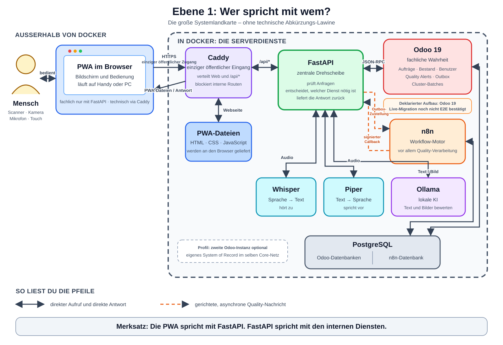
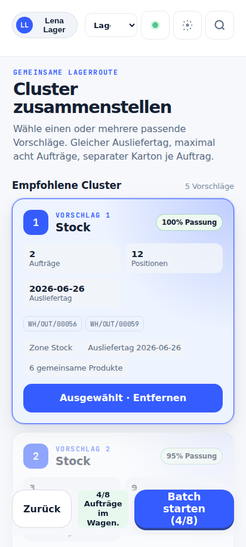
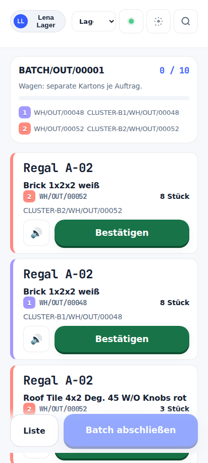

# Mobile Picking und Voice Assistant

Eine mobile Lageranwendung für normales und gebündeltes Kommissionieren – mit
Scanner, Sprache, Fotos und lokaler KI. Die PWA führt den Mitarbeiter durch den
Auftrag, FastAPI schützt alle Zugriffe und Odoo 19 bleibt die fachliche Wahrheit.



## In 30 Sekunden

Der operative Weg ist bewusst kurz:

```text
Mitarbeiter → PWA → Caddy → FastAPI → Odoo 19
```

- Die PWA zeigt Aufträge, Lagerorte, Mengen und Cluster-Routen.
- HID-Scanner ist der robuste Primärpfad; Kamera, Touch und Voice bleiben
  gleichwertige Alternativen.
- Whisper erkennt deutsche Sprache, deterministische Regeln ordnen sichere
  Kommandos zu und Ollama hilft nur bei unsicheren Formulierungen.
- Piper spricht Antworten lokal; Browser-TTS ist der Rückfall.
- Qualitätsmeldungen werden zuerst dauerhaft in Odoo gespeichert und danach
  über Outbox, HMAC und n8n asynchron bewertet.
- Text-, Bild- und Einbettungsmodelle laufen lokal. Unsicherheit oder
  Widersprüche führen zur manuellen Prüfung, nicht zu einem erfundenen Urteil.

Das Repository enthält den deploybaren Laufzeitstand samt Betriebs- und
Architekturdokumentation. Tests, E2E-Strecken, Bildkorpus und historische
Nachweise liegen getrennt im privaten Archiv.

## Was wir gebaut haben

### Mobiles Picking

Nach der Anmeldung lädt die PWA die zulässigen Odoo-Aufträge über FastAPI. Ein
Auftrag wird beim Öffnen zeitlich begrenzt für Mitarbeiter und Gerät reserviert.
Ein Heartbeat hält diesen Claim aktiv; beim Verlassen wird er freigegeben oder
läuft sicher aus.

Der Mitarbeiter sieht den nächsten Lagerort und den erwarteten Artikel,
bestätigt per Scanner, Kamera, Touch oder Sprache und schreibt jede Position
kontrolliert nach Odoo zurück. Idempotenzschlüssel verhindern doppelte
Buchungen, wenn eine Antwort unterwegs verloren geht und die Aktion wiederholt
wird.

### Cluster-Picking

FastAPI bildet aus passenden Odoo-Aufträgen Cluster-Vorschläge. Berücksichtigt
werden unter anderem Lager, Ausliefertag, Zonen, Kapazität und gemeinsam
erreichbare Produkte. Der Mitarbeiter kann mehrere Vorschläge auswählen und
einen Batch mit getrenntem Zielkarton je Auftrag starten.

Die PWA bündelt gleiche Lagerstopps für einen kurzen Rundgang, hält die
Zuordnung zu jedem Auftrag aber getrennt. Deshalb bedeutet „vier Stück am
Regal“ nicht eine anonyme Viererbuchung: jede Zielmenge wird dem richtigen
Auftrag und Karton zugeordnet und einzeln in Odoo bestätigt.

<p align="center">
  
  
</p>

### Voice Assistant

Der Sprachweg bleibt aus dem normalen n8n-Workflow heraus, damit ein
Standardkommando nicht auf Workflow- oder Modelllatenz warten muss:

```text
Mikrofon → PWA → FastAPI → Whisper → Intent-Regeln → sichere Aktion
                                      └─ nur bei Unsicherheit: Ollama
Antwort  ← PWA ← FastAPI ← Piper
```

Die PWA erkennt Sprache und Stille, verhindert Echo-Schleifen während der
Sprachausgabe und verlangt bei riskanten oder unsicheren Schreibaktionen eine
Bestätigung. Fällt Whisper, Piper oder Ollama aus, bleiben Touch und Scanner
verfügbar; Piper fällt zusätzlich auf die Browser-Sprachausgabe zurück.

### Quality, Fotos und lokale KI

Eine Qualitätsmeldung besteht aus Beschreibung, Kontext und optionalen Fotos.
FastAPI berechnet Fingerprints; Odoo speichert Alert, Anhänge, Integrationsjob
und Outbox-Ereignis gemeinsam in einer Transaktion. Erst danach beginnt die
asynchrone Verarbeitung:

```text
PWA
  → FastAPI
  → Odoo: Alert + Fotos + Job + Outbox
  → signierter Dispatcher
  → n8n Quality Assessment v2
  → signierte FastAPI-Bewertungsroute
  → lokale Text-, Einbettungs- und Bildanalyse
  → signierter Callback
  → Odoo: Ergebnis oder review_required
```

Die Bewertung trennt Aufgaben, die unterschiedliche Fehlerbilder haben:

1. `qwen2.5:7b` ordnet den Meldetext in `sellable`, `rework`,
   `quarantine` oder `scrap` ein.
2. Der Einbettungsdienst sucht das Foto mit DINOv2 und einem gewichteten
   Farbhistogramm im bekannten Artikelkatalog. Rangfolge und Abstand ersetzen
   einen geratenen Ja/Nein-Schwellwert.
3. `gemma4:12b` beschreibt bei Bedarf den Artikel und prüft Fotos einzeln auf
   sichtbare Schäden.
4. Ein deterministischer Python-Abgleich führt Text- und Bildbefund zusammen.

Das Bild darf einen Fall verschärfen, aber eine menschliche Schadensmeldung
nicht still abschwächen. Ein falscher Artikel, ein Bildwiderspruch oder ein
unbelegtes `scrap` endet deshalb bei `review_required`. Die konkrete
Handlungsempfehlung stammt aus einer festen Tabelle und nicht aus freier
Modellformulierung.

## Warum diese Bausteine

| Baustein | Aufgabe | Warum |
| --- | --- | --- |
| PWA mit JavaScript | mobile Oberfläche | installierbar ohne App-Store; HID, Kamera, Touch und Voice im Browser |
| Caddy | HTTPS und Reverse Proxy | eine öffentliche Kante; interne Dienste bleiben verborgen |
| FastAPI | API und Command Gatekeeper | ein kontrollierter Lese- und Schreibweg mit Sitzung, Rollen, CSRF und Idempotenz |
| Odoo 19 Community | Aufträge, Bestand, Benutzer, Quality | etabliertes Lager-Datenmodell und eindeutiges System of Record |
| Eigene Odoo-Addons | Claims, Idempotenz, Quality, Outbox | fehlende Community-Funktionen nahe an der fachlichen Transaktion ergänzen |
| PostgreSQL 16 | Odoo- und n8n-Daten | dauerhafte, getrennte Datenbanken in einem Dienst |
| n8n | asynchrone Orchestrierung | Quality-Schritte verbinden, ohne den Picking-Hot-Path zu verlangsamen |
| Whisper | Sprache zu Text | zuverlässig für Deutsch im Lager und vollständig lokal |
| Piper | Text zu Sprache | lokale, reproduzierbare deutsche Ausgabe ohne Cloud-Abhängigkeit |
| Ollama | Text- und Bildmodelle | lokale Verarbeitung von Betriebs- und Bilddaten |
| DINOv2-Einbettung | Artikelabgleich | Bildabstand und Rangfolge sind stabiler als ein freies Sprachmodellurteil |
| Docker Compose | Laufzeit | ein reproduzierbarer Stack für den einzelnen Labor-/Lagerhost |
| Excalidraw + SVG | Architekturwissen | editierbare Quellen plus direkt lesbare Grafiken in GitHub und Markdown |

## Sicherheits- und Datenmodell

Die Grenzen sind absichtlich mehrfach abgesichert:

- Nur Caddy veröffentlicht im Basis-Stack Ports ins LAN.
- `edge-net`, `core-net` und `automation-net` trennen Browserkante,
  Odoo/PostgreSQL und lokale Automatisierung.
- Die PWA spricht fachlich nie direkt mit Odoo, n8n oder PostgreSQL.
- Browserzugriffe verwenden serverseitige Sitzung, Odoo-Rollen, strikte
  Origin-Prüfung, CSRF und Idempotenz.
- Service-zu-Service-Aufrufe im v2-Pfad verwenden HMAC-SHA256 über Methode,
  Ziel, Generation, Zeitstempel, Nonce und Body-Hash.
- Odoo hält Nonces, Receipts, Jobs und Outbox-Zustand dauerhaft. Der
  Python-Prozess besitzt keine zweite fachliche Wahrheit.
- Quality-Zustellung ist `at least once`. Event-ID und Payload-Fingerprint
  deduplizieren Wiederholungen nach verlorenen Acks.
- Secrets gehören in `.env` oder restriktiv gemountete Dateien und niemals in
  Git.

## Fehlerverhalten

Das System bevorzugt sichtbare Unsicherheit vor falschem Erfolg:

| Ausfall | Verhalten |
| --- | --- |
| Browsernetz fehlt | App-Shell kann aus dem Cache öffnen; keine Fachdaten oder Writes werden offline erfunden |
| Sitzung abgelaufen | lokaler Sitzungskontext wird verworfen und Login erscheint |
| Claim kollidiert | `409` und sichtbarer Besitzerkonflikt statt paralleler Buchung |
| HTTP-Antwort verloren | derselbe Idempotenzschlüssel kann die gespeicherte Antwort liefern |
| Whisper/Ollama/Piper fehlt | sichere Bedienwege und definierte Rückfälle bleiben erhalten |
| n8n nicht erreichbar | Odoo-Outbox versucht später mit Backoff erneut zuzustellen |
| Modell oder Bildprüfung unsicher | `review_required` statt Ersatzurteil |
| Verarbeitung hängt | Lease läuft ab; Watchdog gibt eine neue Zustellgeneration frei |

Die PWA ist damit offline sichtbar, aber nicht offline schreibend. Odoo bleibt
auch nach Netzverlust oder Neustart die Serverwahrheit.

## Dienste und Repository

Der Basis-Stack umfasst PWA, Caddy, FastAPI, Odoo, PostgreSQL, n8n, Whisper,
Piper, Ollama und den Einbettungsdienst. Eine zweite Odoo-Instanz kann über das
Profil `second-odoo` ergänzt werden; das Profil `provision` dient einmalig
der n8n-Credential-Einrichtung.

| Pfad | Inhalt |
| --- | --- |
| `pwa/` | mobile Oberfläche, Service Worker, Scanner, Voice und UI-Zustand |
| `backend/app/` | FastAPI-Router, Laufzeitdienste und kontrollierte Abläufe |
| `odoo/addons/` | Picking-, Integrations- und Quality-Modelle für Odoo 19 |
| `n8n/` | Registry, produktive Workflows und signierende Custom Nodes |
| `embed/` | lokaler DINOv2-/Farb-Abgleich gegen den Artikelkatalog |
| `whisper/`, `piper/` | lokale Sprachein- und -ausgabe |
| `infrastructure/` | Caddy, Zertifikate, Provisionierung und Betriebshelfer |
| `docs/` | Architektur, Entscheidungen, Runbooks und eingebettete Grafiken |

## Start

Voraussetzungen sind Docker mit Compose v2, `mkcert`, eine feste LAN-IP und
ausgefüllte Secrets.

```bash
cp .env.example .env
# Platzhalter und Secrets in .env ersetzen
bash infrastructure/scripts/setup-certs.sh <LAN-IP>
docker compose build
docker compose up -d
```

Die neue Odoo-19-Datenbank, Addons, API-Schlüssel und lokalen Modelle werden in
[docs/SETUP.md](docs/SETUP.md) eingerichtet. Das Entwicklungs-Overlay
veröffentlicht ausgewählte Dienste ausschließlich auf `127.0.0.1`:

```bash
docker compose -f docker-compose.yml -f docker-compose.dev.yml up -d
```

Für den einmaligen Modelldownload verbindet das Egress-Overlay nur Whisper und
Ollama vorübergehend mit einem externen Netz:

```bash
docker compose -f docker-compose.yml -f docker-compose.egress.yml up -d whisper ollama
docker compose up -d whisper ollama
```

## Betrieb prüfen

```bash
docker compose --env-file .env config --quiet
docker compose ps
make help
```

Die vorhandenen Make-Ziele sind bewusst auf Betrieb beschränkt: Setup, Build,
Start/Stop, Logs, Seed und Shell-Zugriffe. Das Runtime-Repository enthält keine
Test-Suiten mehr.

## Dokumentationslandkarte

Der Einstieg ist [docs/ARCHITECTURE.md](docs/ARCHITECTURE.md). Die 13 Ebenen
gehen vom Gesamtbild in die einzelnen Abläufe:

1. [Systemlandkarte](docs/architecture/ebene-1-systemlandkarte.md)
2. [PWA und normaler Auftrag](docs/architecture/ebene-2-pwa-normaler-auftrag.md)
3. [Cluster-Picking](docs/architecture/ebene-3-cluster-picking.md)
4. [Voice mit Whisper und Piper](docs/architecture/ebene-4-voice.md)
5. [Quality, n8n sowie Text- und Bild-KI](docs/architecture/ebene-5-quality-n8n-ki.md)
6. [Docker, Netzwerke, Daten und Sicherheit](docs/architecture/ebene-6-docker-daten-sicherheit.md)
7. [Intent und Ollama-Fallback](docs/architecture/ebene-7-intent-problemerkennung-ollama.md)
8. [Fehler, Offline und Wiederanlauf](docs/architecture/ebene-8-fehler-offline-wiederanlauf.md)
9. [Komplette Mitarbeiterreise](docs/architecture/ebene-9-mitarbeiterreise.md)
10. [Status und Lebenszyklen](docs/architecture/ebene-10-status-und-lebenszyklen.md)
11. [Rollen, Rechte und Datenhoheit](docs/architecture/ebene-11-rollen-rechte-datenhoheit.md)
12. [Login, Benutzer und Geräte](docs/architecture/ebene-12-login-benutzer-geraete.md)
13. [Clusterbildung und Lagerorte](docs/architecture/ebene-13-clusterbildung-und-lagerorte.md)

Zu fast jeder Ebene liegt eine editierbare `.excalidraw`-Quelle und eine direkt
einbettbare `.svg`-Fassung vor. Ebene 11 besitzt derzeit nur die SVG-Fassung.
Die acht Laufzeit-Screenshots zeigen Anmeldung, Benutzerkontext,
Cluster-Auswahl, Rundgang und Odoo-Bestandsansicht. Datierte Scorecards,
Härtungsberichte und Messprotokolle sind Nachweise ihres jeweiligen Stands;
bei Widersprüchen gelten aktueller Code, Compose und Workflow-Registry.

Weitere Einstiege:

- [Architekturentscheidungen](docs/DECISIONS.md)
- [Voice-Kommandos](docs/VOICE_COMMANDS.md)
- [Backup und Wiederherstellung](docs/runbooks/backup-und-wiederherstellung.md)
- [Bedienanleitung](docs/testing/bedienanleitung.md)
- [Quality-AI-Felder](docs/QUALITY_ALERT_AI_FIELDS.md)

## Warum das Repository kleiner wurde

Der öffentliche Branch wurde auf deploybaren Code, Konfiguration und
betriebsrelevante Dokumentation reduziert. Vor der Entfernung wurden Tests,
E2E-Skripte, visuelle Baselines, Bildkorpus, Messreihen, PDFs und Live-Smokes
unter ihren ursprünglichen relativen Pfaden in
[`endritmurati99/mobile-picking-test-evidence-archive`](https://github.com/endritmurati99/mobile-picking-test-evidence-archive)
gesichert. Das Archiv ist privat und erfordert Zugriff.

Bewusst im Runtime-Repository geblieben sind:

- Markdown, SVGs, Excalidraw-Quellen und verwendete Screenshots, weil die
  Architektur- und Obsidian-Dokumentation sie direkt referenziert;
- `verify-workflows.py`, weil der Workflow-Importer es als Laufzeit-Gate nutzt;
- Build-Abhängigkeiten der n8n-Custom-Nodes, weil das Docker-Image sie benötigt;
- der registrierte Legacy-Workflow `error-trigger.json`, weil seine Entfernung
  ein koordinierter Verhaltensumbau und keine sichere Dateibereinigung wäre.

Der große Runtime-Split entfernte 39.914 Zeilen aus 283 Dateien. Die
ursprüngliche Arbeitskopie mit nicht eingecheckten Fachänderungen blieb dabei
unangetastet; die Bereinigung entstand in einem separaten Git-Worktree.

## Ehrlicher aktueller Stand

- Die Compose-Grunddatei veröffentlicht nur Caddy, startet das Backend aber
  noch mit Uvicorn `--reload`. Für einen echten Produktivbetrieb sollte dieser
  Entwicklungsmodus entfernt werden.
- Die Registry verlangt die Produktionsaktivierung von „Quality Assessment
  v2“, die eingecheckte n8n-Workflowdatei trägt jedoch `active: false`. Der
  Workflow muss beim Deployment kontrolliert importiert und aktiviert werden.
- Quality-Bewertungen laufen auf dem aktuellen CPU-Host absichtlich einzeln.
  Mehrere Backend-Repliken bräuchten eine gemeinsame externe Sperre.
- Die PWA cached ihre Oberfläche, aber keine API-Daten und keine
  Schreibaktionen.
- Tests und Belegkorpus sind erhalten, aber nicht mehr Teil dieses
  Runtime-Branches oder seiner normalen Installation.

Das Ergebnis ist kein minimaler Demo-Ordner, sondern ein kompakter
Laufzeitstand: weniger Ballast, dieselben fachlichen Pfade und eine klare
Trennung zwischen Betrieb und Nachweis.
