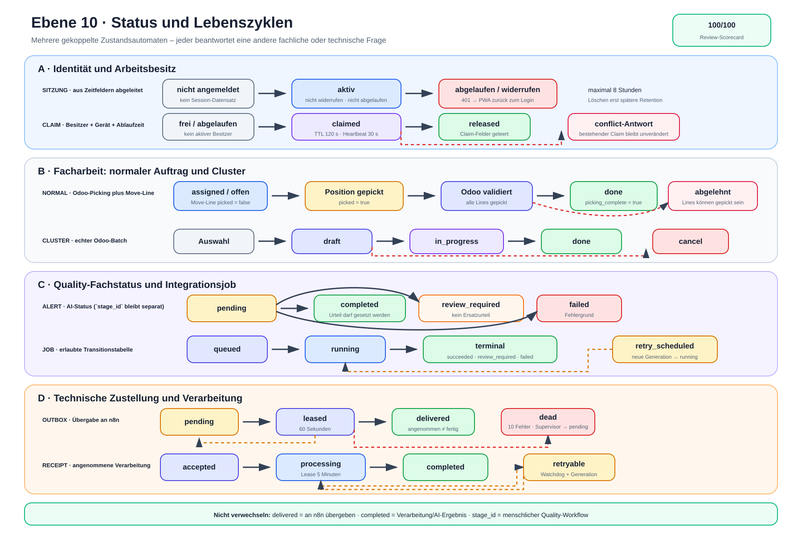

# Ebene 10: Status und Lebenszyklen

Ebene 9 erklärte die Anwendung als Mitarbeiterreise. Ebene 10 betrachtet
dieselbe Anwendung aus einer anderen Richtung: **Welche Zustände existieren,
wer darf sie verändern und welche Übergänge sind tatsächlich erlaubt?**

Das ist besonders wichtig, weil mehrere Wörter ähnlich klingen, aber etwas
anderes bedeuten. Eine zugestellte Outbox ist noch keine abgeschlossene
KI-Bewertung. Ein gepicktes letztes Element ist noch kein bestätigter
Auftragsabschluss. Und ein `409`-Claimkonflikt ist eine Antwort, kein dauerhaft
gespeicherter Auftragstatus.

## Die Erklärung in 30 Sekunden

Die Anwendung besitzt nicht einen großen globalen Status, sondern mehrere
kleine, gekoppelte Lebenszyklen:

- Sitzung und Claim regeln, **wer** arbeiten darf.
- Picking, Position und Batch beschreiben, **was** fachlich erledigt ist.
- Idempotenz beschreibt, ob eine Schreibanfrage neu, aktiv oder wiederholbar
  abgeschlossen ist.
- Alert und Integrationsjob beschreiben den fachlichen Quality-Fortschritt.
- Outbox und Receipt beschreiben Zustellung und Verarbeitungssicherheit.

Odoo speichert die dauerhaften Zustände. FastAPI prüft Übergänge und bildet sie
auf APIs ab. Die PWA zeigt daraus eine Bedienansicht, besitzt aber keinen
zweiten dauerhaften Fachzustand.

> **Merksatz:** Gleiche Zeit, gleiche Meldung – aber unterschiedliche
> Zustände. Erst das richtige Objekt beantwortet die richtige Frage.

## Die Lebenszyklen als Bild



Die [Excalidraw-Quelldatei](./ebene-10-status-und-lebenszyklen.excalidraw) ist
editierbar. Die [SVG-Datei](./ebene-10-status-und-lebenszyklen.svg) ist die
Exportfassung.

Das Bild liest sich zeilenweise von links nach rechts:

1. Identität und Arbeitsbesitz,
2. Picking und Cluster,
3. Quality-Fachstatus und Integrationsjob,
4. technische Zustellung mit Outbox und Receipt.

Gestrichelte Pfeile zeigen einen Rückfall oder eine erneute Verarbeitung. Ein
roter Kasten markiert einen Zustand, der menschliches Eingreifen oder eine
bewusste Entscheidung verlangt.

## Drei Arten von „Status“

Bevor wir die einzelnen Zeilen lesen, müssen drei Arten getrennt werden.

### 1. Dauerhaft gespeicherter Zustand

Beispiele sind:

- `stock.picking.state`,
- `stock.picking.batch.state`,
- `picking.assistant.integration.job.state`,
- `picking.assistant.outbox.state`,
- `picking.assistant.event.receipt.state`,
- `quality.alert.custom.ai_evaluation_status`.

Diese Werte liegen in Odoo und überleben Browser-, Backend- oder n8n-Neustarts.

### 2. Aus Feldern und Zeit abgeleiteter Zustand

Sitzung und Claim besitzen keinen eigenen Selection-Wert wie `active`. Ihr
wirksamer Zustand ergibt sich aus Zeit- und Besitzfeldern:

```text
Sitzung aktiv = Datensatz vorhanden
              + revoked_at leer
              + expires_at liegt in der Zukunft

Claim aktiv   = mobile_claim_user_id gesetzt
              + mobile_claim_expires_at liegt in der Zukunft
```

„Frei“, „abgelaufen“ oder „widerrufen“ sind deshalb verständliche
Lebenszyklusbegriffe, aber nicht alle als eigener String gespeichert.

### 3. API- oder UI-Zustand

`conflict`, `missing`, `picking_complete`, `batch_complete`, Ladeanzeige und
Fehleransicht sind Antworten oder Darstellungen. Dazu gehören auch die lokalen
Cluster-Schritte „Artikel erwartet“, „Artikel geprüft“, „Karton wird gebucht“
und „Halt erledigt“. Sie helfen der PWA, sind aber nicht automatisch
Odoo-Fachstatus.

> **Regel:** Erst fragen: Status von welchem Objekt? Danach erst den Wert
> interpretieren.

## Lebenszyklus A: Sitzung

Eine Sitzung beginnt nach erfolgreicher Prüfung des Odoo-Benutzers.

```text
nicht angemeldet
      ↓ erfolgreicher Login
aktiv
      ├─ Logout / Benutzer-Widerruf → widerrufen
      └─ expires_at erreicht        → abgelaufen
```

Ein aktiver Datensatz enthält Benutzer, Gerät, Rollen, CSRF-Hash,
`expires_at` und `last_seen_at`. Die maximale Sitzungslaufzeit beträgt acht
Stunden. Rollen werden während der Sitzung erneut geprüft; eine zwischenzeitlich
widerrufene oder abgelaufene Sitzung wird dabei nicht wiederbelebt.

Widerrufene und lange abgelaufene Datensätze werden später bereinigt. Die
Bereinigung ist kein Logout-Ersatz: Für die Autorisierung zählt sofort der
Zeitpunkt oder `revoked_at`, nicht erst die physische Löschung.

**PWA-Reaktion:** Eine `401`-Antwort löscht den lokalen Sitzungszustand, stoppt
den Claim-Heartbeat und führt zum Login.

## Lebenszyklus B: Claim

Der Claim ist eine zeitlich begrenzte Bearbeitungssperre auf einem normalen
`stock.picking`.

```text
frei / abgelaufen
      ↓ claim durch Benutzer + Gerät
claimed
      ├─ heartbeat desselben Besitzers → claimed mit neuer Ablaufzeit
      ├─ release desselben Besitzers   → released / Felder geleert
      ├─ TTL ohne heartbeat            → fachlich abgelaufen
      └─ anderer aktiver Besitzer      → conflict-Antwort, keine Übernahme
```

Aktuelle Zeiten:

| Mechanismus | Wert |
| --- | ---: |
| Claim-TTL | 120 Sekunden |
| PWA-Heartbeat | alle 30 Sekunden |

`claimed`, `released`, `conflict` und `missing` sind API-Statuswerte. Dauerhaft
gespeichert werden Besitzer, Gerät sowie Claim- und Ablaufzeit. Ein abgelaufener
Claim kann beim nächsten sicheren Zugriff geleert oder neu übernommen werden.

Ein `conflict` verändert den bestehenden Claim nicht. Die Antwort sagt nur:
**Der verlangte Übergang ist für diesen Anfragenden derzeit nicht erlaubt.**

## Lebenszyklus C: Normaler Auftrag und Position

Die mobile Liste berücksichtigt normale Pickings im Odoo-Zustand `assigned`.
Innerhalb des Auftrags besitzt jede relevante Move-Line den Boolean `picked`.

```text
Position offen (`picked = false`)
      ↓ Barcode, Bestand, Besitz und optionale Serie gültig
Position gepickt (`picked = true`)
      ↓ alle Positionen gepickt
Odoo-Validierung des Auftrags
      ├─ akzeptiert → Picking `done` + PWA `picking_complete = true`
      └─ abgelehnt  → Picking bleibt offen; Positionen können gepickt sein
```

Der letzte Scan und der Auftragsabschluss sind damit zwei Übergänge. Schreibt
Odoo die letzte Move-Line, lehnt aber `button_validate` ab, darf die PWA keinen
grünen Abschluss zeigen. Sie meldet „Position gebucht, Auftrag nicht
abgeschlossen“ und lädt den Serverzustand erneut.

`picking_complete` ist ein Antwort-Flag. Der dauerhafte Fachzustand bleibt
`stock.picking.state` in Odoo.

Odoo kennt außerhalb des mobilen Ausschnitts weitere Standardzustände. Ebene
10 zeigt bewusst nur den Pfad, den die PWA nutzt: offene `assigned`-Aufträge
bis zum bestätigten `done`.

## Lebenszyklus D: Cluster-Batch

Cluster-Vorschläge sind noch kein Batchzustand. Sie entstehen aus geeigneten,
zugewiesenen und noch nicht gebatchten Pickings.

```text
Vorschlag / Auswahl
      ↓ Batch in Odoo anlegen
draft
      ↓ Zielkartons erfolgreich + action_confirm
in_progress
      ↓ alle Cluster-Lines gepickt + action_done
done

Fehler während Anlage/Bestätigung → kompensierendes action_cancel → cancel
```

Der Batch besitzt einen Odoo-Besitzer. `confirm-line` aktualisiert Positionen
und Fortschritt, beendet aber den Batch nicht. Der eigene Validate-Endpunkt
ruft `action_done` auf. Ein bereits `done` befindlicher Batch wird als
idempotent erfolgreich beantwortet.

Fordert Odoo beim Abschluss einen manuellen Wizard oder entsteht ein Fehler,
bleibt `batch_complete = false`. Auch hier ist `batch_complete` nur die
API-Antwort; der maßgebliche Zustand liegt am Odoo-Batch.

### Der flüchtige Scanstatus innerhalb eines Cluster-Stopps

Der Odoo-Batchzustand darf nicht mit dem kleineren PWA-Scanautomaten
verwechselt werden. `buildClusterStops()` bildet diesen nur für ungetrackte
Lines mit gleichem Produkt und Quellort und nur bei höchstens einer Line je
Auftrag:

```text
Artikel erwartet
   ├─ falscher Artikel → Artikel erwartet; kein Request, kein Write
   └─ richtiger Artikel → Artikel geprüft
          ├─ falscher/erledigter Karton → Artikel geprüft; kein Request, kein Write
          └─ offener Zielkarton → Karton wird gebucht
                 ├─ Fehler → Artikel geprüft; Aufteilung bleibt offen
                 └─ Erfolg → Move-Line gepickt + Batch neu laden
                        ├─ weitere Kartons → Artikel geprüft
                        └─ letzter Karton → Halt erledigt; nächster Halt erwartet Artikel
```

`verifiedClusterStopKey` und `verifiedClusterProductBarcode` halten den einmal
gelesenen Artikel nur für den aktuellen Batch/Stopp im Browser-Tab.
`clusterConfirmPending` sperrt einen zweiten Submit während des Writes. Ein
Browser-Reload oder der Wechsel aus dem Cluster verwirft diese Werte; die
gepickten Move-Lines bleiben dagegen in Odoo erhalten.

Jeder richtige Kartonscan wählt genau eine ursprüngliche Auftragsposition und
sendet genau einen `confirm-line`-Request. FastAPI prüft Move-Line, Auftrag,
Batch, Besitzer, den übermittelten Produktcode, den Zielkarton und optional
Charge/Serie, bevor es genau diese `stock.move.line` schreibt. Die visuelle
Produkt-/Ortsgruppe erzeugt weder einen Sammel-Write noch einen neuen
dauerhaften Cluster-Stopp-Datensatz.

Chargen- und Serienpositionen liegen außerhalb dieses Automaten. Sie bleiben
ungegrouppt und werden einzeln über „Manuell bestätigen“ mit Zielkarton und
Charge beziehungsweise Serie gebucht. Der manuelle Ausnahmeweg kann auch bei
ungetrackter Ware ohne Artikelscan verwendet werden; die vier Scanstatus sind
daher eine PWA-Führung und noch keine allgemeine Backendpflicht.

## Lebenszyklus E: Idempotenz einer Schreibanfrage

Idempotenz verhindert, dass dieselbe fachliche Browseraktion bei einer
Wiederholung doppelt ausgeführt wird.

```text
kein Eintrag
      ↓ Endpoint + Principal + Key + Fingerprint reservieren
pending
      ├─ Fachaktion + Finalisierung → completed
      ├─ technischer Abbruch        → Eintrag löschen
      ├─ gleicher Key während aktiv → 409 „processing“
      └─ anderer Fingerprint        → 409 Konflikt

completed + gleicher Request → gespeicherte Antwort als replay
```

Der Eintrag lebt standardmäßig 24 Stunden. Nach Ablauf kann die gesperrte Zeile
neu verwendet oder später bereinigt werden.

Dieser dauerhafte Reservierungsautomat gilt nur für Routen, die den
`MobileWorkflowService` tatsächlich verwenden, darunter das normale Picking.
Die Cluster-Routen verlangen zwar einen syntaktischen `Idempotency-Key`,
reservieren ihn derzeit aber nicht in diesem Automaten. Dort verhindern nur
der flüchtige `clusterConfirmPending`-Guard und die fachlichen Odoo-Prüfungen
einen offensichtlichen Doppelsubmit; sie ersetzen keine dauerhafte Idempotenz.

Wichtig ist die ehrliche Grenze: Reservierung, Odoo-Fachwrite und
Replay-Finalisierung sind getrennte RPCs. Bricht FastAPI nach dem erfolgreichen
Fachwrite, aber vor `completed` ab, bleibt der Eintrag bis zum Ablauf
`pending`. Vor einem sehr späten manuellen Retry muss deshalb der Fachzustand
in Odoo geprüft werden.

## Lebenszyklus F: Quality-Alert und AI-Status

Beim Absenden entstehen Alert, Fotos, Job und Outbox in einer Odoo-Transaktion.
Der Alert besitzt zwei voneinander unabhängige Statusbereiche:

1. `stage_id` für den menschlichen Quality-Workflow,
2. `ai_evaluation_status` für die automatische Bewertung.

Die AI-Zustände lauten:

```text
pending
   ├─ erfolgreicher Modell-Callback → completed
   ├─ kein belastbares Urteil       → review_required
   └─ benannter Fehler              → failed
```

Nur `completed` darf eine KI-Einstufung wie `sellable`, `rework`,
`quarantine` oder `scrap` setzen. `review_required` und `failed` löschen ein
altes Urteil, statt es neben einem neuen Fehler weiter anzuzeigen.

Der menschliche Quality-Stage kann unabhängig davon weitergeführt werden. Ein
AI-Status `completed` bedeutet deshalb nicht automatisch, dass der Alert
fachlich erledigt oder geschlossen ist.

## Lebenszyklus G: Integrationsjob

Der Job beschreibt die asynchrone Bearbeitung, nicht die HTTP-Zustellung.

```text
queued
   ↓ Verarbeitung meldet Start
running
   ├─ succeeded       ┐
   ├─ review_required ├─ terminal; kein Wiederöffnen
   ├─ failed          ┘
   └─ retry_scheduled ──→ running
```

Erlaubte Callback-Übergänge stehen als Transitionstabelle im Odoo-Modell:

| Ausgang | Erlaubte Ziele |
| --- | --- |
| `queued` | `running` |
| `running` | `succeeded`, `review_required`, `retry_scheduled`, `failed` |
| `retry_scheduled` | `running` |

Ein terminaler Job wird nicht wieder geöffnet. Eine fachlich neue Bewertung
benötigt eine neue Revision beziehungsweise einen neuen Job.

Läuft die Processing-Lease eines `queued`- oder `running`-Jobs ab, führt der
Watchdog einen gebündelten Recovery-Übergang aus:

1. Job auf `retry_scheduled`,
2. Zustellgeneration erhöhen,
3. alte Lease entwerten,
4. Receipt auf `retryable`,
5. dieselbe Outbox-Zeile zurück auf `pending`.

Fehlt dabei die Outbox-Zeile, fällt der Job sicher auf `review_required`, statt
unsichtbar in einem nicht mehr zustellbaren Zustand zu hängen.

## Lebenszyklus H: Outbox-Zustellung

Die Outbox beantwortet ausschließlich: **Wurde dieses Ereignis sicher an den
Empfänger übergeben?**

```text
pending
   ↓ Dispatcher leiht fällige Zeile
leased
   ├─ n8n akzeptiert + Ack → delivered
   ├─ Fehler + Nack        → pending mit Backoff
   ├─ Lease läuft ab       → erneut leasebar
   └─ zehnter Fehler       → dead

dead + Supervisor-Requeue → pending
```

Aktuelle technische Werte:

| Mechanismus | Wert |
| --- | ---: |
| Dispatcher-Poll | 2 Sekunden |
| Outbox-Lease | 60 Sekunden |
| Batchgröße | bis zu 50 je Instanz |
| Zustellversuche bis `dead` | 10 |

`delivered` bedeutet: n8n hat die Event-ID und den Payload angenommen. Es
bedeutet **nicht**, dass Text- und Bildbewertung bereits abgeschlossen sind.

## Lebenszyklus I: Event-Receipt und Processing-Lease

Das Event-Receipt beantwortet eine andere Frage als die Outbox: **Wird das
angenommene Ereignis gerade verarbeitet oder ist sein Ergebnis abgeschlossen?**

```text
accepted
   ↓ frische Processing-Lease ausgeben
processing
   ├─ terminaler Callback → completed
   ├─ laufender Callback  → processing + Lease verlängern
   └─ Lease abgelaufen    → Watchdog → retryable

retryable + neue Generation / erneute Annahme → processing
```

Die Processing-Lease beträgt fünf Minuten. Callback und Ressourcenzugriffe
müssen Job, Generation, Receipt-Zustand, Token und Ablaufzeit gemeinsam
erfüllen. Ein alter Worker wird nach einer Recovery durch die höhere Generation
und das gelöschte Token wertlos.

Ein aktives `processing` oder `completed` Receipt dedupliziert eine erneute
Annahme derselben Event-ID. Der Empfänger startet dann keinen zweiten
Seiteneffekt.

## Warum mehrere Automaten nötig sind

| Frage | Richtiger Zustand |
| --- | --- |
| Darf der Browser arbeiten? | Sitzung |
| Wer besitzt den normalen Auftrag? | Claim-Felder und Ablaufzeit |
| Was erwartet der aktuelle Cluster-Stopp? | flüchtiger PWA-Scanstatus |
| Ist eine Position gebucht? | Move-Line `picked` |
| Ist Auftrag oder Batch beendet? | Odoo-Picking-/Batchzustand |
| Darf dieselbe Anfrage wiederholt werden? | Idempotenzeintrag |
| Ist eine KI-Bewertung fachlich fertig? | Job + Alert-AI-Status |
| Wurde das Ereignis an n8n übergeben? | Outbox |
| Läuft die angenommene Verarbeitung noch? | Event-Receipt + Processing-Lease |
| Ist der Alert menschlich erledigt? | Quality-`stage_id` |

Würde man diese Fragen in einen einzigen Status pressen, entstünden falsche
Schlüsse. Beispielsweise könnte `delivered` wie „Bewertung fertig“ aussehen,
obwohl der Job erst `queued` oder `running` ist.

## Zeitschranken im Überblick

| Lebenszyklus | Zeitgrenze | Wirkung nach Ablauf |
| --- | ---: | --- |
| Browsersitzung | standardmäßig 8 Stunden | nicht mehr autorisiert |
| mobiler Claim | 120 Sekunden | ohne Heartbeat übernehmbar |
| Claim-Heartbeat | 30 Sekunden | verlängert denselben Besitz |
| Idempotenz | 24 Stunden | Eintrag kann neu verwendet/bereinigt werden |
| Outbox-Lease | 60 Sekunden | Zeile erneut leasebar |
| Processing-Lease | 5 Minuten | Watchdog-Recovery mit neuer Generation |

Diese Fristen lösen unterschiedliche Probleme. Die fünfminütige Processing-
Lease darf beispielsweise nicht mit der einminütigen Outbox-Lease verwechselt
werden.

## Ehrliche Grenzen

- „aktiv“, „frei“ und „abgelaufen“ sind bei Sitzung und Claim teilweise
  abgeleitete Begriffe, keine gespeicherten Selection-Werte.
- Ebene 10 zeigt beim normalen Picking nur den mobilen `assigned → done`-
  Ausschnitt, nicht Odoos vollständigen Standardworkflow.
- Ein gepicktes letztes Element garantiert noch keinen erfolgreichen
  Gesamtabschluss.
- Der Cluster-Artikelscan ist flüchtige PWA-Führung. Der manuelle Ausnahmeweg
  und ein leerer `scanned_barcode` machen ihn noch nicht zur Backendpflicht.
- Die dauerhafte Idempotenzbeschreibung gilt nicht für die aktuellen
  Cluster-Routen.
- Quality-`stage_id` und AI-Status bleiben absichtlich getrennt.
- `delivered` ist ein Zustellerfolg, kein Verarbeitungserfolg.
- `review_required` ist ein terminaler, ehrlicher Jobausgang und kein
  technischer „läuft noch“-Status.
- `dead` benötigt nach Ursachenbehebung eine Supervisor-Requeue.
- Die PWA-Ansicht ist flüchtig; nach Fehlern gilt der neu geladene Odoo-Stand.

## Wo die Lebenszyklen im Projekt stecken

| Lebenszyklus | Einstiegspunkt |
| --- | --- |
| Sitzung | `models/session.py`, `backend/app/services/auth_sessions.py` |
| Claim | `picking_assistant_core/models/picking_assistant.py` |
| Idempotenz | `picking_assistant_core/models/idempotency.py` |
| Normalauftrag | `backend/app/services/picking_service.py` |
| Cluster | `pwa/js/ui.js`, `pwa/js/app.js`, `backend/app/services/cluster_service.py` |
| Quality-AI-Status | `quality_alert_custom/models/quality_alert.py` |
| Integrationsjob | `picking_assistant_integration/models/integration_job.py` |
| Outbox | `picking_assistant_integration/models/outbox.py` |
| Event-Receipt | `picking_assistant_integration/models/receipts.py` |
| PWA-Darstellung | `pwa/js/app.js`, `pwa/js/ui.js`, `pwa/js/api.js` |

## Einordnung in die bisherigen Ebenen

Ebene 10 ist eine technische Querschnittsansicht:

```text
Ebene 2: normaler Auftrag ───────┐
Ebene 3: Cluster ───────────────┤
Ebene 5: Quality / n8n / KI ────┼─ Ebene 10: Zustände und Übergänge
Ebene 8: Recovery ──────────────┤
Ebene 9: Mitarbeiterreise ──────┘
```

Ebene 9 beantwortet „Was erlebt der Mitarbeiter?“. Ebene 10 beantwortet
„Welches Objekt befindet sich danach in welchem Zustand und warum?“.

## Review-Scorecard

Stand: 8. August 2026. Bewertet wurde die Darstellung gegen die gespeicherten
Selection-Felder, abgeleiteten Zeit-/Besitzregeln, Transitionstabellen,
Picking- und Cluster-Services sowie die PWA-Reaktionen.

| Kriterium | Punkte |
| --- | ---: |
| Genauigkeit der Statusnamen und gespeicherten Felder | 20/20 |
| Vollständigkeit der erlaubten Übergänge und Rückfälle | 20/20 |
| Trennung der gekoppelten Zustandsautomaten | 20/20 |
| Zeitgrenzen, Besitz und Recovery-Sicherheit | 20/20 |
| Verständlichkeit, Ehrlichkeit und Code-Rückverfolgbarkeit | 20/20 |
| **Gesamt** | **100/100** |

Die 100/100 bewerten das geprüfte Zustandsmodell als Dokumentation. Sie
bedeuten nicht, dass jeder Zustand ein eigener PWA-Bildschirm ist oder dass
alle Abhängigkeiten jederzeit verfügbar sind.

Belegt sind 171 erfolgreiche Backendtests für Sitzung, Claim, Idempotenz,
Normalauftrag, Cluster, Voice/Intent, Outbox, signierten Transport und Runtime-
Lifecycle sowie 38 erfolgreiche PWA-API- und Voice-Tests. Zusätzlich wurden
die Transitionstabellen und Selection-Felder direkt aus den Odoo-Modellen
abgeglichen. SVG-XML und Excalidraw-JSON wurden syntaktisch validiert; die SVG-
Exportfassung wurde im Browser gerendert und visuell geprüft.

## Ebene 10 in acht Regeln

1. Sitzung und Claim beantworten Identität und Besitz, nicht den Lagerstatus.
2. `picked = true` beendet eine Position, nicht zwingend den Auftrag.
3. Normal- und Clusterabschluss zählen erst nach Odoos Bestätigung.
4. Idempotenz schützt die Identität einer Schreibanfrage.
5. Quality-Stage, AI-Status und Integrationsjob sind verschiedene Dinge.
6. Outbox `delivered` bedeutet angenommen, nicht fertig bewertet.
7. Receipt und Generation schützen eine laufende asynchrone Verarbeitung.
8. Bei Recovery wird eine alte Lease entwertet und Odoos Zustand neu gelesen.
