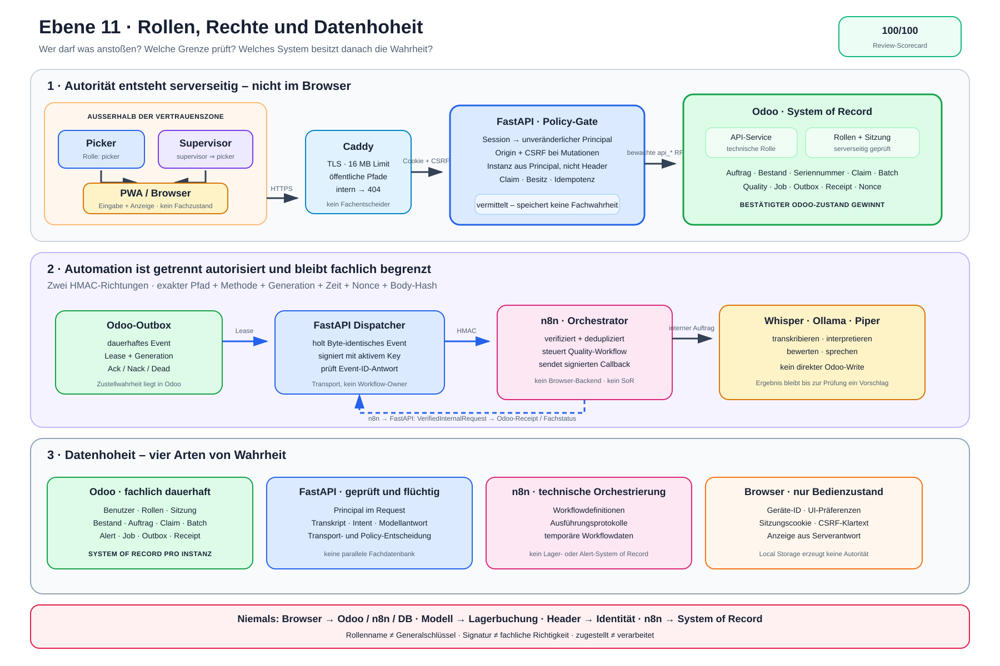

# Ebene 11: Rollen, Rechte, Datenhoheit und Vertrauensgrenzen

Ebene 10 erklärte, welche Zustände das System kennt. Ebene 11 beantwortet die
nächste Querschnittsfrage: **Wer darf einen Zustand beeinflussen, wem wird an
welcher Grenze vertraut und welches System besitzt die maßgebliche Wahrheit?**

Dabei sind Mensch, Browser und technischer Dienst nicht dieselbe Art von
„Rolle“. Ein Mitarbeiter besitzt eine Odoo-Rolle. Die PWA ist dagegen ein
nicht vertrauenswürdiger Client. FastAPI, Odoo und n8n sind Dienste mit eng
begrenzten Aufgaben.

## Die Erklärung in 30 Sekunden

- Picker und Supervisor melden sich mit einem Odoo-Benutzer an.
- Odoo leitet daraus `picker` und optional `supervisor` ab. Ein Supervisor ist
  zugleich Picker.
- Der Browser besitzt keine eigene Autorität. Er sendet nur Sitzungscookie,
  CSRF-Token und Eingaben an FastAPI.
- FastAPI prüft Sitzung, Origin, CSRF, Instanz, Besitz und Request-Kontext. Für
  Odoo-RPC nutzt es einen getrennten Benutzer mit der Rolle `api_service`.
- Odoo speichert Benutzer, Rollen, Sitzung, Auftrag, Bestand, Claim, Batch,
  Idempotenz, Quality-Alert, Job, Outbox und Receipts. Es ist das System of
  Record.
- n8n orchestriert Quality-Abläufe. Whisper, Ollama und Piper liefern
  Hilfsergebnisse. Keiner dieser Dienste darf eigenständig Lagerbestand oder
  Picking-Abschluss zur Wahrheit erklären.

> **Merksatz:** Der Browser schlägt vor, FastAPI prüft und vermittelt, Odoo
> entscheidet und speichert. Automation darf helfen, aber nicht heimlich die
> fachliche Wahrheit übernehmen.

## Rollen und Vertrauensgrenzen als Bild



Für diese Ebene ist nur die
[SVG-Datei](./ebene-11-rollen-rechte-datenhoheit.svg) vorhanden. Eine
editierbare Excalidraw-Quelle liegt im Runtime-Repository nicht vor.

Das Bild liest sich von links nach rechts:

1. Mensch und Browser liegen außerhalb der internen Vertrauenszone.
2. Caddy begrenzt die öffentliche Oberfläche.
3. FastAPI erzeugt aus einer geprüften Sitzung einen unveränderlichen
   `Principal` und vermittelt alle App-Zugriffe.
4. Odoo bleibt Eigentümer des dauerhaften Fachzustands.
5. n8n und die Modellservices liegen in der internen Automationszone und
   erhalten nur signierte oder eng begrenzte Aufträge.

## Drei verschiedene Bedeutungen von „Rolle“

### 1. Menschliche Odoo-Rollen

Das Integrationsmodul definiert exakt diese Rollen:

| Rolle | Bedeutung im aktuellen System |
| --- | --- |
| `picker` | Darf sich für den mobilen Picking-Workflow anmelden und dort als Mitarbeiter arbeiten. |
| `supervisor` | Erbt `picker`; darf damit ebenfalls picken und wird zusätzlich für benannte Supervisor-Aktionen geprüft. |
| `api_service` | Technischer Odoo-Benutzer für die streng bewachten `api_*`-Methoden; keine Mitarbeiterrolle. |

Beim Login ruft FastAPI `api_get_picker_principal` auf. Ein inaktiver, geteilter
oder rollenloser Odoo-Benutzer wird abgelehnt. Die Sitzung speichert eine
Momentaufnahme der Rollen; spätestens nach fünf Minuten werden sie erneut aus
Odoo gelesen. Verliert ein Benutzer die Berechtigung vollständig, widerruft
Odoo seine Sitzungen.

### 2. Browser-Principal

Nach erfolgreichem Login arbeitet FastAPI mit einem unveränderlichen
`Principal` aus:

```text
picker_user_id · picker_name · device_id · odoo_instance
roles · session_id · expires_at
```

Diese Werte stammen aus der serverseitig geprüften Sitzung. Die PWA sendet
keine autoritativen `X-Picker-User-Id`-, `X-Device-Id`- oder
`X-Odoo-Instance`-Header. Ein manipulierter Browser kann dadurch nicht einfach
eine andere Person oder Odoo-Instanz behaupten.

### 3. Technische Identitäten

Technische Dienste werden nicht zu künstlichen Mitarbeiterrollen gemacht:

- FastAPI authentifiziert sich bei Odoo als `api_service`.
- n8n weist interne v2-Aufrufe mit HMAC-signierten Requests nach.
- Caddy ist ein Reverse Proxy, kein Fachbenutzer.
- Whisper, Ollama und Piper sind interne Hilfsdienste ohne Lagerrolle.

Diese Trennung verhindert, dass ein Modellresultat wie eine menschliche oder
fachliche Berechtigung behandelt wird.

## Was die Beteiligten tatsächlich dürfen

| Beteiligter | Darf | Darf nicht |
| --- | --- | --- |
| Picker | mobile Arbeit starten, eigenen Claim halten, Positionen bestätigen, Cluster bedienen, Problem melden | fremden aktiven Claim übernehmen, Identität per Header wählen, Odoo direkt aus der PWA ansprechen |
| Supervisor | alles aus `picker`; benannte Supervisor-Aktion wie begründete Requeue eines `dead`-Events | allein durch den Rollennamen jede interne Route oder jeden Odoo-Datensatz beliebig ändern |
| PWA / Browser | Eingaben sammeln, flüchtige UI-Präferenzen halten, Cookies mitsenden, Serverantwort zeigen | Fachzustand besitzen, Abschluss selbst bestätigen, direkt zu Odoo, n8n oder PostgreSQL sprechen |
| Caddy | TLS terminieren, Bodygröße begrenzen, öffentliche Pfade routen, interne Pfade mit 404 verbergen | Sitzung, Claim, Bestand oder Quality-Ergebnis entscheiden |
| FastAPI | Sitzung und Request prüfen, Besitzregeln anwenden, Odoo-RPC vermitteln, signierte Automation transportieren | eine parallele Fachdatenbank führen oder ein unbestätigtes UI-/KI-Ergebnis zur Wahrheit erklären |
| Odoo-API-Service | bewachte `api_*`-Fassaden aufrufen; interne Operationen laufen dort gezielt und geprüft | als Picker auftreten; unbewachte generische Schreibrechte auf Integrationsmodelle nutzen |
| n8n | Quality-Workflow orchestrieren, angenommene Events deduplizieren, signierte Callbacks senden | Browser-Backend sein, Benutzersitzungen verwalten, Bestand oder Picking direkt besitzen |
| Whisper / Ollama / Piper | Audio transkribieren, begrenzte Interpretation oder Bewertung liefern, Text sprechen | Benutzer autorisieren, Auftrag buchen oder Odoo-Zustand direkt ändern |

Die Tabelle ist absichtlich enger als „System X kann technisch HTTP senden“.
Ein erlaubter Netzwerkpfad ist noch keine fachliche Berechtigung.

## Die vier wichtigsten Vertrauensgrenzen

### Grenze A: Browser → Caddy → FastAPI

Der Browser gilt immer als manipulierbar. Deshalb entstehen Rechte nicht aus
Formularfeldern oder Local Storage.

Der aktuelle Schutzpfad ist:

```text
HTTPS
  + HttpOnly-Sitzungscookie
  + erlaubter Origin
  + CSRF-Token bei Browser-Mutationen
  + Request-Body-Limit
  + serverseitig aufgelöster Principal
```

Das Cookie enthält einen zufälligen Token; Odoo speichert nur dessen SHA-256-
Hash. Auch der CSRF-Token wird in Odoo nur gehasht gespeichert. Die PWA hält
den CSRF-Klartext flüchtig im `sessionStorage`.

Caddy veröffentlicht `/api/*`, blockiert aber unter anderem
`/api/internal/*`, `/api/integration/*`, Dokumentations- und Demo-Pfade an der
Lagerkante. Der interne Schutz bleibt zusätzlich in FastAPI bestehen, weil
n8n das Backend direkt im internen Netz erreicht.

### Grenze B: FastAPI → Odoo

FastAPI wählt den Odoo-Client aus `principal.odoo_instance`, nicht aus einem
Browserheader. Der technische Odoo-Benutzer braucht
`picking_assistant_integration.group_api_service`.

Die Integrationsmodelle geben diesem Benutzer über normale ACLs überwiegend
nur Leserechte. Schreiben erfolgt über benannte `api_*`-Methoden, die zuerst
`_require_api_service()` prüfen und erst danach gezielt mit erhöhtem Zugriff
arbeiten. Damit ist `sudo()` eine Implementierungsstufe hinter einer Wache und
kein frei erreichbarer Browserpfad.

Fachliche Aktionen tragen zusätzlich die serverseitig abgeleitete Picker-ID,
Geräte-ID und den Principal-Scope. Claim-, Batch- und Idempotenzregeln werden
nicht durch einen frei gewählten Anzeigenamen ersetzt.

### Grenze C: FastAPI ↔ n8n

Die v2-Automation benutzt getrennte HMAC-Richtungen. Signiert werden:

```text
HTTP-Methode · exakter Pfad · Delivery-Generation
Zeitstempel · UUID-Nonce · SHA-256 des unveränderten Bodys
```

Der Empfänger prüft Key-ID, Zeitfenster, Methode, Rohpfad, fehlenden Query-
String, Generation, Body-Fingerprint und Signatur. Aktiver und vorheriger Key
können während einer Rotation angenommen werden; Sender verwenden nur den
aktiven Key.

Erst nach erfolgreicher Prüfung entsteht ein `VerifiedInternalRequest`. Der
Replay-Schutz liegt dauerhaft als Nonce-/Receipt-Zustand in Odoo und wird mit
der fachlichen Zustandsänderung gekoppelt. Eine gültige Signatur beweist
Herkunft und Unverändertheit – nicht, dass eine KI-Aussage fachlich richtig ist.

### Grenze D: FastAPI → Whisper, Ollama und Piper

Die Modellservices liegen im internen Automationsnetz. FastAPI schickt ihnen
nur den für Transkription, Interpretation, Bewertung oder Sprachausgabe nötigen
Kontext.

Ihre Ergebnisse bleiben Vorschläge beziehungsweise Verarbeitungsergebnisse:

- Voice-Intent läuft zurück durch denselben Picking-Service wie Touch und
  Scanner.
- Quality-Bewertung wird gegen den Job- und Receipt-Kontext geprüft und erst
  über einen signierten Callback in Odoo gespeichert.
- Ein unsicheres Ergebnis führt zu Rückfrage oder `review_required`, nicht zu
  einer erfundenen Lagerbuchung.

## Datenhoheit: Wer besitzt welche Wahrheit?

| Daten oder Zustand | Maßgeblicher Eigentümer | Begründung |
| --- | --- | --- |
| Benutzer, aktive Rollen | Odoo | Rollen werden aus Odoo-Gruppen abgeleitet und regelmäßig neu geprüft. |
| Sitzung, Ablauf, Widerruf, CSRF-Hash | Odoo | Browser besitzt nur Cookie/Token; Gültigkeit entscheidet der Odoo-Datensatz. |
| Auftrag, Position, Bestand, Seriennummer | Odoo | ERP-Fachzustand und Abschluss liegen im Standardmodell. |
| Claim und Batch-Besitz | Odoo | Besitzer, Gerät, Ablauf und Batch stehen dauerhaft am Odoo-Objekt. |
| Idempotenz | Odoo | Wiederholung muss pro Principal und Fachaktion systemweit entschieden werden. |
| Quality-Alert, Bilder, AI-Status | Odoo | n8n und Modelle verarbeiten; der bestätigte Ergebnisstand wird in Odoo gespeichert. |
| Integrationsjob, Outbox, Receipts, Nonces | Odoo | Zustellung, Dedup, Lease und Callback-Fortschritt müssen Neustarts überleben. |
| Workflowdefinitionen und Ausführungsprotokolle | n8n | Technische Orchestrierungsdaten, nicht der fachliche Lagerzustand. |
| Transkript und Modellantwort während der Anfrage | FastAPI / Modellservice, flüchtig | Erst die validierte Fachaktion oder der bestätigte Callback wird dauerhaft. |
| Geräteschlüssel und UI-Präferenzen | Browser, flüchtig | Bedienkomfort; keine Autorität und kein Fachabschluss. |
| Odoo- und n8n-Datenbanken | PostgreSQL als Speicher | Getrennte logische Datenbanken; FastAPI greift nicht direkt darauf zu. |

Bei mehreren Odoo-Instanzen gilt die Datenhoheit pro Instanz. Die im Principal
gebundene Instanz entscheidet, welcher Odoo-Client verwendet wird. Daten werden
nicht still zwischen `local` und einer zweiten Lagerinstanz vermischt.

## Rollenmatrix: der ehrliche Stand

Die Existenz einer Rolle bedeutet nicht automatisch, dass jede FastAPI-Route
ein eigenes Rollengate trägt.

- Der Login erlaubt Benutzer mit `picker` oder `supervisor`; weil
  `supervisor` die Picker-Gruppe erbt, haben beide den mobilen Picker-Pfad.
- Die aktuellen mobilen Routen prüfen überwiegend gültige Sitzung,
  serverseitige Identität, Claim beziehungsweise Batch-Besitz und
  Idempotenz – nicht an jedem Endpoint noch einmal explizit `picker`.
- Eine wiederverwendbare FastAPI-Funktion `require_roles(...)` existiert,
  ist aktuell aber an keinen Router gebunden.
- Die konkrete Sonderaktion `api_requeue_dead` verlangt gleichzeitig den
  technischen `api_service`-Aufrufer und einen aktiven, internen
  `supervisor_user_id` mit Supervisor-Gruppe sowie einen Grund.
- Odoo-Systemadministratoren besitzen über `base.group_system` administrative
  Modellrechte. Das ist Betriebsadministration, nicht Teil der mobilen
  Mitarbeiterreise.

Damit verspricht Ebene 11 kein feinmaschigeres RBAC, als der aktuelle Code
tatsächlich erzwingt.

## Was niemals passieren darf

1. Der Browser spricht direkt mit Odoo, n8n oder PostgreSQL.
2. Ein Clientheader bestimmt Picker, Gerät oder Odoo-Instanz in Produktion.
3. n8n oder ein Modellservice verwaltet die Browsersitzung.
4. Whisper, Ollama oder Piper schreibt direkt Lagerbestand oder Pickingstatus.
5. Ein erfolgreicher HTTP-Transport wird mit fachlich abgeschlossener
   Verarbeitung verwechselt.
6. Ein `api_service`-Benutzer wird als menschlicher Picker dargestellt.
7. Eine zweite Datenbank in FastAPI wird zum Schatten-System-of-Record.
8. Eine Supervisor-Bezeichnung im Request ersetzt die serverseitige
   Odoo-Gruppenprüfung.

## Ehrliche Grenzen

- Eine Sitzung schützt nicht gegen einen bereits vollständig kompromittierten
  Browser; sie verhindert, dass frei gewählte Identitätsheader Autorität sind.
- CSRF schützt Browsermutationen, nicht die inhaltliche Korrektheit einer
  zulässigen Aktion.
- HMAC schützt Integrität, Authentizität und ein begrenztes Zeitfenster. Es
  bewertet weder Modellqualität noch menschliche Plausibilität.
- Docker-Netztrennung verkleinert die erreichbare Oberfläche, ersetzt aber
  keine Signatur- oder Anwendungsprüfung.
- `supervisor` ist aktuell nur bei konkret implementierten Sonderaktionen ein
  zusätzlicher Vorteil; die Rolle ist kein pauschaler Generalschlüssel.
- Im expliziten Development-Profil kann ein Legacy-Header-Grace-Mode aktiviert
  werden. Die Runtime-Sicherheitsprüfung verbietet ihn in Produktion.
- n8n besitzt eigene Ausführungsdaten. Sie sind ein technischer Nachweis, aber
  kein Ersatz für Odoos Alert-, Job- oder Lagerzustand.

## Wo die Regeln im Projekt stecken

| Thema | Einstiegspunkt |
| --- | --- |
| Principal und Rollen | `backend/app/models/auth.py`, `models/api_security.py` |
| Sitzung, Origin und CSRF | `backend/app/services/auth_sessions.py`, `backend/app/dependencies.py` |
| Browser-API ohne Identitätsheader | `pwa/js/api.js` |
| Odoo-Gruppen und ACLs | `security/integration_security.xml`, `security/ir.model.access.csv` |
| API-Service-Wache | `models/api_security.py` |
| Claim und Mobile-Identität | `backend/app/services/mobile_workflow.py`, `picking_assistant_core/models/picking_assistant.py` |
| Supervisor-Requeue | `picking_assistant_integration/models/outbox.py` |
| HMAC-Vertrag | `backend/app/services/hmac_signing.py`, `backend/app/dependencies.py` |
| Outbox und signierter Transport | `backend/app/services/outbox_dispatcher.py`, `backend/app/services/signed_webhook_transport.py` |
| Interne v2-Callbacks | `backend/app/routers/n8n_v2.py`, `picking_assistant_integration/models/receipts.py` |
| Öffentliche Oberfläche und Netze | `infrastructure/caddy/Caddyfile`, `docker-compose.yml` |

## Einordnung in die bisherigen Ebenen

```text
Ebene 2–5: Fach- und Bedienwege ──────┐
Ebene 6: Infrastruktur und Netze ─────┤
Ebene 7: Intent und Problemerkennung ─┼─ Ebene 11: Wer darf was – und wem gehört die Wahrheit?
Ebene 8: Fehler und Wiederanlauf ─────┤
Ebene 10: Zustände und Übergänge ─────┘
```

Ebene 10 fragte: „Welcher Zustand darf auf welchen folgen?“. Ebene 11 ergänzt:
„Welcher Principal oder Dienst darf diesen Übergang anstoßen, welche Wache
prüft ihn und wo wird das Ergebnis autoritativ gespeichert?“

## Review-Scorecard

Stand: 8. August 2026. Bewertet wurde die Darstellung gegen die aktuellen
Odoo-Gruppen und ACLs, Browser- und Session-Dependencies, HMAC-Verträge,
Outbox-/Callback-Pfade, Netzwerkgrenzen und die dokumentierte Datenhoheit.

| Kriterium | Punkte |
| --- | ---: |
| Genauigkeit der real implementierten Rollen und Vererbung | 20/20 |
| Vollständigkeit der Browser-, Service- und Netzwerkgrenzen | 20/20 |
| Korrekte Zuordnung von Fach- und technischen Daten | 20/20 |
| Schutzpfade für Sitzung, CSRF, Instanzbindung und HMAC | 20/20 |
| Verständlichkeit, ehrliche Grenzen und Code-Rückverfolgbarkeit | 20/20 |
| **Gesamt** | **100/100** |

Die 100/100 bewerten diese geprüfte Architektur-Erklärung. Sie bedeuten nicht,
dass jede theoretisch denkbare Aktion bereits ein eigenes UI oder Rollengate
besitzt.

Die zugehörigen Backend- und PWA-Prüfungen werden nach Erstellung dieser Ebene
erneut ausgeführt. SVG-XML und Excalidraw-JSON werden syntaktisch validiert;
die SVG-Exportfassung wird im Browser gerendert und visuell geprüft.

## Ebene 11 in acht Regeln

1. Menschliche Rolle, Browser-Principal und technische Identität bleiben
   getrennte Begriffe.
2. Der Browser besitzt keine Autorität aus Headern oder Local Storage.
3. FastAPI vermittelt alle App-Zugriffe und bindet sie an die Serversitzung.
4. Odoo ist pro Instanz Eigentümer des dauerhaften Fachzustands.
5. `api_service` erreicht nur bewachte Integrationsfassaden.
6. n8n orchestriert; HMAC und Odoo-Receipts sichern seine Übergänge.
7. Modellservices liefern Hilfsergebnisse, keine Lagerberechtigung.
8. Ein Rollenname verspricht nur Rechte, die der aktuelle Code wirklich prüft.
