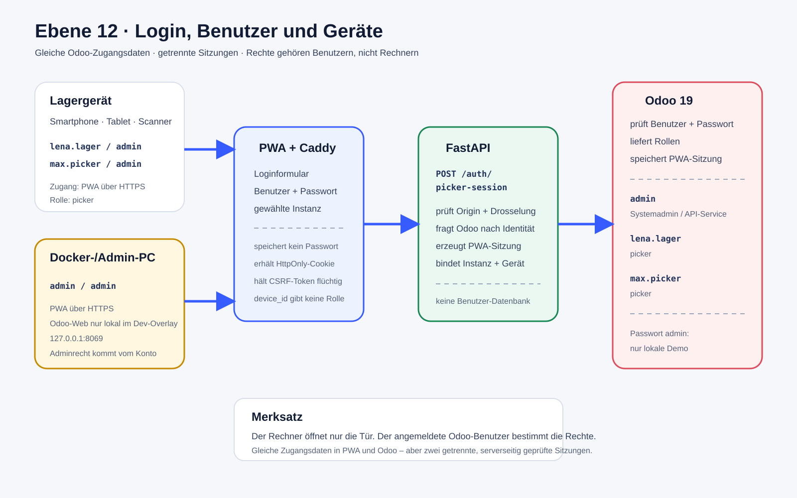

# Ebene 12: Login, Benutzer und Geräte

Ebene 11 erklärte Rollen und Vertrauensgrenzen. Ebene 12 beantwortet die
praktische Frage: **Mit welchem Konto meldet man sich wo an, ist das Passwort
in PWA und Odoo gleich und welcher Rechner besitzt Adminrechte?**

## Die Antwort in 30 Sekunden

- PWA und Odoo verwenden dieselben Odoo-Zugangsdaten.
- Die PWA besitzt keine eigene Benutzer- oder Passwortdatenbank.
- FastAPI reicht Benutzername und Passwort einmalig zur Prüfung an die
  ausgewählte Odoo-Instanz weiter.
- Nach erfolgreicher Prüfung erzeugt die PWA eine eigene, geschützte Sitzung.
  Eine Odoo-Websitzung und eine PWA-Sitzung sind deshalb nicht dasselbe.
- Kein Rechner wird durch seinen Namen oder seine Geräte-ID zum Administrator.
  Rechte stammen immer aus dem angemeldeten Odoo-Benutzer.



Die [Excalidraw-Quelldatei](./ebene-12-login-benutzer-geraete.excalidraw) ist
editierbar. Die SVG-Datei ist die Exportfassung.

## Lokale Demo-Zugänge

Für die lokale Odoo-19-Demo `masterfischer_o19` gilt bewusst eine einfache
Testkonfiguration:

| Anzeigename | Benutzername | Passwort | Odoo-Rolle | PWA-Anmeldung |
| --- | --- | --- | --- | --- |
| Administrator | `admin` | `admin` | Odoo-Systemadministration und technischer API-Zugriff | Nein, solange dem Konto keine Picker-Rolle gegeben wird |
| Lena Lager | `lena.lager` | `admin` | `picker` | Ja |
| Max Picker | `max.picker` | `admin` | `picker` | Ja |

`admin` ist in dieser Tabelle zweimal etwas Verschiedenes:

1. In der Spalte **Passwort** ist es nur das einheitliche lokale Demo-Passwort.
2. Beim Benutzer **Administrator** bezeichnet es zusätzlich das administrative
   Odoo-Konto.

Lena und Max werden durch das Passwort `admin` nicht zu Administratoren. Ihre
Rechte bleiben auf die Odoo-Picker-Gruppe begrenzt.

> **Nur lokale Demo:** Das gemeinsame Passwort darf nicht in Produktion oder
> auf einem ungeschützten Netz verwendet werden. Dort braucht jeder Mensch ein
> eigenes Passwort; FastAPI sollte mit einem eigenen technischen API-Benutzer
> statt dem Systemadministrator verbunden werden.

## Ist das PWA-Login dasselbe wie das Odoo-Login?

Die Zugangsdaten sind dieselben, der Anmeldeweg und die Sitzung unterscheiden
sich.

### Anmeldung in der PWA

```text
Mitarbeiter
  → PWA-Loginformular
  → POST /api/auth/picker-session
  → FastAPI prüft Instanz, Drosselung und Origin
  → Odoo prüft Benutzername + Passwort
  → Odoo liefert Benutzer-ID und Picker-/Supervisor-Rollen
  → Odoo speichert die PWA-Sitzung
  → Browser erhält HttpOnly-Cookie + CSRF-Token
```

Das Passwort wird nach dem Request aus dem Eingabefeld gelöscht und weder im
Local Storage noch in der PWA-Sitzung gespeichert.

### Anmeldung im Odoo-Web

```text
Benutzer
  → Odoo-Webformular
  → Odoo prüft denselben Benutzernamen und dasselbe Passwort
  → Odoo erzeugt eine eigene Odoo-Websitzung
```

Ein erfolgreicher Odoo-Weblogin beweist daher, dass die Zugangsdaten stimmen.
Für die PWA muss der Benutzer zusätzlich `picker` oder `supervisor` sein.

## Welche Rechner haben Adminrechte?

**Keiner automatisch.** Ein Rechner ist nur ein Zugangsgerät.

| Gerät oder Rechner | Erreichbarer Zugang im aktuellen Aufbau | Adminrecht |
| --- | --- | --- |
| Docker-/Entwicklungsrechner | PWA über HTTPS; Odoo-Web im Dev-Overlay über `127.0.0.1:8069` | Nur wenn sich dort der Odoo-Benutzer `admin` anmeldet |
| Lager-Smartphone oder Scannergerät | PWA über Caddy/HTTPS | Nein; Rechte folgen Lena oder Max |
| Weiterer PC im LAN | PWA über Caddy/HTTPS | Nein; direkter Odoo-Port ist standardmäßig nicht veröffentlicht |
| FastAPI-Container | Interner JSON-RPC-Zugang zu Odoo | Technische API-Rechte, keine menschliche Computersitzung |

Die zufällige PWA-`device_id` bindet Sitzung und Claims an einen Browser. Sie
ist kein Gerätename, keine Inventarnummer und verleiht keine Rolle. Soll später
feststehen, welches physische Firmengerät verwendet wurde, braucht es ein
separates verwaltetes Geräteverzeichnis. Das existiert aktuell bewusst nicht.

## Was wird protokolliert?

Die laufenden Dienste schreiben Betriebslogs in Docker:

```bash
docker compose logs backend
docker compose logs odoo
docker compose logs caddy
```

Sichtbar sind beispielsweise Route, HTTP-Status, Odoo-RPC-Ergebnis und
Zeitpunkt. **Passwörter, API-Keys, Sitzungscookies und CSRF-Token gehören nie
in diese Logs.** Eine fehlgeschlagene Anmeldung antwortet absichtlich nur mit
`Anmeldung fehlgeschlagen`, damit Benutzerkonten nicht erraten werden können.

## Typische Login-Ergebnisse

| Situation | Ergebnis |
| --- | --- |
| Lena oder Max mit Passwort `admin` | Odoo bestätigt Zugang und Picker-Rolle; PWA-Sitzung entsteht |
| Administrator im Odoo-Web | Odoo-Websitzung mit administrativen Rechten |
| Administrator in der PWA ohne Picker-Rolle | Zugangsdaten stimmen, PWA lehnt den mobilen Workflow trotzdem ab |
| Falsches Passwort | `401 Anmeldung fehlgeschlagen` |
| Benutzer ohne `picker`/`supervisor` | `401 Anmeldung fehlgeschlagen` |
| Abgelaufene PWA-Sitzung | `GET /api/auth/me` liefert `401`; PWA zeigt wieder das Login |
| Andere Odoo-Instanz gewählt | Zugangsdaten und Rollen werden genau in dieser Instanz geprüft |

## Wo die Regeln implementiert sind

| Thema | Datei |
| --- | --- |
| Loginformular und Rückkehr nach Ablauf | `pwa/js/app.js` |
| Loginrequest, Cookie und CSRF im Browser | `pwa/js/api.js` |
| Öffentliche Auth-Endpunkte | `backend/app/routers/auth.py` |
| Passwortprüfung und PWA-Sitzung | `backend/app/services/auth_sessions.py` |
| Odoo-Rollenableitung | `odoo/addons/picking_assistant_integration/models/api_security.py` |
| Picker-/Supervisor-Gruppen | `odoo/addons/picking_assistant_integration/security/integration_security.xml` |
| Lokale Demo-Benutzer | `infrastructure/scripts/seed-odoo.py` |
| Odoo-Port nur am Entwicklungsrechner | `docker-compose.dev.yml` |
| Öffentlicher PWA-Eingang | `infrastructure/caddy/Caddyfile` |

## Aktuelle Ansicht

Die PWA-Anmeldung zeigt die Auswahl zwischen Lager 1 und Lager 2. Aktuelle
Screenshots sind im [Projekt-README](../../README.md#screenshots-vom-27-august-2026)
verlinkt.

## Ebene 12 in sechs Regeln

1. PWA und Odoo verwenden dieselben Odoo-Zugangsdaten.
2. Die PWA führt keine zweite Passwortdatenbank.
3. Gleiche Zugangsdaten bedeuten nicht dieselbe Browser-Sitzung.
4. Rollen gehören Benutzern, nicht Rechnern oder Geräte-IDs.
5. Zugangsdaten, Passwörter und Sitzungstoken gehören nicht in Dokumentation
   oder Protokolle.
