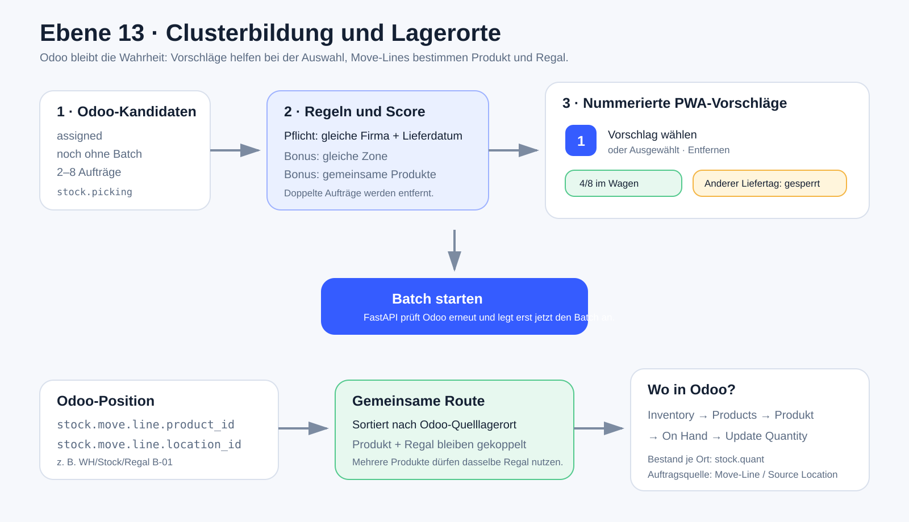

# Ebene 13: Clusterbildung und Lagerorte

Diese Ebene erklärt zwei Fragen: **Warum werden Aufträge als Cluster
vorgeschlagen?** und **woher kennt die PWA den Lagerplatz eines Produkts?**



Die [Excalidraw-Quelldatei](./ebene-13-clusterbildung-und-lagerorte.excalidraw)
ist editierbar.

## Clusterbildung in sechs Schritten

1. FastAPI liest nur Odoo-Pickings im Zustand `assigned`, die noch keinem
   `stock.picking.batch` zugeordnet sind.
2. Die Move-Lines liefern Ausliefertag, Firma, Produkte und Quelllagerorte.
3. Kandidaten werden zunächst nach Ausliefertag, Zone und gemeinsamem Produkt
   gefunden.
4. Ein Vorschlag enthält zwei bis acht Aufträge. Gleiche Firma und gleicher
   Ausliefertag sind Pflicht. Gemeinsame Produkte erhöhen den Score, sind aber
   kein hartes Ausschlusskriterium.
5. Ein Auftrag erscheint nur in einem Vorschlag. Dadurch sind die nummerierten
   Kacheln echte, voneinander getrennte Auswahlmöglichkeiten.
6. Mehrere Vorschläge dürfen kombiniert werden, wenn der Ausliefertag gleich
   bleibt und zusammen höchstens acht eindeutige Aufträge entstehen.

`100 % Passung` bedeutet damit nicht, dass jeder Artikel identisch ist. Der
Score belohnt eine gemeinsame Zone, denselben Ausliefertag und Produktüberlappung.

Beim Klick auf **Batch starten** prüft FastAPI die aktuelle Odoo-Wahrheit erneut.
Ein inzwischen gebuchter oder veränderter Auftrag wird nicht blind übernommen.

## Clusterbildung und Lagerstopp sind zwei verschiedene Gruppierungen

Diese beiden Schritte klingen ähnlich, lösen aber unterschiedliche Probleme:

| Schritt | Zeitpunkt | Gruppiert wird | Zweck |
| --- | --- | --- | --- |
| **Clusterbildung** | Vor dem Batchstart | Mehrere `stock.picking`-Aufträge | Entscheiden, welche Aufträge gemeinsam auf einen Wagen kommen |
| **Lagerstopp-Bildung** | Nach dem Batchstart im Browser | Mehrere `stock.move.line`-Positionen | Gleichen Artikel am gleichen Ort nur einmal als Gesamtentnahme zeigen |

Ein gemeinsames Produkt kann also zuerst helfen, zwei Aufträge als Cluster
vorzuschlagen. Später kann genau dieses Produkt zusätzlich zu einem gemeinsamen
Lagerstopp werden. Die erste Gruppierung erzeugt einen echten Odoo-Batch; die
zweite verändert nur die PWA-Darstellung.

## Wann werden Positionen zu einem Lagerstopp gebündelt?

`buildClusterStops()` in `pwa/js/ui.js` prüft für jede vom Backend gelieferte
Position:

1. Ist die `product_id` gleich?
2. Ist der Quelllagerort gleich?
3. Ist das Produkt nicht serien- oder chargengetrackt?
4. Kommt jede `picking_id` in der möglichen Gruppe nur einmal vor?

Nur wenn alles zutrifft, addiert die PWA die sichtbare Gesamtmenge. Beispiel:

```text
Move-Line Auftrag 43: 2 × Brick 2x2 blau, Regal B-01, Karton 1
Move-Line Auftrag 44: 2 × Brick 2x2 blau, Regal B-01, Karton 2

PWA-Lagerstopp:       4 × Brick 2x2 blau, Regal B-01
Aufteilung darunter:  2 → Karton 1 und 2 → Karton 2
```

Die ursprünglichen Move-Lines bleiben als `allocations` im sichtbaren Stopp
erhalten. Jeder Bestätigungsbutton zeigt wieder auf die ursprüngliche Line-ID.
Die PWA sendet deshalb weiterhin zwei Odoo-Buchungen mit jeweils zwei Stück und
niemals eine Vierer-Buchung auf nur einen Auftrag.

Serien- und Chargenpositionen bleiben einzeln, weil jede Serien-/Losinformation
einer konkreten Move-Line zugeordnet werden muss. Mehrere Split-Lines desselben
Auftrags bleiben ebenfalls einzeln: Der aktuelle Cluster-Payload übernimmt die
Sollmenge des übergeordneten `stock.move` auf jede Line; blindes Summieren könnte
deshalb überzählen.

Der Gruppenschlüssel unterstützt eine Lagerort-ID, fällt im aktuellen
Cluster-Payload aber auf den vollständigen `location_src`-Pfad zurück. Zwei nur
ähnlich benannte Regale werden dadurch nicht zusammengelegt.

## Warum können zwei Produkte im selben Regal liegen?

Ein Odoo-Lagerort ist ein Behälter oder Platz, kein exklusives Produktfach.
Deshalb können verschiedene Produkte denselben Wert wie `Regal B-01` besitzen.
Das ist nicht automatisch ein Datenfehler.

Die Cluster-PWA zeigt für jede Position genau:

```text
stock.move.line.product_id  → Produkt
stock.move.line.location_id → Quelllagerort
```

Sie berechnet den Lagerort nicht aus dem Produktnamen. Die Route sortiert die
Move-Lines lediglich nach ihren bereits in Odoo vorhandenen Quelllagerorten.

Live-Beispiele aus `masterfischer_o19` vom 13. August 2026:

| Produkt | Odoo-Quelllagerort |
| --- | --- |
| `[4166960] Brick 2x2 blau` | `WH/Stock/Regal B-01` |
| `[6023350] Brick 2x2x2 R=15 gelb` | `WH/Stock/Regal A-01` |
| `[4648234] Brick 2x2 pink` | `WH/Stock/Regal B-02` |

## Wo sehe ich den Lagerort in Odoo?

In Odoo 19:

```text
Inventory
→ Products
→ Products
→ Produkt öffnen
→ On Hand
→ Update Quantity
```

Die normale Produktseite zeigt zuerst nur die Gesamtmenge. Die
Bestands-/Lagerortansicht basiert auf `stock.quant`. Für einen bereits
reservierten Auslieferungsauftrag ist die operative Quelle zusätzlich dessen
Move-Line unter `Operations`; genau deren `Source Location` verwendet die PWA.

## Auswahlzustände in der PWA

- **Vorschlag wählen:** übernimmt die enthaltenen Aufträge nur in die lokale
  Auswahl; Odoo wird noch nicht verändert.
- **Ausgewählt · Entfernen:** nimmt genau diesen Vorschlag wieder heraus.
- **Anderer Liefertag:** Kombination ist gesperrt.
- **Wagen voll:** die Kombination würde mehr als acht Aufträge enthalten.
- **Batch starten (n/8):** erst dieser Schritt legt einen echten Odoo-Batch an.

## Verbindliche Quellen

- `backend/app/services/cluster_service.py`: Vorschläge, Regeln und erneute Prüfung
- `backend/app/services/route_optimizer.py`: Sortierung der Odoo-Lagerorte
- `pwa/js/ui.js`: `buildClusterStops()` und sichere visuelle Bündelung
- `pwa/js/app.js`: Auswahl, nummerierte Kacheln, Lagerstopps und atomare Bestätigung
- `pwa/js/tests/cluster-ui.test.mjs`: 2-plus-2-, Teilfortschritts- und Gegenfälle
- `stock.picking`: Auftrag und Batch-Zugehörigkeit
- `stock.move.line`: Produkt, offene Menge und operativer Quelllagerort
- `stock.quant`: Bestand eines Produkts je Lagerort
