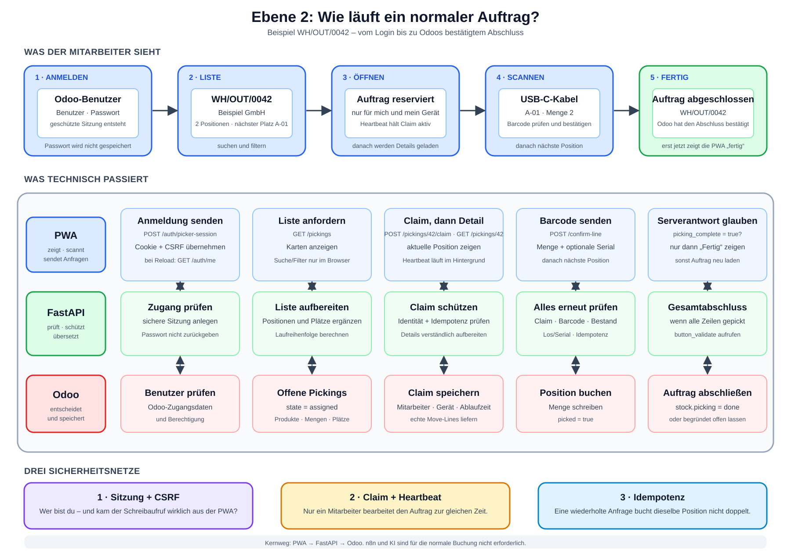

# Ebene 2: Die PWA und ein normaler Auftrag

Ebene 1 zeigte das ganze System von oben. Ebene 2 geht einen Schritt näher
heran: Was passiert vom Anmelden bis zum abgeschlossenen Auftrag?

Wir betrachten nur den normalen Ablauf mit Touch oder Scanner. Cluster,
Quality und Sprache bekommen eigene Ebenen.

## Die Erklärung in 30 Sekunden

Ein Mitarbeiter meldet sich in der PWA mit seinem Odoo-Benutzer an. Danach
holt die PWA offene Aufträge über FastAPI aus Odoo.

Öffnet der Mitarbeiter einen Auftrag, reserviert FastAPI ihn in Odoo für dieses
Gerät. Beim Scannen prüft erst die PWA den Barcode und danach das Backend noch
einmal. FastAPI schreibt die bestätigte Position nach Odoo.

Nach der letzten Position bittet FastAPI Odoo, den Auftrag abzuschließen. Die
PWA zeigt den Abschlussbildschirm nur, wenn Odoo den Abschluss bestätigt hat.

> **Merksatz:** Die PWA zeigt und bedient. FastAPI prüft und vermittelt. Odoo
> entscheidet und speichert.

## Der Ablauf als Bild



Die [Excalidraw-Quelldatei](./ebene-2-pwa-normaler-auftrag.excalidraw) ist die
editierbare Fassung. Die
[SVG-Datei](./ebene-2-pwa-normaler-auftrag.svg) eignet sich für Dokumente,
Präsentationen und die Bachelorarbeit.

Das Bild besitzt zwei Teile:

1. Oben siehst du die fünf Bildschirme beziehungsweise Arbeitsschritte des
   Mitarbeiters.
2. Darunter siehst du, was PWA, FastAPI und Odoo dabei jeweils tun.

Das Bild zeigt den fachlichen Anwendungspfad. Technisch erreicht jede
`/api/*`-Anfrage FastAPI über Caddy. Caddy erhält hier keine eigene Spur, weil
Ebene 1 und Ebene 6 die Eingangsschicht bereits erklären.

## Unser geprüfter Beispielauftrag

Dieses Beispiel stammt aus einem rein lesenden Abzug der lokalen Odoo-
Datenbank `masterfischer` vom 7. August 2026. Der Auftrag war dabei im Zustand
`assigned`; es wurden keine Lagerdaten verändert.

```text
Auftrag: WH/INT/00360
Modell:  Ente Henri (BOM 619287)

Position 1
1 × Brick 2x2 pink
Lagerplatz WH/Stock/Lager Links/L-E1-P2
Barcode 4648234

Position 2
1 × Plate 2x4 pink
Lagerplatz WH/Stock/Lager Links/L-E1-P3
Barcode 4250173

Weitere Positionen
1 × Brick 2x3 W. Inv. Bow gelb       · Regal A-01 · 6167549
1 × Brick 2x2 gelb                   · Regal B-02 · 343724
1 × Brick 2x2x2 R=15 gelb            · Regal D-01 · 6023350
1 × Brick 2x4 W. Inv. Bows gelb      · Regal D-01 · 6171865
```

## Schritt 1: Anmelden

Die PWA zeigt Benutzername, Passwort und – falls mehrere vorhanden sind – die
Odoo-Instanz.

```text
PWA → POST /api/auth/picker-session → FastAPI → Odoo
```

FastAPI prüft die Zugangsdaten gegen die ausgewählte Odoo-Instanz. Bei Erfolg
erhält der Browser:

- ein geschütztes Sitzungscookie,
- den Namen und die ID des Mitarbeiters,
- ein CSRF-Token für schreibende Anfragen.

Das Passwort wird nach der Anfrage aus dem Eingabefeld gelöscht. Die PWA
speichert es nicht.

Bei einem späteren Neuladen fragt die PWA zuerst `GET /api/auth/me`. Ein Name
im Browser beweist keine Anmeldung; die gültige Serversitzung ist entscheidend.

## Schritt 2: Offene Aufträge laden

Nach der Anmeldung ruft die PWA die Auftragsliste ab:

```text
PWA → GET /api/pickings → FastAPI → Odoo
```

FastAPI liest aus Odoo offene `stock.picking`-Datensätze im Zustand
`assigned`. Zusätzlich lädt es Positionen, Produkte und Lagerplätze. Daraus
baut es eine für die PWA geeignete Liste.

Die PWA kann diese Liste suchen und filtern. Das verändert keine Lagerdaten.
Es verändert nur, welche bereits geladenen Aufträge auf dem Bildschirm stehen.

Für `WH/INT/00360` ergibt die aktuelle Produktionslogik:

```text
Ente Henri
1x Brick 2x2 pink
6 Positionen offen
Nächster Platz: L-E1-P2
Referenz: WH/INT/00360
```

Die Reihenfolge ist nicht die Reihenfolge der Datenbankzeilen. Der vorhandene
Routenplaner setzt den Bereich `Lager Links` vor die generischen Regale A, B
und D. Genau diese Projektion wurde mit den sechs echten Positionen als
ausführbarer Self-Check geprüft.

## Schritt 3: Auftrag öffnen und reservieren

Beim Antippen von `WH/INT/00360` lädt die PWA nicht sofort blind die Details.
Sie reserviert den Auftrag zuerst:

```text
1. POST /api/pickings/360/claim
2. GET  /api/pickings/360
```

FastAPI speichert den zeitlich begrenzten Claim in Odoo. Darin stehen
Mitarbeiter, Gerät und Ablaufzeit. Solange der Auftrag geöffnet ist, verlängert
die PWA den Claim regelmäßig über:

```text
POST /api/pickings/360/heartbeat
```

Damit bearbeiten nicht zwei Mitarbeiter versehentlich denselben Auftrag. Ist
der Auftrag schon reserviert, antwortet FastAPI mit HTTP 409 und die PWA zeigt,
wer ihn gerade bearbeitet.

Beim Zurückgehen zur Liste oder Abmelden gibt die PWA den Claim frei:

```text
POST /api/pickings/360/release
```

## Schritt 4: Die aktuelle Position anzeigen

Odoo liefert die echten Auftragspositionen. FastAPI ergänzt verständliche
Bezeichnungen und sortiert die noch offenen Positionen zu einer Laufreihenfolge.

Die PWA zeigt für die erste Position beispielsweise:

```text
Brick 2x2 pink
Lagerplatz L-E1-P2
Menge 1
Barcode 4648234
```

Der sichtbare Zustand liegt vorübergehend im Browser. Er ist keine zweite
Lagerdatenbank. Nach einem Fehler oder einer widersprüchlichen Antwort lädt die
PWA den Auftrag erneut vom Server.

## Schritt 5: Artikel scannen und Position bestätigen

Der Barcode kann von einem Handscanner, der Kamera oder einer manuellen Eingabe
kommen. Danach gilt derselbe Weg.

### Erste Prüfung im Browser

Die PWA vergleicht den gelesenen Barcode mit der sichtbaren Position. Ein
offensichtlich falscher Artikel wird sofort abgelehnt. Bei Produkten mit Los-
oder Seriennummer fragt die PWA zusätzlich danach.

### Zweite Prüfung im Backend

Eine Browserprüfung allein wäre nicht sicher. Deshalb sendet die PWA:

```text
POST /api/pickings/360/confirm-line

{
  "move_line_id": 1015,
  "scanned_barcode": "4648234",
  "quantity": 1,
  "serial_number": ""
}
```

FastAPI prüft erneut:

1. Ist die Sitzung gültig?
2. Ist das CSRF-Token gültig?
3. Gehört der Claim noch diesem Mitarbeiter und Gerät?
4. Wurde dieselbe Anfrage schon verarbeitet?
5. Passt der Barcode zum Produkt?
6. Ist am Lagerplatz Bestand vorhanden?
7. Ist bei einem getrackten Produkt die Los- oder Seriennummer gültig?

Erst danach schreibt FastAPI Menge und `picked = true` in die Odoo-
`stock.move.line`.

## Warum der Idempotenzschlüssel wichtig ist

Jede schreibende Anfrage erhält einen Idempotenzschlüssel. Stell dir ihn wie
eine Belegnummer vor.

Wenn das WLAN genau nach dem Speichern abbricht, kann die PWA dieselbe Anfrage
erneut senden. Odoo erkennt die Belegnummer und verarbeitet die Position nicht
versehentlich doppelt.

## Schritt 6: Nächste Position oder Abschluss

Nach dem `Brick 2x2 pink` zeigt die PWA die `Plate 2x4 pink` am Platz
`L-E1-P3` an. Der Ablauf wiederholt sich für die übrigen vier Positionen.

Sind alle Positionen als gepickt gespeichert, ruft FastAPI in Odoo
`stock.picking.button_validate` auf.

Es gibt zwei verschiedene Ergebnisse:

### Odoo bestätigt den Abschluss

FastAPI antwortet mit `picking_complete: true`. Erst jetzt zeigt die PWA:

```text
WH/INT/00360
Auftrag abgeschlossen
Alle Artikel wurden erfasst und synchronisiert.
```

### Odoo lehnt den Abschluss ab

Eine Position kann gebucht sein, während Odoo den Gesamtauftrag beispielsweise
wegen einer fehlenden Seriennummer nicht abschließt.

FastAPI antwortet dann mit `picking_complete: false`. Die PWA zeigt keinen
falschen Abschlussbildschirm, meldet den Fehler und lädt den Auftrag erneut.

> **Eine grüne Anzeige im Browser ist nie stärker als Odoos Antwort.**

## Was in der PWA selbst steckt

Die PWA besteht aus wenigen großen, direkten Teilen:

- `pwa/index.html` enthält die feste Seitenhülle und Navigation.
- `pwa/css/app.css` bestimmt das mobile Aussehen.
- `pwa/js/app.js` steuert Anmeldung, Liste, Detailansicht und Arbeitsablauf.
- `pwa/js/api.js` ist der einzige Weg zum FastAPI-Backend.
- `pwa/js/ui.js` hält den aktuellen sichtbaren Zustand und UI-Helfer.
- `pwa/js/scanner.js` verarbeitet Handscanner, Kamera und manuelle Eingabe.
- `pwa/sw.js` stellt die Anwendungshülle über den Service Worker bereit.

Offline kann die bereits geladene Hülle erscheinen. Aufträge lesen oder
Positionen sicher buchen braucht eine Verbindung zu FastAPI und Odoo.

## Drei Sicherheitsnetze

### 1. Sitzung und CSRF

Das geschützte Cookie weist die Sitzung nach. Das zusätzliche CSRF-Token
schützt schreibende Aufrufe davor, von einer fremden Webseite ausgelöst zu
werden.

### 2. Claim und Heartbeat

Der Claim verhindert parallele Bearbeitung. Der Heartbeat verlängert ihn nur,
solange der Auftrag wirklich geöffnet ist.

### 3. Idempotenz

Die Belegnummer verhindert doppelte Buchungen bei Wiederholung oder
Verbindungsabbruch.

## Häufige Fehlerfälle

| Situation | Reaktion |
| --- | --- |
| Sitzung fehlt oder ist abgelaufen | PWA zeigt wieder die Anmeldung. |
| Auftrag ist bereits reserviert | HTTP 409; PWA zeigt den anderen Bearbeiter. |
| Falscher Barcode | Browser und Backend lehnen die Bestätigung ab. |
| Kein Bestand am Platz | Position wird blockiert; Problem oder Nachschub kann gemeldet werden. |
| WLAN bricht bei der Buchung ab | Keine lokale Erfolgserfindung; Wiederholung bleibt durch Idempotenz sicher. |
| Odoo lehnt den Gesamtabschluss ab | Position bleibt gebucht, Auftrag bleibt offen, PWA lädt den Serverstand neu. |

## Was bei einem normalen Auftrag nicht beteiligt ist

Der fachliche Kernweg ist:

```text
PWA → FastAPI → Odoo
```

- n8n verarbeitet den normalen Auftrag nicht.
- Ollama entscheidet nichts über die Buchung.
- Whisper wird ohne Spracheingabe nicht benötigt.
- Piper oder Browser-Sprache können Hinweise vorlesen, sind für die Buchung
  aber optional.
- PostgreSQL wird nicht direkt von der PWA oder FastAPI angesprochen; Odoo
  verwaltet seine Daten selbst.

## Wo finde ich das im Code?

| Frage | Einstiegspunkt |
| --- | --- |
| Wie meldet sich die PWA an? | `pwa/js/app.js` – `submitLogin()` |
| Wie werden Cookies und CSRF benutzt? | `pwa/js/api.js` – `loginPickerSession()` und `request()` |
| Wie wird die Liste geladen? | `pwa/js/app.js` – `loadPickingList()` |
| Wie wird ein Auftrag geöffnet? | `pwa/js/app.js` – `loadPickingDetail()` |
| Wie wird gescannt und bestätigt? | `pwa/js/app.js` – `handleScan()` |
| Welche HTTP-Routen gibt es? | `backend/app/routers/auth.py` und `backend/app/routers/pickings.py` |
| Wie werden Odoo-Daten aufbereitet? | `backend/app/services/picking_service.py` |
| Wie funktionieren Claim und Idempotenz? | `backend/app/services/mobile_workflow.py` |
| Wo liegt der Claim in Odoo? | `odoo/addons/picking_assistant_core/models/picking_assistant.py` |

## Review-Scorecard

Stand: 8. August 2026. Bewertet wurde die überarbeitete Darstellung gegen die
PWA-Aufrufe, FastAPI-Routen und -Services sowie die Odoo-Modelle für Sitzung,
Claim, Idempotenz und Picking.

| Kriterium | Punkte |
| --- | ---: |
| Ablaufabdeckung | 20/20 |
| Verbindungs- und Endpunktgenauigkeit | 20/20 |
| Übereinstimmung mit dem aktuellen Code | 18/20 |
| Verständlichkeit | 19/20 |
| Angemessene Detailtiefe | 19/20 |
| **Gesamt** | **96/100** |

Die einzelnen Schritte sind im Code und in Tests belegt. Der frühere
Odoo-18/19-Migrationsfehler ist behoben; die PWA-Anmeldung von Lena und Max
gegen die aktuelle Odoo-19-Datenbank wurde am 13. August 2026 live geprüft.
Claim und Confirm bleiben davon getrennte fachliche Nachweise.

## Ebene 2 in einem Satz

> Der Mitarbeiter bedient die PWA; FastAPI schützt und übersetzt jeden Schritt;
> Odoo bleibt vom ersten Laden bis zum letzten Abschluss die Wahrheit.
