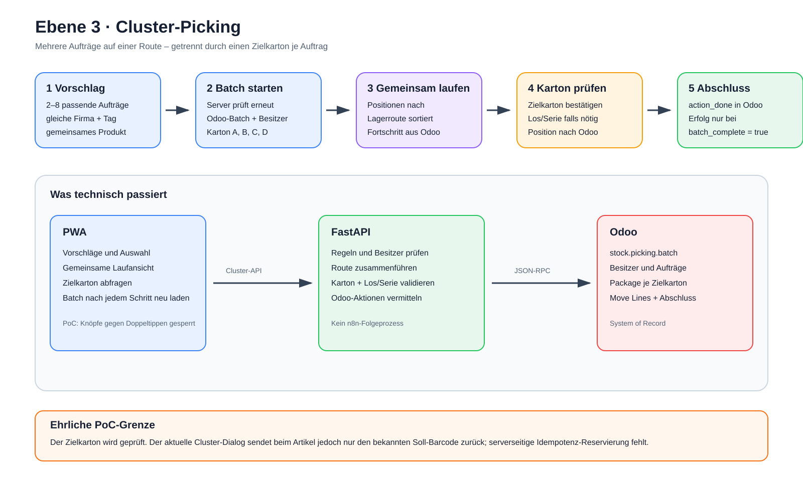

# Ebene 3: Cluster-Picking

Ebene 2 zeigte einen einzelnen Auftrag. Beim Cluster-Picking nimmt ein
Mitarbeiter mehrere passende Aufträge gleichzeitig mit und läuft einen
gemeinsamen Weg durch das Lager.

## Die Erklärung in 30 Sekunden

FastAPI schlägt Aufträge vor, die fachlich zusammenpassen. Der Mitarbeiter
wählt zwei bis acht Aufträge aus. FastAPI prüft die Auswahl erneut und erzeugt
in Odoo aus den weiterhin gültigen Aufträgen einen echten Batch sowie einen
Zielkarton pro Auftrag mit Move-Lines.

Die PWA fasst danach geeignete Positionen zu einer gemeinsamen Laufreihenfolge
zusammen: nur ungetrackte Move-Lines mit gleichem Produkt und Quellort und nur,
wenn höchstens eine Line je Auftrag in der Gruppe liegt. Am aktuellen
Lagerstopp scannt der Mitarbeiter den Artikel einmal und danach jeden
Zielkarton getrennt. Jeder akzeptierte Kartonscan bestätigt weiterhin genau
eine ursprüngliche Move-Line. Chargen- und Serienpositionen bleiben
ungegrouppt und werden einzeln über den manuellen Dialog bestätigt.

> **Merksatz:** Gemeinsam laufen, aber jeden Kundenauftrag sauber in seinem
> eigenen Karton halten.

## Fünf Begriffe, die man auseinanderhalten muss

| Begriff | Bedeutung in diesem Projekt |
| --- | --- |
| **Auftrag** | Ein Odoo-`stock.picking`, zum Beispiel `WH/OUT/0043`. |
| **Batch** | Ein echter Odoo-`stock.picking.batch`, der mehrere Aufträge und einen Besitzer zusammenhält. |
| **Move-Line** | Eine einzelne Odoo-`stock.move.line`. Sie verbindet Produkt, Quelllagerort, Auftrag, Menge und Zielpaket. |
| **Lagerstopp** | Eine reine PWA-Darstellung: gleicher Artikel am gleichen Ort wird für die Entnahme zusammengefasst. Dafür entsteht kein neuer Odoo-Datensatz. |
| **Aufteilung** | Eine ursprüngliche Move-Line innerhalb eines Lagerstopps, die weiterhin einzeln für ihren Auftrag und Karton bestätigt wird. |

Damit existieren drei verschiedene Sichten auf dieselbe Arbeit:

1. **Odoo-Wahrheit:** getrennte Aufträge, Move-Lines und Zielpakete.
2. **FastAPI-Projektion:** eine gemeinsame, nach Lagerorten sortierte Liste aller
   Move-Lines des Batches.
3. **PWA-Sicht:** möglichst wenige Laufstopps, aber weiterhin eine sichere
   Aufteilung je Auftrag und Karton.

Die pauschale Aussage „Positionen werden nicht verschmolzen“ wäre damit
ungenau: In der PWA werden geeignete Positionen bewusst zu einem visuellen
Lagerstopp zusammengeführt. Nicht verschmolzen werden die Odoo-Move-Lines,
ihre Auftrags-/Kartonzuordnung und die einzelnen Writes.

## Der Ablauf als Bild



Die [Excalidraw-Quelldatei](./ebene-3-cluster-picking.excalidraw) ist
editierbar. Die [SVG-Datei](./ebene-3-cluster-picking.svg) eignet sich für
Dokumente und Präsentationen.

Das Bild zeigt den fachlichen Anwendungspfad. Technisch erreicht jede
`/api/cluster/*`-Anfrage FastAPI über Caddy. Caddy erhält hier keine eigene
Spur, weil Ebene 1 und Ebene 6 die Eingangsschicht bereits erklären.

## Die technische Kette auf einen Blick

```text
Mobilgerät / Browser
├─ GET /, /js/*, /css/*
│  └─ Edge-Caddy → PWA-Caddy :80 → statische Dateien aus /srv
│
└─ /api/cluster/*
   └─ Edge-Caddy → FastAPI :8000
      └─ Cluster-Router → ClusterService → OdooClient
         └─ JSON-RPC → Odoo :8069 → Odoo-Modelle → PostgreSQL
```

Der PWA-Container führt die Anwendung nicht aus. Er liefert nur HTML, CSS und
JavaScript. Ausgeführt wird dieses JavaScript im Browser des Mobilgeräts. Der
Browser sendet seine API-Anfragen wieder an dieselbe HTTPS-Adresse; Caddy
entscheidet anhand von `/api/*`, ob die Anfrage zum Backend oder zum statischen
PWA-Server gehört.

Die PWA spricht weder direkt mit Odoo noch direkt mit PostgreSQL. Auch FastAPI
greift nicht auf Odoos Datenbanktabellen zu, sondern benutzt Odoos offizielle
Modellmethoden über JSON-RPC.

## Das 2-plus-2-Beispiel

```text
WH/OUT/0043 → Karton 1 → 2 × Brick 2x2 blau aus Regal B-01
WH/OUT/0044 → Karton 2 → 2 × Brick 2x2 blau aus Regal B-01
```

Ohne Bündelung müsste der Mitarbeiter denselben Artikel am selben Regal zweimal
lesen: erst zwei Stück für Auftrag 43, dann noch einmal zwei Stück für Auftrag
44. Die neue PWA-Sicht zeigt stattdessen:

```text
Regal B-01
Brick 2x2 blau
4 Stück gesamt · 2 Aufträge

2 Stück → Karton 1 · WH/OUT/0043
2 Stück → Karton 2 · WH/OUT/0044
```

Der Mitarbeiter scannt den Artikel einmal und entnimmt damit vier Stück.
Danach scannt er Karton 1 und Karton 2 getrennt. Odoo behält weiterhin zwei
Move-Lines mit jeweils zwei Stück. Es wird weder ein Auftrag überschrieben noch
eine künstliche Vierer-Move-Line angelegt.

Zwei Aufträge sind technisch gültig. Vier bis acht Aufträge sind für einen
wirtschaftlichen Cluster empfohlen, weil sich der gemeinsame Laufweg dann meist
stärker lohnt.

## Schritt 1: Vorschläge laden

Die PWA lädt Cluster-Vorschläge über:

```text
GET /api/cluster/suggestions
```

FastAPI liest zunächst Odoo-`stock.picking`-Datensätze im Zustand `assigned`,
die noch keine `batch_id` besitzen. Anschließend liest es für diese Aufträge die
Produkt- und Lagerortinformationen aus `stock.move.line`.

Die automatische Suche bildet Kandidatengruppen zunächst über diese drei Werte:

```text
Ausliefertag + primäre Lagerzone + gemeinsames Produkt
```

Danach bewertet FastAPI jede Gruppe. Wichtig ist die Trennung zwischen Pflicht
und Empfehlung:

| Regel | Wirkung |
| --- | --- |
| Zwei bis acht eindeutige Aufträge | Harte Grenze |
| Zustand `assigned` und noch ohne Batch | Harte Grenze |
| Gleiche Odoo-Firma | Harte Grenze |
| Gleicher Ausliefertag | Harte Grenze |
| Gleiche Zone | Verbessert Vorschlag und Route, aber ist beim erneuten Batch-Check kein harter Ausschluss |
| Gemeinsame Produkte | Erzeugen die automatischen Kandidaten und erhöhen den Score; eine Kombination mehrerer sichtbarer Vorschläge darf dennoch ohne vollständige Produktüberschneidung bestehen |

Ein Auftrag erscheint höchstens in einem sichtbaren Vorschlag. Dadurch sehen
zwei Kacheln nicht wie verschiedene Möglichkeiten aus, obwohl sie dieselben
Aufträge enthalten.

Ein Vorschlag ist eine Hilfe, keine Buchung. Odoo wird dadurch noch nicht
verändert. Schlägt die Vorschlagsabfrage fehl, zeigt die aktuelle PWA einen
Fehler; ein manueller Auswahl-Fallback ist momentan nicht vorhanden.

## Schritt 2: Aufträge auswählen und Batch starten

Der Mitarbeiter wählt zwei bis acht Aufträge aus; vier sind die empfohlene
Mindestgröße für eine sinnvolle Runde. Danach sendet die PWA:

```text
POST /api/cluster/batches
```

Der Browser sendet dabei das geschützte Sitzungscookie, das CSRF-Token und
einen syntaktisch gültigen `Idempotency-Key`. Caddy leitet die Anfrage an
FastAPI weiter. Dort greifen die gemeinsamen Browser-Gates, bevor der
Cluster-Router die Fachlogik aufruft.

FastAPI vertraut der alten Bildschirmliste nicht, sondern prüft die Aufträge
erneut. IDs, die nicht mehr `assigned` oder bereits einem Batch zugeordnet sind,
werden dabei aus der Auswahl entfernt. Bleiben danach mindestens zwei gültige
Aufträge übrig und passen Kapazität, Firma und Ausliefertag, erzeugt FastAPI mit
diesem Rest einen `stock.picking.batch` und setzt den Mitarbeiter als Besitzer.
Der aktuelle Service verwirft also einzelne ungültige IDs still, statt den
gesamten Start atomar abzulehnen.

Danach passiert in Odoo in dieser Reihenfolge:

1. `stock.picking.batch` mit den geprüften `picking_ids` und dem angemeldeten
   Mitarbeiter als `user_id` anlegen.
2. Für jeden Auftrag mit Move-Lines ein eigenes `stock.package` als Zielkarton
   anlegen. Auf einer Legacy-Instanz fällt der Client auf
   `stock.quant.package` zurück.
3. Dieses Package als `result_package_id` auf alle Move-Lines des zugehörigen
   Auftrags schreiben.
4. Den Batch mit `stock.picking.batch.action_confirm` starten.
5. Den Batch mit `get_batch()` wieder aus Odoo lesen und bereits als Antwort
   des POST-Aufrufs an die PWA zurückgeben.

Schlägt die Package-Zuordnung oder `action_confirm` fehl, versucht FastAPI den
unvollständigen Batch mit `action_cancel` zu kompensieren. Die PWA erhält dann
keinen scheinbar erfolgreichen Rundgang.

## Schritt 3: Gemeinsame Laufreihenfolge anzeigen

Direkt nach dem Start enthält bereits die POST-Antwort den aktuellen Batch. Beim
Wiederöffnen und nach jeder bestätigten Aufteilung lädt die PWA ihn erneut:

```text
GET /api/cluster/batches/{batch_id}
```

FastAPI prüft zuerst, ob `stock.picking.batch.user_id` zum angemeldeten
Mitarbeiter passt. Danach liest der Cluster-Service den Batch nicht mit einer
einzigen großen Abfrage, sondern als kontrollierte Projektion:

1. `stock.picking.batch` liefert Name, Zustand, Besitzer und enthaltene
   Aufträge.
2. `stock.picking` liefert Auftragsnamen und Versandkontext.
3. `stock.move.line` liefert Produkt, Quelllagerort, Istmenge, Pick-Status und
   Zielpaket.
4. `stock.move` liefert die Sollmenge.
5. `product.product` liefert Barcode, Artikelnummer und Tracking-Art.
6. FastAPI ergänzt Kartonnummer, Kartonfarbe, Auftragsname und kurze
   Sprachanweisung.

`build_cluster_lines()` führt die einzelnen Move-Lines aller Aufträge in einer
Liste zusammen. Der vorhandene Routenplaner sortiert offene Positionen nach
Lagerweg nach vorne; erledigte Positionen stehen danach.

Erst im Browser bildet `buildClusterStops()` daraus die sichtbaren
Lagerstopps. Eine Gruppe entsteht nur, wenn alle folgenden Bedingungen gelten:

- gleiche `product_id`,
- gleicher Quelllagerort; bevorzugt über eine ID, aktuell als exakter
  `location_src`-Pfad aus dem Cluster-Payload,
- `tracking === "none"`, also weder Serien- noch Chargenprodukt,
- höchstens eine Move-Line desselben Auftrags innerhalb der Gruppe.

Die letzte Regel schützt vor gesplitteten Odoo-Move-Lines. Die aktuelle
Projektion übernimmt die Sollmenge aus `stock.move.product_uom_qty` auf jede
zugehörige Move-Line. Würde die PWA mehrere Split-Lines desselben Auftrags blind
addieren, könnte sie eine zu hohe Entnahmemenge anzeigen.

Das Nicht-Bündeln verhindert nur die zusätzliche Summierung im Lagerstopp. Es
behebt den älteren Mengenfehler nicht vollständig: Jede einzeln dargestellte
Split-Line kann weiterhin die volle Sollmenge ihres übergeordneten Moves tragen,
und die PWA sendet genau diese angezeigte Menge zurück. Split-Moves müssen daher
vor einem produktiven Rollout im Backend auf echte Line-Mengen projiziert und
serverseitig begrenzt werden.

Die PWA zeigt anschließend:

- Lagerplatz und Produkt,
- die Gesamtmenge am Lagerplatz,
- darunter die Teilmenge je Auftrag und Zielkarton,
- den Fortschritt über die einzeln bestätigten Aufteilungen.

### Warum „4 Stück“ keine Vierer-Buchung ist

```text
FastAPI: batch.lines = [Move-Line A mit 2, Move-Line B mit 2]
                           │
                           ▼
PWA: buildClusterStops() = [ein Lagerstopp mit Gesamtmenge 4]
                           │
                           ├─ Artikel einmal scannen → noch kein Write
                           ├─ Karton 1 scannen → bestätigt nur Move-Line A mit 2
                           └─ Karton 2 scannen → bestätigt nur Move-Line B mit 2
```

`renderClusterWalk()` zeigt die Gruppe. `resolveClusterScan()` prüft zunächst
den Produktcode und ordnet danach einen Paketcode genau einer noch offenen
Aufteilung zu. `submitClusterAllocation()` sendet dabei wieder die unveränderte
Line-ID aus `batch.lines`. Auch der manuelle Ausnahmeweg bleibt an diese Line-ID
gebunden. Die PWA sendet deshalb niemals die Gesamtmenge vier an eine einzelne
Odoo-Zeile.

Der Browser hält keine eigene Wahrheit. Nach jeder Bestätigung lädt er den
Batch erneut aus FastAPI und Odoo. Nach der ersten 2-Stück-Aufteilung bleibt der
Stopp deshalb als „4 Stück gesamt · 2 von 4 verteilt“ sichtbar. So fordert die
PWA nicht versehentlich ein zweites Mal zur Gesamtentnahme auf.

## Schritt 4: Artikel einmal, Zielkartons einzeln scannen

Nur der erste offene Lagerstopp nimmt HID- oder Kamerascans an. Für einen
ungetrackten Stopp läuft der Hauptweg in zwei Phasen:

1. `handleClusterScan()` vergleicht den gelesenen Rohwert exakt mit dem
   `product_barcode` des Stopps. Ein Treffer merkt Produktcode und stabilen
   Stopp-Schlüssel nur im aktuellen Browser-Tab; es erfolgt noch kein Request.
2. Jeder weitere Scan muss Name oder ID eines noch offenen Zielkartons treffen.
   Ein Treffer wählt genau dessen Aufteilung und löst genau einen
   `confirm-line`-Request aus.

Ein falscher Artikel, ein falscher Karton oder ein bereits erledigter Karton
bleibt in der PWA ohne Request und damit ohne Odoo-Write. Während ein
Kartonrequest läuft, blockiert `clusterConfirmPending` einen zweiten Submit.

```text
POST /api/cluster/batches/{batch_id}/confirm-line
```

Für die erste Zeile des Beispiels sieht der fachliche Request vereinfacht so
aus:

```json
{
  "picking_id": 43,
  "move_line_id": 6001,
  "scanned_barcode": "4166960",
  "quantity": 2,
  "serial_number": "",
  "scanned_package": "CLUSTER-B1/WH/OUT/0043"
}
```

Die IDs sind hier nur Beispielwerte. Entscheidend ist: Die Anfrage enthält die
ursprüngliche Move-Line, deren Teilmenge und genau ihren Zielkarton.

FastAPI prüft serverseitig:

1. Gehört der Batch dem angemeldeten Mitarbeiter?
2. Gehört die Move-Line genau zum übermittelten Auftrag und Batch?
3. Falls ein Artikelbarcode übermittelt wurde: Passt er zum Produkt?
4. Ist der bestätigte Karton genau das Ziel dieses Auftrags?
5. Passt gegebenenfalls Los- oder Seriennummer?

Erst danach wird die Position in Odoo aktualisiert. Ein übermittelter falscher
Artikelcode und ein falscher Karton werden auch serverseitig vor jedem
Schreibzugriff abgelehnt. Die übermittelte Menge wird im aktuellen
Cluster-Service dagegen nicht mit der offenen Sollmenge verglichen: Jeder
positive Clientwert wird geschrieben. Dass hier zwei Stück statt vier gesendet
werden, garantiert momentan die PWA, nicht eine unabhängige Backend-Regel.

Die Zugehörigkeitsprüfung erfolgt in derselben Odoo-Suchdomain: Move-Line,
Auftrag, Batch und Batch-Besitzer müssen gemeinsam passen. Danach liest FastAPI
das Produkt für Barcode und Tracking, prüft den Zielkarton sowie gegebenenfalls
Los oder Seriennummer und schreibt erst dann `quantity` und `picked = true` auf
die konkrete `stock.move.line`.

Der nachgelagerte Fortschrittsabruf ist bewusst nur „best effort“: Ist der
Odoo-Write bereits erfolgreich, aber das erneute Lesen schlägt fehl, antwortet
FastAPI weiterhin mit Erfolg und leerem Fortschritt. Dadurch wird eine bereits
gebuchte Position nicht wegen eines reinen Anzeigeproblems doppelt bestätigt.

Chargen- und Serienpositionen nimmt `buildClusterStops()` nicht in eine Gruppe
auf. Der Scan-Dispatcher verweist sie auf „Manuell bestätigen“: Dort bestätigt
der Mitarbeiter zuerst den Zielkarton und erfasst danach Charge oder Serie;
anschließend schreibt FastAPI genau diese eine Move-Line einschließlich der
Tracking-Zuordnung.

Der physische Artikelscan ist derzeit eine Regel des neuen PWA-Hauptwegs, noch
keine allgemeine Backendpflicht. Der klar markierte manuelle Ausnahmeweg kann
bei ungetrackter Ware einen leeren `scanned_barcode` senden; der Service prüft
den Produktcode nur, wenn der Client einen nicht leeren Wert übermittelt.

## Schritt 5: Fortschritt und Wiederholung

Nach jeder erfolgreichen Bestätigung lädt die PWA den Batch neu. Erledigte
Positionen rücken ans Ende und werden als erledigt markiert; die nächste offene
Position steht vorne.

Solange derselbe Lagerstopp nach dem Neuladen noch offene Kartons besitzt,
bleibt der einmal geprüfte Produktcode im Browser-Tab gültig. Nach dem letzten
Karton wechselt der aktuelle Stopp und der Scanstatus wird verworfen; der
nächste Stopp beginnt wieder mit „Artikel scannen“. Ein vollständiger
Browser-Reload verliert diesen flüchtigen Nachweis ebenfalls.

Der Fortschritt zählt bewusst die atomaren Move-Lines beziehungsweise
Aufteilungen und nicht die Anzahl der sichtbaren Lagerstopps. Ein Stopp mit zwei
Kartons ist also erst vollständig erledigt, wenn beide Kartonzeilen bestätigt
sind.

Der Abschlussknopf wird erst freigeschaltet, wenn keine Position mehr offen ist.
Das ist aktuell eine Regel der PWA. Der Validate-Endpunkt prüft den Fortschritt
nicht noch einmal serverseitig und könnte von einem anderen Client vorzeitig
aufgerufen werden.

## Schritt 6: Batch in Odoo abschließen

```text
POST /api/cluster/batches/{batch_id}/validate
```

FastAPI prüft erneut den Besitzer und ruft anschließend in Odoo
`stock.picking.batch.action_done` auf. Die PWA zeigt den Batch nur bei
`batch_complete: true` als abgeschlossen.

Fordert Odoo einen manuellen Assistenten oder lehnt den Abschluss ab, bleibt
der Batch offen und die PWA zeigt keinen falschen Erfolg.

Der Service übergibt dabei einen Kontext, der automatische Rückstände vermeiden
soll. Gibt Odoo dennoch eine Wizard-Aktion zurück, wandelt FastAPI diese nicht
blind in Erfolg um, sondern meldet `pending_action`. Ein Vorgesetzter muss die
offene Odoo-Aktion dann prüfen. Ist der Batch bereits im Zustand `done`, wird
ein erneuter Abschlussaufruf als bereits erledigt beantwortet.

Auch hier gibt es eine ehrliche Grenze: Liefert `action_done` weder Exception
noch Wizard-Dictionary, setzt der Service `batch_complete: true`, ohne den
Batchzustand anschließend erneut aus Odoo zu lesen. Der Rückgabewert von Odoo
ist damit die Entscheidungsgrundlage; eine zusätzliche Nachkontrolle fehlt.

## Wie FastAPI die richtige Odoo-Instanz erreicht

Die Odoo-Verbindung besteht aus zwei getrennten Schritten:

1. Beim Login prüft FastAPI die eingegebenen Mitarbeiterdaten gegen die
   ausgewählte Odoo-Instanz. Daraus entsteht eine serverseitige Sitzung mit
   `user_id` und `odoo_instance`.
2. Bei jeder späteren Cluster-Anfrage wählt die Dependency den langlebigen
   `OdooClient` ausschließlich über diese Sitzung. Ein Browser-Header darf die
   Instanz in Produktion nicht umbiegen.

`RuntimeServices` hält pro FastAPI-App und Odoo-Instanz einen Client mit eigenem
HTTP-Verbindungspool und Authentifizierungs-Cache. Der Client meldet sich mit
den konfigurierten Service-Zugangsdaten über `common.authenticate` an und ruft
anschließend Odoo-Modelle über `object.execute_kw` auf:

```text
FastAPI
→ http://odoo:8069/jsonrpc
→ common.authenticate
→ object.execute_kw(model, method, args, kwargs)
```

Im Cluster-Pfad werden vor allem diese Odoo-Modelle verwendet:

| Odoo-Modell | Verwendung |
| --- | --- |
| `stock.picking` | Aufträge, Zustand, Firma, Ausliefertag und Batch-Zugehörigkeit lesen |
| `stock.picking.batch` | Batch anlegen, Besitzer setzen, starten, lesen und abschließen |
| `stock.move.line` | Produkt, Lagerort, Zielpaket und Pick-Status lesen; bestätigte Menge schreiben |
| `stock.move` | Sollmenge und Pick-Status ergänzen |
| `product.product` | Barcode, Artikelnummer und Tracking-Art lesen |
| `stock.package` | Auf Odoo 19 einen echten Zielkarton je Auftrag mit Move-Lines anlegen; Legacy-Fallback ist `stock.quant.package` |
| `res.partner` | Versandkontext für die Karton-/Auftragsanzeige ergänzen |

PostgreSQL steht darunter, wird aber ausschließlich von Odoo verwaltet. Weder
ClusterService noch OdooClient senden SQL.

## Wie die Cluster-PWA selbst funktioniert

Die Web-App verwendet kein Frontend-Framework. Sie besteht aus wenigen direkten
Schichten:

| Datei | Aufgabe im Cluster |
| --- | --- |
| `pwa/index.html` | Lädt die feste Seitenhülle, CSS und `app.js` als ES-Modul. |
| `pwa/js/app.js` | Steuert Auswahl, Batchstart, Scan-Dispatcher, Rundgang, Dialoge, atomare Bestätigungen und erneutes Laden. |
| `pwa/js/ui.js` | Hält flüchtigen Browserzustand, bildet mit `buildClusterStops()` die visuellen Sammelstopps und ordnet mit `resolveClusterScan()` Produkt-/Kartonscans ein. |
| `pwa/js/api.js` | Kapselt alle `fetch()`-Aufrufe unter `/api`, Cookie, CSRF- und Idempotenz-Header. |
| `pwa/js/voice.js` | Spricht auf Wunsch die Entnahme und Kartonaufteilung über Piper oder Browser-TTS. |
| `pwa/js/pwa.js` | Registriert den Service Worker und behandelt Installations-/Updatezustände. |
| `pwa/css/app.css` | Mobile Darstellung, Kontrast, aktueller Stopp und Kartonaufteilungen. |
| `pwa/sw.js` | Cached die Anwendungshülle, fasst `/api/*` aber ausdrücklich nicht an. |

Der Zustand in `ui.js` ist nur Arbeitsspeicher des aktuellen Browser-Tabs. Ein
Neuladen darf ihn verlieren, weil Batch, Positionen, Pakete und Fortschritt aus
Odoo wiederhergestellt werden. Der Service Worker kann die Oberfläche bei
Netzausfall anzeigen, aber keinen Cluster sicher lesen oder buchen.

## Was Docker bei diesem Ablauf verbindet

- Der **Edge-Caddy** veröffentlicht als einziger Produktionsdienst Port 80 und
  443. HTTP wird auf HTTPS umgeleitet.
- Der **PWA-Caddy** hängt im `edge-net` und liefert den eingebundenen Ordner
  `./pwa` unter `/srv` aus.
- Das **FastAPI-Backend** hängt an `edge-net`, `core-net` und
  `automation-net`. Für Cluster benötigt es Edge und Core; das Automation-Netz
  ist nur für andere Funktionen wichtig.
- **Odoo** und PostgreSQL liegen im internen `core-net`. Der Docker-DNS-Name
  `odoo` wird im Backend als `http://odoo:8069` verwendet.
- Das Development-Overlay veröffentlicht Backend und Odoo zusätzlich nur auf
  `127.0.0.1`. Ohne dieses Overlay sind diese Ports nicht im LAN erreichbar.

### Was bei einer Codeänderung passiert

| Änderung | Wirkung im aktuellen Compose-Stack |
| --- | --- |
| `pwa/index.html`, `pwa/css/*`, `pwa/js/*` | Durch `./pwa:/srv:ro` sofort im PWA-Container sichtbar; Browser neu laden. Kein Image-Build nötig. |
| `pwa/sw.js` oder Precache-Liste | Zusätzlich Cache-Version prüfen und bei verändertem Offline-Vertrag `CACHE_NAME` erhöhen. |
| `backend/app/*.py` | Durch `./backend/app:/app/app:ro` sofort sichtbar; Uvicorn läuft aktuell mit `--reload`. |
| `backend/requirements.txt` oder Backend-Dockerfile | Backend-Image neu bauen und Container neu erstellen. |
| `docker-compose*.yml`, Environment oder Caddy-Konfiguration | Betroffene Container neu erstellen beziehungsweise Caddy neu laden. |
| `odoo/addons/*` | Dateien sind gemountet, aber Odoo lädt sie nicht automatisch neu; Containerneustart und bei Modell/XML/Manifest-Änderungen ein Modul-Upgrade. |

Damit ist eine UI-Änderung wie die 2-plus-2-Bündelung klein: `ui.js`, `app.js`
und CSS ändern, Browser neu laden. Eine Änderung an der Odoo-Persistenz wäre
deutlich größer und würde Add-on, Modul-Upgrade, Datenmigration und weitere
Integrationstests betreffen. Für die aktuelle Bündelung war sie nicht nötig.

## Sicherheitsnetze und bewusste Grenze

- **Sitzung und CSRF:** Alle Cluster-Routen laufen durch die gemeinsamen
  Browser-Gates. Schreibzugriffe benötigen zusätzlich ein CSRF-Token.
- **Besitzprüfung:** Nur der eingetragene Mitarbeiter darf den Batch lesen,
  bestätigen und abschließen.
- **Kartonkontrolle:** Auftrag und Zielpaket bleiben auch auf der gemeinsamen
  Route getrennt.
- **PWA-Scanfolge:** Im ungetrackten Hauptweg wird der Artikel einmal pro
  visuellem Stopp und danach jeder Zielkarton einzeln geprüft.
- **Serverprüfung:** Batch-Zugehörigkeit, Zielkarton sowie Serien-/Losdaten
  werden serverseitig geprüft; der Barcode nur, wenn der Client ihn nicht leer
  übermittelt.
- **Keine Sammelbuchung:** Die PWA bündelt nur die Anzeige; jeder Write bleibt
  an genau eine Move-Line gebunden.
- **Wahrheit in Odoo:** Batch, Positionen, Pakete und Abschluss liegen in Odoo.

FastAPI verlangt auf schreibenden Cluster-Anfragen zwar einen syntaktisch
gültigen `Idempotency-Key`, der ClusterService reserviert und speichert diesen
Schlüssel aber noch nicht. Nach einem verlorenen Response kann das Backend eine
Wiederholung daher nicht zuverlässig als bereits verarbeitet erkennen. Ein
eigener Claim pro enthaltenem Auftrag fehlt ebenfalls; stattdessen schützt der
Batch-Besitzer den gemeinsamen Rundgang. Die PWA sperrt Start- und
Bestätigungsknöpfe gegen Doppeltippen. Für einen produktiven Betrieb mit
instabilem Netz sollte der Cluster-Pfad dieselbe dauerhafte Idempotenz wie der
normale Picking-Pfad erhalten.

Weitere aktuelle Grenzen:

- Der physische Artikelscan gilt im Scanner-Hauptweg. Der manuelle
  Ausnahmeweg kann weiterhin ohne Artikel-Scan bestätigen; ein leerer Barcode
  umgeht auch die bedingte Backendprüfung.
- Die Menge wird nicht gegen die offene Sollmenge begrenzt.
- Serien-/Chargenpositionen und Split-Lines bleiben absichtlich ungebündelt;
  Split-Lines können trotzdem bereits einzeln eine zu hohe Sollmenge tragen.
- Der Validate-Endpunkt prüft weder den offenen Fortschritt noch liest er nach
  erfolgreichem `action_done` den endgültigen Odoo-Zustand erneut.
- Fällt die Vorschlagsabfrage aus, gibt es derzeit keine manuelle Auswahl als
  Rückfall.

## Was für die Fachlogik nicht erforderlich ist

n8n, Whisper und Ollama sind für Cluster-Picking nicht erforderlich.
Insbesondere löst der aktuelle Batch-Abschluss keinen alten n8n-
`batch-confirmed`-Folgeprozess aus.

Piper entscheidet ebenfalls nichts über Auswahl oder Buchung, kann aber
optional beteiligt sein: Der Lautsprecherknopf eines Clusterstopps ruft die
allgemeine Sprachausgabe auf. Diese bevorzugt den Backend-TTS-Pfad mit Piper und
fällt bei Bedarf auf die Browserstimme zurück.

## Wo der Ablauf im Projekt steckt

| Frage | Einstiegspunkt |
| --- | --- |
| Wie entstehen visuelle Sammelstopps? | `pwa/js/ui.js` – `buildClusterStops()` |
| Wie werden sie angezeigt und bestätigt? | `pwa/js/app.js` – `renderClusterWalk()`, `bindClusterWalk()` und `handleClusterConfirm()` |
| Welche Browser-Endpunkte gibt es? | `pwa/js/api.js` – `getClusterSuggestions()` bis `validateBatch()` |
| Wo liegen die HTTP-Routen und Browser-Gates? | `backend/app/main.py`, `backend/app/routers/cluster.py` und `backend/app/dependencies.py` |
| Wo entstehen Vorschläge, Batch, Kartons und Route? | `backend/app/services/cluster_service.py` – `suggest_batches()`, `create_batch()`, `get_batch()` |
| Wo werden Position und Batch gebucht? | `backend/app/services/cluster_service.py` – `confirm_cluster_line()` und `validate_batch()` |
| Wie spricht FastAPI mit Odoo? | `backend/app/runtime.py` und `backend/app/services/odoo_client.py` |
| Wie ist der Browserweg verdrahtet? | `docker-compose.yml`, `infrastructure/caddy/Caddyfile` und `Caddyfile.pwa` |
| Welcher Test schützt die neue Bündelung? | `pwa/js/tests/cluster-ui.test.mjs` |
