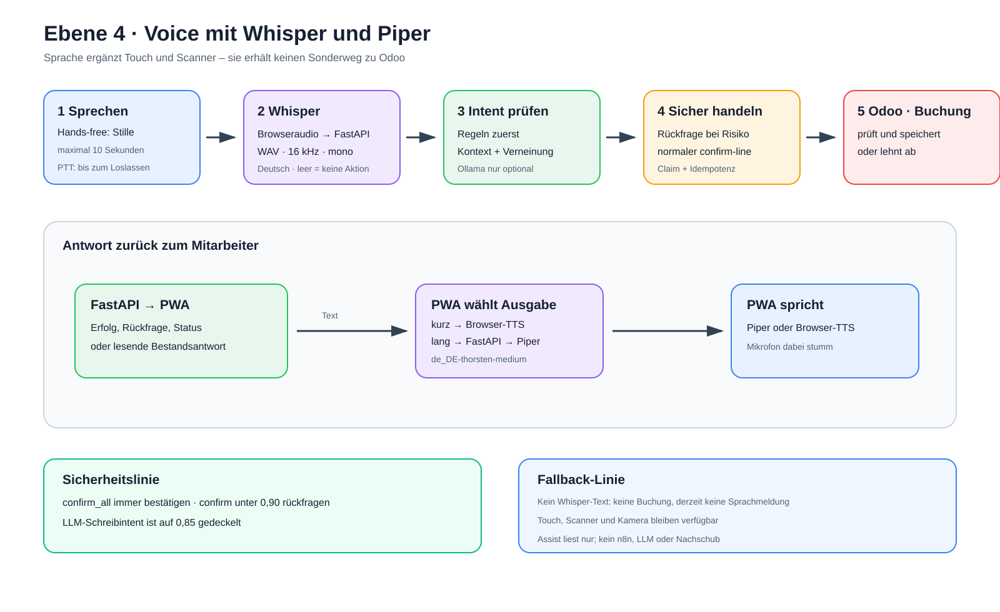

# Ebene 4: Voice mit Whisper und Piper

Voice ersetzt den verlässlichen Touch- und Scannerweg nicht. Es ergänzt ihn:
Der Mitarbeiter kann sprechen, die PWA versteht einfache Befehle und liest
Antworten vor.

## Die Erklärung in 30 Sekunden

Die PWA nimmt eine kurze Äußerung auf und sendet Audio plus den sichtbaren
Arbeitskontext an FastAPI. FastAPI wandelt das Audio über Whisper in Text um
und erkennt daraus einen erlaubten Befehl.

`confirm_all` und unsichere Schreibbefehle müssen bestätigt werden. Ein sicher
erkanntes einzelnes `confirm` darf direkt weiterlaufen. Jede echte
Positionsbuchung nutzt denselben FastAPI- und Odoo-Pfad wie bei Touch. Die PWA
spricht kurze Texte im Browser und ruft für längere Texte bevorzugt Piper auf.

> **Merksatz:** Whisper hört, FastAPI versteht und prüft, Piper spricht – Odoo
> bleibt für Lagerbuchungen zuständig.

## Der Ablauf als Bild



Die [Excalidraw-Quelldatei](./ebene-4-voice.excalidraw) ist editierbar. Die
[SVG-Datei](./ebene-4-voice.svg) ist die Exportfassung.

## Beispiel für einen Sprachbefehl

Bei einer offenen Position kann der Mitarbeiter sagen:

```text
„Position bestätigen“
```

Whisper liefert Text. Die Intent-Erkennung erkennt `confirm`. Bei einer
Konfidenz unter `0,90`, aber mindestens `0,73`, fragt die PWA noch einmal nach.
Nach „Ja“ nutzt sie denselben `confirm-line`-Endpunkt wie der Touchknopf. Ein
exakter Treffer wie „Position bestätigen“ erreicht aktuell `0,95` und läuft
ohne zusätzliche Rückfrage weiter.

## Schritt 1: Aufnahme starten

Der Voice-Knopf unterstützt zwei Bedienweisen:

- kurzer Klick: Hands-free-Modus ein- oder ausschalten,
- längerer Druck: Push-to-Talk.

Die PWA fordert ein Mono-Mikrofon mit Echo- und Rauschunterdrückung an. Im
Hands-free-Modus beendet sie die Aufnahme nach erkannter Sprache bei 550 ms
Stille oder spätestens nach zehn Sekunden. Ohne Sprache endet der Zyklus nach
sechs Sekunden; weniger als 100 ms erkannte Sprache werden verworfen.

Push-to-Talk folgt bewusst einer anderen Regel: Die Aufnahme läuft bis zum
Loslassen. Dafür gelten aktuell weder die automatische Zehn-Sekunden-Grenze
noch die Hands-free-Prüfung für Stille und sehr kurze Geräusche.

## Schritt 2: Audio und Kontext senden

```text
POST /api/voice/recognize
```

Neben dem Audio sendet die PWA genau vier UI-Kontextfelder:

- `context`: `awaiting_command` oder `idle`,
- `surface`: zum Beispiel `detail`, `list`, `quality_alert` oder `complete`,
- `remaining_line_count`: Zahl der danach verbleibenden Positionen,
- `active_line_present`: ob gerade eine Position aktiv ist.

Die konkrete Picking-, Positions- oder Produkt-ID gehört nicht zu
`/voice/recognize`. Der getrennte Assist-Aufruf überträgt diese IDs erst dann,
wenn eine ausdrückliche Bestandsfrage lokalen Odoo-Kontext benötigt.

So kann „weiter“ auf der Detailseite anders behandelt werden als auf der
Anmeldeseite.

## Schritt 3: Audio für Whisper vorbereiten

FastAPI lehnt leere Dateien ab und wandelt Browserformate über ffmpeg in
Mono-WAV mit 16 kHz um. Danach ruft es den internen Whisper-Dienst auf:

```text
FastAPI → POST http://whisper:9000/asr
```

Whisper transkribiert auf Deutsch mit einem kurzen Lager-Domänenhinweis. Meldet
mindestens ein Segment eine `no_speech_prob` von `0,60` oder mehr, verwirft der
Whisper-Client das gesamte Transkript. Bei Whisper-Fehlern liefert er ebenfalls
einen leeren Text zurück. In beiden Fällen erfolgt sicher keine Aktion.

## Schritt 4: Einen erlaubten Intent erkennen

FastAPI verwendet zuerst die deterministische Intent-Erkennung:

1. Text normalisieren,
2. bekannte genaue Formulierungen prüfen,
3. reguläre Regeln prüfen,
4. ähnliche Formulierungen vorsichtig vergleichen.

Oberflächenregeln verhindern unpassende Aktionen. Ein `confirm` ist zum
Beispiel nur bei einer aktiven Auftragsposition sinnvoll. Verneinungen wie
„nicht weiter“ dürfen nicht als Zustimmung ausgeführt werden.

Bleibt der Intent unbekannt oder unsicher, darf optional ein lokaler Ollama-
Classifier helfen. Bei Timeout oder Fehler bleibt das deterministische
Ergebnis bestehen. Ein vom Modell vorgeschlagener Schreibintent kann nie
allein eine Buchung freigeben.

## Schritt 5: Aktion sicher ausführen

Navigation, Wiederholen, Status und Kamera kann die PWA lokal ausführen. Für
eine echte Positionsbestätigung verwendet sie dagegen:

```text
POST /api/pickings/{id}/confirm-line
```

Damit gelten dieselben Schutzmechanismen wie in Ebene 2:

- gültige Sitzung und CSRF-Schutz,
- gültiger Claim für Mitarbeiter und Gerät,
- Idempotenzschlüssel,
- Barcode-, Bestands- und gegebenenfalls Serien-/Losprüfung,
- Abschlussentscheidung durch Odoo.

`confirm_all` verlangt immer eine Rückfrage. Ein einzelnes `confirm` verlangt
sie ebenfalls, wenn die Erkennung nicht sicher genug ist.

## Der getrennte Assist-Pfad

Explizite Bestandsfragen laufen über:

```text
POST /api/voice/assist
```

FastAPI liest dafür Picking- und Bestandskontext aus Odoo und erzeugt eine
lokale Antwort. Der aktuelle Assist-Pfad ruft weder n8n noch ein LLM auf und
führt keine Buchung oder automatische Nachschubanforderung aus. Er ist
absichtlich lesend.

## Schritt 6: Antwort sprechen

Die PWA entscheidet über den Ausgabeweg. Texte bis einschließlich 24 Zeichen
gibt sie direkt mit der Browserfunktion `speechSynthesis` aus. Längere Texte
sendet sie bevorzugt an:

```text
POST /api/voice/tts → FastAPI → Piper
```

Piper erzeugt intern eine WAV-Datei mit der deutschen Stimme
`de_DE-thorsten-medium`. Bei Timeout oder Fehler fällt die PWA auf Browser-TTS
zurück.

Während die Anwendung spricht, ist das Mikrofon stumm. Ein kurzer Cooldown und
eine Echo-Prüfung verhindern, dass die Anwendung ihre eigene Antwort wieder
als neuen Befehl versteht.

## Fehler und sichere Rückfälle

- Kein Mikrofon oder keine Berechtigung: Touch, Scanner und Kamera bleiben da.
- Leere oder verrauschte Hands-free-Aufnahme: keine Aktion, nächster Hörzyklus.
- Whisper nicht erreichbar oder Transkript verworfen: keine Aktion und keine
  Buchung; der aktuelle Voice-Loop erzeugt dafür noch keine akustische Meldung.
- Unbekannter Intent mit Transkript: hörbare Meldung „Nicht verstanden“, keine
  Aktion.
- Ollama nicht erreichbar: deterministische Erkennung bleibt maßgeblich.
- Piper nicht erreichbar: Browser-TTS übernimmt.
- Odoo lehnt eine Buchung ab: kein falscher Erfolgszustand.

## Wo der Ablauf im Projekt steckt

- `pwa/js/voice.js`: Aufnahme, Wiedergabe und Echo-Schutz
- `pwa/js/voice-runtime.mjs`: UI-Kontext und Rückfrage-Regeln
- `pwa/js/app.js`: Intent-Dispatcher und fachliche Aktionen
- `pwa/js/api.js`: Voice- und Picking-Aufrufe
- `backend/app/routers/voice.py`: Recognize, Assist und TTS
- `backend/app/services/intent_engine.py`: deterministische Intent-Erkennung
- `backend/app/services/whisper_client.py`: Whisper-Zugriff
- `backend/app/services/piper_client.py`: Piper-Zugriff
- `backend/app/services/voice_intent_classifier.py`: optionaler Ollama-Fallback
