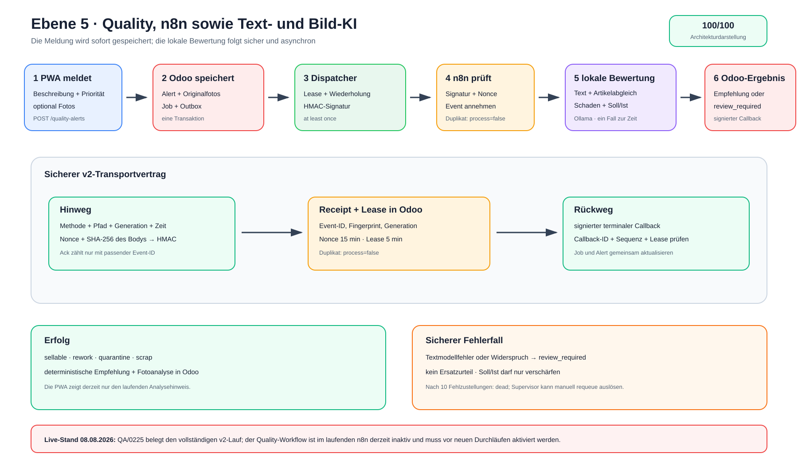

# Ebene 5: Quality, n8n sowie Text- und Bild-KI

Quality ist bewusst vom schnellen Picking-Pfad getrennt. Eine Meldung wird
sofort sicher in Odoo gespeichert; die lokale KI-Bewertung darf anschließend
asynchron erfolgen, wiederholt werden oder zur manuellen Prüfung führen.

## Die Erklärung in 30 Sekunden

Der Mitarbeiter meldet in der PWA ein Problem mit Beschreibung, Priorität und
optional Fotos. FastAPI speichert Meldung, Anhänge und Bewertungsauftrag
gemeinsam in Odoo.

Ein Outbox-Dispatcher liefert den Auftrag signiert an n8n. n8n orchestriert
die Text- und Bildbewertung über FastAPI und lokale Ollama-Modelle. Das Ergebnis
kommt signiert zurück und wird erst nach erneuter Prüfung in Odoo sichtbar.

> **Merksatz:** Erst sicher melden, dann asynchron bewerten. KI empfiehlt;
> Widerspruch oder Ausfall führt zur menschlichen Prüfung.

## Der Ablauf als Bild



Die [Excalidraw-Quelldatei](./ebene-5-quality-n8n-ki.excalidraw) ist
editierbar. Die [SVG-Datei](./ebene-5-quality-n8n-ki.svg) ist die
Exportfassung.

## Ein echter Odoo-Datensatz

Der rein lesende Datenabzug vom 7. August 2026 enthält diesen bereits
vorhandenen Quality Alert:

```text
Meldung:  QA/0149
Auftrag:  WH/INT/00336
Produkt:  Plate 2x4 weiß
Problem:  Artikel beschädigt
Priorität: 3
Fotos:    2
Ergebnis: quarantine
Aktion:   Ware sperren und manuelle Prüfung anfordern.
```

Der Datensatz belegt die echte Odoo-Struktur und die sichtbaren Ergebnisfelder.
Er ist historisch und deshalb kein Beweis für einen heute vollständig laufenden
v2-Durchlauf; dessen Live-Test ist durch die im Architektur-Review genannte
Odoo-19-Datenbankmigration blockiert.

## Schritt 1: Problem in der PWA melden

Die Beschreibung ist Pflicht. Fotos können über Kamera oder Galerie ergänzt
werden. Die PWA sendet Formular und Dateien mit einem Idempotenzschlüssel an:

```text
POST /api/quality-alerts
```

Sitzung, CSRF-Schutz und Idempotenz gelten wie bei anderen schreibenden
Browseraufrufen. Die gesamte Anfrage ist auf 16 MiB begrenzt.

## Schritt 2: Alert, Fotos und Auftrag gemeinsam speichern

FastAPI berechnet für Uploads SHA-256-Fingerprints und übergibt sie an Odoo.
Odoo erzeugt in einer Transaktion:

- den Quality Alert,
- die Originalfotos als `ir.attachment`,
- den Status `pending`,
- einen Integrationsjob,
- eine Outbox-Zeile.

Damit gibt es nicht „eine Meldung ohne Auftrag“ oder „einen Auftrag ohne
Meldung“, wenn die Transaktion fehlschlägt. Odoo bleibt das System of Record.

## Schritt 3: Ereignis zuverlässig ausliefern

Das fachliche Ereignis heißt `quality.assessment.requested.v1` und steckt in
einem sicheren v2-Transportumschlag. Es enthält IDs, Revision, Beschreibung,
Priorität, Produkt, Lagerort, Fotoanzahl und Callback-Informationen – nicht die
Bildbytes selbst.

Der FastAPI-Hintergrundprozess leiht fällige Outbox-Einträge und sendet sie an:

```text
/webhook/quality-assessment-v2
```

Die Outbox arbeitet mit Lease und Wiederholungen. Nach zehn erfolglosen
Zustellungen wird ein Eintrag `dead`. Die Zustellung ist „at least once“:
Dasselbe Event kann erneut ankommen und muss anhand seiner ID dedupliziert
werden.

## Schritt 4: Signatur und Annahme prüfen

FastAPI signiert Methode, Zielpfad, Zustellgeneration, Zeitstempel, Nonce und
Body-Hash per HMAC-SHA256. n8n prüft Signatur, exakten Pfad und ein Zeitfenster
von fünf Minuten.

n8n lässt FastAPI das Event anschließend intern annehmen:

```text
POST /api/internal/n8n/v2/events/accept
```

FastAPI prüft HMAC und Schema; Odoo prüft Event, Fingerprint, Generation und
Job. Nonce und Receipt werden dauerhaft reserviert. Ein bereits angenommenes
Duplikat erhält `process: false` und wird nicht erneut bewertet.

## Nur eine lokale Bewertung zur Zeit

Vor den Modellaufrufen liegt im aktuellen FastAPI-Prozess eine Semaphore. Sie
lässt nur eine Quality-Bewertung gleichzeitig zu, weil parallele 7B-Text- und
Bildmodelle auf dem CPU-System nachweislich beide ausbremsen oder abbrechen
können.

Eine Bewertung wartet höchstens 150 Sekunden auf diesen Platz. Danach entsteht
kein Teilurteil, sondern eine begründete Absage, die zur menschlichen Prüfung
führt. Diese einfache Sperre passt zum aktuellen einzelnen Uvicorn-Worker;
mehrere Worker oder Backend-Repliken bräuchten eine gemeinsame Sperre außerhalb
des Prozesses.

## Schritt 5: Text lokal bewerten

FastAPI lässt Ollama die Beschreibung mit `qwen2.5:7b` einordnen. Erlaubt sind:

- `sellable` – verkaufbar,
- `rework` – Nacharbeit,
- `quarantine` – Quarantäne,
- `scrap` – Ausschuss.

Die konkrete Handlungsempfehlung wird anschließend deterministisch aus der
Einstufung gewählt. Timeout, ungültiges JSON oder ein unbekannter Wert erzeugt
kein heuristisches Ersatzurteil.

## Schritt 6: Bilder lokal prüfen

Über Job, Generation und Lease liest FastAPI höchstens drei Originalfotos und
das Katalogbild aus Odoo. Die Bildbytes werden geprüft und für den
Artikelvergleich auf maximal 512 Pixel verkleinert. Die separate
Schadensprüfung erhält bis zu 768 Pixel, weil echte Risse bei 512 Pixeln in
Messungen verschwanden. Anschließend analysiert `qwen2.5vl:7b` die Bilder.

Das erste Foto wird mit dem Katalogbild verglichen; alle berücksichtigten Fotos
werden auf Schäden geprüft. Meldet das Bild einen falschen Artikel oder
widerspricht es einem „verkaufbar“-Texturteil, ist menschliche Prüfung nötig.

Die Beobachtung des Mitarbeiters wird nicht abgeschwächt: „Schaden gemeldet,
Bildmodell sieht keinen“ hebt die Meldung nicht automatisch auf.

## Schritt 7: Ergebnis signiert zurückschreiben

n8n sendet den terminalen Status an:

```text
POST /api/internal/n8n/v2/callbacks/status
```

FastAPI und Odoo prüfen Signatur, Callback-ID, Fingerprint, Sequenz,
Zustellgeneration, Job und Lease. Jobstatus, Receipts und sichtbare Alert-
Felder werden gemeinsam gespeichert.

Bei Erfolg zeigt Odoo Einstufung, Empfehlung, Fotoanalyse und Analysezeitpunkt.
Bei Modellfehler oder Widerspruch lautet der Zustand `review_required`; ein
früheres KI-Urteil wird dann entfernt. Die PWA zeigt aktuell nur den
vorläufigen Hinweis, dass die KI analysiert. Das endgültige Urteil ist in Odoo
sichtbar.

## Fehlerfälle und ehrliche Grenzen

- n8n nicht erreichbar: Outbox versucht die Zustellung mit Backoff erneut.
- Nur Bildmodell ausgefallen: gültiges Texturteil bleibt, Fotoausfall wird genannt.
- Textmodell ausgefallen oder Widerspruch: `review_required`, keine Einstufung.
- Modellplatz länger als 150 Sekunden belegt: keine Teilbewertung, menschliche Prüfung.
- Callback ausgefallen: Lease läuft ab; eine neue Generation kann erneut starten.
- Mehr als drei Fotos: weitere Originale bleiben gespeichert, werden aber nicht bewertet.
- Dead-Letter: Der aktuelle v2-Pfad setzt einen `dead`-Eintrag nicht automatisch
  auf `failed`; ein Alert kann deshalb in Odoo auf `pending` stehen bleiben.
- Repository-Zustand: Die Registry verlangt Produktion-Aktivierung, das
  Workflow-JSON selbst enthält `active: false`. Ob der Workflow live aktiviert
  ist, lässt sich nur am laufenden n8n prüfen.

## Wo der Ablauf im Projekt steckt

- `pwa/js/app.js`, `camera.js`, `api.js`: Meldemaske, Fotos und Upload
- `backend/app/routers/quality.py`: Browserroute
- `odoo/addons/quality_alert_custom/`: Alert, Anhänge und sichtbare KI-Felder
- `odoo/addons/picking_assistant_integration/models/`: Job, Outbox und Receipts
- `backend/app/services/outbox_dispatcher.py`: zuverlässige Zustellung
- `backend/app/routers/n8n_v2.py`: signierte Annahme und Callbacks
- `backend/app/services/llm_client.py`: Textbewertung
- `backend/app/services/vision_client.py`: Bildbewertung
- `n8n/workflows/quality-assessment-v2.json`: Orchestrierung

## Kurz zusammengefasst

1. PWA und FastAPI speichern die Meldung sofort in Odoo.
2. Odoos Outbox macht die asynchrone Zustellung wiederholbar.
3. HMAC, Nonces und Receipts schützen beide Richtungen.
4. Ollama bewertet Text und höchstens drei Bilder lokal, jeweils nur einen Fall zur Zeit.
5. Widersprüche und Ausfälle führen zur Prüfung statt zu einem erfundenen Urteil.
