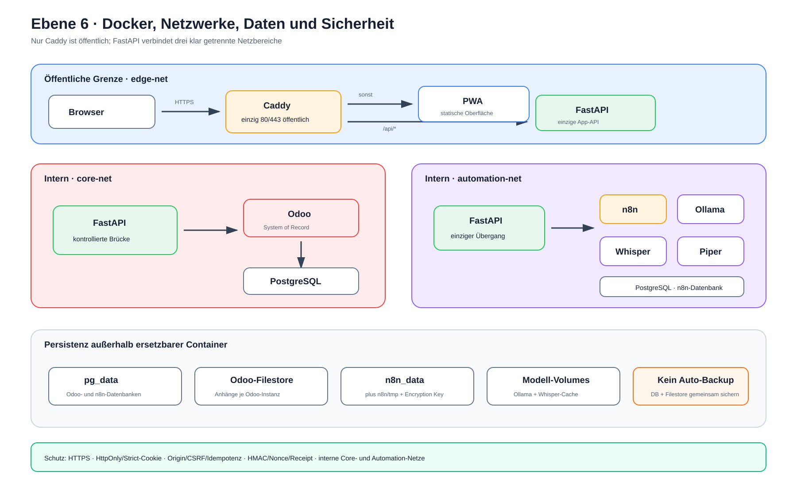

# Ebene 6: Docker, Netzwerke, Daten und Sicherheit

Die bisherigen Ebenen erklärten Fachabläufe. Ebene 6 zeigt die technische
Grenze darunter: Welche Container laufen, wer mit wem sprechen darf, wo Daten
bleiben und wie Fehler eingegrenzt werden.

## Die Erklärung in 30 Sekunden

Docker Compose startet PWA, Caddy, FastAPI, Odoo, PostgreSQL, n8n, Whisper,
Piper und Ollama. Nur Caddy veröffentlicht Ports nach außen. Es verteilt
`/api/*` an FastAPI und alle normalen Seitenpfade an die PWA.

Drei Netze trennen Eingang, Odoo-Kern und Automatisierung. FastAPI ist die
einzige Brücke durch alle drei Bereiche. Geschäftsdaten liegen in Odoo und
PostgreSQL; Modelle, Anhänge und Dienstzustände liegen zusätzlich in Volumes.

> **Merksatz:** Caddy ist die Tür, FastAPI der kontrollierte Flur und die
> internen Dienste sind keine öffentlichen Räume.

## Die Infrastruktur als Bild



Die [Excalidraw-Quelldatei](./ebene-6-docker-daten-sicherheit.excalidraw) ist
editierbar. Die [SVG-Datei](./ebene-6-docker-daten-sicherheit.svg) ist die
Exportfassung.

## Welche Dienste standardmäßig laufen

| Dienst | Aufgabe | Netzbereich |
| --- | --- | --- |
| Caddy | HTTPS-Eingang und Reverse Proxy | Edge |
| PWA | statische mobile Oberfläche | Edge |
| FastAPI | einzige App-API und Brücke | Edge, Core, Automation |
| Odoo | Aufträge, Bestand, Benutzer, Quality | Core |
| PostgreSQL | getrennte Odoo- und n8n-Datenbanken | Core, Automation |
| n8n | asynchrone Quality-Orchestrierung | Automation |
| Whisper | Sprache zu Text | Automation |
| Piper | Text zu Sprache | Automation |
| Ollama | lokale Text- und Bildmodelle | Automation |

Optional startet das Profil `second-odoo` eine zweite Odoo-Instanz. Das Profil
`provision` enthält einen einmaligen Container für n8n-Credentials.

## Netz 1: `edge-net`

Im Edge-Netz liegen Caddy, PWA und FastAPI. Nur Caddy veröffentlicht die Ports
80 und 443. HTTP wird auf HTTPS umgeleitet.

```text
Browser → HTTPS/Caddy
        ├─ /api/* → FastAPI
        └─ sonst  → PWA
```

Interne API-Flächen wie `/api/internal/*`, `/api/integration/*`,
`/api/obsidian/*` und `/api/demo/*` blockiert Caddy mit 404. Odoo und n8n
werden nicht über Caddy veröffentlicht.

## Netz 2: `core-net`

Das interne Core-Netz verbindet FastAPI, Odoo und PostgreSQL. Es besitzt keinen
direkten Außenweg. Die PWA kann daher weder Odoo noch die Datenbank umgehen.

Die optionale zweite Odoo-Instanz lebt ebenfalls hier. Jede Instanz bleibt ihr
eigenes System of Record; Profile werden nicht still vermischt.

## Netz 3: `automation-net`

Im ebenfalls internen Automation-Netz liegen FastAPI, PostgreSQL, n8n,
Whisper, Piper und Ollama. So können lokale Sprach- und KI-Dienste intern
erreicht werden, ohne eigene Browserports zu öffnen.

Nur ein optionales Egress-Overlay gibt Whisper und Ollama zeitweise einen
Außenweg für Modell-Downloads. Das Entwicklungs-Overlay veröffentlicht einige
Dienste ausschließlich auf `127.0.0.1`.

## Warum FastAPI in allen drei Netzen steckt

FastAPI ist der kontrollierte Übergang:

- Browseranfragen kommen aus dem Edge-Netz,
- Odoo-Aufträge werden im Core-Netz gelesen und geschrieben,
- n8n, Whisper, Piper und Ollama werden im Automation-Netz angesprochen.

Es besitzt keine eigene Geschäftsdatenbank. Fachliche Wahrheit bleibt in
Odoo, und n8n erhält nur die für seinen Workflow nötigen Daten.

## Wo Daten dauerhaft liegen

Container können ersetzt werden; benannte Volumes behalten Daten. Deklariert
sind neun Volumes:

- `pg_data`: alle PostgreSQL-Datenbanken für Odoo und n8n,
- `odoo_data`: Filestore der ersten Odoo-Instanz,
- `odoo_lager2_data`: Filestore der optionalen zweiten Instanz,
- `odoo19_trial_data`: derzeit keinem Dienst zugeordnetes Rollback-Volume,
- `caddy_data` und `caddy_config`: Caddy-Zustand,
- `n8n_data`: n8n-Zustand neben dessen PostgreSQL-Daten,
- `ollama_data`: lokale Modelle,
- `whisper_cache`: Whisper-Modellcache.

n8n nutzt zusätzlich `n8n/tmp` auf dem Host. Zur Wiederherstellung seiner
verschlüsselten Credentials ist außerdem derselbe `N8N_ENCRYPTION_KEY` nötig.

## Die wichtige Backup-Grenze

Die Hauptkonfiguration enthält keinen automatischen Backupdienst und keinen
Backupzeitplan.

Ein konsistentes Odoo-Backup benötigt immer Datenbank **und** passendes
Filestore-Volume. Ein Workflow-Export von n8n ist kein Full-Stack-Backup; auch
eine Offline-Kopie des PostgreSQL-Volumes ersetzt keine regelmäßige,
getestete Sicherungsstrategie.

## Browser- und Service-Sicherheit

Die Picker-Anmeldung wird gegen Odoo geprüft. Der Browser erhält ein Cookie
mit `Secure`, `HttpOnly` und `SameSite=Strict`. Schreibende Browseranfragen
benötigen zusätzlich Origin-, CSRF- und Idempotenzprüfung.

Service-zu-Service-Aufrufe im aktuellen v2-Pfad sind per HMAC-SHA256 signiert.
Zeitstempel, Nonce und Body-Hash erschweren Manipulation und Replay. Nonces und
Receipts werden dauerhaft in Odoo gespeichert.

Die drei HMAC-Secrets für die n8n-Credential-Provisionierung liegen als Docker-
Secret-Dateien mit Modus `0400` vor. Andere Backend-Secrets kommen in der
Hauptkonfiguration weiterhin über Umgebungsvariablen.

## Was bei Ausfällen passiert

- PostgreSQL oder Odoo nicht gesund: abhängige Kernprozesse starten nicht sauber.
- Whisper-Cache leer und kein Egress: Whisper kann sein Modell nicht laden.
- Piper oder Whisper ausgefallen: Touch und Scanner bleiben verfügbar.
- Ollama ausgefallen: Voice fällt auf Regeln zurück; Quality verlangt Prüfung.
- n8n nicht erreichbar: die Quality-Outbox versucht später erneut zuzustellen.
- Ack verloren: ein Event kann erneut kommen; Empfänger deduplizieren per Event-ID.

Compose-Healthchecks existieren aktuell nur für PostgreSQL, Odoo, die optionale
zweite Odoo-Instanz und n8n. Die übrigen Dienste besitzen keinen Compose-
Healthcheck.

## Bekannte Konfigurationsgrenzen

Der deklarierte Ist-Stand enthält noch Punkte für die Betriebsreife:

- `.env.example` enthält nicht alle inzwischen zwingenden Runtime- und HMAC-Werte.
- Der `n8n-credentials`-Container ruft das Provisionierungsskript ohne den von
  ihm verlangten Modus auf.
- Odoo und n8n verwenden in Compose denselben PostgreSQL-Benutzer; vorhandene
  Skripte für getrennte Rollen sind nicht vollständig eingebunden.
- Der Bootstrap eines vollständig leeren PostgreSQL-Volumes setzt eine Rolle
  voraus, deren Erzeugung nicht gemountet ist.
- `TRUSTED_CADDY_PEERS` wird nicht passend zur festen Caddy-IP gesetzt; dadurch
  kann die Login-Drosselung Proxyanfragen derselben Caddy-IP zuordnen.

Diese Punkte ändern nicht die gezeichneten Netzgrenzen, müssen aber vor einem
produktiven Betrieb behoben und mit einem frischen Deployment getestet werden.

## Wo die Verdrahtung im Projekt steckt

- `docker-compose.yml`: Dienste, Netze, Volumes und Profile
- `docker-compose.dev.yml`: lokale Portfreigaben
- `docker-compose.egress.yml`: zeitweiser Modell-Download
- `infrastructure/caddy/Caddyfile`: HTTPS, Routing und öffentliche Sperren
- `backend/app/main.py`: Start und Router
- `backend/app/middleware.py`: Request-Grenzen
- `backend/app/services/hmac_signing.py`: v2-Signatur
- `infrastructure/scripts/`: Migration, n8n-Export und Provisionierung

## Kurz zusammengefasst

1. Nur Caddy ist öffentlich.
2. Drei Netze trennen Browser, Odoo-Kern und Automatisierung.
3. FastAPI ist die einzige Brücke und besitzt keine eigene Fachwahrheit.
4. Daten verteilen sich auf PostgreSQL und mehrere Volumes.
5. Sicherheit nutzt HTTPS, Sitzung, CSRF, Idempotenz und HMAC.
6. Backup und einige Bootstrap-Werte sind noch betriebliche Aufgaben.
