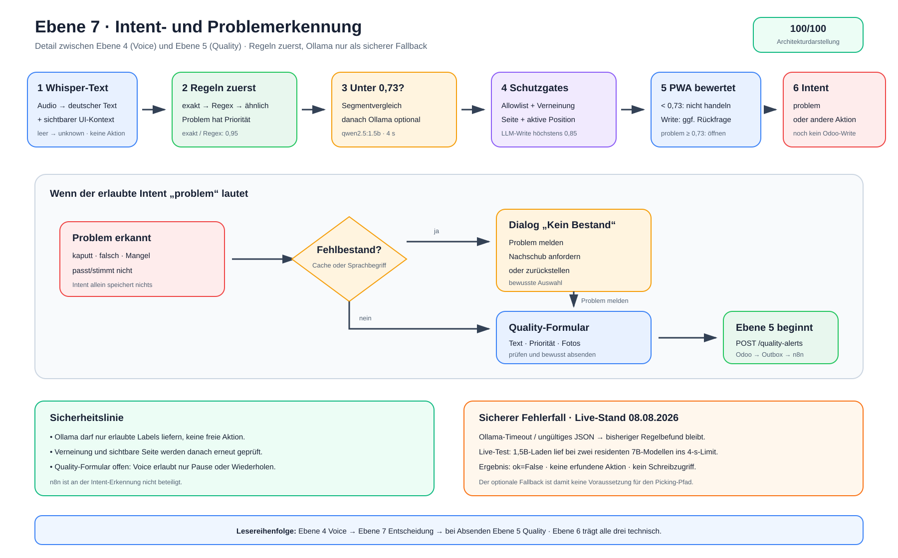

# Ebene 7: Intent- und Problemerkennung mit Ollama-Fallback

Diese Ebene vergrößert genau den Entscheidungsschritt aus Ebene 4: Wie wird aus
einem Whisper-Text ein erlaubter Befehl, und warum öffnet eine erkannte Störung
entweder den Bestandsdialog oder die Quality-Meldung aus Ebene 5?

## Die Erklärung in 30 Sekunden

Whisper liefert nur Text. FastAPI normalisiert ihn und prüft zuerst bekannte
Formulierungen, reguläre Regeln und vorsichtige Ähnlichkeitstreffer. Dabei
haben Problemaussagen Vorrang und die sichtbare PWA-Seite begrenzt, welche
Befehle überhaupt sinnvoll sind.

Nur wenn dieser deterministische Weg unbekannt oder zu unsicher bleibt, folgen
ein begrenzter Segmentvergleich und optional der lokale Ollama-Classifier
`qwen2.5:1.5b`. Auch dessen Ergebnis muss durch dieselben Label-,
Verneinungs- und Oberflächenregeln. Bei Fehler oder Vier-Sekunden-Timeout bleibt
der sichere Regelbefund bestehen.

Erreicht `problem` die PWA, wird noch nichts gespeichert. Bei Fehlbestand öffnet
sie zuerst den Bestandsdialog, sonst direkt das Quality-Formular. Erst ein
bewusstes „Absenden“ beginnt den asynchronen Ablauf aus Ebene 5.

> **Merksatz:** Regeln entscheiden zuerst, Ollama darf nur vorsichtig helfen,
> und der Mitarbeiter meldet das Problem ausdrücklich ab.

## Der Ablauf als Bild



Die [Excalidraw-Quelldatei](./ebene-7-intent-problemerkennung-ollama.excalidraw)
ist editierbar. Die [SVG-Datei](./ebene-7-intent-problemerkennung-ollama.svg)
ist die Exportfassung.

## Begriffsklärung: Intent statt „Annotate“

Im aktuellen Projekt existiert kein eigener `annotate`-Workflow. Der
tatsächliche Begriff im Code ist **Intent-Erkennung**: Eine Äußerung wird einem
kleinen erlaubten Aktionswortschatz wie `confirm`, `next`, `problem`, `pause`
oder `repeat` zugeordnet. „Ulama“ bezeichnet im laufenden System **Ollama**.

Diese Ebene dokumentiert deshalb den real vorhandenen Intent- und
Problemerkennungspfad, nicht einen nur angenommenen Annotation-Service.

## Schritt 1: Whisper-Text und sichtbaren Kontext übernehmen

Ebene 4 endet für diese Detailansicht an folgendem Endpunkt:

```text
POST /api/voice/recognize
```

Die PWA sendet Audio sowie `context`, `surface`, `remaining_line_count` und
`active_line_present`. FastAPI wandelt das Audio in WAV um und lässt Whisper
deutschen Text erzeugen. Ein leerer Text ergibt `unknown` mit Konfidenz `0,00`:
keine Aktion und insbesondere keine Buchung.

Die `surface` bildet die sichtbare PWA-Seite ab:

- `list`: Listenbefehle wie nächster Auftrag, Filter oder Status,
- `detail`: Picking-, Navigations- und Problembefehle,
- `quality_alert`: nur pausieren oder wiederholen,
- `complete`: nächster Auftrag, pausieren oder Hilfe.

Damit kann beispielsweise „bestätigen“ auf der Liste keine Position buchen,
und ein weiteres „Problem“ öffnet im bereits sichtbaren Quality-Formular nicht
noch einmal denselben Ablauf.

## Schritt 2: Deterministisch erkennen

Die Intent-Engine normalisiert Groß-/Kleinschreibung, Umlaute, Satzzeichen und
Leerzeichen. Danach prüft sie in dieser Reihenfolge:

1. exakte bekannte Formulierung,
2. reguläres Muster,
3. Levenshtein-Ähnlichkeit für ausgewählte Aktionen.

Exakte und reguläre Treffer erhalten aktuell `0,95`. Problemformulierungen
stehen in der Prioritätsreihenfolge vor Buchungs- und Navigationsbefehlen.
Beispiele aus dem aktuellen Regelwerk:

| Gesprochener Inhalt | Ergebnis | Warum |
| --- | --- | --- |
| „Problem“ | `problem` | exakter Alias |
| „Artikel ist kaputt“ | `problem` | reguläres Problemmuster |
| „passt nicht“ | `problem` | wörtliche Problemphrase |
| „falscher Artikel“ | `problem` | fachlicher Problemalias |
| „nicht bestätigen“ | `problem` | verneinte Buchung wird nicht ausgeführt |
| „kein Foto“ | `abort` | Verneinung hebt die Nicht-Schreibaktion auf |

Kurze Allerweltswörter zählen im Segment-Fallback nur als ganze Äußerung. So
darf etwa „gut“ in „Guten Morgen“ nicht versehentlich `confirm` ergeben.

## Schritt 3: Unsicherheit begrenzt auffangen

Ist das Ergebnis `unknown` oder liegt seine Konfidenz unter `0,73`, versucht
FastAPI zuerst einen tokenbasierten Segmentvergleich. Dieser trägt bewusst eine
Strafe und kann höchstens `0,85` erreichen.

Bleibt das Ergebnis weiterhin unbekannt oder unter `0,73`, fragt FastAPI lokal:

```text
FastAPI → POST http://ollama:11434/api/chat
Modell: qwen2.5:1.5b
Timeout: 4 Sekunden
Ausgabe: {"intent": "…", "confidence": 0..1}
```

Ollama darf ausschließlich freigegebene Labels zurückgeben. Unbekanntes Label,
ungültiges JSON, HTTP-Fehler oder Timeout ergeben `ok=False`. Dann bleibt das
bisherige deterministische Ergebnis unverändert; es gibt keinen zweiten
Seiteneffekt und keinen n8n-Aufruf.

## Schritt 4: Auch den Modellvorschlag erneut absichern

Ein Ollama-Label ist noch keine Aktion. FastAPI führt es erneut durch drei
Schranken:

1. **Allowlist:** nur bekannte externe Intents werden akzeptiert.
2. **Verneinung:** „nicht bestätigen“ darf nie zur Bestätigung werden.
3. **Surface-Gate:** der Befehl muss zur sichtbaren Seite und aktiven Position
   passen.

Für die schreibenden Labels `confirm` und `confirm_all` deckelt FastAPI die
Ollama-Konfidenz auf `0,85`. Die PWA bucht ein einzelnes `confirm` erst ab
`0,90` direkt; ein Modellvorschlag muss daher immer noch vorgelesen und vom
Mitarbeiter bestätigt werden. `confirm_all` verlangt grundsätzlich eine
Rückfrage.

Für alle Intents gilt im Frontend:

- unter `0,55`: unbekannt,
- `0,55` bis unter `0,73`: unsicher, wiederholen oder tippen,
- ab `0,73`: ausführbar, sofern keine zusätzliche Schreib-Rückfrage gilt.

## Schritt 5: Das erkannte Problem in der PWA verzweigen

Der Intent `problem` selbst schreibt weder nach Odoo noch nach n8n. Der
Dispatcher der PWA prüft die aktive Position:

- **Fehlbestand:** Ist der Bestandsstatus bereits `out_of_stock` oder enthält
  der gesprochene Text Begriffe wie „fehlt“, „Fehlmenge“, „Mangel“,
  „Nachschub“, „leer“ oder „Restbestand“, öffnet die PWA den Dialog „Kein
  Bestand“. Dort kann der Mitarbeiter das Problem melden, Nachschub anfordern
  oder die Position zurückstellen.
- **Anderes Problem:** Bei Schaden, falschem Artikel, falscher Menge oder einer
  allgemeinen Störung öffnet die PWA direkt „Problem melden“.

Der Weg „Problem melden“ aus dem Bestandsdialog füllt die Beschreibung mit
Produkt und Lagerplatz vor. In beiden Fällen kontrolliert der Mitarbeiter die
Beschreibung, Priorität und optionalen Fotos.

Erst der Klick auf **Absenden** ruft `POST /api/quality-alerts` auf. An genau
dieser Grenze beginnt Ebene 5 mit Odoo-Transaktion, Outbox, n8n und lokaler
Text-/Bildbewertung. Die Intent-Erkennung nimmt an diesem Quality-Workflow
nicht weiter teil.

## Was nicht zu diesem Pfad gehört

- `/api/voice/assist` wird von der aktuellen PWA nur für den Intent
  `stock_query` aufgerufen. Es ist kein allgemeiner Fallback für unbekannte
  Sprache und nicht Teil der normalen Problemmeldung.
- Ollama erzeugt hier keine freie Antwort, keine Problembeschreibung und keine
  Handlungsempfehlung. Es klassifiziert höchstens in ein erlaubtes Label.
- n8n erkennt keine Voice-Intents. Es kommt erst nach dem ausdrücklichen
  Absenden einer Quality-Meldung in Ebene 5 hinzu.
- Ein ermittelter Fehlbestand löst durch den Intent allein keinen Nachschub aus.
  Die gesonderte Schaltfläche verwendet einen eigenen, idempotenten
  Nachschub-Endpunkt.

## Wo diese Ebene hingehört

Die Nummern sind Dokumentansichten und keine streng zunehmenden technischen
Schichten. Um bestehende Verweise nicht umzunummerieren, bleibt diese neue
Ansicht **Ebene 7**; in der fachlichen Präsentation steht sie zwischen Ebene 4
und Ebene 5:

```text
Ebene 1 Systemlandkarte
  ├─ Ebene 2 normaler Auftrag
  ├─ Ebene 3 Cluster-Picking
  └─ Ebene 4 Voice
       └─ Ebene 7 Intent- und Problemerkennung
            └─ bei abgesendeter Meldung: Ebene 5 Quality / n8n / KI

Ebene 6 Docker / Daten / Sicherheit liegt technisch unter allen Abläufen.
```

| Ebene | Passt weiterhin? | Abgrenzung zur neuen Ebene |
| --- | --- | --- |
| 1 Systemlandkarte | ja | zeigt Systeme, nicht die Entscheidung im Voice-Pfad |
| 2 normaler Auftrag | ja | erklärt den Touch-/Scanner-Schreibweg |
| 3 Cluster-Picking | ja | erklärt den alternativen Mehr-Auftragsablauf |
| 4 Voice | ja | erklärt Aufnahme, Whisper, Aktionen und TTS im Ganzen |
| 5 Quality / n8n / KI | ja | beginnt erst mit der abgesendeten Meldung |
| 6 Infrastruktur | ja | zeigt Container, Netze, Daten und Schutzgrenzen |
| 7 Intent / Problem | ja | vergrößert ausschließlich Erkennung und UI-Verzweigung |

Die neue Ebene ersetzt daher keine der vorhandenen sechs. Sie schließt die
inhaltliche Lücke zwischen „FastAPI versteht“ in Ebene 4 und „PWA meldet“ in
Ebene 5.


## Wo der Ablauf im Projekt steckt

- `pwa/js/voice.js`: Aufnahme, Recovery-Dialog und Übergabe an die PWA
- `pwa/js/voice-runtime.mjs`: UI-Kontext und Frontend-Schwellen
- `pwa/js/app.js`: Intent-Dispatcher, Bestandsdialog und Quality-Formular
- `backend/app/routers/voice.py`: Whisper-, Segment- und Ollama-Reihenfolge
- `backend/app/services/intent_engine.py`: Regeln, Prioritäten und Schutzgates
- `backend/app/services/voice_intent_classifier.py`: lokaler Ollama-Classifier
- `backend/app/config.py`: Modell, Timeout und Warmup-Konfiguration
