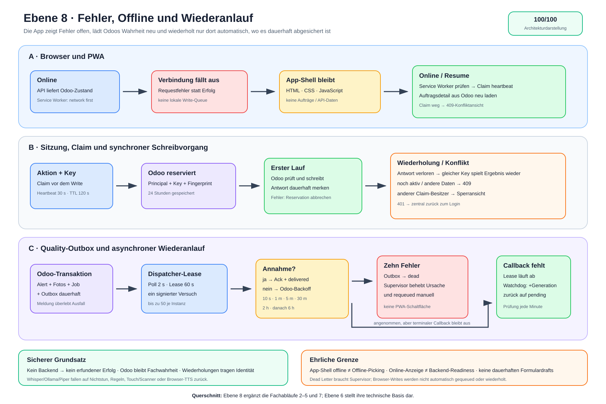

# Ebene 8: Fehler, Offline und Wiederanlauf

Diese Ebene zeigt nicht noch einmal die Container aus Ebene 6. Sie beantwortet
die wichtigere Betriebsfrage: Was sieht der Mitarbeiter bei einem Fehler, was
bleibt sicher gespeichert und wie findet das System wieder zur Serverwahrheit
zurück?

## Die Erklärung in 30 Sekunden

Die installierte PWA kann ihre Oberfläche nach einem erfolgreichen ersten
Laden aus dem Browsercache öffnen. Aufträge und API-Antworten werden jedoch
nicht offline gecacht, und Schreibaktionen werden nicht lokal gequeued. Ohne
Backendverbindung zeigt die PWA deshalb einen Fehler, statt eine Buchung zu
erfinden.

Nach Rückkehr des Netzes aktualisiert sie Service Worker und aktuelle Ansicht.
Bei einem offenen Auftrag verlängert sie den Claim und lädt den Stand erneut
aus Odoo. Ist der Claim inzwischen abgelaufen oder anderweitig vergeben, zeigt
sie den Konflikt.

Synchrone Schreibvorgänge werden durch Claims und Idempotenz geschützt.
Asynchrone Quality-Ereignisse bleiben in Odoos Outbox, werden mit Lease und
Backoff erneut zugestellt und bei einer hängenden Verarbeitung durch den
Watchdog wieder freigegeben.

> **Merksatz:** Offline bleibt die Oberfläche sichtbar, aber Odoo bleibt die
> Wahrheit. Wiederanlauf bedeutet neu laden, sicher wiederholen oder den
> Konflikt offen zeigen – niemals Erfolg vortäuschen.

## Der Ablauf als Bild



Die [Excalidraw-Quelldatei](./ebene-8-fehler-offline-wiederanlauf.excalidraw)
ist editierbar. Die [SVG-Datei](./ebene-8-fehler-offline-wiederanlauf.svg) ist
die Exportfassung.

## Recovery-Linie A: Browser und PWA

### 1. Was tatsächlich offline verfügbar ist

Der Service Worker legt die PWA-Hülle in `picking-v22` ab:

- Startseite und Manifest,
- CSS, Schriften und Symbole,
- JavaScript für API, UI, Scanner, Kamera und Voice.

Für Navigation und diese statischen Dateien gilt „Network first“: Der Browser
versucht zuerst das Netz und verwendet bei einem Verbindungsfehler den Cache.
Dadurch kann die bereits installierte Oberfläche erneut erscheinen.

`/api/*` ist ausdrücklich vom Service Worker ausgeschlossen. Deshalb werden
weder Auftragslisten noch Bestände, Claims, Buchungsantworten oder Quality-
Meldungen als vermeintlich aktuelle Offline-Daten ausgegeben.

### 2. Was bei Netzverlust passiert

Die PWA reagiert auf `online` und `offline` des Browsers und zeigt den Zustand
in der Statusleiste. Ein laufender API-Aufruf scheitert sichtbar; es gibt keine
automatische Wiederholung und keine lokale Mutationswarteschlange.

Das bedeutet bewusst:

- keine Offline-Buchung,
- kein optimistischer „Erfolg“-Bildschirm,
- keine im Hintergrund wartende Quality-Meldung,
- kein lokaler Schattenbestand.

`navigator.onLine` meldet allerdings nur, ob der Browser ein Netzwerk sieht.
Es beweist nicht, dass Caddy, FastAPI oder Odoo erreichbar sind. Der aktuelle
Status kann deshalb „Online“ anzeigen, obwohl eine Backendanfrage fehlschlägt.

### 3. Wiederanlauf nach Online oder App-Rückkehr

Bei `online`, `pageshow` aus dem Back/Forward-Cache oder erneut sichtbarer App:

1. prüft die PWA auf einen neuen Service Worker,
2. aktualisiert sie nur bei tatsächlicher Online-Meldung die Fachansicht,
3. verlängert sie bei geöffnetem Auftrag zuerst den Claim,
4. lädt sie danach die Auftragsdetails erneut aus Odoo,
5. rendert sie ausschließlich den zurückgegebenen Serverzustand.

Lebt der Claim nicht mehr, antwortet das Backend mit `409`. Die PWA zeigt dann
Besitzer und Ablaufzeit sowie die Entscheidungen „Erneut prüfen“ oder „Zurück
zur Liste“.

Ein Service-Worker-Update übernimmt sofort die Kontrolle. Ist gerade das
Quality-Formular offen, unterdrückt die PWA den automatischen Seiten-Reload und
zeigt nur einen Hinweis. Das schützt die laufende Eingabe vor dem unmittelbaren
Reload, speichert sie aber nicht dauerhaft.

## Recovery-Linie B: Sitzung, Claim und synchrone Writes

### 1. Abgelaufene Sitzung

Alle API-Aufrufe der PWA laufen durch einen gemeinsamen Request-Wrapper. Eine
Antwort `401` löscht den lokalen CSRF- und Pickerzustand, stoppt den Claim-
Heartbeat und führt zentral zurück zum Login. Beim Profilwechsel werden
laufende Requests abgebrochen, Voice gestoppt, der Claim bestmöglich
freigegeben und die Serversitzung beendet.

### 2. Claim als temporäre Arbeitssperre

Beim Öffnen eines Auftrags reserviert Odoo ihn für Mitarbeiter und Gerät:

| Mechanismus | Aktueller Wert |
| --- | ---: |
| Claim-Laufzeit | 120 Sekunden |
| PWA-Heartbeat | alle 30 Sekunden |
| Freigabe beim Verlassen | normaler Request; bei `pagehide` mit `keepalive` |

Scheitert ein Heartbeat nur wegen einer Verbindung, protokolliert die PWA den
Fehler und versucht beim nächsten Intervall erneut. Meldet Odoo dagegen einen
echten Besitzerkonflikt, stoppt sie sofort den Heartbeat und sperrt die
Bearbeitungsansicht.

Geht die Freigabe beim Schließen verloren, bleibt der Auftrag nicht dauerhaft
gesperrt: Der Claim läuft nach spätestens 120 Sekunden ohne erfolgreiche
Verlängerung ab. Eine neue Bearbeitung muss anschließend wieder einen Claim
erwerben.

### 3. Idempotenz gegen doppelte Buchungen

Fachliche Browsermutationen benötigen einen `Idempotency-Key`. Odoo bindet die
Reservierung an Endpunkt, serverseitig ermittelte Principal-Scope und Key und
bewahrt sie standardmäßig 24 Stunden auf.

```text
PWA sendet Aktion + Key
        ↓
Odoo reserviert Key + Request-Fingerprint
        ├─ erster Lauf → Aktion ausführen und Antwort speichern
        ├─ abgeschlossen → gespeicherte Antwort wiederholen
        ├─ noch aktiv → 409 „Request is already processing“
        └─ gleicher Key, andere Daten → 409 Konflikt
```

Positionsbuchung und Quality-Meldung bauen den Key aus stabilen fachlichen
Daten. Geht nur die HTTP-Antwort verloren, kann ein bewusster erneuter Versuch
des Mitarbeiters deshalb die gespeicherte Antwort erhalten, ohne denselben
Odoo-Schreibvorgang ein zweites Mal auszuführen.

Explizit behandelte technische Fehlerpfade heben die aktive Reservierung
wieder auf, damit ein späterer Versuch möglich bleibt. Benannte Konflikte
werden dagegen als reproduzierbare Fehlerantwort gespeichert.

## Recovery-Linie C: Quality, Outbox und Watchdog

### 1. Erst dauerhaft speichern

Beim Absenden einer Quality-Meldung speichert Odoo Alert, Fotos, Job und
Outbox-Zeile in einer Transaktion. Ein Ausfall von n8n oder Ollama kann diese
bereits bestätigte Meldung deshalb nicht wieder aus Odoo entfernen.

### 2. Zustellung mit Lease und Backoff

Der laufende Dispatcher prüft standardmäßig alle zwei Sekunden jede
konfigurierte Odoo-Instanz. Er leiht bis zu 50 fällige Outbox-Zeilen für 60
Sekunden und sendet jede Zeile genau einmal pro Versuch. Die Transportklasse
besitzt absichtlich keine eigene Retry-Schleife; Odoo allein bestimmt den
Zeitplan.

Bei einem Fehler setzt Odoo folgende Abstände:

```text
10 s → 1 min → 5 min → 30 min → 2 h → danach 6 h
```

Nach dem zehnten fehlgeschlagenen Versuch wird die Zeile `dead`. Ein
Supervisor kann sie nach Behebung manuell wieder auf `pending` setzen. Dafür
existiert aktuell kein eigener Selbstbedienungsdialog in der PWA.

### 3. Verlorenes Ack und doppelte Zustellung

Hat n8n das Event angenommen, aber das Odoo-Ack geht verloren, markiert der
Dispatcher den Vorgang nicht fälschlich als fehlgeschlagen. Die Lease läuft
ab und dasselbe Event wird erneut gesendet.

Die Wiederholung besitzt einen neuen Zeitstempel, eine neue Nonce und eine neue
Signatur, aber dieselbe Event-ID und denselben Payload-Fingerprint. Der
Empfänger muss deshalb vor Seiteneffekten anhand dieser fachlichen Identität
deduplizieren. Die Strecke ist **at least once**, nicht exactly once.

### 4. n8n hat begonnen, aber kein Callback kommt

Bleibt eine Verarbeitung nach der Annahme hängen, läuft ihre Processing-Lease
ab. Der Backend-Watchdog prüft jede Minute dieselbe gesperrte Odoo-Recovery-
Funktion wie der Odoo-Cron. Sie:

1. erhöht die Zustellgeneration,
2. setzt Job und Receipt auf wiederholbar,
3. gibt die unveränderte Outbox-Zeile wieder als `pending` frei,
4. lässt andere Kandidaten weiterlaufen, wenn ein einzelner Fall nicht
   reparierbar ist.

So überlebt der Workflow Backend-, n8n- und Worker-Neustarts. Job, Receipt,
Lease und Outbox liegen dauerhaft in Odoo; der Python-Prozess hält nicht die
Fachwahrheit.

## Abhängigkeiten und ihre Rückfälle

| Ausfall | Sichtbares Verhalten | Sicherer Rückfall |
| --- | --- | --- |
| Browsernetz | Status „Offline“ oder Requestfehler | App-Shell aus Cache; keine Fachmutation |
| FastAPI/Odoo | Laden oder Schreiben scheitert | kein lokaler Erfolg; später neu laden |
| Sitzung abgelaufen | `401` | Login und neuer serverseitiger Kontext |
| Claim anderweitig vergeben | `409` | Konfliktansicht statt paralleler Buchung |
| Whisper | kein belastbarer Text | „Nicht verstanden“; Touch oder Scanner |
| Ollama-Voice | Timeout/ungültige Antwort | deterministische Intent-Regeln |
| Piper | TTS nicht verfügbar | Browser-`speechSynthesis` |
| Ollama-Quality | Bewertung unvollständig | `review_required` statt Ersatzurteil |
| n8n/Transport | Event nicht angenommen | Odoo-Backoff und erneute Zustellung |
| Callback bleibt aus | Processing-Lease läuft ab | Watchdog erhöht Generation und requeued |
| zehn Zustellfehler | Outbox `dead` | manuelle Supervisor-Requeue nach Behebung |


## Ehrliche Grenzen

- **Kein echtes Offline-Picking:** Die PWA cached die Hülle, nicht Aufträge oder
  Schreibvorgänge.
- **Kein automatisches Write-Retry im Browser:** Ein Mitarbeiter muss einen
  fehlgeschlagenen Vorgang bewusst erneut auslösen; Idempotenz macht das sicher.
- **Finalisierungsfenster der Idempotenz:** Reservierung, fachlicher Odoo-Write
  und gespeicherte Replay-Antwort sind getrennte RPCs. Bricht FastAPI nach dem
  erfolgreichen Fachwrite, aber vor der Finalisierung ab, bleibt der Key
  zunächst `pending`. Ein Retry erhält bis zum Ablauf `409`; für dieses Fenster
  existiert aktuell keine automatische Abgleichsfunktion. Nach Ablauf der 24
  Stunden kann der Key neu reserviert werden, weshalb der Odoo-Fachzustand vor
  einem späten manuellen Retry geprüft werden muss.
- **Keine dauerhaften Formulardrafts:** Ein Reload, Tab-Absturz oder
  Betriebssystemabbruch kann eine noch nicht abgesendete Quality-Beschreibung
  und ausgewählte Fotos verlieren.
- **Online-Anzeige ist keine Readiness-Prüfung:** `/api/health/live` bestätigt
  nur den FastAPI-Prozess, nicht Odoo, n8n oder die Modellservices.
- **Heartbeat-Verbindungsfehler sind nur im Browserlog sichtbar:** Erst ein
  `409` erzeugt die Claim-Konfliktansicht.
- **Dead-Letter-Requeue ist ein Supervisor-/Odoo-Vorgang:** Es existiert keine
  PWA-Schaltfläche dafür.

Diese Grenzen sind keine Behauptung, dass die Recovery-Kette falsch ist. Sie
markieren genau, wo für einen späteren produktiven Offline- oder
Operationsausbau neue Funktionen nötig wären.

## Wo diese Ebene hingehört

Ebene 8 ist eine Querschnittsansicht über die bisherigen Fachabläufe:

```text
Ebene 2 normaler Auftrag ─┐
Ebene 3 Cluster-Picking  ├─ Ebene 8: Fehler und Wiederanlauf
Ebene 4/7 Voice + Intent ┤
Ebene 5 Quality          ┘

Ebene 6 erklärt die technische Basis darunter.
```

| Bestehende Ebene | Was Ebene 8 ergänzt |
| --- | --- |
| 2 Normalauftrag | verlorene Antwort, Idempotenz, Claim-Ablauf |
| 3 Cluster | Serverwahrheit und sicherer Abbruch statt Teil-Erfolg |
| 4 Voice | Whisper-/Piper-Ausfall und Bedienfallback |
| 5 Quality | Backoff, Dead Letter, Ack-Verlust und Watchdog |
| 6 Infrastruktur | Verhalten der Dienste bei Ausfall statt ihrer Position |
| 7 Intent | Ollama-Ausfall und deterministischer Rückfall |

## Wo der Ablauf im Projekt steckt

- `pwa/sw.js`: App-Shell-Cache und Ausschluss der APIs
- `pwa/js/pwa.js`: Online-, Resume- und Service-Worker-Lifecycle
- `pwa/js/app.js`: Refresh, Request-Abbruch, Claim und Konfliktansicht
- `pwa/js/api.js`: Requests, CSRF und Idempotenzschlüssel
- `backend/app/services/mobile_workflow.py`: Claim- und Idempotenzzugriff
- `backend/app/routers/pickings.py`: Replay, Konflikt und sichere Writes
- `odoo/addons/picking_assistant_core/`: Claim und Idempotenzspeicher
- `backend/app/services/outbox_dispatcher.py`: Lease, Ack/Nack und Watchdog
- `backend/app/services/signed_webhook_transport.py`: ein signierter Versuch
- `odoo/addons/picking_assistant_integration/`: Outbox, Receipts und Recovery
