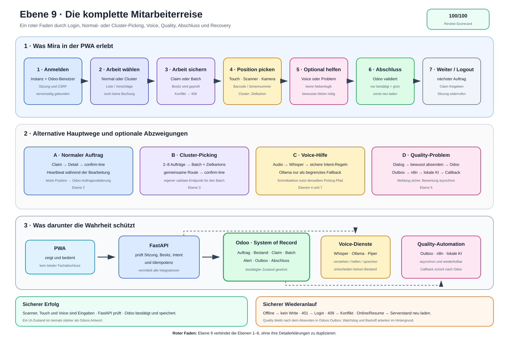

# Ebene 9: Die komplette Mitarbeiterreise

Die bisherigen Ebenen erklären einzelne Ausschnitte: System, Normalauftrag,
Cluster, Voice, Quality, Infrastruktur, Intent und Recovery. Ebene 9 verbindet
diese Ausschnitte zu der Frage, die bei einer Produktvorstellung zuerst
entsteht: **Was erlebt ein Mitarbeiter vom Öffnen der PWA bis zum sicheren
Arbeitsabschluss?**

Die Reise ist ein zusammengesetztes Beispiel. Ein Mitarbeiter wählt entweder
einen normalen Auftrag oder einen Cluster-Batch. Voice, Problemmeldung und
Recovery sind optionale Abzweigungen – nicht jeder Auftrag durchläuft sie.

## Die Erklärung in 30 Sekunden

Der Mitarbeiter meldet sich mit seinem Odoo-Benutzer in der PWA an und wählt
eine Odoo-Instanz. Danach lädt die PWA über FastAPI die Arbeit aus Odoo.

Er entscheidet sich für einen normalen Auftrag oder für Cluster-Picking. Beim
normalen Auftrag schützt ein zeitlich begrenzter Claim die Bearbeitung. Im
Cluster erstellt Odoo einen Batch mit einem Zielkarton je Auftrag. Die PWA
fasst geeignete ungetrackte Positionen nach Produkt und Quellort zusammen:
Mira scannt den Artikel am aktuellen Stopp einmal und danach jeden Zielkarton
getrennt. Jede Kartonzuordnung bleibt ein eigener FastAPI-Aufruf und ein Write
auf genau eine Odoo-Move-Line. Getrackte Positionen bleiben einzeln und laufen
über den manuellen Karton-/Chargen-/Seriendialog.

Tritt ein Problem auf, öffnet die PWA einen Dialog. Erst das bewusste Absenden
speichert Alert, Fotos, Job und Outbox in Odoo. n8n und die lokale KI bewerten
die Meldung danach asynchron; die bereits gespeicherte Meldung bleibt davon
unabhängig erhalten.

Odoo bestätigt auch den fachlichen Abschluss. Bei Netz-, Sitzungs- oder
Claimproblemen zeigt die PWA einen Fehler und lädt später den Serverzustand
neu, statt einen Erfolg zu erfinden.

> **Merksatz:** Der Mitarbeiter arbeitet in einer Oberfläche. Hinter jedem
> sicheren Erfolg stehen FastAPIs Prüfungen und Odoos bestätigter Zustand.

## Die Reise als Bild



Die [Excalidraw-Quelldatei](./ebene-9-mitarbeiterreise.excalidraw) ist
editierbar. Die [SVG-Datei](./ebene-9-mitarbeiterreise.svg) ist die
Exportfassung für Dokumente, Präsentationen und die Bachelorarbeit.

Das Bild besitzt drei Lesespuren:

1. oben die sichtbare Reise des Mitarbeiters,
2. in der Mitte die Wahl- und Hilfswege während der Arbeit,
3. unten die technische Wahrheit und die sicheren Rückfälle.

## Unsere Beispielperson

Wir nennen die Mitarbeiterin in dieser Reise **Mira**. Der Name und die
Auftragsfolge dienen nur der Erklärung. Sie behaupten keinen zusätzlichen
Live-Datensatz.

Mira hat vier mögliche Eingaben:

- Touch in der PWA,
- einen HID-Handscanner,
- die Gerätekamera,
- Sprache über Push-to-Talk oder Voice-Modus.

Diese Eingaben sind keine vier getrennten Lagerprozesse. Sobald eine
Fachaktion ausgelöst wird, gelten dieselben Backend- und Odoo-Prüfungen.
Welche Eingabe sichtbar ist, hängt aber vom Modus ab: Im Cluster-Rundgang
leitet der Dispatcher HID- und Kamerascans an die Artikel-/Kartonfolge; Voice
ist dort nicht eingeblendet und Touch bleibt der beschriftete manuelle
Ausnahmeweg.

## Station 1: PWA öffnen und anmelden

Mira öffnet die installierte oder im Browser geladene PWA. Bei mehreren
konfigurierten Lagern wählt sie zuerst die Odoo-Instanz und meldet sich mit
ihrem Odoo-Benutzer an.

```text
PWA → POST /api/auth/picker-session → FastAPI → gewählte Odoo-Instanz
```

Bei Erfolg erhält der Browser eine geschützte Sitzung und ein CSRF-Token. Das
Passwort bleibt nicht als Arbeitszustand in der PWA. Nach einem Reload prüft
`GET /api/auth/me` die echte Serversitzung erneut.

**Mira sieht:** ihren Namen, die aktive Instanz und die Arbeitsnavigation.

**Das System sichert:** Identität, Instanzbindung und Schutz schreibender
Browseranfragen.

## Station 2: Arbeit laden und einen Modus wählen

Nach der Anmeldung lädt Mira die offenen Aufträge. Suche, Zone und Filter
verändern zunächst nur die sichtbare Auswahl.

```text
Normal:  GET /api/pickings
Cluster: GET /api/cluster/suggestions
```

Jetzt teilt sich die Reise:

### Weg A: Normaler Auftrag

Mira öffnet genau einen Auftrag. Die PWA erwirbt zuerst den Claim und lädt
danach die Details.

```text
POST /api/pickings/{id}/claim
GET  /api/pickings/{id}
```

Ein Heartbeat verlängert den Claim, solange Mira die Detailansicht bearbeitet.
Ist ein anderer Mitarbeiter bereits Besitzer, zeigt die PWA einen `409`-
Konflikt statt einer zweiten parallelen Bearbeitung.

### Weg B: Cluster-Picking

Mira wählt zwei bis acht vorgeschlagene Aufträge. FastAPI prüft die Auswahl
erneut, bevor Odoo einen echten Batch und einen Zielkarton je Auftrag anlegt.

```text
POST /api/cluster/batches
GET  /api/cluster/batches/{batch_id}
```

Die Vorschlagsliste ist noch keine Buchung. Erst der bestätigte Batch erzeugt
die gemeinsame Laufreihenfolge und die Kartonzuordnung in Odoo.

> **Entscheidend:** Normal- und Cluster-Picking sind alternative Hauptwege.
> Ebene 9 zeigt beide nebeneinander, aber vermischt ihre Besitz- und
> Abschlusslogik nicht.

## Station 3: Die nächste Position verstehen

FastAPI liest die offenen Move-Lines aus Odoo und bereitet sie für die mobile
Ansicht auf. Mira sieht insbesondere:

- Artikel und Sollmenge,
- Lagerplatz,
- erwarteten Barcode,
- bei Cluster-Picking zusätzlich den Zielkarton,
- Fortschritt und nächste Position.

Im Cluster bildet erst die PWA daraus sichtbare Lagerstopps. Zusammengefasst
werden nur `tracking === "none"`, gleiche Produkt-ID und gleicher Quellort;
enthält die mögliche Gruppe mehr als eine Move-Line desselben Auftrags, bleiben
die Lines einzeln. Damit ist „4 Stück entnehmen“ eine visuelle Summe, während
die Aufteilung darunter weiter zwei ursprüngliche Auftragspositionen zeigt.

Die PWA hält diesen Zustand nur für die Darstellung. Sie ist keine zweite
Lagerdatenbank. Nach einem Konflikt oder Wiederanlauf lädt sie neu aus Odoo.

## Station 4: Scannen, prüfen und buchen

Mira scannt mit Handscanner oder Kamera oder bestätigt über die Oberfläche.
Beim normalen Auftrag sendet die PWA:

```text
POST /api/pickings/{id}/confirm-line
```

Im Cluster führt die PWA den ersten offenen ungetrackten Lagerstopp schrittweise:

1. Mira scannt den exakten Artikelcode einmal. Die PWA merkt die Prüfung lokal;
   es wird noch nichts gebucht.
2. Mira scannt einen offenen Zielkarton. Dessen Package-Name oder Package-ID
   wählt genau die zugehörige Auftragsposition.
3. Für jeden weiteren Zielkarton wiederholt sie nur Schritt 2. Nach dem letzten
   Karton verlangt der nächste Lagerstopp wieder einen Artikelscan.

Pro Zielkarton sendet die PWA:

```text
POST /api/cluster/batches/{batch_id}/confirm-line
```

Ein falscher Artikel oder Karton erzeugt in diesem Scanner-Hauptweg keinen
Confirm-Request. FastAPI prüft bei einem Request zusätzlich Sitzung,
Batch-Besitz, die gemeinsame Zugehörigkeit von Move-Line, Auftrag und Batch,
den nicht leeren Produktcode, den Zielkarton und gegebenenfalls Charge oder
Serie. Erst danach schreibt es Menge, `picked` und optional die
Tracking-Zuordnung gemeinsam auf genau diese eine `stock.move.line`.

Getrackte Positionen werden weder visuell gruppiert noch durch den
Artikel-/Karton-Scannerautomaten geführt. „Manuell bestätigen“ fragt ihren
Zielkarton und danach Charge oder Seriennummer ab und sendet ebenfalls nur
einen atomaren Move-Line-Request. Auch für ungetrackte Ware existiert dieser
beschriftete manuelle Ausnahmeweg; deshalb ist der physische Artikelscan noch
keine allgemeine Backendpflicht.

## Optionale Hilfe A: Voice

Mira kann während der Arbeit Push-to-Talk oder den Voice-Modus verwenden. Die
PWA sendet Audio zusammen mit dem sichtbaren Arbeitskontext.

```text
PWA → POST /api/voice/recognize → Whisper → Intent-Regeln
```

Whisper liefert Text. FastAPI erkennt zuerst deterministisch einen erlaubten
Intent. Segmentvergleich und Ollama dürfen Unsicherheit nur begrenzt
auffangen. Ein Modelllabel löst niemals ungeprüft einen Odoo-Write aus.

Typische Ergebnisse sind:

- Navigation zur nächsten oder vorherigen Position,
- Wiederholung von Artikel oder Lagerplatz,
- sichere Bestätigung über denselben Picking-Pfad,
- Öffnen des Bestands- oder Problemdialogs,
- eine getrennte Assist-Antwort ohne Buchung.

Schreibende Voice-Befehle benötigen ausreichende Sicherheit oder eine klare
Ja/Nein-Rückbestätigung. Für die Sprachausgabe nutzt die PWA kurze
Browseransagen und für längere Texte bevorzugt Piper. Fallen Whisper, Ollama
oder Piper aus, bleiben Touch und Scanner verfügbar.

> **Voice ist ein Bedienweg, keine zweite Fachlogik.** Die Buchung endet im
> gleichen geschützten FastAPI- und Odoo-Pfad wie bei Touch und Scanner.

## Optionale Hilfe B: Ein Problem melden

Erkennt die Intent-Logik `problem` oder öffnet Mira den Dialog per Touch,
entsteht noch kein Odoo-Datensatz. Die PWA zeigt zunächst nur das Formular.

Mira beschreibt das Problem, wählt eine Priorität und kann Fotos hinzufügen.
Erst **Absenden** ruft auf:

```text
POST /api/quality-alerts
```

Odoo speichert Alert, Anhänge, Integrationsjob und Outbox gemeinsam. Danach
zeigt die PWA nur, dass die Meldung sicher erstellt wurde und die Bewertung
läuft. Sie lädt anschließend den aktuellen Auftrag oder die Liste neu.

Die spätere Strecke lautet:

```text
Odoo-Outbox → FastAPI-Dispatcher → n8n
            → FastAPI → lokale Text-/Bildmodelle
            → signierter Callback → Odoo
```

n8n orchestriert, Ollama bewertet und Odoo speichert das Ergebnis. Die KI
schließt keinen Lagerauftrag und ersetzt keine fachliche Odoo-Entscheidung. Bei
unvollständiger Bewertung bleibt ein nachvollziehbarer Status wie
`review_required` statt eines erfundenen Urteils.

## Station 5: Weiterarbeiten und abschließen

Nach jeder bestätigten Position liefert der Server den Fortschritt. Mira
arbeitet weiter, bis keine offene Position mehr bleibt.

Bei einem teilweise verteilten Cluster-Stopp lädt die PWA den Batch nach jedem
Write neu, behält aber im selben Browser-Tab den bereits geprüften Artikel für
die noch offenen Kartons. Die dauerhafte Wahrheit bleibt der neu geladene
Odoo-Status; ein kompletter Browser-Reload verwirft den lokalen Scannachweis.

Beim normalen Auftrag bittet der Picking-Pfad Odoo um die Validierung des
Auftrags. Im Cluster löst die PWA ausdrücklich aus:

```text
POST /api/cluster/batches/{batch_id}/validate
```

Nur eine bestätigte Odoo-Antwort führt zum Abschlussbildschirm. Sind zwar
Positionen gebucht, aber Odoo lehnt den Gesamtabschluss ab, zeigt die PWA den
Fehler und lädt den offenen Serverstand erneut.

Danach kann Mira den nächsten Auftrag öffnen, zur Liste zurückkehren oder sich
abmelden. Beim Verlassen wird ein normaler Claim bestmöglich freigegeben; die
Serversitzung wird beim Logout widerrufen.

## Wenn die Reise unterbrochen wird

Die Mitarbeiterreise besitzt keine unsichtbare Offline-Nebenwelt:

| Unterbrechung | Was Mira sieht | Sicherer nächster Schritt |
| --- | --- | --- |
| Browser offline | App-Hülle oder Requestfehler | Verbindung abwarten; Ansicht neu laden |
| Sitzung abgelaufen | Rückkehr zum Login | neu anmelden und Serverkontext laden |
| Claim verloren | `409` mit Besitzer/Ablauf | erneut prüfen oder zur Liste |
| falscher Scan/Karton | klare Ablehnung | richtigen Artikel oder Karton scannen |
| Whisper versteht nichts | sicht- und hörbarer Hinweis | erneut sprechen oder Touch/Scanner |
| Odoo lehnt Abschluss ab | kein grüner Abschluss | offenen Serverstand korrigieren |
| n8n oder KI fällt aus | Meldung bleibt gespeichert | Outbox/Watchdog arbeitet im Hintergrund |

Nach `online`, App-Rückkehr oder Ansichtswiederaufnahme aktualisiert die PWA
den aktuellen serverseitigen Zustand. APIs und Schreibaktionen werden nicht im
Service Worker gecacht. Deshalb bedeutet „PWA offline sichtbar“ ausdrücklich
nicht „offline kommissionieren“.

## Was die Systeme während dieser einen Reise tun

| System | Aufgabe in der Reise | Darf nicht behaupten |
| --- | --- | --- |
| PWA | anzeigen, Eingaben aufnehmen, Rückmeldung geben | einen fachlichen Erfolg ohne Serverantwort |
| Caddy | Browserzugriff und API-Eingang weiterleiten | Lagerzustände entscheiden |
| FastAPI | Sitzung, Kontext, Regeln und Integrationen prüfen | dauerhafte Fachwahrheit ersetzen |
| Odoo | Auftrag, Bestand, Claim, Batch, Alert und Abschluss speichern | KI-Orchestrierung ausführen |
| Whisper | Audio in Text umwandeln | einen Auftrag buchen |
| Ollama | begrenztes Intent-Fallback und Quality-Bewertung | ungeprüft Fachaktionen auslösen |
| Piper | Text als Audio ausgeben | die Bedeutung eines Befehls entscheiden |
| n8n | Quality-Verarbeitung orchestrieren | App-Backend oder System of Record sein |

## Wo Ebene 9 in die vorhandenen Ebenen greift

| Station der Mitarbeiterreise | Vertiefung |
| --- | --- |
| Systemrollen im Hintergrund | Ebene 1 |
| Login, Claim, Scan und Normalabschluss | Ebene 2 |
| Batch, Zielkarton und Clusterabschluss | Ebene 3 |
| Aufnahme, Whisper, sichere Aktion und TTS | Ebene 4 |
| Alert, Outbox, n8n und lokale KI | Ebene 5 |
| Container, Netze, Daten und Security | Ebene 6 |
| Intent- und Problemerkennung | Ebene 7 |
| Fehler, Offline und Wiederanlauf | Ebene 8 |

Ebene 9 ersetzt diese Detailerklärungen nicht. Sie ist der rote Faden, mit dem
man zuerst das Produkt versteht und danach gezielt in eine Vertiefung springt.

## Ehrliche Grenzen dieser Darstellung

- Die Reise ist ein **Storyboard**, kein einzelner aufgezeichneter Live-Lauf.
- Normal- und Cluster-Picking werden alternativ gewählt, nicht gleichzeitig.
- Voice und Quality sind optionale Abzweigungen.
- Eine abgesendete Quality-Meldung ist sofort gespeichert; ihre KI-Bewertung
  läuft jedoch asynchron und kann `review_required` ergeben.
- Die PWA besitzt keine API-Offline-Queue und keine dauerhaften Quality-Drafts.
- Odoos Abschlussantwort bleibt stärker als jeder lokale UI-Zustand.
- Die Ebene zeigt Produktverständnis, nicht jede technische RPC-, HMAC- oder
  Containerverbindung; dafür bleiben die Ebenen 2 bis 8 zuständig.

## Wo der Ablauf im Projekt steckt

| Reiseabschnitt | Einstiegspunkte |
| --- | --- |
| Sitzung und Logout | `pwa/js/api.js`, `backend/app/routers/auth.py`, `auth_sessions.py` |
| Liste, Detail und Scan | `pwa/js/app.js`, `pwa/js/api.js`, `routers/pickings.py` |
| Claim und Idempotenz | `mobile_workflow.py`, Odoo-Addon `picking_assistant_core` |
| Cluster-Picking | `pwa/js/ui.js`, `pwa/js/app.js`, `routers/cluster.py`, `cluster_service.py` |
| Voice und Intent | `pwa/js/voice.js`, `routers/voice.py`, `intent_engine.py` |
| Quality-Meldung | `routers/quality.py`, Odoo-Addon `picking_assistant_integration` |
| Outbox und Recovery | `outbox_dispatcher.py`, `signed_webhook_transport.py` |
| n8n-Orchestrierung | `n8n/workflows/quality-assessment-v2.json` |
