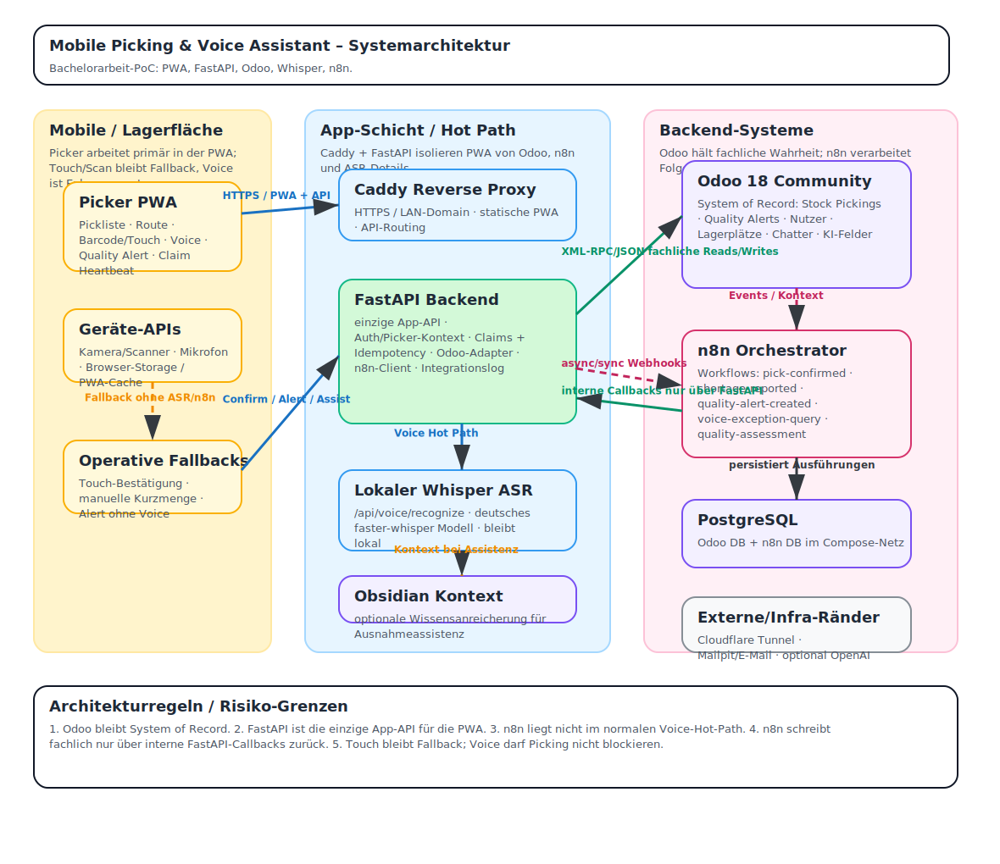

# Mobile Picking & Voice Assistant – Systemarchitektur

Diese Diagrammdateien dokumentieren die aktuelle Systemarchitektur des Mobile Picking & Voice Assistant PoC.

- Editierbar in Excalidraw: `mobile-picking-system-architecture.excalidraw`
- GitHub-/Browser-Preview: `mobile-picking-system-architecture.svg`

Kernaussagen:

1. Odoo bleibt System of Record.
2. FastAPI ist die einzige App-API für die PWA.
3. Der normale Voice-Hot-Path bleibt lokal: PWA → FastAPI → Whisper → FastAPI → PWA.
4. n8n verarbeitet Folgeprozesse, Ausnahmeassistenz und Quality-Alert-Auswertung.
5. Fachliche n8n-Writebacks laufen nur über interne FastAPI-Callbacks zurück nach Odoo.
6. Touch/Scan bleibt der robuste Fallback, Voice ist Enhancement.

