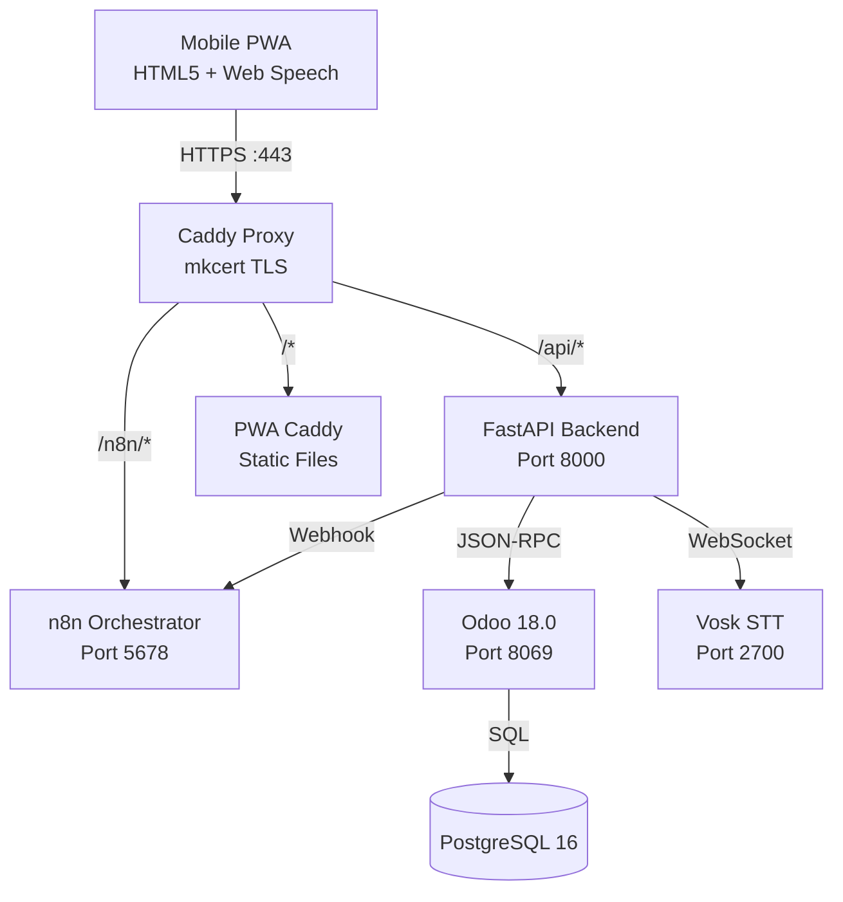

# System Architektur

## Überblick

## Harte Architekturregeln

> [!warning] Nicht verhandelbar
> 1. **Odoo ist System of Record** — alle Daten leben in Odoo
> 2. **n8n ist Orchestrator, NICHT App-Backend** — kein Echtzeit-State in n8n
> 3. **FastAPI ist die einzige API-Schicht für die PWA**
> 4. **HTTPS ist zwingend** — ohne kein `getUserMedia()`, kein Service Worker
> 5. **n8n liegt NICHT im Voice-Pfad** — Vosk → FastAPI → Intent, n8n nur fire-and-forget
> 6. **Touch ist immer Fallback** — Voice ist Enhancement, nicht Voraussetzung

## Datenflow: Barcode Scan

1. Nutzer scannt Barcode (HID-Scanner oder Touch-Eingabe)
2. PWA: `POST /api/pickings/{id}/confirm-line`
3. FastAPI: Barcode gegen `product.product.barcode` validieren
4. FastAPI: `stock.move.line.write([id], {"quantity": qty})`
5. FastAPI: Alle Zeilen fertig? → `stock.picking.button_validate(context={skip_backorder: True})`
6. FastAPI: Antwort `{success, message, picking_complete}`
7. PWA: TTS-Ausgabe via `SpeechSynthesis`

## Datenflow: Voice-Picking

1. Nutzer hält Voice-Button gedrückt (PTT)
2. `MediaRecorder` nimmt Audio auf (WebM/Opus auf Android, MP4/AAC auf iOS)
3. `POST /api/voice/recognize` mit Audio-Blob
4. FastAPI → Vosk-WebSocket: Transkription
5. `intent_engine.recognize_intent(text, context)` → Intent-Objekt
6. PWA reagiert auf Intent (confirm, next, problem, ...)

## Odoo 18 API-Details

| Operation | Endpunkt | Methode |
| --------- | -------- | ------- |
| Auth | `/jsonrpc` | `common.authenticate` |
| CRUD | `/jsonrpc` | `object.execute_kw` |
| API-Key | Odoo Settings → User → Account Security | — |

> [!caution] Odoo 18 Breaking Changes
> - `stock.move.line.quantity` (NICHT `qty_done` — das war Odoo 16!)
> - `stock.picking.move_ids` (NICHT `move_lines`)
> - `stock.lot` (NICHT `stock.production.lot`)

## Docker-Netzwerk

Alle Services im `picking-net` Netzwerk. Inter-Service-Kommunikation über Container-Namen:

| Service | Intern | Extern (via Caddy) |
| ------- | ------ | ------------------ |
| Odoo | `http://odoo:8069` | `http://<HOST>:8069/` (Admin-Setup) |
| Backend | `http://backend:8000` | `/api/` |
| n8n | `http://n8n:5678` | `/n8n/` |
| Vosk | `ws://vosk:2700` | Nicht exponiert |

> [!note] Odoo-Admin-Zugang
> Der aktuelle PoC nutzt für Odoo-Administration den direkten Zugriff auf Port `8069`.
> PWA, API und n8n laufen weiter über Caddy.

---

## Weiterführende Entscheidungen

- [[Odoo 18 Entscheidungen]] — Warum JSON-RPC, API-Key-Auth, breaking field name changes
- [[Voice Intent Engine]] — Detaillierter Datenfluss PTT→STT→Intent→TTS, Kontext-Zustände
- [[PWA Implementierungshinweise]] — iOS Safari Einschränkungen, MediaRecorder-Formate, HTTPS-Pflicht
- [[API Dokumentation]] — Vollständige Endpoint-Spezifikation mit Beispielen
- [[00 - Projekt Übersicht]] — Gesamtüberblick und Phasen-Status
