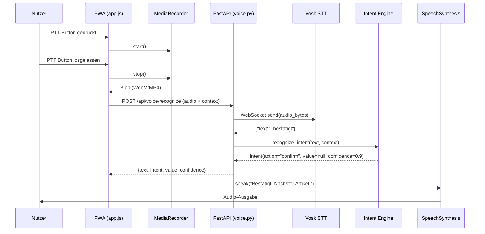
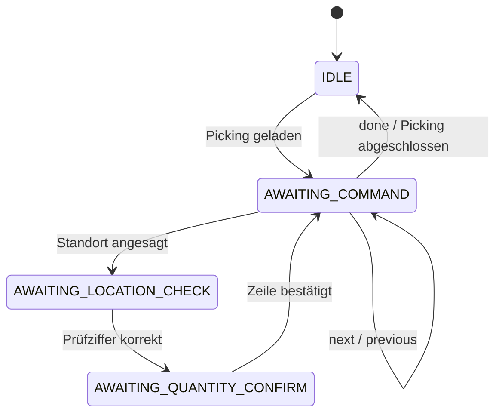

# Voice Intent Engine

> [!abstract] Voice-Pipeline Dokumentation
> Detaillierte Beschreibung des Voice-Pfades von der PTT-Geste bis zur TTS-Ausgabe.
> Implementierung: `backend/app/services/intent_engine.py` + `backend/app/routers/voice.py`

Übergeordnete Architektur: [[System Architektur]] | API: [[API Dokumentation]] | PWA-Seite: [[PWA Implementierungshinweise]]

---

## Architektur-Überblick



---

## PickingContext — Zustandsmodell

Der Kontext steuert, welche Intents als gültig erkannt werden.



| Context-Enum | Wert | Beschreibung |
| ------------ | ---- | ------------ |
| `IDLE` | `"idle"` | Kein aktives Picking |
| `AWAITING_LOCATION_CHECK` | `"awaiting_location_check"` | Prüfziffer des Lagerorts wird erwartet |
| `AWAITING_QUANTITY_CONFIRM` | `"awaiting_quantity_confirm"` | Mengenbestätigung wird erwartet |
| `AWAITING_COMMAND` | `"awaiting_command"` | Allgemeines Kommando |

---

## Intent-Patterns (Deutsch)

| Intent | Kontext | Auslösende Wörter | Beispiel |
| ------ | ------- | ----------------- | -------- |
| `check_digit` | `AWAITING_LOCATION_CHECK` | Zahlenwörter, Ziffern | "vier sieben" → `47` |
| `quantity` | `AWAITING_QUANTITY_CONFIRM` | Zahlenwörter, Ziffern | "fünf" → `5` |
| `confirm` | alle | bestätigt, ja, korrekt, stimmt, richtig, okay, ok | "ja" |
| `next` | alle | nächster, nächste, weiter, skip | "weiter" |
| `previous` | alle | zurück, vorheriger | "zurück" |
| `problem` | alle | problem, fehler, defekt, beschädigt, kaputt, fehlt | "problem" |
| `photo` | alle | foto, photo, bild, kamera | "foto" |
| `repeat` | alle | wiederholen, nochmal, noch mal, wie bitte | "nochmal" |
| `pause` | alle | pause, stopp, stop, halt | "pause" |
| `done` | alle | fertig, abgeschlossen, ende | "fertig" |
| `help` | alle | hilfe, help | "hilfe" |
| `unknown` | alle | — | Kein Match |

---

## Deutsche Zahlwörter-Mapping

```python
GERMAN_NUMBERS = {
    "null": "0", "eins": "1", "zwei": "2", "drei": "3",
    "vier": "4", "fünf": "5", "sechs": "6", "sieben": "7",
    "acht": "8", "neun": "9", "zehn": "10", "elf": "11", "zwölf": "12"
}
```

Vosk transkribiert Zahlen manchmal als Wörter ("vier sieben"), manchmal als Ziffern ("47"). Die Engine behandelt beide Fälle.

---

## Vosk STT — Konfiguration

> [!info] Warum Vosk und nicht Browser SpeechRecognition?
> Browser `SpeechRecognition` funktioniert **nicht** in iOS PWA-Standalone-Mode.
> Vosk läuft vollständig lokal, braucht kein Internet, und ist deterministisch.
> Mehr dazu: [[PWA Implementierungshinweise]]

**Docker Image:** `alphacep/kaldi-de:latest` (Deutsches Modell, ~2 GB RAM)

**Verbindung:** WebSocket `ws://vosk:2700` (intern, nicht nach außen exponiert)

**Protokoll:**
```python
# Senden: Audio-Bytes in Chunks
await ws.send(audio_bytes)

# Terminieren:
await ws.send(json.dumps({"eof": 1}))

# Empfangen: JSON-Transkript
result = json.loads(await ws.recv())
# → {"text": "bestätigt"}
```

**Audio-Formate:** Vosk akzeptiert WebM/Opus (Android Chrome) und MP4/AAC (iOS Safari) direkt — ffmpeg im Backend-Container als Fallback für andere Formate.

---

## Konfidenz und Fallback

| Konfidenz | Bedeutung | PWA-Reaktion |
| --------- | --------- | ------------ |
| ≥ 0.8 | Hohe Sicherheit | Intent direkt ausführen |
| 0.5–0.79 | Mittlere Sicherheit | Visuell anzeigen, Touch-Bestätigung anfordern |
| < 0.5 | Niedrige Sicherheit / `unknown` | Wiederholungsaufforderung |

> [!tip] Touch ist immer Fallback
> Nach 5 Sekunden ohne erkanntes Kommando zeigt die PWA Touch-Buttons.
> Der Voice-Pfad ist Enhancement, nicht Pflicht.

---

## Weiterführend

- [[System Architektur]] — Gesamtarchitektur und Datenflow
- [[API Dokumentation]] — `/api/voice/recognize` Endpoint
- [[PWA Implementierungshinweise]] — MediaRecorder, iOS-Bugs, PTT-Implementierung
- [[Odoo 18 Entscheidungen]] — Backend-seitige Entscheidungen
