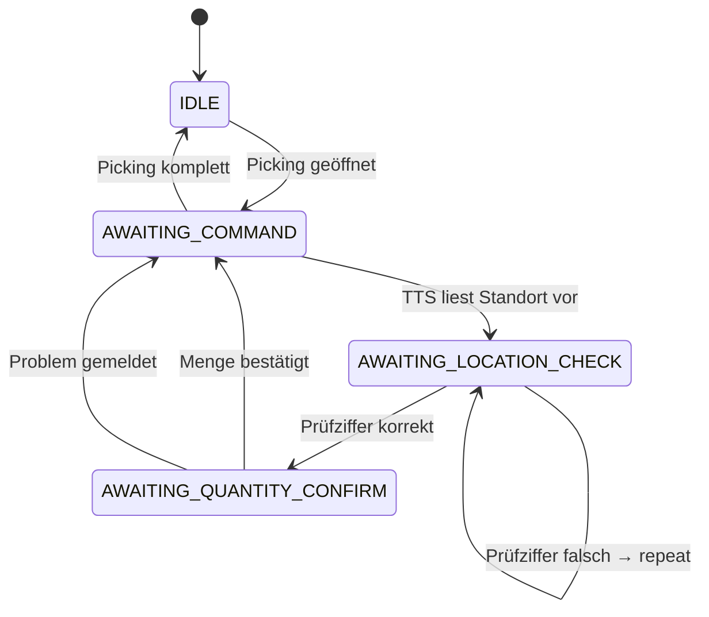

# Phase 4 — Voice Picking (Vosk STT)

> [!todo] Wartet auf Phase 3
> Vosk STT + Intent-Engine + TTS vollständig in den Picking-Flow integrieren.
> **Voraussetzung:** [[Phase 3 - Barcode Scanning]] ✅ abgeschlossen.

Überblick: [[00 - Projekt Übersicht]] | Voice-Architektur: [[Voice Intent Engine]] | PWA-Details: [[PWA Implementierungshinweise]] | Nächste Phase: [[Phase 5 - n8n Orchestrierung]]

---

## Ziel dieser Phase

Voice-Picking als vollständiger Workflow:
```
PTT-Button halten → MediaRecorder → POST /api/voice/recognize → Intent → TTS-Antwort
```

Touch bleibt immer Fallback — Voice ist Enhancement, nicht Pflicht.

---

## Was bereits implementiert ist

| Komponente | Datei | Status |
| ---------- | ----- | ------ |
| Vosk STT Client | `backend/app/services/vosk_client.py` | ✅ Implementiert |
| Intent Engine | `backend/app/services/intent_engine.py` | ✅ Implementiert |
| Voice Router | `backend/app/routers/voice.py` | ✅ Implementiert |
| TTS (Browser) | `pwa/js/voice.js:speak()` | ✅ Implementiert |
| Audio Recording | `pwa/js/voice.js:startRecording/stopRecording` | ✅ Implementiert |
| PTT-Button | `pwa/js/app.js` | ✅ Implementiert |
| Audio-Konvertierung | `backend/app/utils/audio.py` | ✅ Implementiert |

---

## Vosk Setup-Checkliste

> [!warning] Vosk Startup-Zeit
> Vosk braucht **~30 Sekunden** beim ersten Start um das deutsche Modell (`alphacep/kaldi-de`) zu laden.
> Voice-Tests erst starten nach:
> ```bash
> docker compose logs vosk | grep "Ready to process"
> ```

- [ ] `docker compose logs vosk` — Container läuft
- [ ] `docker compose logs vosk | grep "Ready"` — Modell geladen
- [ ] WebSocket-Port 2700 intern erreichbar: `docker compose exec backend nc -z vosk 2700`

---

## Test-Szenarien

### Vosk-Verbindungstest

```bash
# Direkt über Backend testen:
curl -k -X POST https://localhost/api/voice/recognize \
  -F "audio=@test.wav" \
  -F "context=awaiting_command"
# → {"text": "...", "intent": "...", "value": null, "confidence": 0.9}
```

### Intent-Engine Unit Tests

```bash
cd backend
python -m pytest tests/test_intent_engine.py -v
```

Getestete Intents:

| Sprachbefehl | Kontext | Erwarteter Intent |
| ------------ | ------- | ----------------- |
| "bestätigt" | `awaiting_command` | `confirm` |
| "nächster" | `awaiting_command` | `next` |
| "problem" | `awaiting_command` | `problem` |
| "vier sieben" | `awaiting_location_check` | `check_digit` (value=4) |
| "fünf" | `awaiting_quantity_confirm` | `quantity` (value=5) |
| "5" | `awaiting_quantity_confirm` | `quantity` (value=5) |
| "wiederholen" | `awaiting_command` | `repeat` |
| "fertig" | `awaiting_command` | `done` |

### Voice-Flow End-to-End

```
1. PTT-Button halten
2. Sprechen: "bestätigt"
3. PTT loslassen → Audio geht an /api/voice/recognize
4. Backend → Vosk → "bestätigt"
5. Intent: {action: "confirm", confidence: 0.9}
6. PWA: Pick-Zeile wird bestätigt
7. TTS: "Bestätigt. Nächster Artikel: ..."
```

---

## Sprachbefehle (Referenz)

| Kontext | Befehl | Intent | Aktion |
| ------- | ------ | ------ | ------ |
| Standort-Check | Prüfziffer (z.B. "vier sieben") | `check_digit` | Standort bestätigen |
| Standort-Check | "Wiederholen" | `repeat` | Standort nochmal ansagen |
| Menge | "Bestätigt" | `confirm` | Bedarfsmenge übernehmen |
| Menge | Zahl (z.B. "fünf") | `quantity` | Abweichende Menge setzen |
| Allgemein | "Nächster" | `next` | Nächster Pick-Schritt |
| Allgemein | "Zurück" | `previous` | Vorheriger Schritt |
| Allgemein | "Problem" | `problem` | Quality Alert starten |
| Allgemein | "Foto" | `photo` | Kamera öffnen |
| Allgemein | "Fertig" | `done` | Picking abschließen |
| Allgemein | "Hilfe" | `help` | Befehle ansagen |

---

## PickingContext State Machine



---

## Audio-Format-Kompatibilität

| Plattform | Format | Vosk-Kompatibilität |
| --------- | ------ | ------------------- |
| iOS Safari | `audio/mp4` (AAC) | ✅ direkt |
| Chrome Android | `audio/webm;codecs=opus` | ✅ direkt |
| Chrome Desktop | `audio/webm;codecs=opus` | ✅ direkt |

> [!info] ffmpeg-Fallback
> `backend/app/utils/audio.py:convert_to_wav()` konvertiert bei Problemen zu WAV 16kHz/Mono.
> Wird automatisch aufgerufen wenn Vosk keine verwertbare Antwort gibt.

---

## PWA-Tests auf Mobile

### iOS Safari

- [ ] Mikrofon-Permission erscheint beim ersten PTT-Druck
- [ ] PTT-Button hält Aufnahme korrekt (kein automatisches Ende)
- [ ] Audio-Upload zu Backend → Vosk → Intent
- [ ] TTS spricht auf Deutsch (`utterance.lang = 'de-DE'`)
- [ ] TTS funktioniert in PWA-Standalone-Modus
- [ ] Touch-Fallback erscheint wenn Vosk nicht antwortet (5s Timeout)

### Android Chrome

- [ ] Mikrofon-Permission erscheint
- [ ] `audio/webm;codecs=opus` wird als Format erkannt
- [ ] Intent-Erkennung für deutsche Befehle
- [ ] TTS Deutsch funktioniert

---

## Bekannte Probleme und Lösungen

> [!bug] iOS TTS + PTT gleichzeitig
> TTS und Mikrofon können auf iOS interferieren.
> Lösung: TTS fertig abwarten (`await speak(...)`) bevor Aufnahme startet.

> [!bug] Vosk leere Antwort
> Vosk gibt manchmal `""` zurück bei schlechter Audioqualität.
> Behandlung in `voice.py`: leere Antwort → `{intent: "unknown", confidence: 0.0}`.
> PWA zeigt dann Touch-Fallback.

> [!bug] MediaRecorder kein ondataavailable auf iOS 15
> iOS 15 feuert `ondataavailable` manchmal erst nach `stop()`.
> Fix in `voice.js`: `mediaRecorder.requestData()` vor `stop()` aufrufen.

---

## Kill-Kriterium

> [!danger] Kill-Kriterium: Vosk <60% Erkennungsrate
> Falls deutschsprachige Kommandos im Lagerumfeld weniger als 60% Erkennungsrate erreichen:
> → `faster-whisper` evaluieren als Alternative zu Vosk
> → Oder: Voice als "experimentell" deklarieren, Fokus auf Scan + Touch

---

## Go/No-Go Checkliste

| Kriterium | Status |
| --------- | ------ |
| Vosk antwortet auf WebSocket-Verbindung | ☐ |
| `POST /api/voice/recognize` → Transkription | ☐ |
| Intent "bestätigt" → Pick-Zeile bestätigt | ☐ |
| Intent "problem" → Quality Alert öffnet | ☐ |
| TTS spricht Pick-Anweisung (iOS + Android) | ☐ |
| Vollständiger Voice-Loop ohne Touch | ☐ |
| Touch-Fallback nach 5s ohne Erkennung | ☐ |

---

## Weiterführend

- [[Voice Intent Engine]] — Detaillierter Datenfluss, Intent-Patterns, PickingContext-Zustände
- [[PWA Implementierungshinweise]] — iOS Safari Einschränkungen für Audio/Mikrofon
- [[API Dokumentation]] — `/api/voice/recognize` Endpoint-Spezifikation
- [[Phase 3 - Barcode Scanning]] — Voice als Enhancement zu Barcode-Scanning
- [[Phase 5 - n8n Orchestrierung]] — n8n-Webhooks nach Voice-Events
