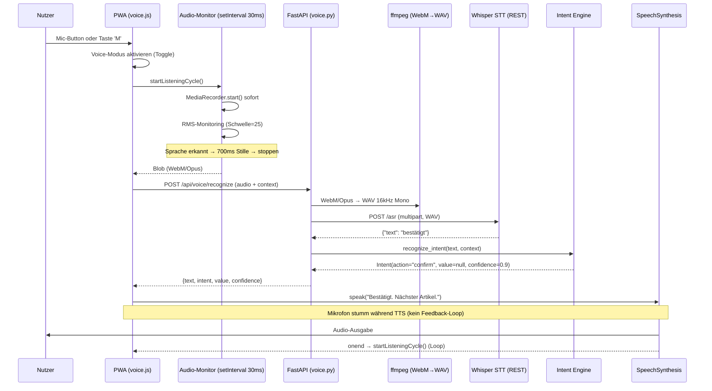
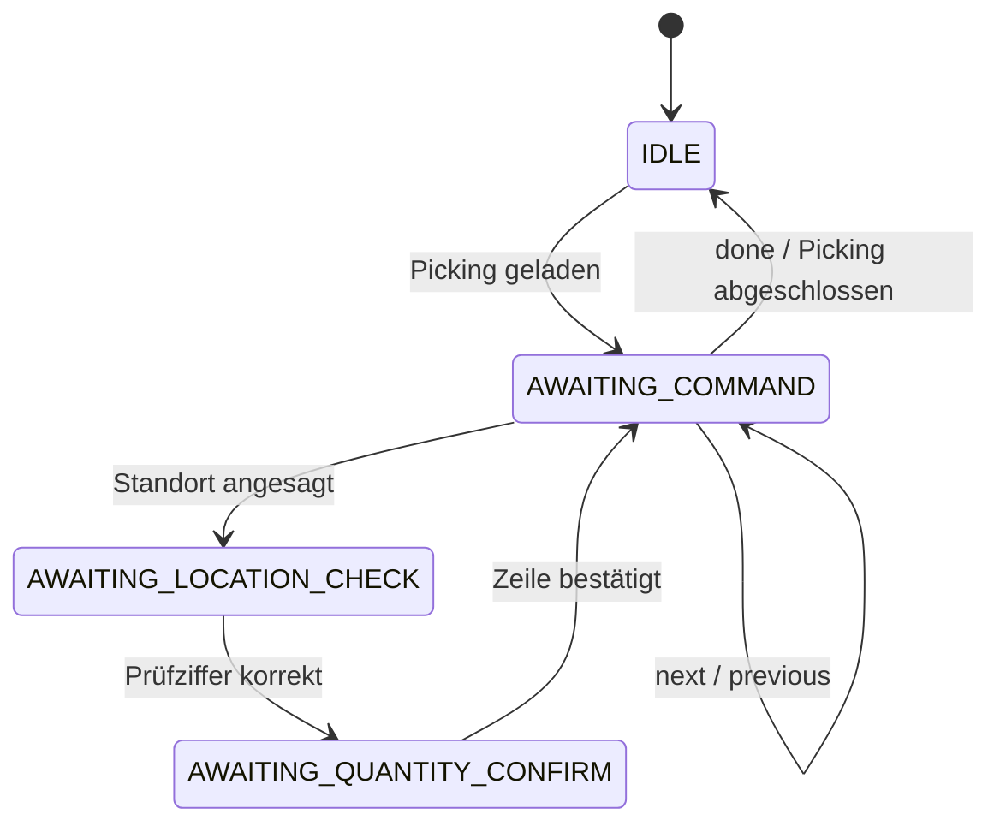

# Voice Intent Engine

> [!abstract] Voice-Pipeline Dokumentation
> Detaillierte Beschreibung des Voice-Pfades vom Voice-Toggle-Modus bis zur TTS-Ausgabe.
> Implementierung: `backend/app/services/intent_engine.py` + `backend/app/routers/voice.py`
> STT: Whisper (faster_whisper, small-Modell) | TTS: Browser SpeechSynthesis

Übergeordnete Architektur: [[System Architektur]] | API: [[API Dokumentation]] | PWA-Seite: [[PWA Implementierungshinweise]]

---

## Architektur-Überblick



---

## PickingContext — Zustandsmodell

Der Kontext steuert, welche Intents als gültig erkannt werden.



| Context-Enum | Wert | Beschreibung |
| ------------ | ---- | ------------ |
| `IDLE` | `"idle"` | Kein aktives Picking |
| `AWAITING_LOCATION_CHECK` | `"awaiting_location_check"` | Prüfziffer des Lagerorts wird erwartet |
| `AWAITING_QUANTITY_CONFIRM` | `"awaiting_quantity_confirm"` | Mengenbestätigung wird erwartet |
| `AWAITING_COMMAND` | `"awaiting_command"` | Allgemeines Kommando |

---

## Intent-Patterns (Deutsch)

| Intent | Kontext | Auslösende Wörter | Beispiel |
| ------ | ------- | ----------------- | -------- |
| `check_digit` | `AWAITING_LOCATION_CHECK` | Zahlenwörter, Ziffern | "vier sieben" → `47` |
| `quantity` | `AWAITING_QUANTITY_CONFIRM` | Zahlenwörter, Ziffern | "fünf" → `5` |
| `confirm` | alle | bestätigt, ja, korrekt, stimmt, richtig, okay, ok | "ja" |
| `next` | alle | nächster, nächste, weiter, skip | "weiter" |
| `previous` | alle | zurück, vorheriger | "zurück" |
| `problem` | alle | problem, fehler, defekt, beschädigt, kaputt, fehlt | "problem" |
| `photo` | alle | foto, photo, bild, kamera | "foto" |
| `repeat` | alle | wiederholen, nochmal, noch mal, wie bitte | "nochmal" |
| `pause` | alle | pause, stopp, stop, halt | "pause" |
| `done` | alle | fertig, abgeschlossen, ende | "fertig" |
| `help` | alle | hilfe, help | "hilfe" |
| `stock_query` | Detail (Picking offen) | noch da, im bestand, lagerbestand, bestand prüfen | "noch da?" |
| `filter_high` | Liste | dringend, hohe priorität, eilig, kritisch | "dringend" |
| `filter_normal` | Liste | alle, zurücksetzen, filter weg, reset | "alle" |
| `status` | Liste | wie viele, status, übersicht, aufträge | "wie viele offen?" |
| `unknown` | alle | — | Kein Match |

---

## Deutsche Zahlwörter-Mapping

```python
GERMAN_NUMBERS = {
    "null": "0", "eins": "1", "zwei": "2", "drei": "3",
    "vier": "4", "fünf": "5", "sechs": "6", "sieben": "7",
    "acht": "8", "neun": "9", "zehn": "10", "elf": "11", "zwölf": "12"
}
```

Whisper transkribiert Zahlen manchmal als Wörter ("vier sieben"), manchmal als Ziffern ("47"). Die Engine behandelt beide Fälle.

---

## Whisper STT — Konfiguration

> [!info] Warum Whisper statt Vosk oder Browser SpeechRecognition?
> - Browser `SpeechRecognition` funktioniert **nicht** in iOS PWA-Standalone-Mode.
> - Vosk hatte ~15-20% WER für deutsche Befehle — zu ungenau für den Lagereinsatz.
> - Whisper (small-Modell) erreicht ~8-10% WER und versteht natürlichere Sprache.
> - Whisper läuft vollständig lokal im Docker-Container, braucht kein Internet.
> Mehr dazu: [[PWA Implementierungshinweise]]

**Docker Image:** `onerahmet/openai-whisper-asr-webservice:latest`

**Engine:** `faster_whisper` (CTranslate2-optimiert, ~4x schneller als openai_whisper auf CPU)

**Modell:** `small` (~1-2s Antwortzeit auf CPU; `medium` hatte Timeouts >2min auf CPU)

**Verbindung:** REST API `http://whisper:9000/asr` (intern, nicht nach außen exponiert)

**Protokoll:**
```python
# REST API — POST mit multipart/form-data
resp = await client.post(
    f"{settings.whisper_url}/asr",
    params={"task": "transcribe", "language": "de", "output": "json", "encode": "false"},
    files={"audio_file": (filename, audio_bytes, "audio/wav")},
)
data = resp.json()
text = data.get("text", "").strip()
# → "bestätigt"
```

**Audio-Konvertierung:** Whisper-Container hat minimales ffmpeg ohne WebM-Codec. Deshalb konvertiert das Backend **immer** WebM/Opus → WAV (16kHz, Mono) via `backend/app/utils/audio.py:convert_to_wav()` bevor es an Whisper gesendet wird. Parameter `encode=false` signalisiert, dass die Datei bereits im richtigen Format ist.

### Migration von Vosk zu Whisper (2026-03-22)

| Aspekt | Vosk (vorher) | Whisper (jetzt) |
| ------ | ------------- | --------------- |
| Protokoll | WebSocket (`ws://vosk:2700`) | REST (`http://whisper:9000/asr`) |
| Modell | Kaldi DE (~2 GB RAM) | faster_whisper small |
| WER (Deutsch) | ~15-20% | ~8-10% |
| Antwortzeit | ~0.5-1s | ~1-2s |
| Audio-Input | WebM/Opus direkt | WAV (Backend konvertiert) |
| Client | `vosk_client.py` (WebSocket) | `whisper_client.py` (httpx REST) |

---

## Konfidenz und Fallback

| Konfidenz | Bedeutung | PWA-Reaktion |
| --------- | --------- | ------------ |
| ≥ 0.8 | Hohe Sicherheit | Intent direkt ausführen |
| 0.5–0.79 | Mittlere Sicherheit | Visuell anzeigen, Touch-Bestätigung anfordern |
| < 0.5 | Niedrige Sicherheit / `unknown` | Wiederholungsaufforderung |

> [!tip] Touch ist immer Fallback
> Nach 5 Sekunden ohne erkanntes Kommando zeigt die PWA Touch-Buttons.
> Der Voice-Pfad ist Enhancement, nicht Pflicht.

---

## Voice-Toggle-Modus

> [!info] Seit 2026-03-22 — ersetzt Push-to-Talk
> Der Voice-Modus wird per Mic-Button oder Taste **M** ein-/ausgeschaltet (Toggle).
> Solange aktiv, läuft ein automatischer Aufnahme-Loop.

**Ablauf:**
1. Toggle: Mikrofon-Zugriff anfordern, AudioContext + Analyser erstellen
2. `startListeningCycle()`: MediaRecorder sofort starten (kein Kalibrieren)
3. RMS-Monitoring per `setInterval(30ms)`: Warte auf Sprache (RMS > 25)
4. Sprache erkannt → warte auf 700ms Stille → `recorder.stop()`
5. Audio-Blob an Backend senden (`POST /api/voice/recognize`)
6. Intent verarbeiten, TTS-Antwort sprechen
7. Während TTS: Mikrofon stumm (`track.enabled = false`) → kein Feedback-Loop
8. Nach TTS: Mikrofon unmuten, `startListeningCycle()` erneut → Loop

**Schwellwerte (fest, kein Kalibrieren):**

| Konstante | Wert | Beschreibung |
| --------- | ---- | ------------ |
| `SPEECH_RMS` | 25 | RMS über 25 = Sprache (Rauschen liegt bei 5-15) |
| `SILENCE_AFTER_SPEECH` | 400ms | Stille nach Sprache → Audio senden (gesenkt von 700ms am 2026-03-23) |
| `NO_SPEECH_TIMEOUT` | 6000ms | Keine Sprache erkannt → Zyklus neu starten |
| `MIN_SPEECH_MS` | 150ms | Mindest-Sprechdauer (verhindert Artefakte) |
| `MAX_RECORDING_MS` | 10000ms | Sicherheits-Timeout |
| `CHECK_MS` | 30ms | Monitor-Intervall (setInterval) |

> [!success] Update 2026-03-23
> `SILENCE_AFTER_SPEECH` von 700ms auf 400ms gesenkt → ~300ms schnellere Reaktion pro Kommando.
> Neue Intents hinzugefügt: `stock_query`, `filter_high`, `filter_normal`, `status`.
> `stopVoiceMode()` exportiert — Voice-Modus stoppt jetzt automatisch beim Seitenwechsel.

**TTS-Feedback-Loop-Prävention:**
```javascript
function muteMic(mute) {
    if (micStream) {
        micStream.getAudioTracks().forEach(t => { t.enabled = !mute; });
    }
}
// speak() setzt ttsBusy=true, muteMic(true), stopCurrentRecording()
// Nach TTS-Ende: ttsBusy=false, muteMic(false), startListeningCycle()
```

**Keyboard-Shortcut:**
- Taste **M** toggled den Voice-Modus (mit `e.repeat`-Guard gegen gedrückt-halten)
- Wird ignoriert wenn Fokus auf INPUT/TEXTAREA/SELECT liegt

---

## Bekannte Einschränkungen & Offene Punkte

> [!warning] Performance-Optimierung ausstehend
> Gesamte Round-Trip-Zeit (Stille-Erkennung + Whisper-Verarbeitung) liegt bei ~2-4s.
> Funktioniert, aber könnte reaktiver sein. Mögliche Optimierungen:
> - `SILENCE_AFTER_SPEECH` reduzieren (aktuell 700ms)
> - Whisper `tiny` Modell testen (schneller, aber weniger genau)
> - Audio-Streaming statt Batch-Upload

> [!warning] M-Taste: Voice-Modus bleibt aktiv wenn Buttons versteckt
> Wenn per M-Taste der Voice-Modus aktiviert wird, bleibt er aktiv auch wenn die UI-Buttons
> bei einem Seitenwechsel nicht mehr sichtbar sind. Benötigt eine globale Lösung:
> z.B. Voice-Modus an Navigation koppeln oder permanenten Status-Indikator anzeigen.

---

## Weiterführend

- [[System Architektur]] — Gesamtarchitektur und Datenflow
- [[API Dokumentation]] — `/api/voice/recognize` Endpoint
- [[PWA Implementierungshinweise]] — MediaRecorder, iOS-Bugs, Voice-Toggle-Implementierung
- [[Odoo 18 Entscheidungen]] — Backend-seitige Entscheidungen
