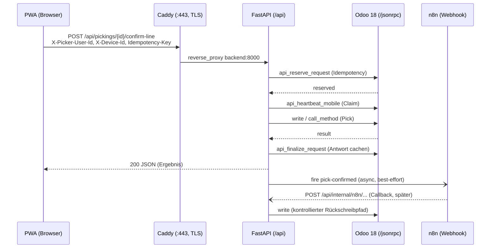

# Überblick & Datenfluss

> [!abstract] Kurzfassung
> Das System ist ein geschichteter PoC: Eine Vanilla-JS-PWA spricht ausschließlich mit einem FastAPI-Backend, das wiederum Odoo 18 als System of Record über JSON-RPC (`/jsonrpc`) anspricht. Caddy terminiert HTTPS im LAN und routet Pfade auf die Dienste; n8n hängt nur als asynchroner Orchestrator und synchrone Ausnahmeassistenz an FastAPI, niemals im Voice-Hot-Path. Diese Datei beschreibt die Schichten, den Request-Lebenszyklus und die nicht verhandelbaren Invarianten.

## 1. Wie es funktioniert

Das System besteht aus klar getrennten Schichten, die jeweils nur mit ihrer Nachbarschicht reden:

1. **PWA (Browser)** — mobile-first Vanilla-JS-Oberfläche. Sie kennt nur einen einzigen Backend-Einstieg: `const API_BASE = '/api'` (`pwa/js/api.js:5`). Alle Calls laufen über die zentrale `request(...)`-Funktion gegen `${API_BASE}${path}` (`pwa/js/api.js:191`). Die PWA spricht nie direkt mit Odoo oder n8n.
2. **Caddy (Reverse Proxy / TLS)** — terminiert HTTPS auf `:443` (`infrastructure/caddy/Caddyfile:1-2`) und verteilt: `handle /api/*` → `reverse_proxy backend:8000` (`Caddyfile:4-6`), restliche Pfade → `pwa:80` (`Caddyfile:30-32`). `:80` leitet permanent auf HTTPS um (`Caddyfile:40-45`).
3. **FastAPI (App-API & Odoo-Adapter)** — die einzige API-Schicht. `app.main:app` registriert die Router unter dem gemeinsamen Prefix `/api` (`backend/app/main.py:22-30`) und ist die einzige Komponente, die Odoo-JSON-RPC, Idempotency und Claims kapselt.
4. **Odoo 18 Community (System of Record)** — fachliche Datenquelle. FastAPI erreicht es über `odoo_client.py` per JSON-RPC.
5. **n8n (Orchestrator)** — async Events (Pull/Push via Webhook) und synchrone Ausnahmeassistenz. n8n schreibt fachlich nur über interne FastAPI-Callbacks zurück (`backend/app/routers/n8n_internal.py`), nie direkt in Odoo.
6. **Whisper (STT) / Piper (TTS)** — lokale Sprachdienste, vom Backend über `WHISPER_URL`/`PIPER_URL` adressiert (`backend/app/config.py:13-14`).

Typischer Request-Lebenszyklus eines fachlichen Writes (Pick-Bestätigung):

1. Die PWA sendet `POST /api/pickings/{id}/confirm-line` mit den Headern `X-Picker-User-Id`, `X-Device-Id` und `Idempotency-Key` (gesetzt in `getWriteHeaders` / `getReadHeaders`, `pwa/js/api.js:157-170`).
2. Caddy reicht `/api/*` an `backend:8000` weiter (`Caddyfile:4-6`).
3. FastAPI löst Dependencies auf: Schreib-Kontext (`get_write_request_context`, `dependencies.py:62-77`) und — im Handler — die aufgelöste Picker-Identität (`_require_resolved_identity`, `pickings.py:59-67`).
4. FastAPI reserviert die Idempotency (`begin_idempotent_request`, `pickings.py:289`) und spielt bei Wiederholung die gecachte Antwort zurück (`_return_or_raise_replay`, `pickings.py:76-82`).
5. FastAPI verlängert den Claim per Heartbeat und schreibt nach Odoo (`pickings.py:296-306`).
6. FastAPI finalisiert die Idempotency-Reservierung mit der Antwort (`finalize_idempotent_request`, `pickings.py:316`) und antwortet der PWA.
7. Async-Events (`pick-confirmed` etc.) gehen anschließend best-effort an n8n; ein Fehlschlag lässt das Picking fachlich abgeschlossen, markiert aber den Folgeprozess als degradiert (`docs/ARCHITECTURE.md:26-31`).

## 2. Wie es mit Odoo kommuniziert

FastAPI spricht Odoo ausschließlich über `OdooClient` (`backend/app/services/odoo_client.py`) per JSON-RPC an `POST {odoo_url}/jsonrpc` (`odoo_client.py:50`). Odoo 18 Community nutzt JSON-RPC (nicht JSON-2), dokumentiert im Modulkopf (`odoo_client.py:1-8`).

- **Auth (API-Key):** `authenticate()` ruft `common.authenticate` und probiert nacheinander `odoo_api_key` und `odoo_password` als Secret (`odoo_client.py:34-68`). Die erhaltene `uid` und das gültige Secret werden gecacht und für jedes `object.execute_kw` wiederverwendet (`odoo_client.py:70-76`).
- **Kernmethoden:** `search_read` (`:78`), `create` (`:81`), `write` (`:84`) und `call_method` (`:87`) — alle laufen über `execute_kw`. Beliebige Modellmethoden werden direkt über `execute_kw(model, method, args, kwargs)` aufgerufen (`:70`).
- **`call_method`-Besonderheit:** baut `call_args = [ids] + args` und reicht einen optionalen `context` als kwarg durch — genau der Mechanismus für kontextbehaftete Aufrufe wie `action_done` (`odoo_client.py:87-90`).
- **Fehlerbehandlung:** Liefert die JSON-RPC-Antwort ein `error`-Objekt, wirft der Client `OdooAPIError` und extrahiert dabei `error.data.message` (`odoo_client.py:53-55`, `:93-99`). HTTP-Fehler werden vorher über `resp.raise_for_status()` abgefangen (`:51`).
- **Strukturierte Timeouts:** bewusst `connect=5s / read=30s` statt eines flachen 120-s-Timeouts, um langsame Odoo-Queries nicht zu maskieren und den Event-Loop nicht zu blockieren (`odoo_client.py:13-16`).
- **Best-Effort-Pfade:** Chatter-Notizen und `mail.activity` werden in `n8n_internal.py` bewusst best-effort geschrieben — Fehler werden nur geloggt, nicht propagiert (`n8n_internal.py:205-248`).

Auf der n8n-Rückschreibseite gilt: Fachliche Writes aus n8n laufen nur über die internen FastAPI-Callbacks (`n8n_internal.py`), die jeweils per `require_n8n_callback_secret` (`dependencies.py:80-90`) und Idempotency-Key geschützt sind, bevor `odoo.write(...)` ausgeführt wird (z. B. `n8n_internal.py:595-599`).

## 3. Was genau zugegriffen wird (Odoo-Zugriff)

> Dieser Überblick listet die Modelle, die direkt im Architektur-/Lebenszyklus-Pfad berührt werden. Feature-spezifische Felder stehen in den jeweiligen Funktionsdoku-Seiten.

| Modell | Felder (R/W) | Methoden | Domain/Filter | Zweck |
|---|---|---|---|---|
| `res.users` | `name` (R) | `search_read` | `[("active","=",True),("share","=",False)]` (`mobile_workflow.py:67`, `:82`) | Picker-Auswahl & Identitätsauflösung |
| `stock.picking` | — | `api_claim_mobile`, `api_heartbeat_mobile`, `api_release_mobile` (`mobile_workflow.py:95-120`); `api_create_replenishment_transfer` (`n8n_internal.py:751-765`); `message_post` (`n8n_internal.py:1054-1059`) | per `picking_id` / Methoden-Args | Claim-/Heartbeat-/Release-Lifecycle, Nachschub, Chatter |
| `picking.assistant.idempotency` | — | `api_reserve_request`, `api_finalize_request`, `api_abort_request` (`mobile_workflow.py:132-173`) | Endpoint + Idempotency-Key + Fingerprint | Idempotenz-Reservierung & Antwort-Cache (Replay) |
| `quality.alert.custom` | `ai_*`-Felder (W); `id,name,description,priority,photo_count,product_id,location_id` (R) | `write` (`n8n_internal.py:595`, `:897`); `search_read` (`:345-351`); `message_post` | per `alert_id` | KI-Rückschreibung aus n8n, Shadow-Kontext, Chatter |
| `product.product` | `image_128/256/512/1024/1920` (R) | `search_read` | `[("id","=",product_id)]` (`pickings.py:116-121`) | Produktbild-Auslieferung als Binary |
| `ir.model` | `id` (R) | `search` | `[["model","=",model]]` (`n8n_internal.py:233`, `:1097`) | `res_model_id` für `mail.activity` |
| `mail.activity` | `res_model_id,res_id,summary,note` (W) | `create` (`n8n_internal.py:236-245`) | — | Best-Effort-Aktivität bei Review/Fehler |

## 4. API-Endpunkte (FastAPI)

Alle Router laufen unter dem Prefix `/api` (`main.py:22-30`). Die hier relevanten Architektur-/Lifecycle-Endpunkte:

| Methode | Pfad | Zweck | Auth/Headers |
|---|---|---|---|
| GET | `/api/health` | Liveness-Check, gibt `{status, service}` (`health.py:6-8`) | keine |
| GET | `/api/pickers` | Aktive Picker (Read) (`pickings.py:98-101`) | keine zwingend |
| GET | `/api/pickings` | Offene Pickings (`pickings.py:140-146`) | `X-Picker-User-Id` (`get_required_picker_identity`) |
| POST | `/api/pickings/{id}/claim` | Claim reservieren (`pickings.py:169`) | `X-Picker-User-Id`, `X-Device-Id`, opt. `Idempotency-Key` |
| POST | `/api/pickings/{id}/confirm-line` | Pick-Zeile bestätigen (`pickings.py:271`) | wie oben |
| POST | `/api/internal/n8n/quality-assessment` | n8n-Rückschreibung KI-Bewertung (`n8n_internal.py:546`) | `X-N8N-Callback-Secret`, `Idempotency-Key` |
| POST | `/api/internal/n8n/replenishment-action` | n8n löst Nachschub aus (`n8n_internal.py:683`) | `X-N8N-Callback-Secret`, `Idempotency-Key` |

Querschnitt: Schreib-Header werden über `get_write_request_context` eingelesen (`dependencies.py:62-77`); die Picker-Identität über `get_required_picker_identity` (numerisch, sonst 400/403; `dependencies.py:42-59`). n8n-Callbacks sind über `require_n8n_callback_secret` mit `secrets.compare_digest` abgesichert (`dependencies.py:80-90`). CORS-Origin kommt aus `cors_origins` (`main.py:14-20`, `config.py:28`).

## 5. PWA-Seite (falls relevant)

Der einzige API-Layer der PWA ist `pwa/js/api.js`. Kommentar im Kopf: „Einziger Kommunikationsweg zwischen PWA und Backend" (`api.js:1-5`). Zentrale Bausteine:

- `request(method, path, body, options)` — baut Header, setzt `Content-Type: application/json` (außer FormData), `cache: 'no-store'`, und wirft bei `!resp.ok` einen `ApiError` mit `status` und `detail` (`api.js:172-198`).
- `getReadHeaders()` setzt `X-Picker-User-Id` aus dem aktiven Picker (`api.js:165-170`); `getWriteHeaders()` ergänzt `X-Device-Id` (aus `getDeviceId`) und optional `Idempotency-Key` (`api.js:157-163`).
- `getDeviceId()` erzeugt/persistiert eine stabile Device-UUID im `localStorage` (`api.js:65-72`).

## 6. Telemetrie & Fehlerverhalten

- **Strukturierte Callback-Events:** n8n-Callbacks loggen ein JSON-Event mit `workflow_name`, `callback_type`, `callback_status` (`applied`/`replay`/`rejected`/`failed`/`aborted`), `correlation_id`, `idempotency_key`, `target_object_*`, `schema_version`, `received_at_backend` und `latency_tracking` (`n8n_internal.py:70-101`).
- **Shadow-Evaluation-Event:** `quality_shadow_evaluation` mit Heuristik-vs-KI-Vergleich, `confidence_delta`, `ai_latency_ms` etc. (`n8n_internal.py:354-390`).
- **n8n-Resilienz:** Der ausgehende n8n-Client hat einen Circuit Breaker pro Pfad (`BreakerState`, Schwelle `n8n_circuit_breaker_failures`, Open-Dauer `..._open_seconds`; `n8n_webhook.py:108-110`, `:359-385`). Sync-Replies fallen bei Timeout/Transport-/Contract-Fehler kontrolliert auf eine lokale Fallback-Antwort zurück (`status="fallback"`, `source="fastapi-fallback"`; `n8n_webhook.py:239-256`, `:326-342`).
- **Fehlerpfade in FastAPI:** `ClaimConflictError` → HTTP 409 (`pickings.py:192-194`); `OdooAPIError` in Callbacks → HTTP 502 mit Detail (`n8n_internal.py:618-635`); unerwartete Exceptions führen zu `abort_idempotent_request`, damit kein „false positive"-Replay zurückbleibt (`pickings.py:312-314`).

Invarianten (aus `CLAUDE.md` und `docs/ARCHITECTURE.md:16-23`): (1) Odoo = System of Record; (2) PWA spricht nur mit FastAPI; (3) n8n ist Orchestrator, nicht im Voice-Hot-Path; (4) HTTPS im LAN ist Pflicht für Kamera/Mikrofon/Service Worker; (5) Touch bleibt Fallback; (6) STT bleibt lokal.

**Pull vs. Push / HTTPS / LAN:** Reads (Pickings, Bilder, Bestand) sind Pull über FastAPI→Odoo. Statusänderungen sind synchrone Writes über FastAPI→Odoo; nachgelagerte Effekte sind Push: FastAPI feuert async Events an n8n (`fire`/`fire_event`), n8n schiebt Ergebnisse über interne Callbacks zurück. HTTPS wird durch Caddy mit `tls /certs/cert.pem /certs/key.pem` (`Caddyfile:2`) im LAN bereitgestellt; `LAN_HOST` ist über Docker-Compose parametriert (`docker-compose.yml:9-10`, `:92`).

## 7. Quellen im Code

- `backend/app/main.py:7-30` — FastAPI-App, Router-Prefix `/api`, CORS
- `backend/app/dependencies.py:20-90` — DI, Picker-Identität, Schreib-Kontext, n8n-Callback-Secret
- `backend/app/config.py:4-36` — Settings (Odoo-/n8n-/Whisper-/Piper-URLs, Timeouts, TTLs)
- `backend/app/services/odoo_client.py:43-99` — JSON-RPC, `execute_kw`, `search_read/create/write/call_method`, `OdooAPIError`
- `backend/app/services/n8n_webhook.py:120-260` — Envelope, `fire_event`, `request_reply`, Circuit Breaker
- `backend/app/services/mobile_workflow.py:95-178` — Claim/Heartbeat/Release, Idempotency-Reservierung
- `backend/app/routers/pickings.py:271-317` — `confirm-line` als kanonischer Write-Lebenszyklus
- `backend/app/routers/n8n_internal.py:546-680` — n8n-Rückschreibung mit Idempotenz & Telemetrie
- `pwa/js/api.js:5,157-198` — einziger Backend-Client der PWA
- `docker-compose.yml:1-216` — Topologie der Dienste (caddy, db, odoo, backend, whisper, piper, n8n, pwa)
- `infrastructure/caddy/Caddyfile:1-45` — TLS-Terminierung & Pfad-Routing
- `docs/ARCHITECTURE.md:16-43` — Architekturregeln & Hauptflüsse

## Verwandt

- [[12 - Funktionsdokumentation]] — Übersicht aller Funktionsseiten
- [[01 - Odoo-Kommunikation & Zugriffskatalog]]
- [[02 - Einzel-Kommissionierung (Picking)]]
- [[03 - Cluster- & Batch-Picking]]
- [[06 - Sprachassistent (STT, Intent, TTS)]]
- [[07 - Qualitätsmeldungen & n8n-Orchestrierung]]
