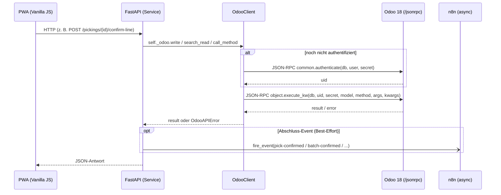

# Odoo-Kommunikation & Zugriffskatalog

> [!abstract] Kurzfassung
> Das FastAPI-Backend ist die einzige Komponente, die mit Odoo spricht. Die gesamte Kommunikation laeuft ueber den schmalen Adapter `backend/app/services/odoo_client.py`, der per JSON-RPC den Endpunkt `/jsonrpc` von Odoo 18 Community anspricht und vier generische Operationen (`search_read`, `create`, `write`, `call_method`) sowie den Low-Level-Zugriff `execute_kw` bereitstellt. Dieses Dokument beschreibt das WIE der Anbindung (Auth, Timeout, Fehlerbehandlung) und liefert einen konsolidierten Zugriffskatalog ueber alle Features hinweg: welcher Service welche Odoo-Modelle, Felder, Methoden und Domains nutzt.

## 1. Wie es funktioniert

Odoo ist das System of Record (Invariante). Die PWA spricht ausschliesslich mit FastAPI, und FastAPI spricht ausschliesslich ueber `OdooClient` mit Odoo. Es gibt keine zweite Datenhaltung und keinen direkten Odoo-Zugriff aus der PWA.

Der Ablauf eines typischen Lese-/Schreibvorgangs:

1. Die PWA ruft einen FastAPI-Endpunkt auf (z. B. `GET /pickings`, `POST /pickings/{id}/confirm-line`).
2. FastAPI loest ueber Dependency Injection (`get_odoo_client`, `get_picking_service`, ...) einen Service auf, der eine Instanz von `OdooClient` haelt (`self._odoo`).
3. Der Service ruft eine der generischen Methoden (`search_read` / `create` / `write` / `call_method` / `execute_kw`) auf.
4. `OdooClient` baut daraus ein JSON-RPC-Paket und sendet es per HTTP-POST an `{odoo_url}/jsonrpc`.
5. Beim ersten Aufruf authentifiziert sich der Client lazy gegen den Service `common` (`authenticate`) und merkt sich `uid` plus das gueltige Secret; alle weiteren Aufrufe gehen ueber den Service `object` (`execute_kw`).
6. Das Ergebnis (oder ein `OdooAPIError`) wird an den Service zurueckgegeben, dort fachlich aufbereitet und als JSON an die PWA geliefert.

Schreib-Abschluesse (Pick fertig, Batch fertig, Quality Alert erstellt) loesen zusaetzlich ein asynchrones n8n-Event aus. n8n liegt bewusst nicht im Voice-Hot-Path; ein Fehlschlag degradiert nur den Folgeprozess, nicht den Odoo-Write.

## 2. Wie es mit Odoo kommuniziert

**JSON-RPC-Endpunkt.** `OdooClient._json_rpc` postet auf `f"{self._url}/jsonrpc"` ein Paket mit `{"jsonrpc": "2.0", "method": "call", "params": {service, method, args}, "id": 1}` (`odoo_client.py:43-55`). Odoo 18 Community spricht klassisches JSON-RPC; der Header im Code stellt ausdruecklich klar: JSON-RPC, nicht JSON-2 (`odoo_client.py:4`).

**Authentifizierung (API-Key).** `authenticate` ruft den RPC-Service `common` mit Methode `authenticate` auf und probiert die Secrets in der Reihenfolge `odoo_api_key`, dann `odoo_password` (`_auth_secrets`, `odoo_client.py:35-41`, `authenticate`, `odoo_client.py:57-68`). Das erste Secret, das eine `uid` liefert, wird zusammen mit der `uid` gemerkt. Konfiguriert werden `odoo_url`, `odoo_db`, `odoo_user`, `odoo_api_key`, `odoo_password` ueber `Settings` aus `.env` (`config.py:7-11`). Der Login erfolgt lazy: `execute_kw` ruft `authenticate` erst, wenn noch keine `uid` vorliegt (`odoo_client.py:70-76`).

**Generische Operationen.** Auf `execute_kw` (Service `object`) setzen vier Convenience-Methoden auf:

- `search_read(model, domain, fields, limit=100)` -> `execute_kw(model, "search_read", [domain], {fields, limit})` (`odoo_client.py:78-79`)
- `create(model, vals)` -> `execute_kw(model, "create", [vals])` (`odoo_client.py:81-82`)
- `write(model, ids, vals)` -> `execute_kw(model, "write", [ids, vals])` (`odoo_client.py:84-85`)
- `call_method(model, method, ids, args, context)` -> `execute_kw(model, method, [ids]+args, {"context": context})` (`odoo_client.py:87-90`)

`execute_kw` selbst ist oeffentlich und wird fuer benutzerdefinierte Model-Methoden und Low-Level-Aufrufe (`read`, `search`, eigene `api_*`-Methoden, `message_post`) direkt genutzt.

**Timeout.** Statt eines flachen 120-s-Timeouts wird ein strukturierter `httpx.Timeout(connect=5.0, read=30.0, write=10.0, pool=5.0)` gesetzt (`odoo_client.py:13-16`). Ein gemeinsamer `httpx.AsyncClient` mit Connection-Pooling (`max_keepalive_connections=5`, `max_connections=10`, `keepalive_expiry=30.0`) wird wiederverwendet (`odoo_client.py:25-32`).

**Fehlerbehandlung.** `_json_rpc` ruft `resp.raise_for_status()` und wirft bei gesetztem `error`-Feld ein `OdooAPIError`, das die verschachtelte Odoo-Fehlermeldung aus `error.data.message` extrahiert (`odoo_client.py:51-55`, `OdooAPIError`, `odoo_client.py:93-99`). Ein dediziertes Retry gibt es im Client nicht; Robustheit entsteht durch fachliche try/except-Bloecke in den Services (Logging statt 500er, kompensierende Aktionen, Best-Effort-Pfade).

**Besonderheiten.**

- **`(6,0,ids)`-Befehl:** Beim Anlegen eines Batches wird `picking_ids` als `[(6, 0, allowed_ids)]` gesetzt — ein REPLACE der Many2many-Relation. Genau deshalb duerfen nur vorab gescopte, autorisierte IDs hineingehen (IDOR-Schutz, `cluster_service.py:169`).
- **`action_done`-Kontext:** Der Batch-Abschluss ruft `action_done` mit `context={"skip_backorder": True, "picking_ids_not_to_backorder": member_ids, "skip_sms": True}`, um Rueckfrage-Wizards und SMS zu unterdruecken (`cluster_service.py:540-547`). Liefert Odoo dennoch ein Wizard-Action-Dict (`res_model` gesetzt), wird kein Abschluss erzwungen, sondern eine manuelle Bestaetigung gemeldet (`cluster_service.py:556-563`). Der Einzel-Pick-Abschluss nutzt analog `button_validate` mit `context={"skip_immediate": True, "skip_backorder": True}` (`picking_service.py:700-705`).
- **Best-Effort-Pfade:** Nach erfolgreichem Batch-Confirm darf ein Glitch bei der Package-Zuweisung (`_assign_packages`) den bestaetigten Batch nie zerstoeren — daher nur Logging, kein `raise`, kein `action_cancel` (`cluster_service.py:199-204`). Der Progress-Read nach einem Confirm ist ebenfalls Best-Effort (`cluster_service.py:502-508`). Chatter-Notizen und `mail.activity` in den n8n-Callbacks sind durchweg Best-Effort (`n8n_internal.py:205-248`).
- **Kompensation:** Schlaegt `action_confirm` nach dem Batch-`create` fehl, wird kompensierend `action_cancel` gerufen, um keinen verwaisten Draft-Batch zu hinterlassen (`cluster_service.py:182-193`).

## 3. Was genau zugegriffen wird (Odoo-Zugriff)

Konsolidierter Katalog ueber alle Features. R = gelesen (Feld in `fields`), W = geschrieben (Feld in `vals`/`line_values`). Eigene Addon-Methoden (`api_*`) liegen im Custom-Addon `quality_alert_custom` bzw. an `stock.picking`.

| Modell | Felder (R/W) | Methoden | Domain/Filter | Zweck (Feature/Service) |
|---|---|---|---|---|
| `stock.picking` | R: `name`, `origin`, `partner_id`, `scheduled_date`, `state`, `picking_type_id`, `priority`, `move_ids`, `location_id`, `location_dest_id`, `batch_id`, `company_id` | `search_read`, `button_validate`, `api_claim_mobile`, `api_heartbeat_mobile`, `api_release_mobile`, `api_create_replenishment_transfer`, `message_post` | `[("state","=","assigned")]`; Detail: `[("id","=",picking_id)]`; Cluster-Vorschlag: `[("state","=","assigned"),("batch_id","=",False)]` | Offene Auftraege/Detail laden, Pick validieren, Claim/Heartbeat/Release, Nachschub-Transfer, Chatter (`picking_service.py:311`, `:438`, `:700`; `mobile_workflow.py:96-120`; `cluster_service.py:91`, `:152`; `n8n_internal.py:751`, `:1054`) |
| `stock.move.line` | R: `id`, `picking_id`, `product_id`, `quantity`, `move_id`, `location_id`, `location_dest_id`, `lot_id`, `result_package_id`; W: `quantity`, `lot_name`, `result_package_id` | `search_read`, `read`, `write` | `[("picking_id","in",ids)]`; Confirm: `[("id","=",move_line_id),("picking_id","=",..),("picking_id.batch_id","=",..),("picking_id.batch_id.user_id","=",..)]` | Move-Lines lesen, Menge/Serial bestaetigen, Ziel-Package setzen (`picking_service.py:329`, `:617`, `:683`; `cluster_service.py:102`, `:217`, `:415`, `:484`) |
| `stock.move` | R: `id`, `product_uom_qty`, `picked`; W: `picked` | `search_read`, `write` | `[("id","in",move_ids)]`; Abschlusspruefung: `[("picking_id","=",picking_id)]` | Soll-Menge/Pick-Status lesen, Move als `picked` markieren, Picking-Komplettheit pruefen (`picking_service.py:355`, `:511`, `:686`, `:689`; `cluster_service.py:305`, `:486`) |
| `stock.picking.batch` | R: `name`, `state`, `picking_ids`, `user_id`; W: `picking_ids` `[(6,0,ids)]`, `company_id`, `user_id` | `create`, `search_read`, `action_confirm`, `action_cancel`, `action_done` | `[("id","=",batch_id)]` | Cluster-/Batch-Picking: Batch anlegen/bestaetigen/abschliessen (`cluster_service.py:176`, `:182`, `:189`, `:277`, `:517`, `:540`) |
| `stock.quant.package` | W: `name`, `package_use` (`"reusable"`) | `create` | — | Ziel-Karton (Box N <-> Order N <-> 1 Package) je Picking anlegen (`cluster_service.py:233`) |
| `stock.quant` | R: `quantity`, `reserved_quantity`, `location_id` | `search_read` | `[("product_id","=",product_id)]` | Bestands-Snapshot, Alternativplaetze, Nachschub-Empfehlung (`picking_service.py:243`; `voice.py:76`) |
| `product.product` | R: `id`, `barcode`, `default_code`, `tracking`, `product_tmpl_id`, `image_128/256/512/1024/1920` | `search_read` | `[("id","=",product_id)]`, `[("id","in",ids)]`, `[("product_tmpl_id.name","in",kit_names)]` | Barcode-/Serial-Validierung, SKU/Name, Kit-Bild, Produktbild (`picking_service.py:371`, `:415`, `:502`, `:637`, `:673`; `cluster_service.py:311`, `:436`; `pickings.py:116`) |
| `res.users` | R: `name` | `search_read` | `[("active","=",True),("share","=",False)]`; `[("id","=",user_id),...]` | Picker-Auswahl, Identitaets-Aufloesung (`mobile_workflow.py:65`, `:80`) |
| `quality.alert.custom` | R: `id`, `name`, `description`, `priority`, `photo_count`, `product_id`, `location_id`, `create_date`, `ai_evaluation_status`; W: `ai_*`-Felder (`ai_disposition`, `ai_confidence`, `ai_summary`, `ai_enhanced_description`, `ai_photo_analysis`, `ai_recommended_action`, `ai_last_analyzed_at`, `ai_provider`, `ai_model`, `ai_evaluation_status`, `ai_failure_reason`) | `search_read`, `write`, `api_create_alert`, `message_post` | `[("picking_id","=",picking_id),("ai_evaluation_status","=","pending")]`; `[("id","=",alert_id)]` | Quality Alert anlegen, AI-Bewertung schreiben, pending-Status pruefen (`picking_service.py:569`; `quality.py:147`, `:249`, `:344`; `n8n_internal.py:345`, `:595`, `:897`) |
| `picking.assistant.idempotency` | — (Methoden-API) | `api_reserve_request`, `api_finalize_request`, `api_abort_request` | — | Idempotenz fuer Schreib-Endpunkte (Reserve/Finalize/Abort) (`mobile_workflow.py:132`, `:160`, `:169`) |
| `mail.activity` | W: `res_model_id`, `res_id`, `summary`, `note` | `create` | — | Manuelle-Review-/Quality-Aktivitaet (Best-Effort) (`n8n_internal.py:236`, `:1099`) |
| `ir.model` | R: `model` | `search` | `[["model","=",model]]` | `res_model_id` fuer `mail.activity` aufloesen (`n8n_internal.py:233`, `:1097`) |

> [!note] Odoo-18-Feldkonventionen
> Relevant ist `stock.move.line.quantity` (nicht `qty_done`) und `stock.picking.move_ids` (nicht `move_lines`); der Pick-Status haengt an `stock.move.picked` (`odoo_client.py:5-7`, `picking_service.py:4-6`). Many2one-Felder kommen als `[id, name]` zurueck und werden im Code defensiv auf `False` geprueft.

## 4. API-Endpunkte (FastAPI)

`OdooClient` selbst hat keinen eigenen Endpunkt; er ist die Bridge hinter allen folgenden Routen. Auswahl der Odoo-naehsten Endpunkte:

| Methode | Pfad | Zweck | Auth/Headers |
|---|---|---|---|
| GET | `/pickers` | Aktive Odoo-Benutzer fuer Picker-Auswahl | — |
| GET | `/products/{product_id}/image` | Produktbild aus Odoo als Binary | — |
| GET | `/pickings` | Offene Pickings mit Move-Lines | `X-Picker-User-Id` (Pflicht) |
| GET | `/pickings/{picking_id}` | Einzel-Picking mit Details | `X-Picker-User-Id` |
| GET | `/pickings/{picking_id}/route-plan` | Berechneter Routenplan | `X-Picker-User-Id` |
| POST | `/pickings/{picking_id}/claim` / `/heartbeat` / `/release` | Geraete-Claim auf Picking | `X-Picker-User-Id`, `X-Device-Id` |
| POST | `/pickings/{picking_id}/confirm-line` | Move-Line per Scan bestaetigen | `X-Picker-User-Id`, `X-Device-Id`, `Idempotency-Key` |
| POST | `/pickings/{picking_id}/replenishment-request` | Nachschub anfordern (-> n8n) | `X-Picker-User-Id`, `X-Device-Id` |
| GET | `/pickings/{picking_id}/stock` | Bestands-Snapshot | `X-Picker-User-Id` |
| GET | `/cluster/suggestions` | Batch-Vorschlaege nach Zone | Picker-Identitaet |
| POST | `/cluster/batches` | Batch anlegen + bestaetigen | Picker-Identitaet, ggf. `Idempotency-Key` |
| GET | `/cluster/batches/{batch_id}` | Batch mit Sammelliste/Boxen | Picker-Identitaet (Ownership-Gate) |
| POST | `/cluster/batches/{batch_id}/confirm-line` | Cluster-Position bestaetigen | Picker-Identitaet (Ownership-Gate) |
| POST | `/cluster/batches/{batch_id}/validate` | Batch abschliessen (-> n8n) | Picker-Identitaet (Ownership-Gate) |
| POST | `/quality-alerts` | Quality Alert + Fotos anlegen | `X-Picker-User-Id`, `X-Device-Id`, `Idempotency-Key` |
| POST | `/internal/n8n/quality-assessment` u. a. | n8n-Callbacks schreiben nach Odoo | `require_n8n_callback_secret`, `Idempotency-Key` |

Header-Wiring: `get_required_picker_identity` und `get_write_request_context` lesen `X-Picker-User-Id`, `X-Device-Id` und `Idempotency-Key` (`dependencies.py:51-72`); `require_n8n_callback_secret` schuetzt die internen n8n-Callbacks per Shared Secret `n8n_callback_secret` (`dependencies.py:80-83`).

## 5. PWA-Seite (falls relevant)

Die PWA ist reiner Konsument der oben genannten FastAPI-Endpunkte (`pwa/js/api.js` als HTTP-Schicht, `pwa/js/app.js` fuer die Views). Sie kennt keine Odoo-Modelle, keine JSON-RPC-Payloads und keine Odoo-Credentials — die gesamte Odoo-Semantik bleibt im Backend gekapselt (Invariante: PWA spricht nur mit FastAPI). Die `X-Picker-User-Id`/`X-Device-Id`/`Idempotency-Key`-Header werden von der API-Schicht der PWA gesetzt.

## 6. Telemetrie & Fehlerverhalten

- **Strukturierte Events:** Confirm-/Abschluss-Pfade emittieren JSON-Logzeilen mit Latenz: `serial_confirm` (`picking_service.py:42-50`), `cluster_confirm` (`cluster_service.py:591-601`), `batch_validate` (`cluster_service.py:610-616`). Invariante: genau ein Event pro Aufruf auf JEDEM Exit-Pfad (Erfolg wie Fehlschlag), damit die Erfolgsrate eine echte Rate ueber alle Versuche ist.
- **Fehler ohne 500er:** Odoo-Fehler in den Schreibpfaden werden als `OdooAPIError` gefangen, geloggt und als `success: False` zurueckgegeben statt als HTTP 500 (`cluster_service.py:483-494`; `picking_service.py:707-708`). `suggest_batches` loggt sichtbar und propagiert kontrolliert (`cluster_service.py:108-111`).
- **Degradierter n8n-Folgeprozess:** Ist der Odoo-Write erfolgt, aber das n8n-Event nicht zustellbar, bleibt die Antwort `success: True` mit `integration_status: "degraded"` (`picking_service.py:741-759`; `cluster_service.py:576-580`). Beim Quality Alert gibt es bei n8n-Ausfall einen lokalen Keyword-Heuristik-Fallback, der die `ai_*`-Felder direkt nach Odoo schreibt (`quality.py:125-161`, `:304-340`).
- **Sicherheits-Invarianten:** Fail-closed Ownership-Gates (`_is_authorized`, `cluster_service.py:259-273`) und IDOR-Schutz ueber gescopte Domains stellen sicher, dass nur der zugewiesene Picker schreibt und keine fremden Move-Lines/Batches manipuliert werden.

## 7. Quellen im Code

- `backend/app/services/odoo_client.py:16` — strukturierter Timeout
- `backend/app/services/odoo_client.py:43-55` — `_json_rpc` / `/jsonrpc`
- `backend/app/services/odoo_client.py:57-90` — `authenticate`, `execute_kw`, `search_read`, `create`, `write`, `call_method`
- `backend/app/services/odoo_client.py:93-99` — `OdooAPIError`
- `backend/app/config.py:7-11` — `odoo_url`, `odoo_db`, `odoo_user`, `odoo_api_key`, `odoo_password`
- `backend/app/services/picking_service.py:243`, `:311`, `:438`, `:617`, `:683`, `:700` — Stock/Picking/Confirm
- `backend/app/services/cluster_service.py:169`, `:176`, `:540` — `(6,0,ids)`, Batch-`create`, `action_done`
- `backend/app/services/mobile_workflow.py:65`, `:96-169` — Picker, Claim, Idempotenz-API
- `backend/app/routers/quality.py:147`, `:249` — Quality-Alert-Write/`api_create_alert`
- `backend/app/routers/n8n_internal.py:595`, `:751`, `:1054` — n8n-Callback-Writes nach Odoo
- `backend/app/dependencies.py:51-83` — Header-/Secret-Wiring

## Verwandt

- [[12 - Funktionsdokumentation]] — Übersicht aller Funktionsseiten
- [[00 - Überblick & Datenfluss]]
- [[02 - Einzel-Kommissionierung (Picking)]]
- [[03 - Cluster- & Batch-Picking]]
- [[05 - Seriennummer-Bestätigung]]
- [[07 - Qualitätsmeldungen & n8n-Orchestrierung]]
