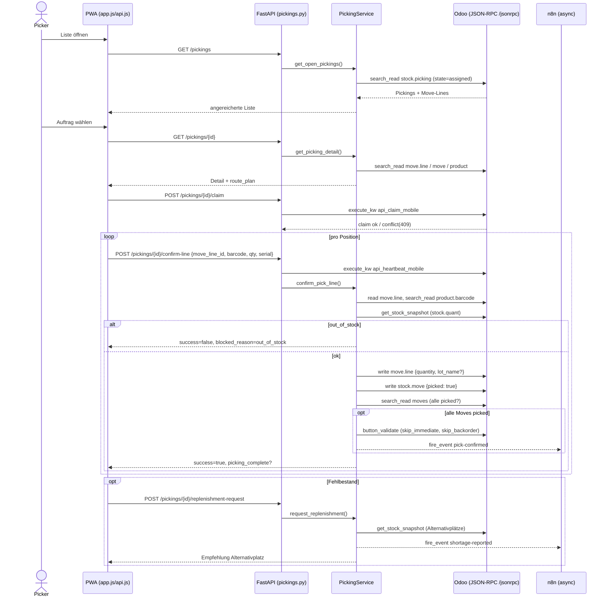

# Einzel-Kommissionierung (Picking)

> [!abstract] Kurzfassung
> Die Einzel-Kommissionierung führt einen Picker durch genau einen Odoo-Lieferauftrag (`stock.picking`): von der Liste offener Aufträge über die Detailansicht mit routenoptimierter Positionsreihenfolge bis zur scan-basierten Bestätigung jeder Position. Wird die letzte Position bestätigt, validiert das Backend den Auftrag in Odoo (`button_validate`) und stößt asynchron einen n8n-Folgeprozess an. Fehlbestand am Lagerplatz blockiert die Bestätigung und ermöglicht eine explizite Nachschubanforderung an einen Alternativplatz.

## 1. Wie es funktioniert

Der fachliche Ablauf folgt der Kette **Liste → Detail → Claim → Position bestätigen → (Fehlbestand/Nachschub)**. Die PWA spricht ausschließlich mit FastAPI; FastAPI spricht ausschließlich über `OdooClient` per JSON-RPC mit Odoo; n8n liegt nur im asynchronen Folgepfad nach Auftragsabschluss bzw. bei Fehlbestand.

1. **Liste laden.** Die PWA ruft `GET /pickings` auf. `PickingService.get_open_pickings()` lädt alle Pickings im Zustand `assigned` und reichert jeden Auftrag mit einer operativen Vorschau an (primärer Artikel, nächster Lagerplatz, Fortschritt, Kit-Name aus `origin`) (`picking_service.py:309`).
2. **Detail öffnen.** `GET /pickings/{id}` → `get_picking_detail()` lädt die `stock.move.line`-Positionen, ergänzt Produkt-Metadaten (Barcode, SKU, Tracking) und berechnet über `build_route_plan()` eine deterministische Pick-Reihenfolge (`picking_service.py:436`, `route_optimizer.py:105`).
3. **Claim setzen.** `POST /pickings/{id}/claim` reserviert den Auftrag für genau einen Picker+Gerät über die Odoo-Methode `api_claim_mobile`. Konkurrierende Claims führen zu HTTP 409 (`pickings.py:169`, `mobile_workflow.py:95`).
4. **Heartbeat halten.** Während der Bearbeitung verlängert die PWA periodisch den Claim per `POST /pickings/{id}/heartbeat` (`api_heartbeat_mobile`). Auch `confirm-line` und `replenishment-request` senden vor der eigentlichen Aktion einen Heartbeat (`pickings.py:296`, `pickings.py:349`).
5. **Position bestätigen.** `POST /pickings/{id}/confirm-line` → `confirm_pick_line()` prüft den gescannten Barcode gegen den erwarteten Produkt-Barcode, prüft den Bestand am Lagerplatz, schreibt Menge (und optional Seriennummer als `lot_name`) auf die Move-Line und setzt `stock.move.picked = True` (`picking_service.py:602`).
6. **Auftrag abschließen.** Sind alle Moves `picked`, ruft das Backend `button_validate` mit dem Kontext `{skip_immediate, skip_backorder}` auf und feuert danach das n8n-Event `pick-confirmed` (`picking_service.py:698`).
7. **Fehlbestand/Nachschub.** Ist am Lagerplatz kein verfügbarer Bestand vorhanden, blockiert `confirm_pick_line` die Bestätigung (`blocked_reason: out_of_stock`). Über `POST /pickings/{id}/replenishment-request` lässt sich an einem Alternativplatz Nachschub anfordern; das Backend feuert dazu das n8n-Event `shortage-reported` (`picking_service.py:657`, `picking_service.py:769`).

## 2. Wie es mit Odoo kommuniziert

Sämtliche Odoo-Kommunikation läuft über `OdooClient` als JSON-RPC an `{odoo_url}/jsonrpc` (`odoo_client.py:50`). Die Authentifizierung erfolgt einmalig per `common.authenticate` mit `odoo_api_key` (Fallback `odoo_password`); die ermittelte `uid` und das Secret werden für alle folgenden `object.execute_kw`-Aufrufe wiederverwendet (`odoo_client.py:57`, `odoo_client.py:70`).

Genutzte `OdooClient`-Methoden in diesem Feature:

- **`search_read(model, domain, fields, limit)`** — lesende Abfragen, z. B. offene Pickings, Produkte, `stock.quant` (`odoo_client.py:78`).
- **`execute_kw(model, method, args, kwargs)`** — für `search_read` mit feingranularen kwargs sowie für die Odoo-Custom-Methoden des Mobile-Workflows (`api_claim_mobile`, `api_heartbeat_mobile`, `api_release_mobile`) und die Idempotenz-Methoden (`odoo_client.py:70`, `mobile_workflow.py:96`).
- **`write(model, ids, vals)`** — Menge und optional `lot_name` auf die Move-Line, `picked: True` auf den Move (`picking_service.py:683`, `picking_service.py:686`).
- **`call_method(model, method, ids, args, context)`** — `button_validate` auf `stock.picking` mit Kontext `{"skip_immediate": True, "skip_backorder": True}` (`odoo_client.py:87`, `picking_service.py:700`).

**Fehlerbehandlung.** JSON-RPC-Fehler werden als `OdooAPIError` geworfen (`odoo_client.py:53`, `odoo_client.py:93`). Der Auftragsabschluss ist als **Best-Effort-Pfad** ausgelegt: scheitert `button_validate` mit `OdooAPIError`, wird `picking_complete = False` gesetzt, die Position bleibt aber als bestätigt erfasst (kein Roll-back der `picked`-Flags) (`picking_service.py:707`).

**Besonderheiten.** Es kommen keine `(6,0,ids)`-Relationsbefehle in diesem Feature zum Einsatz; geschrieben werden ausschließlich skalare Felder (`quantity`, `lot_name`, `picked`). Die Seriennummer wird nur dann als `lot_name` geschrieben, wenn das Produkt `tracking in ("serial", "lot")` ist (`picking_service.py:672`). Der n8n-Folgeprozess ist ebenfalls best-effort: liefert `fire_event` nicht aus (`delivered=False`), gilt der Pick in Odoo trotzdem als erfasst und das Ergebnis wird mit `integration_status: degraded` zurückgegeben (`picking_service.py:741`).

## 3. Was genau zugegriffen wird (Odoo-Zugriff)

| Modell | Felder (R = gelesen / W = geschrieben) | Methoden | Domain/Filter | Zweck |
|---|---|---|---|---|
| `stock.picking` | R: `name`, `origin`, `partner_id`, `scheduled_date`, `state`, `picking_type_id`, `priority`, `move_ids`, `location_id`, `location_dest_id` | `search_read`, `button_validate`, `api_claim_mobile`, `api_heartbeat_mobile`, `api_release_mobile` | Liste: `state = assigned`; Detail: `id = picking_id` | Offene Aufträge laden, Detail laden, Claim-/Heartbeat-/Release-Lebenszyklus, Auftrag validieren |
| `stock.move.line` | R: `id`, `product_id`, `quantity`, `move_id`, `location_id`, `location_dest_id`, `lot_id` · W: `quantity`, `lot_name` | `search_read`, `read`, `write` | `picking_id in/=` bzw. `id = move_line_id` | Positionen laden, bestätigte Menge und Seriennummer schreiben |
| `stock.move` | R: `id`, `product_uom_qty`, `picked` · W: `picked` | `search_read`, `write` | `id in move_ids` bzw. `picking_id = picking_id` | Soll-Menge lesen, Position als erledigt markieren, Vollständigkeit prüfen |
| `product.product` | R: `id`, `default_code`, `barcode`, `tracking`, `product_tmpl_id`, `image_128`..`image_1920` | `search_read` | `id = product_id` / `id in product_ids` / `product_tmpl_id.name in kit_names` | Barcode-Abgleich, SKU/Tracking, Kit-Produktbild, Produktbild-Endpoint |
| `stock.quant` | R: `quantity`, `reserved_quantity`, `location_id` | `search_read` | `product_id = product_id` (limit 50) | Verfügbaren Bestand am Lagerplatz und Alternativplätze ermitteln |
| `res.users` | R: `id`, `name` | `search_read` | `active = True`, `share = False` (`id = user_id` bei Identitäts-Auflösung) | Picker-Auswahl und Identitäts-Validierung |
| `quality.alert.custom` | R: `id`, `create_date` | `search_read` | `picking_id = picking_id`, `ai_evaluation_status = pending` | Hinweis auf ausstehende KI-Qualitätsbewertungen am Auftrag |
| `picking.assistant.idempotency` | (Odoo-seitige Verwaltung) | `api_reserve_request`, `api_finalize_request`, `api_abort_request` | über `Idempotency-Key` | Idempotenz für schreibende Endpunkte (Claim/Heartbeat/Release/Confirm/Replenishment) |

## 4. API-Endpunkte (FastAPI)

| Methode | Pfad | Zweck | Auth/Headers |
|---|---|---|---|
| GET | `/pickings` | Offene Pickings (`state=assigned`) mit Vorschau | `X-Picker-User-Id` (Pflicht) |
| GET | `/pickings/{id}` | Einzelauftrag mit Move-Lines + `route_plan` | `X-Picker-User-Id` (Pflicht) |
| GET | `/pickings/{id}/route-plan` | Nur die optimierte Reihenfolge der offenen Positionen | `X-Picker-User-Id` (Pflicht) |
| POST | `/pickings/{id}/claim` | Auftrag für Picker+Gerät reservieren | `X-Picker-User-Id`, `X-Device-Id`, opt. `Idempotency-Key` |
| POST | `/pickings/{id}/heartbeat` | Aktiven Claim verlängern | `X-Picker-User-Id`, `X-Device-Id`, opt. `Idempotency-Key` |
| POST | `/pickings/{id}/release` | Aktiven Claim freigeben | `X-Picker-User-Id`, `X-Device-Id`, opt. `Idempotency-Key` |
| POST | `/pickings/{id}/confirm-line` | Position per Scan bestätigen (Body: `move_line_id`, `scanned_barcode`, `quantity`, `serial_number`) | `X-Picker-User-Id`, `X-Device-Id`, opt. `Idempotency-Key` |
| POST | `/pickings/{id}/replenishment-request` | Nachschub für out-of-stock-Position anfordern (Body: `move_line_id`, `reason`) | `X-Picker-User-Id`, `X-Device-Id`, opt. `Idempotency-Key` |
| GET | `/pickings/{id}/stock` | Bestand für Produkt+Lagerplatz ("Wie viele noch da?") | `X-Picker-User-Id` (Pflicht) |
| GET | `/products/{id}/image` | Produktbild als Binary in passender Größe | — |
| POST | `/scan/validate` | Schnellvergleich Barcode ↔ Erwartungswert (vor `confirm-line`) | — |

Schreibende Endpunkte erfordern eine vollständige Picker-Identität (`X-Picker-User-Id` **und** `X-Device-Id`); unvollständige Identität führt zu HTTP 400, unbekannter/inaktiver Picker zu HTTP 403, Claim-Konflikte zu HTTP 409 (`pickings.py:51`, `pickings.py:59`, `mobile_workflow.py:42`). Der optionale `Idempotency-Key` wird über `picking.assistant.idempotency` ausgewertet; bei Replay wird die zwischengespeicherte Antwort zurückgegeben (`pickings.py:76`, `mobile_workflow.py:122`).

## 5. PWA-Seite

In `pwa/js/api.js` kapseln dünne Wrapper die Endpunkte: `getPickings`, `getPickingDetail`, `claimPicking`, `heartbeatPicking`, `releasePicking`, `confirmLine`, `getLineStock`, `requestReplenishment` (`api.js:204`–`263`). Lesende Aufrufe setzen `getReadHeaders()` (nur `X-Picker-User-Id`), schreibende `getWriteHeaders()` (zusätzlich `X-Device-Id` und optional `Idempotency-Key`) (`api.js:157`, `api.js:165`).

In `pwa/js/app.js` orchestriert der Detail-Flow den Claim-Lebenszyklus: `loadPickingDetail` claimt den Auftrag und startet per `claimHeartbeatTimer` einen periodischen Heartbeat (`app.js:1498`, `app.js:1778`). `releaseCurrentClaim()` gibt den Claim bei Verlassen der Detailansicht frei — auch beim Seitenwechsel via `keepalive` (`app.js:1519`, `app.js:3167`). Die Positionsbestätigung läuft über `confirmLine(...)` innerhalb `withManagedRequest`, Idempotenz-Keys werden über `buildOperationKey('confirm-line', …)` gebildet (`app.js:2405`, `app.js:2414`).

## 6. Telemetrie & Fehlerverhalten

- **Strukturiertes Event `serial_confirm`.** `confirm_pick_line` emittiert auf **jedem** Exit-Pfad genau ein JSON-Log-Event (`event_type`, `picking_id`, `move_line_id`, `product_id`, `success`, `serial_recorded`, `latency_ms`) — sowohl bei Fehlern (Line fehlt, falscher Barcode, out_of_stock) als auch bei Erfolg. Dadurch bleibt die `success_rate` eine echte Rate über alle Bestätigungsversuche (`picking_service.py:26`, `picking_service.py:761`).
- **Out-of-Stock-Block.** Bei `status == out_of_stock` wird die Bestätigung verweigert; die Antwort enthält `blocked_reason: out_of_stock` und einen `stock_context` mit Alternativplätzen (`picking_service.py:657`).
- **Degradierter n8n-Pfad.** Schlägt `fire_event("pick-confirmed", …)` fehl, bleibt der Pick in Odoo erfasst; die Antwort meldet `integration_status: degraded` samt `correlation_id` (`picking_service.py:741`).
- **Invarianten.** Odoo bleibt System of Record (keine Schattendaten); die PWA spricht nur mit FastAPI; n8n ist reiner asynchroner Orchestrator nach Abschluss/Fehlbestand und nie im Hot-Path; der Auftragsabschluss (`button_validate`) und der n8n-Folgeprozess sind best-effort und blockieren die Erfassung der Einzelposition nicht.
- **KI-Status nicht blockierend.** `_check_pending_quality_ai` darf den Detail-Abruf nie blockieren; Ausnahmen werden geschluckt und `False` zurückgegeben. Pendings älter als 10 Minuten gelten als stale (`picking_service.py:561`).

## 7. Quellen im Code

- `backend/app/services/picking_service.py:309` — `get_open_pickings` (Liste, `state=assigned`)
- `backend/app/services/picking_service.py:436` — `get_picking_detail` (Detail + `route_plan`)
- `backend/app/services/picking_service.py:602` — `confirm_pick_line` (Barcode/Bestand/Schreiben/Validieren)
- `backend/app/services/picking_service.py:698` — `button_validate` + `pick-confirmed`
- `backend/app/services/picking_service.py:769` — `request_replenishment` (`shortage-reported`)
- `backend/app/services/picking_service.py:223` — `get_stock_snapshot` (`stock.quant`)
- `backend/app/routers/pickings.py:140`–`385` — Endpunkte (List/Detail/Claim/Heartbeat/Release/Confirm/Replenishment/Stock)
- `backend/app/services/mobile_workflow.py:95`–`120` — Claim/Heartbeat/Release (`api_*_mobile`)
- `backend/app/services/mobile_workflow.py:122`–`173` — Idempotenz-Reservierung/Finalisierung
- `backend/app/services/route_optimizer.py:105` — `build_route_plan` (zone-first-shortest-walk)
- `backend/app/routers/scan.py:11` — `POST /scan/validate`
- `backend/app/utils/barcode.py:4`–`22` — `validate_ean13`, `normalize_barcode`, `match_barcode`
- `backend/app/services/odoo_client.py:43`–`90` — JSON-RPC, Auth, `search_read`/`write`/`call_method`

## Verwandt

- [[12 - Funktionsdokumentation]] — Übersicht aller Funktionsseiten
- [[00 - Überblick & Datenfluss]]
- [[01 - Odoo-Kommunikation & Zugriffskatalog]]
- [[03 - Cluster- & Batch-Picking]]
- [[05 - Seriennummer-Bestätigung]]
- [[06 - Sprachassistent (STT, Intent, TTS)]]
