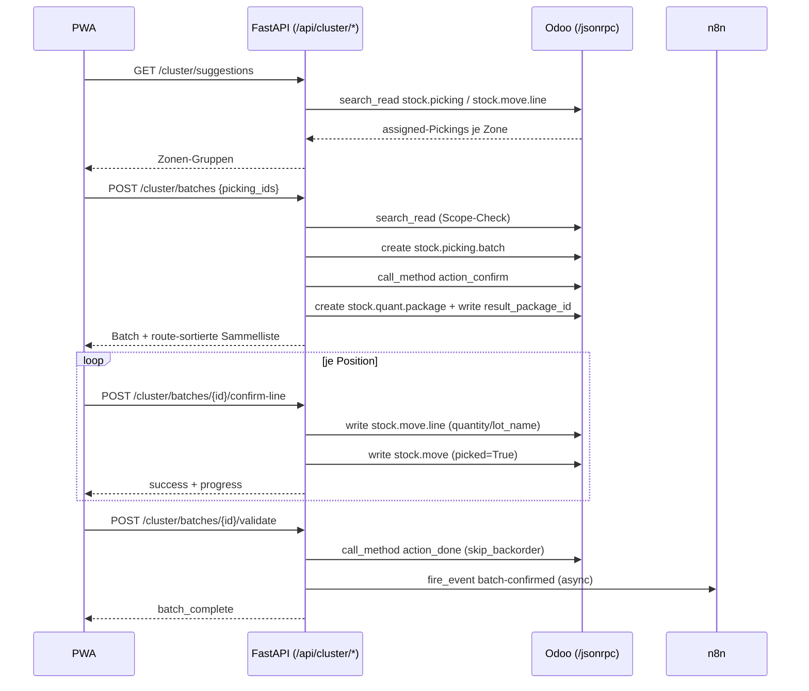

# Cluster- & Batch-Picking

> [!abstract] Kurzfassung
> Cluster-/Batch-Picking bündelt mehrere offene Kommissionieraufträge (`stock.picking`) in einem echten Odoo-`stock.picking.batch` und führt sie als einen einzigen route-sortierten Rundgang aus. Jeder Auftrag erhält eine logische Box (Nummer + Farbe) und ein echtes, wiederverwendbares Ziel-Package (`stock.quant.package`), in das beim Abschluss physisch eingelagert wird. Die Sammelliste mergt alle Move-Lines, sortiert sie nach Laufweg, bestätigt Positionen einzeln ohne Sofort-Validierung und schließt den gesamten Batch erst gesammelt via `action_done` ab.

## 1. Wie es funktioniert

Das Cluster-Picking ist ein eigener Workflow neben dem Einzel-Picking. `picking_service.py` bleibt unberührt; nur die Route-Sortierung wird über `build_route_plan` wiederverwendet (`cluster_service.py:10`, `:25`, `:63`).

Ablauf:

1. **Vorschläge holen** — `suggest_batches` liest alle `assigned`-Pickings ohne Batch und gruppiert sie nach Lagerzone (vorletztes Segment des Location-Pfads). Ergebnis ist eine nach Auftragszahl sortierte Liste von Zonen-Gruppen (`cluster_service.py:88-141`).
2. **Batch anlegen** — `create_batch` validiert die übergebenen `picking_ids` gegen `assigned`/`batch_id = False` (IDOR-/State-Schutz), legt einen echten `stock.picking.batch` an und ruft `action_confirm` (`draft -> in_progress`). Schlägt das Confirm fehl, wird der Draft-Batch kompensierend via `action_cancel` zurückgerollt (`cluster_service.py:143-205`).
3. **Ziel-Packages zuweisen** — `_assign_packages` legt je Picking ein reusable `stock.quant.package` an (Name `CLUSTER-B{box_index}/{picking_name}`) und schreibt es als `result_package_id` auf alle Move-Lines des Pickings (Box N ↔ Order N ↔ 1 Package). Best-Effort: ein Package-Glitch darf den bereits bestätigten Batch nie zerstören (`cluster_service.py:195-238`).
4. **Sammelliste laden** — `get_batch` mergt die Move-Lines aller Pickings, taggt sie mit Box/Farbe/Package, sortiert offene Positionen route-optimiert nach vorne (gepickte ans Ende) und liefert Fortschritt sowie Box-Übersicht (`cluster_service.py:275-377`).
5. **Position bestätigen** — `confirm_cluster_line` schreibt Menge (+ optional Serial/Lot) auf die Move-Line und setzt `picked = True` auf den Move. Hat die Line ein Ziel-Package, ist eine Empfängerkarton-Bestätigung (Put-to-Box) Pflicht: ohne Karton `carton_required`, falscher Karton `wrong_package` — in beiden Fällen wird nichts geschrieben. **Kein** `button_validate` (`cluster_service.py:379-511`).
6. **Batch abschließen** — `validate_batch` schließt den gesamten Batch gesammelt via `action_done` ab (mit `skip_backorder`-Kontext) und feuert danach das n8n-Event `batch-confirmed` (`cluster_service.py:513-582`).

## 2. Wie es mit Odoo kommuniziert

Der gesamte Odoo-Zugriff läuft über `odoo_client.py` per JSON-RPC an `/jsonrpc` (`odoo_client.py:50`). Auth erfolgt über `common.authenticate` mit API-Key bzw. Passwort als Secret-Kandidaten; nachfolgende Aufrufe nutzen `object.execute_kw` mit der erhaltenen `uid` (`odoo_client.py:34-76`).

Genutzte `odoo_client`-Methoden im Cluster-Service:

- **`search_read(model, domain, fields, limit)`** — Pickings, Move-Lines, Moves, Produkte, Batches, Package-Lookups (`odoo_client.py:78`).
- **`create(model, vals)`** — Batch-Anlage und Ziel-Package-Anlage (`odoo_client.py:81`).
- **`write(model, ids, vals)`** — `result_package_id` auf Move-Lines, `quantity`/`lot_name` auf der bestätigten Line, `picked=True` auf dem Move (`odoo_client.py:84`).
- **`call_method(model, method, ids, context=...)`** — `action_confirm`, `action_cancel`, `action_done` (`odoo_client.py:87`).

Besonderheiten:

- **REPLACE-Befehl `(6, 0, ids)`** — `create_batch` setzt `picking_ids: [(6, 0, allowed_ids)]`. Weil das ein vollständiges Ersetzen ist, dürfen ausschließlich die gescopten, validierten IDs in die `vals` (`cluster_service.py:169`).
- **Sequenz statt manuellem Namen** — `name` wird bewusst weggelassen, damit die Odoo-Sequenz `picking.batch` ihn füllt (`cluster_service.py:168`).
- **`action_done`-Kontext** — `validate_batch` übergibt `skip_backorder=True`, `picking_ids_not_to_backorder=member_ids` und `skip_sms=True`, um Rückfrage-Wizards und SMS-Nebeneffekte zu vermeiden (`cluster_service.py:540-547`).
- **Wizard-Erkennung** — gibt `action_done` ein Action-Dict mit `res_model` zurück (offene Rückfrage), wird abgebrochen mit `pending_action` statt blind weiterzumachen (`cluster_service.py:556-563`).
- **Best-Effort-Pfade** — die Package-Zuweisung (`cluster_service.py:199-203`) und der Progress-Read nach erfolgreichem Confirm (`cluster_service.py:502-508`) sind best-effort: sie loggen bei Fehlern, werfen aber kein HTTP 500, damit ein bestätigter Batch bzw. ein erfolgreicher Write nicht nachträglich verloren geht.
- **Fehlerbehandlung** — alle Odoo-Aufrufe lösen bei Problemen `OdooAPIError` aus (`odoo_client.py:93`). Der Service fängt diese gezielt ab, loggt strukturiert und liefert `error`/`success:false` statt der 500er-Propagation (`cluster_service.py:108-111`, `:177-193`, `:487-494`, `:548-553`).

## 3. Was genau zugegriffen wird (Odoo-Zugriff)

| Modell | Felder (R = gelesen / W = geschrieben) | Methoden | Domain/Filter | Zweck |
| --- | --- | --- | --- | --- |
| `stock.picking` | R: `name`, `batch_id`, `company_id` | `search_read` | `[("state","=","assigned"),("batch_id","=",False)]`; bei `create_batch` zusätzlich `("id","in",ids)` | Batch-fähige Aufträge finden, Scope-/IDOR-Check, `company_id` für Batch übernehmen (`cluster_service.py:91-96`, `:152-157`, `:211-215`, `:290-294`) |
| `stock.move.line` | R: `picking_id`, `location_id`, `id`, `product_id`, `quantity`, `move_id`, `result_package_id`; W: `result_package_id`, `quantity`, `lot_name` | `search_read`, `write` | `[("picking_id","in",picking_ids)]`; beim Confirm `[("id","=",move_line_id),("picking_id","=",picking_id),("picking_id.batch_id","=",batch_id),("picking_id.batch_id.user_id","=",requester_id)]` | Sammelliste mergen, Ziel-Package setzen, Menge/Serial bestätigen, kombinierter IDOR-+Ownership-Check (`cluster_service.py:102-107`, `:217-238`, `:297-302`, `:409-421`, `:472-484`) |
| `stock.move` | R: `id`, `product_uom_qty`, `picked`; W: `picked` | `search_read`, `write` | `[("id","in",move_ids)]` | Soll-Menge und Pick-Status der Sammelliste, `picked=True` beim Confirm (`cluster_service.py:304-308`, `:485-486`) |
| `product.product` | R: `id`, `default_code`, `barcode`, `tracking` | `search_read` | `[("id","in",product_ids)]` bzw. `[("id","=",product_id)]` | SKU/Barcode für Anzeige, Barcode-Match, Serial/Lot-Tracking-Prüfung (`cluster_service.py:310-315`, `:436-437`) |
| `stock.picking.batch` | R: `name`, `state`, `picking_ids`, `user_id`; W (indirekt via Methoden) | `create`, `call_method` (`action_confirm`, `action_cancel`, `action_done`), `search_read` | `[("id","=",batch_id)]` | Batch anlegen/bestätigen/abschließen, Ownership-Gate, Sammelliste laden (`cluster_service.py:176-189`, `:277-280`, `:517-547`) |
| `stock.quant.package` | W: `name`, `package_use` | `create` | — | Reusable Ziel-Package je Box/Order anlegen (`cluster_service.py:233-236`) |

## 4. API-Endpunkte (FastAPI)

Alle Endpunkte liegen unter dem Präfix `/cluster` (gemountet als `/api/cluster/*`) und erfordern eine bekannte Picker-Identität über `get_required_picker_identity` (`cluster.py:10`, `:29-94`).

| Methode | Pfad | Zweck | Auth/Headers |
| --- | --- | --- | --- |
| GET | `/cluster/suggestions` | Auto-Vorschläge: offene Pickings nach Zone gruppiert | Picker-Identität (Dependency) |
| POST | `/cluster/batches` | Batch aus `picking_ids` anlegen + bestätigen (`{picking_ids: int[]}`) | Picker-Identität; 400 bei leerer Liste |
| GET | `/cluster/batches/{batch_id}` | Sammelliste + Fortschritt eines Batches | Picker-Identität; 403 bei `forbidden`, 404 bei `error` |
| POST | `/cluster/batches/{batch_id}/confirm-line` | Position bestätigen (Menge/Serial/Karton), ohne Picking-Validierung | Picker-Identität; 403 bei `forbidden` |
| POST | `/cluster/batches/{batch_id}/validate` | Ganzen Batch gesammelt abschließen (`action_done` + n8n) | Picker-Identität; 403 bei `forbidden` |

`confirm-line` akzeptiert den Body `ClusterConfirmRequest` mit `picking_id`, `move_line_id`, `scanned_barcode`, `quantity`, `serial_number`, `scanned_package` (`cluster.py:20-27`). Der Router reicht Fehler-Felder des Service (`forbidden`, `error`, `message`) als passende HTTP-Codes durch, gibt das Service-Resultat sonst direkt zurück.

> [!note] PoC-Hinweis
> Die Cluster-Routes verzichten bewusst auf den Idempotenz-Reservierungs-Flow der Einzel-Picking-Routes. Doppel-Submits entschärft das Frontend per Button-Disable; Owner des Batches ist `batch.user_id` (`cluster.py:3-6`).

## 5. PWA-Seite

Die PWA spricht ausschließlich FastAPI über `pwa/js/api.js` an. Die Cluster-Funktionen liegen im Abschnitt `Cluster-/Batch-Picking` (`api.js:299-323`): `getClusterSuggestions`, `createBatch`, `getBatch`, `confirmClusterLine`, `validateBatch` — jeweils 1:1 auf die fünf Endpunkte gemappt.

In `pwa/js/app.js` startet `enterClusterMode` den Modus, lädt Vorschläge und offene Pickings parallel (`Promise.allSettled`, Vorschläge best-effort) und rendert die Auswahlansicht (`app.js:3229-3256`). Die Toolbar-States `cluster_select` und `cluster_walk` trennen Auswahl vom Rundgang (`app.js:3234`, `:3372`, `:3383`). Für Lines mit Ziel-Package zeigt die Put-to-Box-Bestätigung alle Kartons als Tipp-Auswahl (`cluster-carton-choice`), der Picker bestätigt den richtigen Karton per Tippen (`app.js:2256-2295`). Der Abschluss läuft über `validateBatch` und prüft `batch_complete` (`app.js:3559-3563`). Touch bleibt durchgängig Fallback.

## 6. Telemetrie & Fehlerverhalten

Strukturierte JSON-Log-Events:

- **`cluster_confirm`** (`_emit_cluster_confirm`, `cluster_service.py:584-601`) — pro Confirm-Versuch mit `batch_id`, `picking_id`, `move_line_id`, `product_id`, `success`, `serial_recorded`, `carton_ok`, `latency_ms`. `carton_ok=False` macht die Verwechslungsschutz-Quote (fehlender/falscher Empfängerkarton) messbar.
- **`batch_validate`** (`_emit_batch_validate`, `cluster_service.py:603-616`) — pro Validierungsversuch mit `outcome` aus `{success, wizard, auth_denied, not_found, already_done, odoo_error}`. Invariante: genau ein Event auf jedem Exit-Pfad, damit die Abschluss-Erfolgsrate eine echte Rate über alle Versuche ist.

Fehler- und Sicherheitsverhalten:

- **Fail-closed Ownership-Gate** — `_is_authorized` verweigert ohne bekannten Picker und bei abweichendem Owner (kein fail-open über ownerlose Batches). Greift in `get_batch`, `confirm_cluster_line` und `validate_batch` (`cluster_service.py:259-273`, `:286`, `:403`, `:528`).
- **Idempotenter Doppel-Abschluss** — ist der Batch bereits `done`, liefert `validate_batch` idempotent `batch_complete:True` (`cluster_service.py:534-537`).
- **n8n degraded** — schlägt das `batch-confirmed`-Event fehl, gilt der Batch trotzdem als abgeschlossen; die Antwort meldet `integration_status:"degraded"`. n8n liegt nie im Hot-Path (`cluster_service.py:571-582`, `n8n_webhook.py:61-93`).
- **Kompensation/Best-Effort** — verwaiste Draft-Batches werden via `action_cancel` zurückgerollt; Package-Zuweisung und Progress-Read überleben Teilfehler ohne 500er (`cluster_service.py:186-205`, `:499-508`).

Invarianten: Odoo bleibt System of Record (echter `stock.picking.batch`, kein Schattenzustand); die PWA spricht nur FastAPI; n8n ist reiner async-Orchestrator; Touch ist Fallback.

## 7. Quellen im Code

- `cluster_service.py:88-141` — `suggest_batches` (Zonen-Gruppierung)
- `cluster_service.py:143-205` — `create_batch` (Scope-Check, `(6,0,ids)`, `action_confirm`, Kompensation)
- `cluster_service.py:207-238` — `_assign_packages` (Ziel-Package + `result_package_id`)
- `cluster_service.py:275-377` — `get_batch` (gemergte route-sortierte Sammelliste, Fortschritt, Boxen)
- `cluster_service.py:379-511` — `confirm_cluster_line` (Menge/Serial/Karton-Bestätigung, kein `button_validate`)
- `cluster_service.py:513-582` — `validate_batch` (`action_done`, Wizard-Erkennung, n8n `batch-confirmed`)
- `cluster_service.py:584-616` — Telemetrie `cluster_confirm` / `batch_validate`
- `cluster.py:29-94` — fünf FastAPI-Endpunkte unter `/cluster/*`
- `odoo_client.py:43-90` — JSON-RPC `/jsonrpc`, `search_read`/`create`/`write`/`call_method`
- `api.js:299-323`, `app.js:3199-3563` — PWA-Cluster-Flow

## Verwandt

- [[12 - Funktionsdokumentation]] — Übersicht aller Funktionsseiten
- [[01 - Odoo-Kommunikation & Zugriffskatalog]]
- [[02 - Einzel-Kommissionierung (Picking)]]
- [[04 - Empfängerkarton-Bestätigung (Put-to-Box)]]
- [[05 - Seriennummer-Bestätigung]]
- [[07 - Qualitätsmeldungen & n8n-Orchestrierung]]
- [[Cluster- und Batch-Picking]] — Future-Functions-Designnotiz
