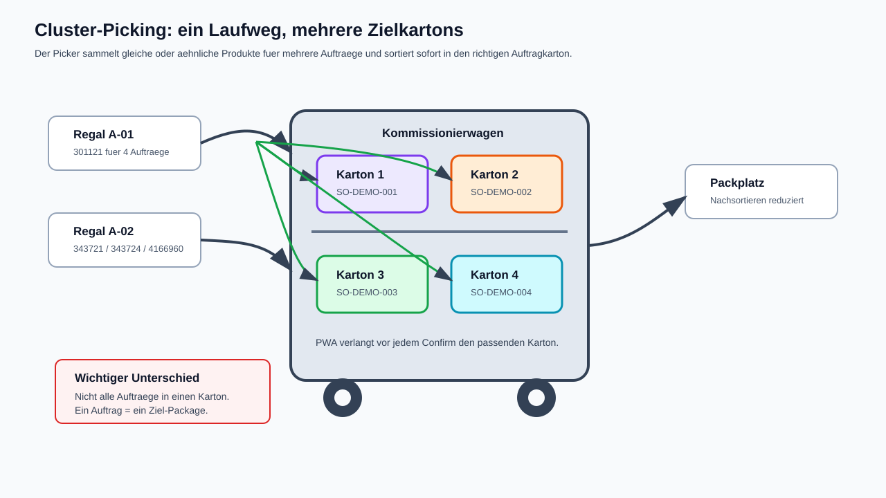
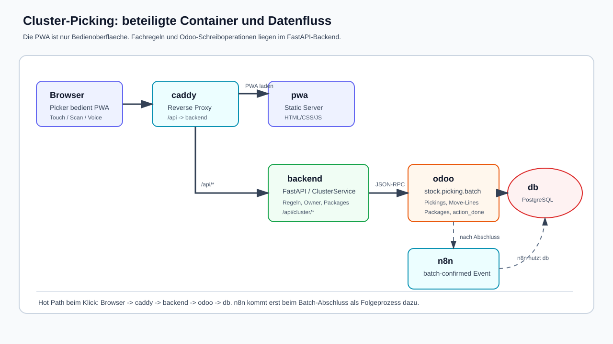
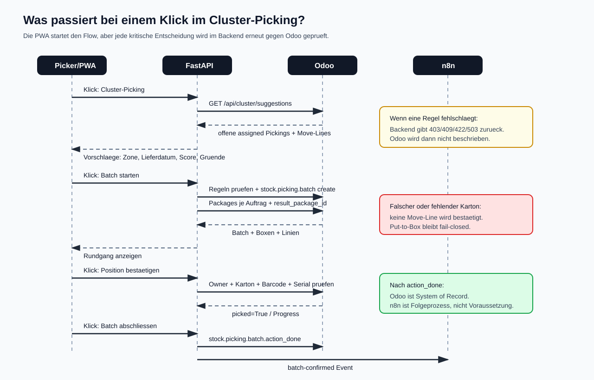

# Cluster- & Batch-Picking

> [!abstract] Kurzfassung
> Cluster-Picking buendelt mehrere offene Odoo-Kommissionierauftraege (`stock.picking`) in einem echten Odoo-`stock.picking.batch`. Der Picker laeuft einmal durch das Lager, sammelt Artikel fuer mehrere Auftraege gleichzeitig und legt sie sofort in den auftragsbezogenen Zielkarton. Das System nutzt Odoo als System of Record, die PWA als Bedienoberflaeche und FastAPI als fachliche Pruef- und Integrationsschicht.

## 1. Professoren-Erklaerung in einem Absatz

Cluster-Picking ist in diesem Projekt kein eigener Schattenprozess neben Odoo, sondern eine mobile Bedienlogik auf Odoos nativen Batch Transfers. Mehrere passende Auslieferauftraege werden zu einem `stock.picking.batch` zusammengefasst. Passend bedeutet hier: gleicher Ausliefertag, gleiche Company, noch nicht gebatcht, ausreichend Produktueberlappung und innerhalb einer Wagenkapazitaet von 2 bis 8 Auftraegen. Jeder Auftrag bekommt einen eigenen Zielkarton als Odoo-Package. Beim Picken muss der Mitarbeiter den korrekten Zielkarton bestaetigen, bevor die Move-Line geschrieben wird. Dadurch werden Laufwege reduziert, ohne die Auftraege am Packplatz neu sortieren zu muessen.

## 2. Was ich konkret umgesetzt habe

Umgesetzt wurde die Haertung des Cluster-Flows in Backend, PWA, Seed-Daten, Tests und Wiki:

- Backend erzwingt Cluster-Kapazitaet: mindestens 2, maximal 8 Auftraege.
- Backend bildet und prueft Cluster-Regeln: gleiche Company, gleicher Ausliefertag, Produktueberlappung, gueltiger Picking-State und kein bestehender Batch.
- Backend arbeitet fail-closed, wenn Odoo kein `batch_id`/`stock.picking.batch` bereitstellt.
- Backend akzeptiert keine ownerlosen Batches mehr. Zugriff erfordert einen bekannten Picker und passenden `batch.user_id`.
- Backend erzeugt pro Auftrag ein Ziel-Package und schreibt es als `result_package_id` auf die Move-Lines.
- Backend blockiert Confirm, wenn ein Zielkarton fehlt oder der falsche Karton bestaetigt wurde.
- PWA zeigt Regeln, Score, Gruende, Kapazitaet und den Hinweis "Wagen: separate Kartons je Auftrag".
- PWA sperrt "Batch starten", wenn die Auswahl fachlich ungueltig ist.
- Picking- und Cluster-API liefern Kundendaten: Kundenname, Versandadresse, Kundenreferenz, Lieferdatum und Carrier-Kontext.
- Seed-Daten erzeugen realistische Demo-Kunden und `SO-DEMO-*`-Auftraege mit Produktueberlappung und Lieferterminen.

Wichtige Commits auf dem Feature-Branch:

- `a3881f8 fix(cluster): enforce capacity and fail-closed ownership`
- `595f78f feat(cluster): score suggestions with delivery and product overlap`
- `8bd8471 fix(cluster): require put-to-box packages`
- `c7eda76 feat(pwa): show cluster rules and capacity`
- `915c8d0 feat(picking): expose customer shipping context`
- `8048683 feat(seed): add customer order cluster demo data`
- `e266092 docs(cluster): record Odoo 19 hardening outcome`

## 3. Wo es im Code liegt

| Bereich | Datei | Aufgabe |
| --- | --- | --- |
| Cluster-Fachlogik | `Mobile Picking und Voice Assistant/backend/app/services/cluster_service.py` | Regeln, Vorschlaege, Batch-Erstellung, Package-Zuweisung, Confirm, Abschluss |
| API-Routen | `Mobile Picking und Voice Assistant/backend/app/routers/cluster.py` | `/api/cluster/*` Endpunkte |
| API-Registrierung | `Mobile Picking und Voice Assistant/backend/app/main.py` | bindet den Cluster-Router unter `/api` ein |
| Dependency Injection | `Mobile Picking und Voice Assistant/backend/app/dependencies.py` | erzeugt `ClusterService`, Odoo-Client, n8n-Client, Picker-Identitaet |
| PWA-API-Client | `Mobile Picking und Voice Assistant/pwa/js/api.js` | JavaScript-Funktionen fuer Cluster-Endpunkte |
| PWA-Oberflaeche | `Mobile Picking und Voice Assistant/pwa/js/app.js` | Auswahl, Rundgang, Karton-Dialog, Abschluss |
| PWA-Styling | `Mobile Picking und Voice Assistant/pwa/css/app.css` | Regel-Chips, Kapazitaet, Cluster-Ansichten |
| Kundendaten im Einzel-Picking | `Mobile Picking und Voice Assistant/backend/app/services/picking_service.py` | Versandkontext fuer offene Pickings und Details |
| Demo-Daten | `Mobile Picking und Voice Assistant/infrastructure/scripts/seed-odoo.py` | Demo-Kunden, Demo-Produkte, Demo-Auftraege |
| Backend-Tests | `Mobile Picking und Voice Assistant/backend/tests/test_cluster_service.py` | Regeln, Fehlerfaelle, Packages, Ownership |
| Route-Tests | `Mobile Picking und Voice Assistant/backend/tests/test_cluster_routes.py` | HTTP-Codes fuer API-Fehler |
| PWA-Tests | `Mobile Picking und Voice Assistant/e2e/cluster.spec.js` | Auswahl, Regeln, Kartonpflicht, Flow |

## 4. Architektur und Container

Der Browser spricht nicht direkt mit Odoo. Die PWA ruft ausschliesslich FastAPI-Endpunkte unter `/api` auf. Der Reverse Proxy `caddy` verteilt die Requests:

- `/api/*` geht an den Container `backend`.
- Alle PWA-Dateien gehen an den Container `pwa`.
- Odoo bleibt im Container `odoo` oder optional `odoo19-trial`.
- Odoo speichert in `db` bzw. PostgreSQL.
- `n8n` wird erst nach erfolgreichem Batch-Abschluss als Folgeprozess angesprochen.

Beim normalen Cluster-Klick werden diese Container direkt beansprucht:

1. `caddy`: nimmt den HTTPS/HTTP-Request entgegen und routet.
2. `pwa`: liefert HTML/CSS/JS fuer die Bedienoberflaeche.
3. `backend`: prueft Regeln und spricht Odoo.
4. `odoo` oder `odoo19-trial`: verwaltet Pickings, Batches, Move-Lines und Packages.
5. `db`: PostgreSQL fuer Odoo-Daten.
6. `n8n`: nur beim Abschluss, nicht beim Start oder Zeilen-Confirm.

Nicht direkt im Cluster-Hot-Path:

- `whisper`: Spracheingabe.
- `piper`: Sprachausgabe.
- `ollama`: lokale LLM-Funktionen.

Wichtige Setup-Stellen:

- `docker-compose.yml`: Services `caddy`, `db`, `odoo`, `odoo19-trial`, `backend`, `n8n`, `pwa`.
- `infrastructure/caddy/Caddyfile`: `/api/*` wird an `backend:8000` weitergeleitet, alles andere an `pwa:80`.
- Backend-Umgebung: `ODOO_URL`, `ODOO_DB`, `ODOO_USER`, `ODOO_API_KEY`, `ODOO_INSTANCES_JSON`, `N8N_WEBHOOK_BASE`.

## 5. API-Verbindung zwischen PWA und Backend

Die PWA nutzt in `pwa/js/api.js` genau diese Cluster-Funktionen:

| PWA-Funktion | HTTP-Endpunkt | Bedeutung |
| --- | --- | --- |
| `getClusterSuggestions()` | `GET /api/cluster/suggestions` | fachliche Batch-Vorschlaege laden |
| `createBatch(pickingIds)` | `POST /api/cluster/batches` | echten Odoo-Batch anlegen |
| `getBatch(batchId)` | `GET /api/cluster/batches/{batch_id}` | Rundgang und Fortschritt laden |
| `confirmClusterLine(batchId, data)` | `POST /api/cluster/batches/{batch_id}/confirm-line` | eine Position bestaetigen |
| `validateBatch(batchId)` | `POST /api/cluster/batches/{batch_id}/validate` | ganzen Batch abschliessen |

Im Backend liegen diese Routen in `backend/app/routers/cluster.py`.

Jeder Request erfordert eine Picker-Identitaet ueber `X-Picker-User-Id`. Diese wird in `dependencies.py` aufgeloest. Dadurch weiss das Backend, welcher Odoo-User den Batch besitzt oder bedienen darf.

## 6. Was passiert bei einem Klick?

### 6.1 Klick auf "Mehrere Auftraege buendeln"

1. PWA ruft `enterClusterMode()` auf.
2. PWA stellt sicher, dass ein Picker ausgewaehlt ist.
3. PWA ruft parallel:
   - `GET /api/cluster/suggestions`
   - offene Pickings ueber den bestehenden Picking-Flow
4. Backend `cluster_suggestions()` ruft `ClusterService.suggest_batches()`.
5. Backend liest aus Odoo:
   - `stock.picking` mit `state = assigned` und `batch_id = False`
   - `stock.move.line` fuer Produkt- und Lagerortdaten
6. Backend baut Kandidaten:
   - Picking-ID
   - Company
   - Ausliefertag
   - primaere Lagerzone
   - Produktmenge/Produkt-IDs
7. Backend gruppiert nach `(delivery_date, primary_zone)`.
8. Backend bewertet die Gruppe mit Score, Gruenden und Warnungen.
9. PWA zeigt Vorschlaege, offene Auftraege, Kapazitaet und Regel-Chips.

### 6.2 Klick auf "Vorschlag uebernehmen"

1. PWA nimmt die vorgeschlagenen `picking_ids`.
2. PWA speichert sie lokal in `clusterSelected`.
3. PWA berechnet lokal die Kapazitaetsregel.
4. Button "Batch starten" bleibt deaktiviert, wenn weniger als 2 oder mehr als 8 Auftraege ausgewaehlt sind.

Wichtig: Die PWA-Regel ist nur UX. Die verbindliche Regel liegt im Backend.

### 6.3 Klick auf "Batch starten"

1. PWA ruft `createBatch(ids)`.
2. Backend prueft zuerst Kapazitaet.
3. Backend fragt Odoo erneut:
   - Existieren diese Pickings?
   - Sind sie `assigned`?
   - Haben sie `batch_id = False`?
4. Backend verwirft IDs, die nicht in den erlaubten Scope passen.
5. Backend prueft fachliche Regeln:
   - gleiche Company
   - gleicher Ausliefertag
   - Produktueberlappung
   - gueltige Kapazitaet
6. Backend erstellt `stock.picking.batch` mit `picking_ids: [(6, 0, allowed_ids)]`.
7. Backend setzt `company_id`.
8. Backend setzt `user_id` auf den Picker.
9. Backend erstellt je Picking ein Ziel-Package.
10. Backend schreibt `result_package_id` auf alle Move-Lines dieses Pickings.
11. Backend ruft Odoo `stock.picking.batch.action_confirm`.
12. Backend laedt den fertigen Batch ueber `get_batch()`.
13. PWA zeigt den Cluster-Rundgang.

Wenn ein Schritt beim Package-Anlegen fehlschlaegt, wird der Batch abgebrochen und nicht als halbgueltiger Cluster weitergegeben. Wenn `action_confirm` fehlschlaegt, versucht das Backend kompensierend `action_cancel`.

### 6.4 Klick auf eine Position "Bestaetigen"

1. PWA ermittelt die erwartete Zielbox aus der Line oder aus `batch.boxes`.
2. Wenn kein Package vorhanden ist, stoppt die PWA sofort.
3. PWA oeffnet den Empfaengerkarton-Dialog.
4. Picker bestaetigt den richtigen Karton per Tippen oder Scan.
5. Bei falschem Karton bleibt der Dialog offen und es wird kein Backend-Confirm gesendet.
6. Falls der Artikel serien- oder chargengefuehrt ist, fragt die PWA Seriennummer oder Charge ab.
7. PWA ruft `confirmClusterLine()`.
8. Backend prueft mit einer einzigen Odoo-Domain:
   - Move-Line-ID stimmt.
   - Move-Line gehoert zum Picking.
   - Picking gehoert zum Batch.
   - Batch gehoert zum Picker.
9. Backend prueft optional Barcode.
10. Backend prueft Zielkarton gegen `result_package_id`.
11. Backend prueft Serial/Lot-Regeln.
12. Backend schreibt erst danach:
   - `quantity`
   - `picked = True`
   - ggf. Serial/Lot-Werte
13. Backend liefert Fortschritt.
14. PWA laedt den Batch neu und rendert den Fortschritt.

### 6.5 Klick auf "Batch abschliessen"

1. Button ist erst aktiv, wenn alle Lines gepickt sind.
2. PWA ruft `validateBatch(batch_id)`.
3. Backend liest `stock.picking.batch`.
4. Backend prueft Owner erneut.
5. Wenn Batch schon `done` ist, antwortet Backend idempotent mit Erfolg.
6. Backend ruft Odoo `stock.picking.batch.action_done`.
7. Backend setzt Kontext:
   - `skip_backorder = True`
   - `picking_ids_not_to_backorder = member_ids`
   - `skip_sms = True`
8. Falls Odoo einen Wizard zurueckgibt, meldet Backend `pending_action`.
9. Bei Erfolg feuert Backend ein n8n-Event `batch-confirmed`.
10. PWA zeigt den Abschluss.

## 7. Cluster-Regeln im Detail

| Regel | Warum sie existiert | Wo sie greift |
| --- | --- | --- |
| Mindestens 2 Auftraege | Ein einzelner Auftrag ist kein Cluster. | PWA und Backend |
| Maximal 8 Auftraege | Wagenkapazitaet und Bedienbarkeit begrenzen. | PWA und Backend |
| Empfehlung 4 bis 8 | Unter 4 ist der Nutzen kleiner, aber technisch gueltig. | PWA-Hinweis |
| `state = assigned` | Nur kommissionierbereite Pickings sollen gestartet werden. | Backend |
| `batch_id = False` | Bereits gebatchte Pickings duerfen nicht doppelt zugeordnet werden. | Backend |
| gleiche Company | Odoo-Batches sollen nicht company-uebergreifend mischen. | Backend |
| gleicher Ausliefertag | Cluster soll logistisches Zeitfenster respektieren. | Backend |
| Produktueberlappung | Cluster lohnt sich vor allem bei aehnlichen Auftraegen. | Backend |
| gleicher Picker-Owner | Schutz vor fremdem Lesen/Schreiben. | Backend |
| Zielkarton erforderlich | Put-to-Box muss real sein, nicht nur UI-Farbe. | PWA und Backend |

Fehlercodes:

- `cluster_capacity`: weniger als 2 oder mehr als 8 Auftraege.
- `stock_picking_batch_unavailable`: Odoo-Instanz kann Cluster nicht sicher abbilden.
- `mixed_company`: mehrere Companies in einer Auswahl.
- `mixed_delivery_date`: mehrere Ausliefertage in einer Auswahl.
- `no_product_overlap`: keine gemeinsamen Produkt-IDs.
- `package_assignment_failed`: Zielkartons konnten nicht angelegt werden.

## 8. Wie der Score entsteht

Der Score ist kein KI-Modell und kein Optimierungsalgorithmus. Er ist eine transparente Heuristik:

- Keine harten Fehler: plus 40.
- Ein gemeinsamer Ausliefertag: plus 20.
- Eine gemeinsame Lagerzone: plus 20.
- Produktueberlappung: bis plus 20, je gemeinsames Produkt plus 5.

Maximal sind 100 Punkte moeglich. Die PWA zeigt Score und Gruende an, zum Beispiel:

- `Zone Links`
- `Ausliefertag 2026-07-09`
- `2 gemeinsame Produkte`

Das ist professorentauglich, weil die Bewertung nachvollziehbar ist. Es ist keine Black Box.

## 9. Warum Odoo System of Record bleibt

Es gibt keine eigene Batch-Datenbank im Backend. Das Backend speichert keinen Schatten-Batch. Entscheidend sind Odoo-Objekte:

- `stock.picking`: einzelne Ausliefer- oder Kommissionierauftraege.
- `stock.move.line`: konkrete Pick-Zeilen.
- `stock.picking.batch`: echter Odoo-Batch.
- `stock.package` in Odoo 19 oder `stock.quant.package` in Odoo 18: Zielkarton.
- `result_package_id`: Verbindung zwischen Move-Line und Zielkarton.

Der Vorteil: Wenn die PWA geschlossen wird, bleibt der operative Zustand in Odoo erhalten. Der Batch kann wieder geladen werden.

## 10. Kundendaten und Demo-Daten

Damit Cluster nicht wie reine Technik wirkt, wurden Demo-Auftraege realistischer gemacht:

- `ACME Demo GmbH`
- `Meyer Spielwaren KG`
- `Fischer Techniklabor AG`
- `FH Demo Logistik`

Die Seed-Daten erzeugen:

- Kunden mit Lieferadresse, E-Mail und Telefon.
- Demo-Produkte mit echten Produktcodes aus der Projektwelt.
- Sechs `SO-DEMO-*`-Auftraege.
- Vier Auftraege am `2026-07-09` mit Produktueberlappung.
- Zwei Auftraege am `2026-07-10` mit anderer Produktgruppe.

Dadurch kann man im Demo-System zeigen, warum ein Cluster vorgeschlagen wird: gleicher Tag, gleiche Zone, gemeinsame Produkte.

## 11. Selbstbefragung: kritisch hinterfragt

### Frage: Ist das wirklich Cluster-Picking oder nur Batch-Picking?

Antwort: Es ist Cluster-Picking, weil jeder Auftrag einen eigenen Zielkarton bekommt und beim Pick direkt in diesen Karton sortiert wird. Reines Batch-Picking wuerde mehrere Auftraege gemeinsam sammeln und spaeter am Packplatz sortieren. Hier verhindert `result_package_id`, dass alles in einer Sammelkiste landet.

### Frage: Warum reicht eine farbige UI-Box nicht aus?

Antwort: Eine UI-Farbe ist nur Darstellung. Operativ zaehlt, ob Odoo weiss, in welches Package die Ware gehoert. Deshalb legt das Backend pro Auftrag ein echtes Package an und schreibt es auf die Move-Lines.

### Frage: Was passiert, wenn die PWA manipuliert wird und fremde IDs sendet?

Antwort: Das Backend vertraut der PWA nicht. `create_batch` fragt Odoo erneut mit `state = assigned` und `batch_id = False`. `confirm_cluster_line` prueft in der Domain, dass Move-Line, Picking, Batch und Picker zusammenpassen.

### Frage: Warum mindestens 2 Auftraege?

Antwort: Ein Auftrag allein hat keinen Cluster-Nutzen. Der Prozess wuerde dann nur Overhead erzeugen. Deshalb blockiert PWA und Backend die Auswahl.

### Frage: Warum maximal 8 Auftraege?

Antwort: Die Grenze modelliert die Wagenkapazitaet und die Bedienbarkeit. Mehr Auftraege bedeuten mehr Kartons, hoeheres Verwechslungsrisiko und schlechtere mobile Uebersicht.

### Frage: Warum gleicher Ausliefertag?

Antwort: Clusterbildung darf keine logistische Prioritaet zerstoeren. Wenn ein Auftrag heute raus muss und ein anderer morgen, sollte das System sie nicht automatisch zusammenwerfen.

### Frage: Warum Produktueberlappung?

Antwort: Cluster-Picking lohnt sich besonders, wenn mehrere Auftraege aehnliche Artikel enthalten. Dann reduziert ein Gang zu einem Lagerort mehrere Einzelgaenge.

### Frage: Was passiert, wenn Odoo `batch_id` nicht kennt?

Antwort: Dann ist Cluster-Picking in dieser Instanz nicht sicher. Das Backend liefert fail-closed `stock_picking_batch_unavailable`, statt blind Pickings zu buendeln.

### Frage: Was passiert, wenn ein Zielkarton fehlt?

Antwort: Die PWA stoppt vor dem Confirm. Falls trotzdem ein Request beim Backend ankommt, blockiert das Backend ebenfalls mit `missing_package`.

### Frage: Was passiert, wenn n8n ausfaellt?

Antwort: Der Batch bleibt abgeschlossen, weil Odoo der fuehrende operative Zustand ist. Das Backend meldet `integration_status = degraded`. n8n ist Folgeprozess, nicht Voraussetzung fuer den Lagerabschluss.

### Frage: Kann man damit Labels drucken?

Antwort: Noch nicht als Teil dieser Umsetzung. Die Datenbasis ist vorbereitet: Kundendaten, Lieferadresse, Kundenreferenz, Delivery-Date und Package-Kontext werden geliefert. Der eigentliche Versandlabel-Druck ist bewusst Restgrenze.

### Frage: Ist das eine KI-Entscheidung?

Antwort: Nein. Die Cluster-Auswahl ist eine nachvollziehbare Heuristik. Das ist fuer eine Bachelorarbeit vorteilhaft, weil jede Regel erklaerbar und testbar bleibt.

## 12. Fehlerverhalten

Das System ist an kritischen Stellen fail-closed:

- Keine Picker-Identitaet: kein Zugriff.
- Ownerloser Batch: kein Zugriff.
- Falscher Picker: kein Zugriff.
- Fehlendes Batch-Modell: kein Cluster.
- Ungueltige Auswahl: kein Odoo-Write.
- Fehlender Zielkarton: kein Confirm.
- Falscher Zielkarton: kein Confirm.
- Odoo-Wizard beim Abschluss: PWA meldet Eskalation statt blind weiterzumachen.

Bewusst nicht fail-closed:

- n8n nach Batch-Abschluss. Wenn Odoo abgeschlossen ist, darf n8n-Ausfall den Lagerabschluss nicht rueckgaengig machen.

## 13. Tests und Verifikation

Frisch verifiziert am 2026-07-08:

- Backend-Zieltests: `99 passed`
- PWA-Cluster-Playwright: `6 passed`
- Grep-Pruefung der neuen Fehlercodes und UI-Hinweise erfolgreich

Relevante Testabdeckung:

- Kapazitaet zu klein/zu gross.
- Mixed Company.
- Unterschiedliche Lieferdaten.
- Keine Produktueberlappung.
- `batch_id` fehlt in Odoo.
- Ownerless oder fremder Batch.
- Package-Anlage und `result_package_id`.
- Fehlender Zielkarton blockiert Confirm.
- Falscher Karton blockiert Confirm.
- PWA sperrt Einzelauftrag.
- PWA zeigt Gruende wie Ausliefertag und gemeinsame Produkte.

## 14. Wie ich es im Vortrag erklaeren wuerde

1. "Wir haben im Lager mehrere Kundenauftraege, die sich aehneln."
2. "Statt jeden Auftrag einzeln zu laufen, buendeln wir passende Auftraege in Odoo als Batch."
3. "Der Wagen hat mehrere Kartons, pro Auftrag einen."
4. "Die PWA zeigt dem Picker einen gemeinsamen Laufweg."
5. "Bei jedem Artikel fragt die PWA: In welchen Karton gehoert das?"
6. "Das Backend prueft den Karton gegen Odoo, nicht nur gegen die Oberflaeche."
7. "Erst wenn Auftrag, Batch, Picker, Artikel und Karton zusammenpassen, wird die Move-Line bestaetigt."
8. "Am Ende wird der echte Odoo-Batch abgeschlossen."

Kernsatz:

> Wir reduzieren Laufwege durch Buendelung, behalten aber Auftragstrennung durch Put-to-Box bei.

## 15. Restgrenzen

- Versandlabel-Druck ist vorbereitet, aber noch nicht implementiert.
- Die Scoring-Regel ist bewusst heuristisch, kein mathematischer Optimierer.
- Route-Optimierung nutzt den vorhandenen `build_route_plan`, aber keine physische Karten-/Distanzmatrix.
- Odoo-Wizards beim Abschluss werden erkannt, aber nicht mobil geloest.

## 16. Verwandt

- [[00 - Überblick & Datenfluss]]
- [[01 - Odoo-Kommunikation & Zugriffskatalog]]
- [[02 - Einzel-Kommissionierung (Picking)]]
- [[04 - Empfängerkarton-Bestätigung (Put-to-Box)]]
- [[05 - Seriennummer-Bestätigung]]
- [[07 - Qualitätsmeldungen & n8n-Orchestrierung]]
- [[10 - Cluster-Picking Odoo-19 Audit und Haertungsplan]]
- [[Cluster- und Batch-Picking]]
