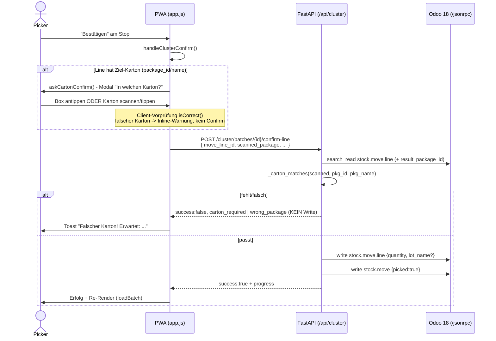

# Empfängerkarton-Bestätigung (Put-to-Box)

> [!abstract] Kurzfassung
> Beim Cluster-Picking landet jede Auftragsposition in einem definierten Empfängerkarton (Box N ↔ Auftrag N ↔ ein `stock.quant.package`). Bevor eine Position bestätigt werden darf, muss der Picker den **richtigen** Karton ausweisen — per Antippen der Box-Kachel oder per Scan/Eingabe der Karton-Referenz. Der tatsächlich gescannte/getippte Token wird serverseitig gegen das hinterlegte Ziel-Package re-validiert; bei fehlender oder falscher Bestätigung wird **nichts** in Odoo geschrieben (Verwechslungsschutz, Akzeptanzkriterien #3 + #4).

## 1. Wie es funktioniert

Das Cluster-Picking weist jedem Picking im Batch eine logische Box-Nummer/-Farbe **und** ein echtes, wiederverwendbares `stock.quant.package` zu, das als `result_package_id` auf allen Move-Lines des Pickings gesetzt wird (siehe `_assign_packages`, `cluster_service.py:207`). Damit besitzt jede Sammelliste-Zeile eine eindeutige Ziel-Karton-Referenz.

Ablauf einer Positionsbestätigung in der Cluster-Walk-Ansicht:

1. Der Picker tippt an einem Stop auf „Bestätigen" → `handleClusterConfirm(batch, line, btn)` startet (`app.js:3493`). Der Button wird sofort deaktiviert (Doppel-Tap-Schutz).
2. Hat die Position einen Ziel-Karton (`line.package_id` **oder** `line.package_name`), öffnet `askCartonConfirm(line, batch.boxes)` das Modal „In welchen Karton?" (`app.js:3508`, `app.js:2261`).
3. Das Modal zeigt **alle** Kartons des Batches als Kacheln (Box-Index, Farbe, Auftrag, Package-Name) plus ein Texteingabefeld „Karton scannen oder eingeben". Der empfohlene Karton wird als Hinweis genannt.
4. **Scan-oder-Tippen:** Der Picker bestätigt entweder durch Antippen der richtigen Box-Kachel oder durch Scannen/Eintippen der Karton-Referenz (Package-Name oder Package-ID). Ein **falscher** Karton erzeugt eine Inline-Warnung; das Modal bleibt offen, es wird kein Confirm ausgelöst (`app.js:2342`, `app.js:2358`). Abbruch (`Abbrechen`/`Escape`/Klick außerhalb) löst mit `''` auf → kein Confirm.
5. Der vom UI ausgewählte **tatsächliche** Token wird an `confirmClusterLine(...)` als `scanned_package` mitgesendet (`app.js:3530`) — bewusst **nicht** die vorgewaschene Soll-Referenz, damit die Server-Prüfung echt re-validiert (Defense-in-depth, Kommentar `app.js:2336`).
6. Das Backend re-prüft serverseitig: Die Move-Line wird per IDOR-/Ownership-Domain gelesen, ihr `result_package_id` ausgelesen. Fehlt `scanned_package` → `carton_required`; passt der Token nicht (`_carton_matches`) → `wrong_package`; in **beiden** Fällen kein Write (`cluster_service.py:452`–`469`).
7. Erst wenn der Karton passt, schreibt Odoo die Menge (+ optional Serial/Lot) und setzt `picked=True` auf den Move (`cluster_service.py:484`–`486`). Anschließend wird der frische Fortschritt geladen und die Ansicht neu gerendert (`app.js:3545`).

> [!note] PoC-Grenze
> `stock.quant.package` besitzt in Odoo 18 Community **kein** `barcode`-Feld. Als scanbarer Identifier dient deshalb der **Package-Name** (`name`, z. B. `CLUSTER-B1/WH/OUT/00012`, gesetzt in `_assign_packages`, `cluster_service.py:235`). Alternativ akzeptiert die Prüfung die Package-**ID** als String — z. B. wenn die PWA per Tippen die ID sendet (`_carton_matches`, `cluster_service.py:246`).

## 2. Wie es mit Odoo kommuniziert

Der Backend spricht Odoo ausschließlich über `odoo_client.py` per JSON-RPC an `POST {url}/jsonrpc` (`odoo_client.py:50`). Die Authentifizierung erfolgt fail-fast über einen **API-Key** (`settings.odoo_api_key`, mit `odoo_password` als Fallback) gegen den `common.authenticate`-Service; die ermittelte `uid` und das Secret werden für nachfolgende `object.execute_kw`-Aufrufe wiederverwendet (`odoo_client.py:57`–`76`).

Für die Empfängerkarton-Bestätigung genutzte `odoo_client`-Methoden:

- **`search_read`** — Move-Line inkl. `result_package_id` lesen (in `confirm_cluster_line`, `cluster_service.py:415`); Produkt-Barcode/Tracking nur bei Bedarf (`cluster_service.py:436`).
- **`write`** — Menge/Lot auf `stock.move.line` und `picked` auf `stock.move` schreiben (`cluster_service.py:484`/`486`); in `_assign_packages` das `result_package_id` setzen (`cluster_service.py:237`).
- **`create`** — je Picking ein `stock.quant.package` anlegen (`cluster_service.py:233`).

**Besonderheiten:**
- Die Ziel-Packages werden beim Batch-Aufbau einmalig erzeugt; die Karton-Zuweisung ist ein **Best-Effort-Pfad**: ein Package-Glitch darf den bereits bestätigten Batch nicht zerstören (kein `raise`, nur Logging — `cluster_service.py:200`–`203`).
- **Fehlerbehandlung:** `OdooAPIError` aus `odoo_client` wird in `confirm_cluster_line` abgefangen; statt eines HTTP-500 gibt es Fehler-Telemetrie + `success:false` mit klarer Meldung (`cluster_service.py:487`–`494`). Der nachgelagerte Progress-Read ist ebenfalls Best-Effort (`cluster_service.py:502`–`508`).
- Die `(6,0,ids)`- und `action_done`-Kontext-Besonderheiten betreffen die Batch-Anlage bzw. den Batch-Abschluss und sind in den zugehörigen Funktionsdokus beschrieben (`create_batch` / `validate_batch`).

## 3. Was genau zugegriffen wird (Odoo-Zugriff)

| Modell | Felder (R gelesen / W geschrieben) | Methoden | Domain/Filter | Zweck |
|---|---|---|---|---|
| `stock.move.line` | R: `id`, `product_id`, `quantity`, `move_id`, `location_id`, `result_package_id` · W: `quantity`, `lot_name` (`cluster_service.py:472`,`477`), `result_package_id` (im Aufbau) | `search_read`, `write` | `id = move_line_id` **und** `picking_id = picking_id` **und** `picking_id.batch_id = batch_id` **und** `picking_id.batch_id.user_id = requester_id` (`cluster_service.py:409`–`414`) | Ziel-Karton (`result_package_id`) lesen; nach bestandener Prüfung Menge/Serial schreiben |
| `stock.move` | R: `id`, `product_uom_qty`, `picked` · W: `picked` | `search_read`, `write` | `id = move_id` | `picked = True` markieren (Fortschritt) |
| `product.product` | R: `barcode`, `tracking` | `search_read` | `id = product_id` | Artikel-/Tracking-Prüfung (nur wenn Barcode oder Serial übergeben, `cluster_service.py:435`) |
| `stock.quant.package` | W: `name`, `package_use` (`cluster_service.py:235`) | `create` | — | Empfängerkarton anlegen; **`name`** ist der scanbare Identifier (kein `barcode`-Feld vorhanden) |
| `stock.picking` | R: `name` | `search_read` | `id in allowed_ids` | Karton-Namen `CLUSTER-B{n}/{picking_name}` bilden (`_assign_packages`) |

## 4. API-Endpunkte (FastAPI)

Alle Endpunkte hängen unter dem globalen Prefix `/api` (`main.py:24`). Die Karton-Bestätigung hat **keinen eigenen** Endpunkt — sie ist Teil der Positionsbestätigung im Cluster-Picking.

| Methode | Pfad | Zweck | Auth/Headers |
|---|---|---|---|
| POST | `/api/cluster/batches/{batch_id}/confirm-line` | Position bestätigen; trägt `scanned_package` im Body, der serverseitig gegen `result_package_id` geprüft wird (`cluster.py:65`) | `X-Picker-User-Id` (Pflicht via `get_required_picker_identity`), `Idempotency-Key`, `X-Device-Id` (`getWriteHeaders`, `api.js:157`) |
| GET | `/api/cluster/batches/{batch_id}` | Sammelliste inkl. `boxes[]` (mit `package_id`/`package_name`) und `lines[]` (mit `package_id`/`package_name`) — liefert dem Frontend die Karton-Auswahl (`cluster.py:50`) | `X-Picker-User-Id` (`getReadHeaders`) |

Request-Body-Schema `ClusterConfirmRequest` (`cluster.py:20`): `picking_id:int`, `move_line_id:int`, `scanned_barcode:str=""`, `quantity:float=0`, `serial_number:str=""`, **`scanned_package:str=""`**.

Rückgabe-Signale bei Karton-Problemen: `{"success": false, "carton_required": true, "expected_package_name": ...}` bzw. `{"success": false, "wrong_package": true, "expected_package_name": ...}` (`cluster_service.py:458`,`466`).

## 5. PWA-Seite

In `pwa/js/app.js`:
- **`askCartonConfirm(line, boxes)`** (`app.js:2261`) — baut das Modal „In welchen Karton?": Box-Kacheln (`data-carton-pick`), Texteingabe (Scan/Tippen), Inline-Warnung. Die Client-Vorprüfung `isCorrect(value)` akzeptiert nur Package-Name oder Package-ID — **deckungsgleich** mit der Server-Prüfung, um keine loseres UI-Gate (z. B. Box-Index) zuzulassen (`app.js:2313`). Gibt den tatsächlich bestätigten Token zurück, nicht die Soll-Referenz (`app.js:2336`).
- **`handleClusterConfirm(batch, line, btn)`** (`app.js:3493`) — orchestriert: Karton-Prompt (nur bei Ziel-Karton), optional Serial-Prompt, dann `confirmClusterLine(...)` mit `scanned_package`. Bei `!result.success` Fehler-Feedback + Toast + Button-Reaktivierung; bei Erfolg `loadBatch(...)`.
- Lebenszyklus: `cartonPromptActive`/`cartonPromptCleanup` (`app.js:371`–`372`) sorgen dafür, dass ein extern geschlossenes Overlay den offenen Prompt sauber als „Abbrechen" auflöst (`closeOverlay`, `app.js:824`).

In `pwa/js/api.js`: **`confirmClusterLine(batchId, data, options)`** sendet `POST /cluster/batches/{batchId}/confirm-line` mit Write-Headern (`api.js:316`).

## 6. Telemetrie & Fehlerverhalten

Jeder Aufruf von `confirm_cluster_line` emittiert genau ein strukturiertes JSON-Event `cluster_confirm` über `_emit_cluster_confirm(...)` (`cluster_service.py:584`). Das Feld **`carton_ok`** macht die Verwechslungsschutz-Quote messbar:
- `carton_ok=False` bei fehlendem (`carton_required`) oder falschem (`wrong_package`) Empfängerkarton (`cluster_service.py:456`,`464`).
- `carton_ok=True` (Default) sonst.
- Weitere Felder: `event_type`, `batch_id`, `picking_id`, `move_line_id`, `product_id`, `success`, `serial_recorded`, `latency_ms`.

**Fehlerverhalten / Invarianten:**
- **Fail-closed Ownership:** Ohne bekannten Picker (`requester_id is None`) kein Schreibzugriff → `forbidden`, Event mit `success=False` (`cluster_service.py:403`). Die IDOR-Domain bindet Line → Picking → Batch → Owner in einer Query (`cluster_service.py:409`).
- **Kein Write ohne Karton:** Bei `carton_required`/`wrong_package` wird nichts in Odoo geschrieben — die Move-Line bleibt offen (`cluster_service.py:452`–`469`).
- **Defense-in-depth:** Das UI prüft vor (`isCorrect`), der Server prüft den tatsächlich übermittelten Token erneut (`_carton_matches`). Der Client kann die Server-Prüfung nicht umgehen.
- **Rückwärtskompatibel:** Lines **ohne** Ziel-Package (`result_package_id` fehlt) unterliegen keinem Karton-Zwang (`cluster_service.py:452`, `app.js:3508`).

## 7. Quellen im Code

- `backend/app/services/cluster_service.py:246` — `_carton_matches` (Name- oder ID-Match, case-insensitiv)
- `backend/app/services/cluster_service.py:379` — `confirm_cluster_line` (Signatur mit `scanned_package`)
- `backend/app/services/cluster_service.py:449`–`469` — Karton-Prüfung (`carton_required` / `wrong_package`, kein Write)
- `backend/app/services/cluster_service.py:207`–`238` — `_assign_packages` (Package-Anlage, `result_package_id`, Name = Identifier)
- `backend/app/services/cluster_service.py:584` — `_emit_cluster_confirm` (Telemetrie `carton_ok`)
- `backend/app/routers/cluster.py:20` / `:65` — `ClusterConfirmRequest` / Confirm-Line-Endpoint
- `pwa/js/app.js:2261` — `askCartonConfirm` (Scan-oder-Tippen, Inline-Warnung)
- `pwa/js/app.js:3493` / `:3530` — `handleClusterConfirm` (sendet `scanned_package`)
- `pwa/js/api.js:316` — `confirmClusterLine`
- `backend/app/services/odoo_client.py:50`/`78`/`81`/`84` — JSON-RPC, `search_read`, `create`, `write`

## Verwandt

- [[12 - Funktionsdokumentation]] — Übersicht aller Funktionsseiten
- [[01 - Odoo-Kommunikation & Zugriffskatalog]]
- [[03 - Cluster- & Batch-Picking]]
- [[05 - Seriennummer-Bestätigung]]
- [[02 - Einzel-Kommissionierung (Picking)]]
