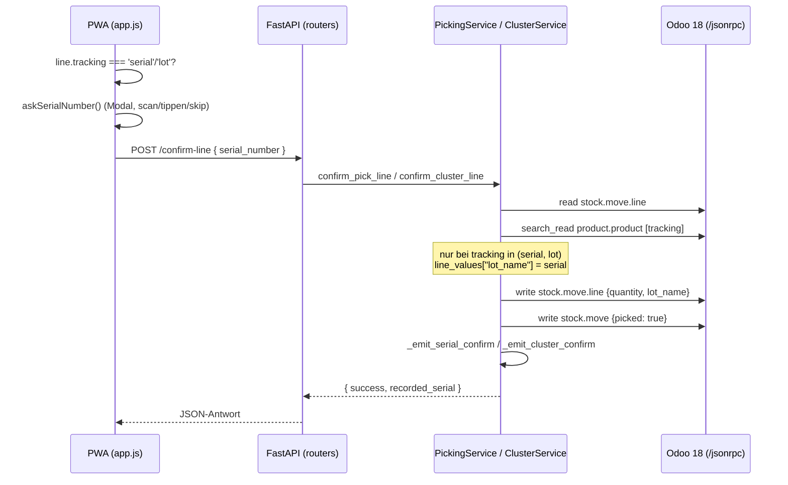

# Seriennummer-Bestätigung

> [!abstract] Kurzfassung
> Bei serien- bzw. chargengeführten Artikeln erfasst der Picker beim Bestätigen einer Pick-Position zusätzlich eine Seriennummer (oder Chargennummer). Das Backend schreibt diese als `lot_name` in dieselbe `stock.move.line`-Write-Operation wie die Menge und überlässt Odoo das Anlegen des Lots. Die Erfassung ist optional (Überspringen möglich), greift nur bei `tracking in ("serial", "lot")` und wird über strukturierte `serial_confirm`- bzw. `cluster_confirm`-Events telemetriert.

## 1. Wie es funktioniert

Die Seriennummer-Bestätigung ist kein eigenständiger Endpunkt, sondern ein optionaler Pfad innerhalb der bestehenden Positions-Bestätigung – sowohl im Einzel-Picking als auch im Cluster-Picking. Sie ist additiv: Nicht-getrackte Positionen sind vollständig unberührt, `serialNumber` bleibt dort leerer String.

Ablauf (Einzel-Picking):

1. Die PWA kennt pro Move-Line das Feld `tracking` aus `get_picking_detail` (geliefert aus `product.product.tracking`, `picking_service.py:531`).
2. Beim Bestätigen prüft die PWA `line.tracking === 'serial'` und öffnet bei Treffer das modale Eingabefeld `askSerialNumber(...)` (`app.js:2400`). Der Picker kann die Seriennummer scannen oder tippen – oder über „Überspringen“/Escape/Backdrop-Klick leeren Wert zurückgeben (`app.js:2247`).
3. Die PWA sendet den Wert als `serial_number` im Body von `POST /pickings/{picking_id}/confirm-line` (`app.js:2411`).
4. Das Backend (`confirm_pick_line`) liest die Move-Line, validiert Barcode und Bestand, normalisiert die Seriennummer (`.strip()`) und liest – nur wenn eine Seriennummer übergeben wurde – das Feld `tracking` des Produkts (`picking_service.py:671–676`).
5. Nur bei `tracking in ("serial", "lot")` wird `lot_name = serial_clean` in das `line_values`-Dict aufgenommen (`picking_service.py:677–679`).
6. Menge **und** optionale Seriennummer gehen in **einem einzigen** `write` auf `stock.move.line` an Odoo (`picking_service.py:683`). Odoo legt aus `lot_name` selbsttätig das passende `stock.lot` an bzw. verknüpft es.
7. Anschließend wird der Move auf `picked=True` gesetzt; sind alle Moves des Pickings erledigt, folgt `button_validate` (`picking_service.py:686`, `:700`).
8. Auf jedem Exit-Pfad wird genau ein `serial_confirm`-Telemetrie-Event emittiert (`_emit_serial_confirm`).

Im Cluster-Picking ist der Mechanismus identisch, nur dass `tracking === 'serial' || tracking === 'lot'` abgefragt wird (`app.js:3517` — der Cluster-Stop-Confirm) und der Write **ohne** sofortige Validierung erfolgt (kein `button_validate`, Docstring `cluster_service.py:386`) – der Batch wird später gesammelt via `action_done` abgeschlossen (`cluster_service.py:540`, Kontext `:542–546`).

## 2. Wie es mit Odoo kommuniziert

Das Backend spricht Odoo ausschließlich über `OdooClient` per JSON-RPC an `POST {odoo_url}/jsonrpc` (`odoo_client.py:50`). Genutzte Methoden im Serial-Pfad:

- **`read`** der Move-Line über `execute_kw(... "read" ...)` (`picking_service.py:617`); im Cluster über `search_read` mit IDOR-/Ownership-Domain (`cluster_service.py:415`).
- **`search_read`** auf `product.product` zum Lesen von `tracking` (`picking_service.py:673`, `cluster_service.py:436`). Im Cluster wird `barcode` und `tracking` in **einem** Read wiederverwendet (Kommentar `#9`, `cluster_service.py:432`).
- **`write`** auf `stock.move.line` mit `{quantity, lot_name}` in einer einzigen Operation, statt zwei Round-Trips (`picking_service.py:683`, `cluster_service.py:484`).
- **`write`** auf `stock.move` mit `{picked: True}` (`picking_service.py:686`, `cluster_service.py:486`).
- **`call_method`** `button_validate` (Einzel-Picking) bzw. `action_done` (Cluster-Batch) als Abschluss – mit Kontext `skip_immediate`/`skip_backorder` (`picking_service.py:700`) bzw. `skip_backorder`/`picking_ids_not_to_backorder`/`skip_sms` (`cluster_service.py:542`).

Auth: `authenticate` über den `common`-Service mit DB, User und Secret; die Secret-Kandidaten sind `odoo_api_key` und `odoo_password` (`odoo_client.py:37`, `:57`). Der API-Key wird bevorzugt; danach laufen alle Aufrufe als `object.execute_kw` mit dem ermittelten `uid`/Secret (`odoo_client.py:70`).

Fehlerbehandlung: Liefert die JSON-RPC-Antwort ein `error`, wird `OdooAPIError` geworfen (`odoo_client.py:53`). Besonderheiten:

- **Einzel-Picking:** Der `lot_name`-Write selbst ist nicht zusätzlich gekapselt; schlägt der Abschluss-`button_validate` mit `OdooAPIError` fehl, bleibt `picking_complete=False`, der Pick (inkl. Serial) ist aber bereits geschrieben (`picking_service.py:707`).
- **Cluster:** Beide Writes (Menge/Serial + `picked`) liegen in einem `try/except OdooAPIError`; bei Fehler kein HTTP 500, sondern Fehler-Telemetrie und `success:False` (Kommentar `#1`, `cluster_service.py:483–494`).
- **Best-Effort-Pfade:** Der nachgelagerte Progress-Read im Cluster ist best effort – schlägt er fehl, bleibt `success:True` mit `progress:None` (Kommentar `#7`, `cluster_service.py:499`). Im Einzel-Picking gilt: ist der n8n-Folgeprozess nach erfolgreichem Pick degradiert, bleibt der Confirm `success:True` mit `integration_status="degraded"` (`picking_service.py:741`).

Es kommen im Serial-Pfad **keine** `(6,0,ids)`-Relationsbefehle zum Einsatz; die Lot-Verknüpfung erfolgt implizit über das Schreiben des Namens `lot_name`, nicht über eine `lot_id`-Relation.

## 3. Was genau zugegriffen wird (Odoo-Zugriff)

| Modell | Felder (R/W) | Methoden | Domain/Filter | Zweck |
|---|---|---|---|---|
| `stock.move.line` | R: `id`, `product_id`, `quantity`, `move_id`, `location_id` (`result_package_id` im Cluster) · W: `quantity`, `lot_name` | `read`/`search_read`, `write` | Einzel: `[id]`; Cluster: `id` + `picking_id` + `picking_id.batch_id` + `picking_id.batch_id.user_id` (IDOR/Ownership) | Position laden; Menge und optionale Seriennummer (`lot_name`) schreiben |
| `product.product` | R: `tracking` (Cluster zusätzlich `barcode`) | `search_read` | `[("id", "=", product_id)]` | Entscheiden, ob `tracking in ("serial", "lot")` und Serial überhaupt geschrieben wird |
| `stock.move` | R: `id`, `picked` (`product_uom_qty` im Detail) · W: `picked` | `search_read`, `write` | `[("picking_id", "=", picking_id)]` / `[move_id]` | Move als erledigt markieren; Vollständigkeit prüfen |
| `stock.picking` | – | `call_method` `button_validate` | `[picking_id]`, Kontext `skip_immediate`/`skip_backorder` | Einzel-Picking abschließen, sobald alle Moves `picked` |
| `stock.picking.batch` | R: `picking_ids`, `user_id`, `state` | `call_method` `action_done` | `[batch_id]`, Kontext `skip_backorder`/`picking_ids_not_to_backorder`/`skip_sms` | Cluster-Batch gesammelt abschließen |
| `stock.lot` | (implizit) | – (über `lot_name` durch Odoo) | – | Odoo legt aus `lot_name` selbsttätig das Lot/die Seriennummer an |

> [!note] Lesepfad `tracking`
> Im Detail-Endpunkt wird `tracking` schon mitgeladen (`product.product`-Read mit `["id", "barcode", "default_code", "tracking"]`, `picking_service.py:505`) und pro Move-Line ausgespielt (`picking_service.py:531`). Im Confirm-Pfad wird `tracking` zur Sicherheit nochmals serverseitig gelesen, statt der Client-Angabe zu vertrauen.

## 4. API-Endpunkte (FastAPI)

| Methode | Pfad | Zweck | Auth/Headers |
|---|---|---|---|
| POST | `/pickings/{picking_id}/confirm-line` | Einzel-Pick bestätigen; Feld `serial_number` im Body (`pickings.py:271`, Modell `ConfirmLineRequest`, `pickings.py:43`) | Picker-Identität aufgelöst über `WriteRequestContext`; Idempotenz via `begin_idempotent_request` |
| POST | `/cluster/batches/{batch_id}/confirm-line` | Cluster-Position bestätigen; Feld `serial_number` im Body (`cluster.py:65`, Modell `ClusterConfirmRequest` `cluster.py:20`, Feld `serial_number` `:25`) | `get_required_picker_identity` (Ownership fail-closed) |

Es gibt **keinen** dedizierten Seriennummer-Endpunkt. Die Seriennummer reist als optionales Body-Feld `serial_number` (Default `""`) innerhalb der vorhandenen Confirm-Requests. Der Body trägt zusätzlich `move_line_id`, `scanned_barcode`, `quantity` (Cluster zusätzlich `picking_id`, `scanned_package`).

> [!info] Soll/Ist-Abgleich
> `utils/serial.py` (`reconcile_serials`) ist ein reiner, Odoo-unabhängiger Hilfsbaustein für den Soll/Ist-Abgleich von Seriennummern (Retouren-Prüfung): er liefert `missing`, `unknown`, `duplicates` und ein `ok`-Flag (`serial.py:13`). Er ist nicht Teil des hier dokumentierten Bestätigungs-Schreibpfads.

## 5. PWA-Seite

In `pwa/js/app.js`:

- **`askSerialNumber(productName)`** (`app.js:2184`): baut ein modales Sheet (`role="dialog"`, `aria-modal`) mit Eingabefeld, „Bestätigen“ und „Überspringen“; resolved mit dem getrimmten Wert oder `''` bei Skip/Escape/Backdrop. Produktname wird XSS-sicher per `textContent` gesetzt (`app.js:2210`). `serialPromptActive` verhindert, dass ein asynchrones Re-Render (Heartbeat-/Detail-Refresh) das Modal wegschließt (`app.js:2191`, `:823`, `:1306`).
- **Einzel-Confirm** (`app.js:2400`): `if (line.tracking === 'serial')` ruft den Prompt vor dem Confirm.
- **Schnell-/Mehrfach-Confirm** (`app.js:2558`): `if (pickLine.tracking === 'serial')` ruft denselben Prompt pro serialisierter Position im „Alle bestätigen“-Pfad des Einzel-Pickings (serien-getrackt). Die **Toast**-Meldung nennt dort die Anzahl serialisierter Positionen (`app.js:2549`); die **Voice**-Ansage (`speak`, `app.js:2546`) nennt nur die Gesamtzahl der Positionen.
- **Cluster-Stop-Confirm** (`app.js:3517`): `tracking === 'serial' || tracking === 'lot'` ruft den Prompt; in der Liste markiert ein „Serial“-Badge betroffene Positionen (`app.js:3417`).

## 6. Telemetrie & Fehlerverhalten

Einzel-Picking emittiert `serial_confirm` über `_emit_serial_confirm` (`picking_service.py:26`) mit `event_type`, `picking_id`, `move_line_id`, `product_id`, `success`, `serial_recorded` (bool) und `latency_ms`. **Invariante:** `confirm_pick_line` emittiert **genau ein** Event pro Aufruf auf **jedem** Exit-Pfad – auch bei Fehlern (Line fehlt, falscher Barcode, kein Bestand). Dadurch ist `success_rate` in `summarize_serial_events` eine echte Rate über alle Versuche (`picking_service.py:36–40`).

`summarize_serial_events` (`telemetry.py:11`) aggregiert für die Design-Science-Evaluation: `count` (Nenner über alle Versuche), `success_rate`, `serial_capture_rate` (Anteil mit tatsächlich erfasstem Serial/Lot, aus `serial_recorded`) sowie `latency_p50_ms`/`latency_p95_ms`.

Cluster-Picking emittiert analog `cluster_confirm` über `_emit_cluster_confirm` (`cluster_service.py:584`) – zusätzlich mit `batch_id` und `carton_ok` (Verwechslungsschutz-Quote). Auch hier wird auf jedem Exit-Pfad genau ein Event emittiert.

Fehler- und Invarianten-Verhalten:

- **Optionalität:** Ohne übergebene Seriennummer (`serial_clean == ""`) wird `lot_name` nicht geschrieben; `recorded_serial` bleibt `""` (`picking_service.py:670`, `cluster_service.py:474`). Skip ist also ein gültiger Pfad.
- **Tracking-Gate:** Selbst bei übergebener Seriennummer wird sie nur bei `tracking in ("serial", "lot")` geschrieben; nicht-getrackte Produkte ignorieren das Feld.
- **Antwortfeld:** Die erfolgreiche Confirm-Antwort enthält `recorded_serial` (geschrieben oder `""`), sodass die PWA Rückmeldung über die tatsächlich erfasste Nummer hat (`picking_service.py:766`, `cluster_service.py:510`).
- **Atomarität:** Menge und Seriennummer gehen gemeinsam in einem Write; kein Zustand „Menge ohne Serial“ durch einen zweiten Round-Trip.

## 7. Quellen im Code

- `backend/app/services/picking_service.py:670–683` — `serial_clean`, `tracking`-Read, `lot_name`-Write
- `backend/app/services/picking_service.py:26–50` — `_emit_serial_confirm` und Invariante
- `backend/app/services/cluster_service.py:474–484` — Serial im Cluster-Confirm, gemeinsamer Write
- `backend/app/services/cluster_service.py:584–601` — `_emit_cluster_confirm`
- `backend/app/utils/telemetry.py:11–32` — `summarize_serial_events`
- `backend/app/utils/serial.py:13–21` — `reconcile_serials` (Soll/Ist-Abgleich)
- `backend/app/routers/pickings.py:43`, `:271–306` — `ConfirmLineRequest`, Endpunkt, `serial_number`-Durchreichung
- `backend/app/routers/cluster.py:20` (`:25` = Feld `serial_number`), `:65–78` — `ClusterConfirmRequest`, Cluster-Endpunkt
- `backend/app/services/odoo_client.py:50`, `:84`, `:87` — JSON-RPC, `write`, `call_method`
- `pwa/js/app.js:2184–2252` — `askSerialNumber`
- `pwa/js/app.js:2400`, `:2558`, `:3517` — Tracking-Abfragen vor den Confirms

## Verwandt

- [[12 - Funktionsdokumentation]] — Übersicht aller Funktionsseiten
- [[01 - Odoo-Kommunikation & Zugriffskatalog]]
- [[02 - Einzel-Kommissionierung (Picking)]]
- [[03 - Cluster- & Batch-Picking]]
- [[04 - Empfängerkarton-Bestätigung (Put-to-Box)]]
