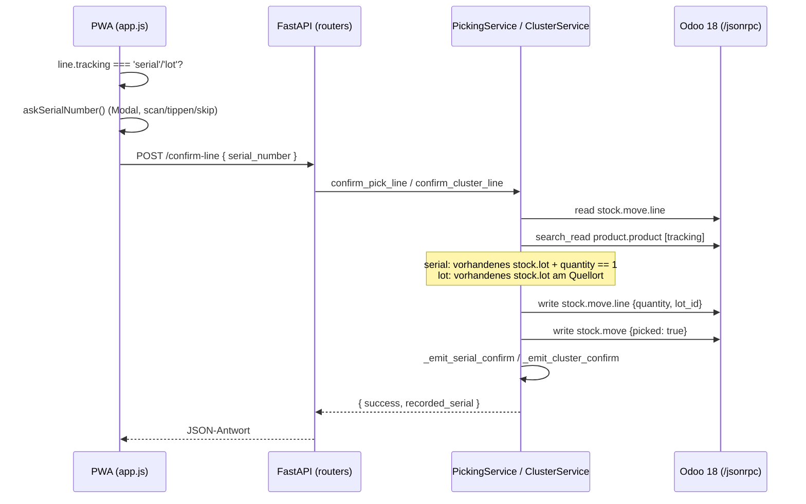

# Seriennummer-Bestätigung

> [!abstract] Kurzfassung
> Bei getrackten Artikeln erfasst der Picker beim Bestätigen einer Pick-Position zusätzlich die Charge oder Seriennummer des **konkreten physischen Bauteils**. Für `product.product.tracking == "serial"` ist eine vorhandene Odoo-Seriennummer (`stock.lot`) fuer genau eine Einheit Pflicht. Für `tracking == "lot"` ist eine vorhandene Charge am Quelllagerplatz Pflicht. In beiden Fällen schreibt das Backend die validierte `lot_id` gemeinsam mit der Menge auf `stock.move.line`. Ziel ist Rueckverfolgbarkeit der BOM-Komponenten, nicht nur des fertigen Endprodukts.

## 1. Wie es funktioniert

Die Seriennummer-/Chargen-Bestätigung ist kein eigenständiger Endpunkt, sondern ein Pfad innerhalb der bestehenden Positions-Bestätigung – sowohl im Einzel-Picking als auch im Cluster-Picking. Sie ist additiv für nicht-getrackte Positionen, aber **verpflichtend** für getrackte Positionen (`tracking == "serial"` oder `tracking == "lot"`).

Fachlich bedeutet „Seriennummer“ hier nicht Artikelnummer/SKU, sondern die eindeutige Instanz eines Bauteils. Beispiel: Für den Artikel „Brick 2x2“ wird beim Picken das konkrete Exemplar mit Seriennummer `123` gescannt und ausgeliefert. Kommt später in einer Retoure ein beschädigtes Teil mit Seriennummer `245` zurück, zeigt der Abgleich: Diese Retoure passt nicht zur damals ausgelieferten Instanz.

Ablauf (Einzel-Picking):

1. Die PWA kennt pro Move-Line das Feld `tracking` aus `get_picking_detail` (geliefert aus `product.product.tracking`, `picking_service.py:531`).
2. Beim Bestätigen prüft die PWA `line.tracking === 'serial'` oder `line.tracking === 'lot'` und öffnet bei Treffer `askSerialNumber(..., { required: true, tracking })`. Escape, Backdrop und ein leerer Wert blockieren den Confirm (`app.js`).
3. Die PWA sendet den Wert als `serial_number` im Body von `POST /pickings/{picking_id}/confirm-line`; der lokale Idempotency-Key enthält die Seriennummer (`app.js:2482–2500`).
4. Das Backend (`confirm_pick_line`) liest die Move-Line inklusive vorhandener `lot_id`, validiert Barcode und Bestand und liest `product.product.tracking` (`picking_service.py:618–677`).
5. `build_serial_move_line_values(...)` validiert bei `tracking == "serial"`: Seriennummer vorhanden, Menge genau 1, `stock.lot` existiert für dieses Produkt, die ggf. reservierte `lot_id` passt und am Quelllagerort existiert ein passender `stock.quant`. Bei `tracking == "lot"` gelten dieselben Existenz-/Produkt-/Lagerortprüfungen, aber ohne Mengenbegrenzung auf 1 (`serial_validation.py`).
6. Bei Erfolg werden Menge und `lot_id` in **einem einzigen** `write` auf `stock.move.line` geschrieben. Das gilt inzwischen fuer Seriennummern und Chargen; der fruehere freie `lot_name`-Pfad ist fuer die Demo bewusst durch vorhandene Odoo-Lots ersetzt.
7. Anschließend wird der Move auf `picked=True` gesetzt; sind alle Moves des Pickings erledigt, folgt `button_validate` (`picking_service.py:704–720`).
8. Auf jedem Exit-Pfad wird genau ein `serial_confirm`-Telemetrie-Event emittiert (`_emit_serial_confirm`).

Im Cluster-Picking ist der Mechanismus identisch, nur dass vor dem Serial-/Lot-Write zusätzlich der Empfängerkarton geprüft wird. `handleClusterConfirm(...)` fragt bei `serial` und `lot` die Nummer ab; der Backend-Write erfolgt ohne sofortiges `button_validate`, weil der Batch später gesammelt via `action_done` abgeschlossen wird.

```mermaid
sequenceDiagram
    participant PWA as PWA (app.js)
    participant API as FastAPI (routers)
    participant SVC as PickingService / ClusterService
    participant Odoo as Odoo 18 (/jsonrpc)

    PWA->>PWA: line.tracking === 'serial'/'lot'?
    PWA->>PWA: askSerialNumber() (Modal, scan/tippen/skip)
    PWA->>API: POST /confirm-line { serial_number }
    API->>SVC: confirm_pick_line / confirm_cluster_line
    SVC->>Odoo: read stock.move.line
    SVC->>Odoo: search_read product.product [tracking]
    Note over SVC: serial: vorhandenes stock.lot + quantity == 1<br/>lot: vorhandenes stock.lot am Quellort
    SVC->>Odoo: write stock.move.line {quantity, lot_id}
    SVC->>Odoo: write stock.move {picked: true}
    SVC->>SVC: _emit_serial_confirm / _emit_cluster_confirm
    SVC-->>API: { success, recorded_serial }
    API-->>PWA: JSON-Antwort
```

## 2. Wie es mit Odoo kommuniziert

Das Backend spricht Odoo ausschließlich über `OdooClient` per JSON-RPC an `POST {odoo_url}/jsonrpc` (`odoo_client.py:50`). Genutzte Methoden im Serial-Pfad:

- **`read`** der Move-Line über `execute_kw(... "read" ...)`, inklusive vorhandener `lot_id` (`picking_service.py:618–623`); im Cluster über `search_read` mit IDOR-/Ownership-Domain (`cluster_service.py:416–421`).
- **`search_read`** auf `product.product` zum Lesen von `tracking` (`picking_service.py:672–677`, `cluster_service.py:437–441`). Im Cluster wird `barcode` und `tracking` in **einem** Read wiederverwendet.
- **`search_read`** auf `stock.lot` und `stock.quant` zur Serial-Validierung (`serial_validation.py:67–103`).
- **`write`** auf `stock.move.line` mit `{quantity, lot_id}` für Seriennummern und Chargen in einer einzigen Operation.
- **`write`** auf `stock.move` mit `{picked: True}` (`picking_service.py:704–705`, `cluster_service.py:502–503`).
- **`call_method`** `button_validate` (Einzel-Picking) bzw. `action_done` (Cluster-Batch) als Abschluss – mit Kontext `skip_immediate`/`skip_backorder` (`picking_service.py:700`) bzw. `skip_backorder`/`picking_ids_not_to_backorder`/`skip_sms` (`cluster_service.py:542`).

Auth: `authenticate` über den `common`-Service mit DB, User und Secret; die Secret-Kandidaten sind `odoo_api_key` und `odoo_password` (`odoo_client.py:37`, `:57`). Der API-Key wird bevorzugt; danach laufen alle Aufrufe als `object.execute_kw` mit dem ermittelten `uid`/Secret (`odoo_client.py:70`).

Fehlerbehandlung: Liefert die JSON-RPC-Antwort ein `error`, wird `OdooAPIError` geworfen (`odoo_client.py:53`). Besonderheiten:

- **Einzel-Picking:** Der `lot_id`-Move-Line-Write ist Teil des Confirm-Writes; schlägt danach der Abschluss-`button_validate` mit `OdooAPIError` fehl, bleibt `picking_complete=False`, der Pick inklusive Charge/Seriennummer ist aber bereits geschrieben.
- **Cluster:** Beide Writes (Menge/Serial + `picked`) liegen in einem `try/except OdooAPIError`; bei Fehler kein HTTP 500, sondern Fehler-Telemetrie und `success:False` (Kommentar `#1`, `cluster_service.py:483–494`).
- **Best-Effort-Pfade:** Der nachgelagerte Progress-Read im Cluster ist best effort – schlägt er fehl, bleibt `success:True` mit `progress:None` (Kommentar `#7`, `cluster_service.py:499`). Im Einzel-Picking gilt: ist der n8n-Folgeprozess nach erfolgreichem Pick degradiert, bleibt der Confirm `success:True` mit `integration_status="degraded"` (`picking_service.py:741`).

Es kommen im Serial-/Lot-Pfad **keine** `(6,0,ids)`-Relationsbefehle zum Einsatz. Für serien- und chargengeführte Produkte wird die vorhandene `stock.lot`-ID direkt als `lot_id` geschrieben.

## 3. Was genau zugegriffen wird (Odoo-Zugriff)

| Modell | Felder (R/W) | Methoden | Domain/Filter | Zweck |
|---|---|---|---|---|
| `stock.move.line` | R: `id`, `product_id`, `quantity`, `move_id`, `location_id`, `lot_id` (`result_package_id` im Cluster) · W: `quantity`, `lot_id`, `picked` | `read`/`search_read`, `write` | Einzel: `[id]`; Cluster: `id` + `picking_id` + `picking_id.batch_id` + `picking_id.batch_id.user_id` (IDOR/Ownership) | Position laden; Menge und validierte Seriennummer/Charge schreiben |
| `product.product` | R: `tracking` (Cluster zusätzlich `barcode`) | `search_read` | `[("id", "=", product_id)]` | Entscheiden, ob `tracking in ("serial", "lot")` und Serial überhaupt geschrieben wird |
| `stock.lot` | R: `id`, `name`, `product_id` | `search_read` | `product_id` + gescannte `name` | Prüfen, dass die Seriennummer bereits in Odoo für dieses Produkt existiert |
| `stock.quant` | R: `quantity`, `reserved_quantity`, `location_id` | `search_read` | `product_id` + `lot_id` + Quell-`location_id` | Prüfen, dass die Seriennummer am aktuellen Lagerplatz vorhanden ist |
| `stock.move` | R: `id`, `picked` (`product_uom_qty` im Detail) · W: `picked` | `search_read`, `write` | `[("picking_id", "=", picking_id)]` / `[move_id]` | Move als erledigt markieren; Vollständigkeit prüfen |
| `stock.picking` | – | `call_method` `button_validate` | `[picking_id]`, Kontext `skip_immediate`/`skip_backorder` | Einzel-Picking abschließen, sobald alle Moves `picked` |
| `stock.picking.batch` | R: `picking_ids`, `user_id`, `state` | `call_method` `action_done` | `[batch_id]`, Kontext `skip_backorder`/`picking_ids_not_to_backorder`/`skip_sms` | Cluster-Batch gesammelt abschließen |

> [!note] Lesepfad `tracking`
> Im Detail-Endpunkt wird `tracking` schon mitgeladen (`product.product`-Read mit `["id", "barcode", "default_code", "tracking"]`, `picking_service.py:505`) und pro Move-Line ausgespielt (`picking_service.py:531`). Im Confirm-Pfad wird `tracking` zur Sicherheit nochmals serverseitig gelesen, statt der Client-Angabe zu vertrauen.

## 4. API-Endpunkte (FastAPI)

| Methode | Pfad | Zweck | Auth/Headers |
|---|---|---|---|
| POST | `/pickings/{picking_id}/confirm-line` | Einzel-Pick bestätigen; Feld `serial_number` im Body (`pickings.py:271`, Modell `ConfirmLineRequest`, `pickings.py:43`) | Picker-Identität aufgelöst über `WriteRequestContext`; Idempotenz via `begin_idempotent_request` |
| POST | `/cluster/batches/{batch_id}/confirm-line` | Cluster-Position bestätigen; Feld `serial_number` im Body (`cluster.py:65`, Modell `ClusterConfirmRequest` `cluster.py:20`, Feld `serial_number` `:25`) | `get_required_picker_identity` (Ownership fail-closed) |
| POST | `/pickings/{picking_id}/returns/reconcile` | Retouren-Seriennummern gegen die beim Picking ausgelieferten Odoo-Serials vergleichen; Body: `{ returned_serials: [...] }` | `get_required_picker_identity`; read-only, kein Odoo-Write |

Es gibt **keinen** dedizierten Seriennummer-Endpunkt. Die Seriennummer reist als Body-Feld `serial_number` (Default `""`) innerhalb der vorhandenen Confirm-Requests. Für `tracking == "serial"` führt ein leerer Wert serverseitig zu `success:false` mit `serial_required:true`. Der Body trägt zusätzlich `move_line_id`, `scanned_barcode`, `quantity` (Cluster zusätzlich `picking_id`, `scanned_package`). Der Einzel-Picking-Idempotenz-Fingerprint enthält `serial_number` (`pickings.py:282–288`).

> [!info] Soll/Ist-Abgleich
> `utils/serial.py` (`reconcile_serials`) ist ein reiner, Odoo-unabhängiger Hilfsbaustein für den Soll/Ist-Abgleich von Seriennummern (Retouren-Prüfung): er liefert `missing`, `unknown`, `duplicates` und ein `ok`-Flag (`serial.py:13`). `PickingService.reconcile_return_serials` liest die ausgelieferten Seriennummern read-only aus `stock.move.line.lot_id` bzw. als Legacy-Fallback aus `lot_name` und vergleicht sie mit den zurückgescannten Seriennummern. Abweichungen werden aktuell zurückgegeben, aber noch nicht als Quality Alert/n8n-Event persistiert.

## 5. PWA-Seite

In `pwa/js/app.js`:

- **`askSerialNumber(productName, { required })`** (`app.js:2239`): baut ein modales Sheet (`role="dialog"`, `aria-modal`) mit Eingabefeld. Bei `required:true` gibt es keinen Überspringen-Pfad; Escape/Backdrop/leerer Wert zeigen eine Fehlermeldung und lösen keinen Confirm aus (`app.js:2272–2326`).
- **Einzel-Confirm:** `tracking === 'serial' || tracking === 'lot'` ruft den Pflicht-Prompt vor dem Confirm.
- **Schnell-/Mehrfach-Confirm:** derselbe Pflicht-Prompt wird pro getrackter Position im „Alle bestätigen“-Pfad ausgeführt.
- **Cluster-Stop-Confirm:** `tracking === 'serial' || tracking === 'lot'` ruft den Pflicht-Prompt; der Dialog beschriftet `lot` als Charge und `serial` als Seriennummer.
- **HID-Scanner-Konflikt:** `scanner.js` ignoriert globale HID-Events, solange Fokus in einem Eingabefeld liegt, damit ein Serial-Scan im Modal nicht parallel als Produktbarcode verarbeitet wird (`scanner.js:25–35`).

## 6. Telemetrie & Fehlerverhalten

Einzel-Picking emittiert `serial_confirm` über `_emit_serial_confirm` (`picking_service.py:26`) mit `event_type`, `picking_id`, `move_line_id`, `product_id`, `success`, `serial_recorded` (bool) und `latency_ms`. **Invariante:** `confirm_pick_line` emittiert **genau ein** Event pro Aufruf auf **jedem** Exit-Pfad – auch bei Fehlern (Line fehlt, falscher Barcode, kein Bestand). Dadurch ist `success_rate` in `summarize_serial_events` eine echte Rate über alle Versuche (`picking_service.py:36–40`).

`summarize_serial_events` (`telemetry.py:11`) aggregiert für die Design-Science-Evaluation: `count` (Nenner über alle Versuche), `success_rate`, `serial_capture_rate` (Anteil mit tatsächlich erfasstem Serial/Lot, aus `serial_recorded`) sowie `latency_p50_ms`/`latency_p95_ms`.

Cluster-Picking emittiert analog `cluster_confirm` über `_emit_cluster_confirm` (`cluster_service.py:584`) – zusätzlich mit `batch_id` und `carton_ok` (Verwechslungsschutz-Quote). Auch hier wird auf jedem Exit-Pfad genau ein Event emittiert.

Fehler- und Invarianten-Verhalten:

- **Pflicht bei Seriennummern:** Ohne Seriennummer wird bei `tracking == "serial"` nicht geschrieben; Antwort enthält `serial_required:true`.
- **Menge bei Seriennummern:** Serialisierte Produkte werden nur mit Menge `1` akzeptiert; Menge `> 1` muss in einzelne Move-Lines/Scans aufgeteilt werden.
- **Existenz-/Produkt-/Lagerprüfung:** Die Seriennummer muss als `stock.lot` zum Produkt existieren und am Quelllagerort als `stock.quant` vorhanden sein.
- **Tracking-Gate:** Bei `tracking == "lot"` wird eine vorhandene Charge (`stock.lot`) am Quelllagerplatz verlangt; nicht-getrackte Produkte ignorieren das Feld.
- **Antwortfeld:** Die erfolgreiche Confirm-Antwort enthält `recorded_serial` (geschrieben oder `""`), sodass die PWA Rückmeldung über die tatsächlich erfasste Nummer hat (`picking_service.py:766`, `cluster_service.py:510`).
- **Atomarität:** Menge und Seriennummer gehen gemeinsam in einem Write; kein Zustand „Menge ohne Serial“ durch einen zweiten Round-Trip.
- **Idempotenz:** Im Einzel-Picking enthält der Fingerprint `serial_number`; derselbe `Idempotency-Key` mit anderer Seriennummer wird damit als abweichender Request erkannt.
- **Retouren-Abgleich:** Der Reconcile-Endpunkt ist read-only. Er schreibt keine Abweichungen nach Odoo, sondern liefert `missing`, `unknown`, `duplicates`, `summary`, `shipped_serials` und `returned_serials` als Entscheidungsgrundlage.

## 7. Quellen im Code

- `backend/app/services/serial_validation.py` — Pflicht-/Existenz-/Lagerprüfung und Rückgabe von `lot_id`
- `backend/app/services/picking_service.py:672–702` — `tracking`-Read, Serial-Validierung, gemeinsamer Move-Line-Write
- `backend/app/services/picking_service.py:26–50` — `_emit_serial_confirm` und Invariante
- `backend/app/services/cluster_service.py:437–503` — Serial im Cluster-Confirm, gemeinsamer Write
- `backend/app/services/cluster_service.py:584–601` — `_emit_cluster_confirm`
- `backend/app/utils/telemetry.py:11–32` — `summarize_serial_events`
- `backend/app/utils/serial.py:13–21` — `reconcile_serials` (Soll/Ist-Abgleich)
- `backend/app/routers/pickings.py:43`, `:271–306` — `ConfirmLineRequest`, Endpunkt, `serial_number` im Fingerprint und Service-Call
- `backend/app/routers/pickings.py` — `ReturnReconcileRequest` und `/pickings/{picking_id}/returns/reconcile`
- `backend/app/services/picking_service.py` — `reconcile_return_serials`, read-only Odoo-Read + `reconcile_serials`
- `backend/app/routers/cluster.py:20` (`:25` = Feld `serial_number`), `:65–78` — `ClusterConfirmRequest`, Cluster-Endpunkt
- `backend/app/services/odoo_client.py:50`, `:84`, `:87` — JSON-RPC, `write`, `call_method`
- `pwa/js/app.js:2239–2326` — `askSerialNumber`
- `pwa/js/app.js:2477`, `:2630`, `:3592` — Tracking-Abfragen vor den Confirms
- `pwa/js/scanner.js:25–35` — HID-Scanner ignoriert Eingabefelder

## 8. Odoo-Konfiguration

Damit dieser Pfad fachlich funktioniert, muss Odoo vor dem Picking vorbereitet sein:

1. **Lots & Seriennummern aktivieren:** Inventory → Configuration → Settings → Traceability → Lots & Serial Numbers.
2. **Produkt auf Tracking stellen:** Beim konkreten Produkt `tracking = serial` oder `tracking = lot`, nicht nur Barcode/SKU setzen.
3. **Lots/Seriennummern vorliefern/einlagern:** Für jedes physische Exemplar oder jede Charge existiert ein `stock.lot` und Bestand (`stock.quant`) am Lagerort. Diese Nummer kann als Barcode/QR auf dem Teil oder Behälter stehen.
4. **Picking:** Picker scannt erst den Produktbarcode, dann Charge oder Seriennummer. Das Backend schreibt die vorhandene `lot_id`.

> [!info] Stand Odoo-19-Demo
> In der Trial-DB `masterfischer_o19_trial` setzt der Demo-Schalter aktuell primaer die BOM-Komponenten auf `tracking = lot` oder `tracking = serial`. Das entspricht dem fachlichen Ziel: Die Bauteile in der Stueckliste sollen rueckverfolgbar sein, nicht nur das fertige Endprodukt.
5. **Retoure:** Zurückgesendete Seriennummern werden gegen die ausgelieferten Seriennummern desselben Pickings verglichen. Beispiel: ausgeliefert `123`, retourniert `245` → `245` ist unbekannt/falsches Exemplar, `123` fehlt.

Odoo-Doku-Grundlage: Seriennummern identifizieren einzelne Produkte über die Lieferkette; das Lots/Serials-Dashboard und Traceability-Reports zeigen Herkunft, Lagerort und Empfänger. Die Barcode-App unterstützt bei getrackten Produkten das Scannen von Lot-/Seriennummern pro Menge.

## Verwandt

- [[12 - Funktionsdokumentation]] — Übersicht aller Funktionsseiten
- [[01 - Odoo-Kommunikation & Zugriffskatalog]]
- [[02 - Einzel-Kommissionierung (Picking)]]
- [[03 - Cluster- & Batch-Picking]]
- [[04 - Empfängerkarton-Bestätigung (Put-to-Box)]]
