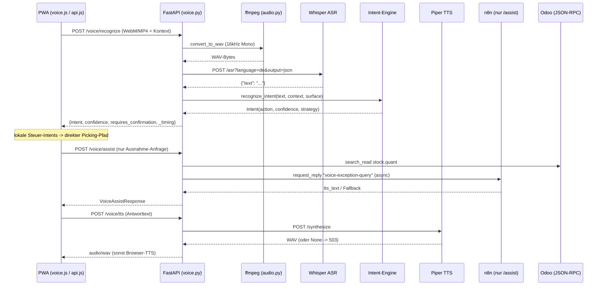

# Sprachassistent (STT, Intent, TTS)

> [!abstract] Kurzfassung
> Der Sprachassistent nimmt im Browser aufgenommenes Audio (WebM/MP4) entgegen, konvertiert es serverseitig zu WAV (16 kHz, Mono), transkribiert es lokal mit Whisper auf Deutsch und bildet den Text deterministisch per Keyword-Matching (Exact -> Regex -> Fuzzy -> Segment-Partial) auf eine sichere Picking-Aktion ab. Für Antworten erzeugt Piper lokal WAV-Sprache; bei Ausfall fällt die PWA auf Browser-TTS zurück. Der schnelle Kommando-Pfad läuft komplett in FastAPI; nur kontextreiche Ausnahme-Anfragen (`/voice/assist`) ziehen optional n8n als asynchronen Orchestrator hinzu — nie im Voice-Hot-Path.

## 1. Wie es funktioniert

Der Hot-Path eines Sprachkommandos verläuft rein lokal und deterministisch:

1. Die PWA nimmt Mikrofon-Audio auf und sendet es als `multipart/form-data` an `POST /voice/recognize` (`api.js:279-289`). Zusätzlich werden UI-Kontextfelder mitgeschickt: `context`, `surface`, `remaining_line_count`, `active_line_present` (`api.js:281-288`).
2. FastAPI liest den Blob; bei leerem Body wird `400` geworfen (`voice.py:221-223`).
3. `convert_to_wav` ruft `ffmpeg` im Thread-Pool auf und erzwingt 16 kHz Mono WAV; bei Fehler kommen die Original-Bytes zurück (`audio.py:31-52`, `audio.py:62-69`). Die Eingangs-Suffix-Wahl unterscheidet `.mp4` (iOS Safari/AAC) und `.webm` (Chrome Android/Opus) (`audio.py:68`).
4. `whisper_client.transcribe_audio` postet die WAV-Bytes an den Whisper-ASR-Webservice: `POST {whisper_url}/asr?task=transcribe&language=de&output=json&encode=false` (`whisper_client.py:49-60`). Rückgabe ist das Feld `text` (`whisper_client.py:63-64`); bei jeder Exception ein leerer String (`whisper_client.py:65-67`).
5. Ist der Text leer, antwortet der Endpunkt sofort mit `intent="unknown"` und Timing-Metadaten (`voice.py:244-258`).
6. Andernfalls wird der `context`-String zu `PickingContext` und `surface` zu `VoiceSurface` geparst (Fallback auf `AWAITING_COMMAND` bzw. `DETAIL` bei ungültigen Werten) (`voice.py:260-268`).
7. `recognize_intent` bildet den Text deterministisch auf einen Intent ab. Die Pipeline normalisiert zunächst (Umlaute/ß, Diakritika, nur `a-z0-9`) (`intent_engine.py:434-444`) und prüft dann in fester Reihenfolge: Zahl-Extraktion in Prüfziffer-/Mengen-Kontexten (`intent_engine.py:369-387`), negierte Bestätigung -> `problem` (`intent_engine.py:389-402`, `intent_engine.py:569-573`), Exact-Match (`intent_engine.py:447-460`), Regex (`intent_engine.py:463-475`), Fuzzy via Levenshtein (`intent_engine.py:478-530`).
8. Liegt das Ergebnis unter `FUZZY_SINGLE_THRESHOLD` (0,73), läuft als Fallback eine Partial-Ratio-Suche über die Alias-Keywords der zur Oberfläche passenden Aktionen (`recognize_intent_from_segments`, `voice.py:280-289`, `intent_engine.py:637-695`).
9. Liegt die Konfidenz im Bereich `[0,68 ; 0,73)`, setzt der Endpunkt `requires_confirmation=true` mit einem deutschen Rückfrage-Prompt, damit die PWA eine Bestätigung einholt (`voice.py:300-308`).
10. Der `VoiceSurface`-Kontext schränkt zulässige Aktionen ein: im `QUALITY_ALERT` nur `pause`/`repeat`, `confirm` nur im `DETAIL` mit aktiver Zeile, `done` nur wenn keine Restzeilen offen sind (`_resolve_with_context`, `intent_engine.py:533-555`).
11. Der Endpunkt liefert `text`, `intent`, `value`, `confidence`, `normalized_text`, `match_strategy`, `requires_confirmation`, `confirmation_prompt` und ein `_timing`-Objekt (`voice.py:322-337`).
12. Lokale Steuer-Intents (`confirm`, `next`, `done`, `pause`, `photo` …) werden in der PWA direkt im Picking-Pfad verarbeitet. Nur kontextreiche Ausnahmefragen gehen an `POST /voice/assist`, das Odoo-Bestandskontext lädt und n8n asynchron befragt (`voice.py:340-488`).
13. Für gesprochene Antworten ruft die PWA `POST /api/voice/tts`; `piper_client.synthesize` liefert WAV oder `None` (`piper_client.py:34-56`). Bei `None` antwortet der Endpunkt mit `503`, woraufhin die PWA auf Browser-TTS zurückfällt (`voice.py:498-501`, `voice.js:261-264`).

## 2. Wie es mit Odoo kommuniziert

Der **Erkennungs-Pfad** (`/voice/recognize`, `/voice/tts`) spricht **gar nicht** mit Odoo. STT, Intent-Matching und TTS sind reine Lokal-Services (Whisper, Intent-Engine, Piper). Damit bleibt der Voice-Hot-Path frei von JSON-RPC-Latenz und externer Abhängigkeit.

Odoo wird ausschließlich im **Assistenz-Pfad** (`/voice/assist`) berührt, und zwar über `OdooClient` (JSON-RPC an `/jsonrpc`, Auth per API-Key im `OdooClient`):

- **`stock.quant` lesen** via `odoo.search_read("stock.quant", [("product_id", "=", product_id)], ["quantity", "reserved_quantity", "location_id"], limit=50)` (`voice.py:76-81`). Daraus berechnet `_load_stock_context` die verfügbare Menge (`quantity - reserved_quantity`) je Lagerplatz, sammelt Alternativplätze und leitet ggf. eine Nachschub-Empfehlung ab (`voice.py:82-146`).
- **Picking-Detail** wird indirekt über `PickingService.get_picking_detail(body.picking_id)` geladen (`voice.py:374-377`), das seinerseits den `OdooClient` nutzt. Bei `error` im Ergebnis wird leer weitergearbeitet (Best-Effort, `voice.py:376-377`).

**Fehlerbehandlung / Best-Effort-Pfade:**
- Ohne `product_id` liefert `_load_stock_context` sofort einen leeren Kontext (kein Odoo-Call) (`voice.py:69-74`).
- Der n8n-Reply ist optional: bei `status == "fallback"` baut `_build_local_assist_answer` die Antwort rein aus dem lokal geladenen Odoo-/Obsidian-Kontext (`voice.py:425-441`).
- Schlägt der asynchrone `shortage-reported`-Event-Versand fehl (`event_result.delivered == False`), wird die TTS-Antwort um einen Hinweis ergänzt und ein `fallback_reason="shortage_dispatch_failed"` gesetzt (`voice.py:449-477`).

> [!note] Invariante
> Es gibt im Voice-Feature **keine** Schreibzugriffe auf Odoo. `/voice/assist` liest nur `stock.quant` und löst Folgeaktionen rein über n8n-Events aus. Die eigentliche Mengen-/Statusbuchung (z. B. `action_done`, `(6,0,ids)`-Befehle) erfolgt im Picking-Feature, nicht hier.

## 3. Was genau zugegriffen wird (Odoo-Zugriff)

| Modell | Felder (R/W) | Methoden | Domain/Filter | Zweck |
|---|---|---|---|---|
| `stock.quant` | `quantity` (R), `reserved_quantity` (R), `location_id` (R) | `search_read` (`voice.py:76-81`) | `[("product_id", "=", product_id)]`, `limit=50` | Verfügbaren Bestand am aktuellen Lagerplatz und an Alternativplätzen für die Sprach-Ausnahmeantwort ermitteln |
| `stock.picking` (indirekt) | über `PickingService.get_picking_detail` (`kit_name`, `origin`, `reference_code`, `priority`, `voice_intro`, `move_lines`) (R) | `get_picking_detail` (`voice.py:375`) | `picking_id == body.picking_id` | Kontext (Kit-Name, aktive Zeile, Voice-Intro) für die Assistenz-Antwort |

> Der STT/Intent/TTS-Kernpfad (`/voice/recognize`, `/voice/tts`) greift auf **kein** Odoo-Modell zu.

## 4. API-Endpunkte (FastAPI)

| Methode | Pfad | Zweck | Auth/Headers |
|---|---|---|---|
| `POST` | `/voice/recognize` | Audio -> WAV -> Whisper-STT -> Intent; liefert `intent`, `confidence`, `match_strategy`, `requires_confirmation`, `_timing` (`voice.py:205-337`) | `multipart/form-data` (`audio` + `context`/`surface`/`remaining_line_count`/`active_line_present`); kein Write-Header |
| `POST` | `/voice/assist` | Kontextreiche Ausnahme-Anfrage; lädt Odoo-Bestand + Obsidian, fragt n8n async, liefert `VoiceAssistResponse` (`voice.py:340-488`) | JSON-Body (`VoiceAssistRequest`); Write-Header via `get_write_request_context` / `getWriteHeaders` (`api.js:293-294`) |
| `POST` | `/voice/tts` | Text -> Piper-WAV; `503` wenn Piper nicht erreichbar (PWA -> Browser-TTS-Fallback) (`voice.py:491-501`) | JSON-Body (`TTSRequest`: `text`, `lang="de-DE"`) (`models/voice.py:14-16`) |

Hinweise:
- `VoiceAssistRequest` trägt `text`, `intent`, `surface`, `picking_id`, `move_line_id`, `product_id`, `location_id`, `remaining_line_count` (`models/n8n.py:12-20`).
- `_LOCAL_ONLY_ASSIST_INTENTS = {confirm, confirm_all, next, previous, done, pause, photo}` werden in `/voice/assist` mit `status="not_applicable"` kurzgeschlossen — sie gehören in den schnellen lokalen Picking-Pfad (`voice.py:33`, `voice.py:353-361`).

## 5. PWA-Seite

- `pwa/js/api.js`: `recognizeVoice(...)` packt den Audio-Blob nach Codec (`mp4`/`ogg`/`webm`) und die UI-Kontextfelder in `FormData` und ruft `POST /voice/recognize` (`api.js:272-289`). Aufgerufen wird sie aus `pwa/js/voice.js` (`recognizeVoice`-Import, `voice.js:9`, `:547`). `assistVoice(payload, ...)` ruft `POST /voice/assist` mit Write-Headers (`api.js:292-297`).
- `pwa/js/voice.js`: `_tryPiper(text)` ruft `POST /api/voice/tts`, spielt das WAV per `Audio`-Element ab und cacht den Verfügbarkeitsstatus (`_piperHealthy`); bei `!response.ok` wird Piper permanent deaktiviert, bei Timeout/Netzwerkfehler nur temporär (`voice.js:244-288`). Damit ist Browser-TTS der garantierte Fallback und Touch bleibt immer Bedienoption.

## 6. Telemetrie & Fehlerverhalten

**Strukturierte Logs / Timing:**
- Whisper protokolliert Eingangsgröße/MIME und die Response-Statuszeile (`whisper_client.py:45`, `whisper_client.py:61`).
- `/voice/recognize` misst `audio_bytes`, `convert_ms`, `stt_ms`, `total_ms` und loggt eine Latenz-Zeile sowie eine `STT: '<text>' -> intent=... strategy=... conf=... surface=... [<ms>]`-Zeile (`voice.py:219-242`, `voice.py:310-320`). Dasselbe Timing geht als `_timing` in die Response (`voice.py:331-336`).
- `/voice/assist` loggt `intent`, `picking`, `source`, `status`, `latency_ms`, `end_to_end` (`voice.py:479-487`).

**Fehlerverhalten (Best-Effort, Fallback-First):**
- Whisper-Fehler -> leerer Text -> `intent="unknown"` ohne Crash (`whisper_client.py:65-67`, `voice.py:244-258`).
- ffmpeg-Fehler -> Original-Bytes statt Abbruch (`audio.py:44-52`).
- Ungültiger `context`/`surface` -> sichere Defaults (`voice.py:260-268`).
- Piper-Timeout/-Ausfall -> `None` -> `503` -> Browser-TTS in der PWA (`piper_client.py:51-56`, `voice.py:498-501`, `voice.js:261-264`).
- n8n nicht erreichbar -> lokale Antwort aus Odoo-/Obsidian-Kontext (`voice.py:425-441`).

**Invarianten:**
- STT, Intent und TTS bleiben lokal; kein externer Cloud-Dienst im Kern-Workflow.
- n8n liegt nie im Hot-Path — es wird ausschließlich im `/voice/assist`-Ausnahmepfad asynchron befragt.
- Intent-Matching ist deterministisch (keine generative KI im Kommando-Pfad); Konfidenz-Schwellen `EXACT=0,95`, `FUZZY_SINGLE=0,73`, `FUZZY_PHRASE=0,68` (`intent_engine.py:39-41`).
- Touch ist immer Fallback; Voice ist additiv.

## 7. Quellen im Code

- `backend/app/routers/voice.py:205-337` — `/voice/recognize` (STT -> Intent -> Response, Timing, Recovery-Dialog)
- `backend/app/routers/voice.py:340-488` — `/voice/assist` (Odoo-`stock.quant`, n8n async, Shortage-Flow)
- `backend/app/routers/voice.py:491-501` — `/voice/tts` (Piper, `503`-Fallback)
- `backend/app/services/whisper_client.py:35-67` — `transcribe_audio` (`/asr?language=de&output=json`)
- `backend/app/services/piper_client.py:34-56` — `synthesize` (Piper-WAV oder `None`)
- `backend/app/services/intent_engine.py:357-431` — `recognize_intent` (Exact/Regex/Fuzzy-Pipeline)
- `backend/app/services/intent_engine.py:434-444` — `normalize_text` (Umlaut-/Diakritik-Normalisierung)
- `backend/app/services/intent_engine.py:533-555` — `_resolve_with_context` (Surface-Restriktionen)
- `backend/app/services/intent_engine.py:637-695` — `recognize_intent_from_segments` (Partial-Ratio-Fallback)
- `backend/app/utils/audio.py:17-69` — `convert_to_wav` / `_run_ffmpeg` (16 kHz Mono WAV)
- `backend/app/config.py:13-14` — `whisper_url`, `piper_url`
- `pwa/js/api.js:272-297` — `recognizeVoice`, `assistVoice`
- `pwa/js/voice.js:244-288` — `_tryPiper` (TTS-Abspielung + Fallback)

## Verwandt

- [[12 - Funktionsdokumentation]] — Übersicht aller Funktionsseiten
- [[00 - Überblick & Datenfluss]]
- [[01 - Odoo-Kommunikation & Zugriffskatalog]]
- [[02 - Einzel-Kommissionierung (Picking)]]
- [[07 - Qualitätsmeldungen & n8n-Orchestrierung]]
