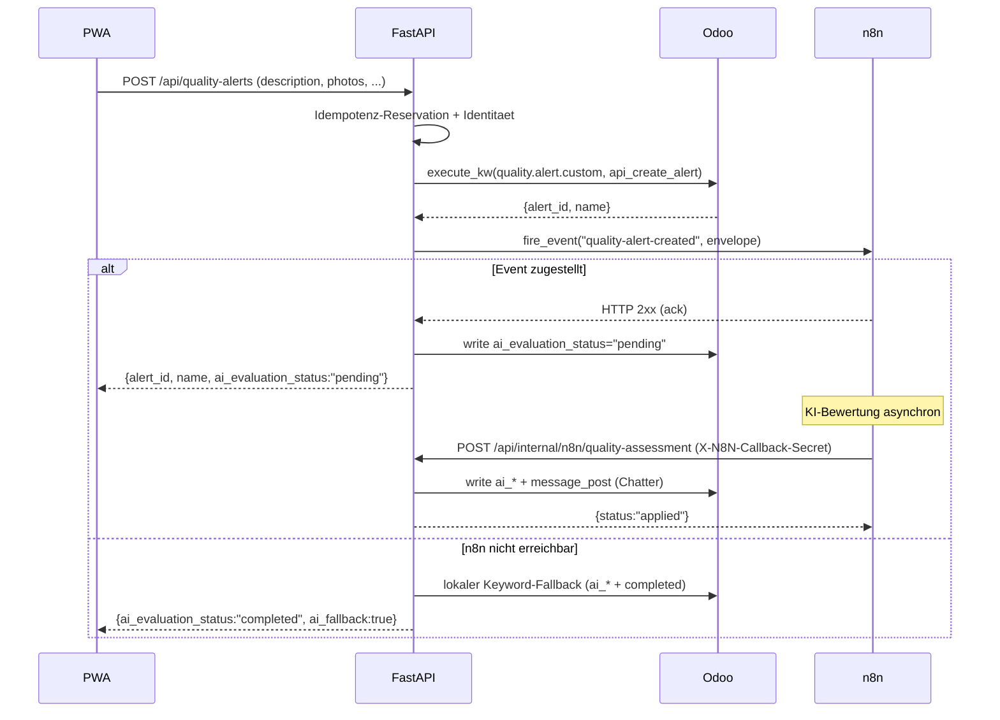

# Qualitätsmeldungen & n8n-Orchestrierung

> [!abstract] Kurzfassung
> Der Picker meldet aus der PWA eine Qualitätsstörung (Beschreibung, optional Fotos, Picking-/Produkt-/Lagerort-Bezug). Das FastAPI-Backend legt dafür über JSON-RPC einen `quality.alert.custom`-Datensatz in Odoo an und stösst anschliessend einen n8n-Workflow als asynchronen Orchestrator an, der die KI-Bewertung übernimmt und das Ergebnis über gesicherte interne Callback-Endpunkte nach Odoo zurückschreibt. Fällt n8n aus, greifen ein Circuit-Breaker und ein lokaler Keyword-Fallback; n8n bleibt damit ausserhalb des kritischen Schreibpfads.

## 1. Wie es funktioniert

Die Qualitätsmeldung folgt einem **Outbound-Event** (Backend → n8n, fire-and-forget) und einem späteren **Inbound-Callback** (n8n → Backend → Odoo). Ablauf:

1. Die PWA sendet `POST /api/quality-alerts` als `multipart/form-data` mit `description`, optional `picking_id`, `product_id`, `location_id`, `priority` und beliebig vielen `photos` (`routers/quality.py:164-176`).
2. Das Backend liest alle Fotos ein, bildet pro Foto einen SHA-256-Fingerprint und baut daraus zusammen mit den Formularfeldern einen Idempotenz-Fingerprint; eine wiederholte Anfrage mit identischem Fingerprint wird als Replay aus dem Cache beantwortet (`routers/quality.py:182-223`).
3. Nach Identitätsprüfung (`X-Picker-User-Id`/`X-Device-Id` müssen vollständig sein, Picker muss aktiv sein) ruft das Backend in Odoo die Modellmethode `api_create_alert` auf und erhält `alert_id` und `name` zurück (`routers/quality.py:225-264`).
4. Das Backend feuert das Event `quality-alert-created` an n8n (`routers/quality.py:274-302`). n8n läuft hier als reiner asynchroner Orchestrator und führt die eigentliche KI-Bewertung durch (Provider/Modell ausserhalb des Backends).
5. **Erfolg:** Wurde das Event zugestellt, setzt das Backend best-effort `ai_evaluation_status = "pending"` und antwortet der PWA mit `{alert_id, name, photo_count, ai_evaluation_status: "pending"}` (`routers/quality.py:342-350`).
6. **n8n nicht erreichbar:** Konnte das Event nicht zugestellt werden, führt das Backend einen **lokalen Keyword-Fallback** aus (`_apply_local_quality_fallback`, `routers/quality.py:125-161`), schreibt eine vollständige `ai_*`-Bewertung mit `ai_provider="backend-local-fallback"` und `ai_evaluation_status="completed"` und antwortet mit `ai_fallback: true`. Schlägt selbst der Fallback fehl, wird `ai_evaluation_status="failed"` gesetzt und HTTP 502 zurückgegeben (`routers/quality.py:304-340`).
7. n8n schreibt das KI-Ergebnis später asynchron über die internen Callback-Endpunkte (`/api/internal/n8n/...`) zurück. Das Backend persistiert die `ai_*`-Felder in Odoo, postet eine Chatter-Notiz und protokolliert ein strukturiertes Callback-Event (`routers/n8n_internal.py:546-680`).

## 2. Wie es mit Odoo kommuniziert

Der gesamte Odoo-Zugriff läuft ausschliesslich über den `OdooClient` (JSON-RPC an `/jsonrpc`, API-Key-Auth). Eingesetzte Methoden:

- **`execute_kw("quality.alert.custom", "api_create_alert", [vals])`** — delegiert das Anlegen samt Foto-Attachments an eine dedizierte Odoo-Modellmethode des Custom-Addons `quality_alert_custom`; Fotos werden als base64-codierte Liste übergeben und in Odoo als `ir.attachment` gespeichert (`routers/quality.py:248-264`).
- **`write("quality.alert.custom", [alert_id], {...})`** — Statusübergänge (`pending`/`failed`) und der lokale Fallback (`routers/quality.py:147`, `:326-333`, `:344`); im Callback das Schreiben der `ai_*`-Bewertung (`routers/n8n_internal.py:595-599`).
- **`search_read("quality.alert.custom", ...)`** — lädt den Alert-Kontext für die Shadow-AI-Auswertung (`routers/n8n_internal.py:344-351`).
- **`execute_kw(model, "message_post", [[id]], {...})`** — Chatter-Notizen best-effort (Erfolg/Misserfolg der KI-Bewertung, Fallback-Hinweis) (`routers/quality.py:148-159`, `routers/n8n_internal.py:213-217`).
- **`execute_kw("ir.model", "search", ...)` + `execute_kw("mail.activity", "create", ...)`** — best-effort Anlegen einer To-do-Aktivität bei fehlgeschlagener Bewertung bzw. Manual-Review (`routers/n8n_internal.py:233-245`, `:1096-1108`).
- **`execute_kw("stock.picking", "api_create_replenishment_transfer", [...])`** — Nachschub-Callback aus dem `shortage-reported`-Flow (`routers/n8n_internal.py:751-765`).

**Fehlerbehandlung:** `OdooAPIError` wird in den Endpunkten gefangen und auf HTTP 502 (`f"Odoo-Fehler: {exc.message}"`) abgebildet; die Idempotenz-Reservation wird über `_finalize_error` mit dem Fehler abgeschlossen, damit ein Replay denselben Fehler liefert (`routers/quality.py:254-258`, `routers/n8n_internal.py:479-496`). Chatter- und Aktivitäts-Aufrufe sind bewusst **best-effort** (`_post_chatter_note_best_effort`, `_create_activity_best_effort`): Sie loggen nur eine Warnung und brechen den Hauptpfad nicht ab (`routers/n8n_internal.py:205-248`). Odoo bleibt damit System of Record; n8n liegt nicht im kritischen Schreibpfad.

## 3. Was genau zugegriffen wird (Odoo-Zugriff)

| Modell | Felder (R/W) | Methoden | Domain/Filter | Zweck |
| --- | --- | --- | --- | --- |
| `quality.alert.custom` | W: `description`, `priority`, `picking_id`, `product_id`, `location_id`, `user_id`, `photos` (via `api_create_alert`) | `api_create_alert` | – | Qualitätsmeldung + Foto-Attachments anlegen (`routers/quality.py:236-264`) |
| `quality.alert.custom` | W: `ai_disposition`, `ai_confidence`, `ai_summary`, `ai_enhanced_description`, `ai_photo_analysis`, `ai_recommended_action`, `ai_last_analyzed_at`, `ai_provider`, `ai_model`, `ai_evaluation_status`, `ai_failure_reason` | `write` | `[alert_id]` | KI-Bewertung schreiben (Callback `quality-assessment`) bzw. lokaler Fallback (`routers/n8n_internal.py:314-327`, `routers/quality.py:134-147`) |
| `quality.alert.custom` | W: `ai_evaluation_status` (`pending`/`failed`), `ai_failure_reason` | `write` | `[alert_id]` | Statusübergänge nach Dispatch / Fehler-Callback (`routers/quality.py:344`, `routers/n8n_internal.py:897-904`) |
| `quality.alert.custom` | R: `id`, `name`, `description`, `priority`, `photo_count`, `product_id`, `location_id` | `search_read` | `[("id","=",alert_id)]`, `limit=1` | Kontext für Shadow-AI-Heuristik (`routers/n8n_internal.py:344-351`) |
| `quality.alert.custom` | – | `message_post` | `[[alert_id]]` | Chatter-Notiz Erfolg/Fehler/Fallback (`routers/n8n_internal.py:213-217`, `routers/quality.py:148-159`) |
| `ir.model` | R: `id` | `search` | `[("model","=",model)]` | Auflösen `res_model_id` für Aktivität (`routers/n8n_internal.py:233`) |
| `mail.activity` | W: `res_model_id`, `res_id`, `summary`, `note` | `create` | – | To-do-Aktivität (best-effort) bei Fehlbewertung / Manual-Review (`routers/n8n_internal.py:236-245`, `:1099-1108`) |
| `stock.picking` | – (Resultat: `success`, `message`, `replenishment_name`) | `api_create_replenishment_transfer` | Args: `picking_id, product_id, recommended_location_id, location_id, quantity, ticket_text, correlation_id, requested_by_*` | Nachschubauftrag aus `shortage-reported` (`routers/n8n_internal.py:751-765`) |
| `stock.picking` | – | `message_post` | `[[picking_id]]` | Manual-Review-Notiz (HTML mit n8n-Execution-Link) (`routers/n8n_internal.py:1053-1059`) |

## 4. API-Endpunkte (FastAPI)

| Methode | Pfad | Zweck | Auth/Headers |
| --- | --- | --- | --- |
| POST | `/api/quality-alerts` | Qualitätsmeldung + Fotos anlegen, n8n-Event auslösen | `multipart/form-data`; `X-Picker-User-Id`, `X-Device-Id` (Pflicht), `Idempotency-Key` (Write-Context) (`routers/quality.py:164-176`) |
| POST | `/api/internal/n8n/quality-assessment` | KI-Bewertung zurückschreiben (`ai_*` + Chatter) | `X-N8N-Callback-Secret`, `Idempotency-Key` (`routers/n8n_internal.py:546-552`) |
| POST | `/api/internal/n8n/quality-assessment-ai` | Shadow-AI-Auswertung protokollieren (Research-only) | `X-N8N-Callback-Secret`, `Idempotency-Key` (`routers/n8n_internal.py:406-417`) |
| POST | `/api/internal/n8n/quality-assessment-failed` | KI-Bewertung als `failed` markieren + Aktivität | `X-N8N-Callback-Secret`, `Idempotency-Key` (`routers/n8n_internal.py:849-855`) |
| POST | `/api/internal/n8n/replenishment-action` | Nachschubauftrag aus `shortage-reported` anlegen | `X-N8N-Callback-Secret`, `Idempotency-Key` (`routers/n8n_internal.py:683-689`) |
| POST | `/api/internal/n8n/manual-review-activity` | Manual-Review-Notiz + Aktivität am Picking | `X-N8N-Callback-Secret`, `Idempotency-Key` (`routers/n8n_internal.py:1000-1006`) |

Alle Callback-Endpunkte tragen `Depends(require_n8n_callback_secret)`: ist kein Secret konfiguriert, antwortet das Backend mit HTTP 503; bei falschem Secret mit HTTP 403. Der Vergleich läuft konstantzeitig über `secrets.compare_digest` (`dependencies.py:80-90`). Zusätzlich ist ein `Idempotency-Key` Pflicht; weicht `correlation_id` vom Key ab, wird mit HTTP 409 abgelehnt (`routers/n8n_internal.py:119-151`).

**Outbound-Events** sind keine FastAPI-Endpunkte, sondern ausgehende Webhooks an n8n. Sie werden über `N8NWebhookClient.fire_event(...)` ausgelöst:

| Event | Quelle | Default-Pfad (überschreibbar) |
| --- | --- | --- |
| `quality-alert-created` | `routers/quality.py:274` | `n8n_webhook_path_quality_alert_created = "quality-alert-created"` (`config.py:17`) |
| `shortage-reported` | `routers/voice.py:450` | `n8n_webhook_path_shortage_reported = "shortage-reported"` (`config.py:19`) |
| `pick-confirmed` | `services/picking_service.py:719` | `n8n_webhook_path_pick_confirmed = "pick-confirmed"` (`config.py:20`) |
| `batch-confirmed` | `services/cluster_service.py:571` | kein Override → Pfad = Event-Name (`n8n_webhook.py:267-268`) |

## 5. PWA-Seite (falls relevant)

Die Qualitätsmeldung wird in `pwa/js/app.js` aus dem Detail-/Problemdialog ausgelöst. Beschreibung, Priorität, `picking_id`, optional `product_id`/`location_id` und die ausgewählten Fotos werden als `FormData` gebaut (`pwa/js/app.js:2980-2997`). Der Aufruf läuft über `createQualityAlert(formData, {...})` in `pwa/js/api.js:265-270`, das `POST /quality-alerts` mit Write-Headern und einem aus Picking-, Line-, Priorität-, Text- und Foto-Fingerprints gebildeten `Idempotency-Key` sendet (`buildOperationKey('quality-alert', [...])`). Nach Erfolg gibt die PWA per TTS "Problem gemeldet. Die KI-Bewertung läuft." aus und zeigt einen Toast mit `result.name` (`pwa/js/app.js:2998-2999`). Gemäss Invariante spricht die PWA dabei ausschliesslich mit FastAPI, nie direkt mit Odoo oder n8n.

## 6. Telemetrie & Fehlerverhalten

**Circuit-Breaker (Sync-Pfad):** Pro Webhook-Pfad führt der `N8NWebhookClient` einen `BreakerState` mit `consecutive_failures`, `opened_until` und `probe_in_flight` (`n8n_webhook.py:28-33`). Nach `n8n_circuit_breaker_failures` (Default 3) aufeinanderfolgenden Fehlern öffnet der Breaker für `n8n_circuit_breaker_open_seconds` (Default 60s); danach lässt er einen Halb-Offen-Probe-Request zu und schliesst bei Erfolg wieder (`n8n_webhook.py:359-385`, `config.py:25-26`). Der Breaker greift im **synchronen** `request_reply`-Pfad; bei offenem Breaker wird sofort eine Fallback-Antwort (`source="fastapi-fallback"`, `fallback_reason="circuit_open"`) erzeugt (`n8n_webhook.py:207-215`). Der fire-and-forget-Pfad `fire_event` liefert bei Fehler ein `N8NEventResult(delivered=False, error=...)` zurück, ohne den Hauptpfad zu blockieren (`n8n_webhook.py:154-161`).

**Event-Envelope:** Jeder Outbound-Call sendet eine versionierte Hülle mit `event_name`, `schema_version="v1"`, `correlation_id` (UUID4), `occurred_at` (ISO/Z), `picker`, `device_id`, normalisiertem `picking_context` und `payload` (`n8n_webhook.py:270-299`). Das Callback-Secret reist als `X-Webhook-Secret`-Header mit (`n8n_webhook.py:261-265`).

**Degraded-Pfade (Best-Effort):** Wird `quality-alert-created` nicht zugestellt, greift der lokale Keyword-Fallback (`routers/quality.py:304-322`). Bei `pick-confirmed`/`batch-confirmed` bleibt die Buchung in Odoo gültig; nur der n8n-Folgeprozess wird als `integration_status="degraded"` markiert und ein Erfolgs-Telemetrie-Event emittiert, damit der Confirm im Nenner zählt (`services/picking_service.py:741-759`, `services/cluster_service.py:576-580`). Schlägt `shortage-reported` fehl, wird die Voice-Antwort um einen Hinweis ergänzt und `fallback_reason="shortage_dispatch_failed"` gesetzt (`routers/voice.py:465-477`).

**Strukturierte Callback-Telemetrie:** Jeder interne Callback loggt ein JSON-Event über `_log_callback_event` mit `workflow_name`, `callback_type`, `callback_status` (`applied`/`rejected`/`replay`/`failed`/`aborted`), `correlation_id`, `idempotency_key`, `target_object_type/id`, `execution_id`, `schema_version`, `received_at_backend`, `legacy_payload` und `latency_tracking` (`routers/n8n_internal.py:70-101`).

**Shadow-AI (Research-only):** Der Endpunkt `quality-assessment-ai` lädt den Alert, klassifiziert ihn lokal mit einer gewichteten Keyword-Heuristik über die Kategorien `damage`/`shortage`/`wrong_item`/`unclear` (`quality_shadow_evaluation.py:92-152`, inkl. Negations-Erkennung und Umlaut-Normalisierung) und loggt ein Vergleichs-Event `quality_shadow_evaluation` mit `heuristic_category` vs. `ai_category`, `match`, `confidence_delta` und `ai_latency_ms` (`routers/n8n_internal.py:354-390`). Dieser Pfad **verändert keine Geschäftsdaten in Odoo**; er dient nur dem Soll-Ist-Vergleich Heuristik gegen KI.

**Invarianten:** Odoo bleibt System of Record; alle Schreibvorgänge laufen über den `OdooClient`. n8n ist asynchroner Orchestrator und liegt nie im Voice-Hot-Path. Chatter/Aktivität sind best-effort. Idempotenz schützt Outbound-Erstellung wie Inbound-Callbacks gegen Doppelausführung (Replay liefert das gecachte Ergebnis).

## 7. Quellen im Code

- `backend/app/routers/quality.py:164-350` — `POST /quality-alerts`, Idempotenz, `api_create_alert`, Outbound-Event, lokaler Fallback
- `backend/app/routers/quality.py:69-161` — Keyword-Heuristik + `_apply_local_quality_fallback`
- `backend/app/services/n8n_webhook.py:97-118` — Pfad-Overrides, Timeouts, Breaker-Parameter
- `backend/app/services/n8n_webhook.py:120-161` — `fire_event` (fire-and-forget)
- `backend/app/services/n8n_webhook.py:207-215`, `:359-385` — Circuit-Breaker (offen/halb-offen/reset)
- `backend/app/services/n8n_webhook.py:261-299` — Header (`X-Webhook-Secret`) + Event-Envelope `v1`
- `backend/app/routers/n8n_internal.py:546-680` — Callback `quality-assessment` (write `ai_*` + Chatter)
- `backend/app/routers/n8n_internal.py:406-543` — Callback `quality-assessment-ai` (Shadow-Vergleich)
- `backend/app/routers/n8n_internal.py:849-997` — Callback `quality-assessment-failed`
- `backend/app/routers/n8n_internal.py:683-846` — Callback `replenishment-action`
- `backend/app/services/quality_shadow_evaluation.py:92-152` — `classify_quality_alert_shadow`
- `backend/app/dependencies.py:80-90` — `require_n8n_callback_secret` (`X-N8N-Callback-Secret`)
- `backend/app/config.py:16-26` — Webhook-Basis, Pfade, Secrets, Timeouts, Breaker-Defaults
- `backend/app/models/n8n.py:84-148` — Callback-Pydantic-Modelle + `N8NCommandResponse`
- `backend/app/services/picking_service.py:719-759`, `backend/app/services/cluster_service.py:571-582` — `pick-confirmed` / `batch-confirmed`-Events

## Verwandt

- [[12 - Funktionsdokumentation]] — Übersicht aller Funktionsseiten
- [[00 - Überblick & Datenfluss]]
- [[01 - Odoo-Kommunikation & Zugriffskatalog]]
- [[02 - Einzel-Kommissionierung (Picking)]]
- [[06 - Sprachassistent (STT, Intent, TTS)]]
