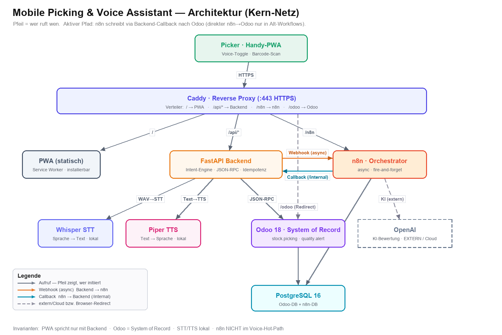

# Mobile Picking & Voice Assistant

Bachelorarbeit-Proof-of-Concept fuer einen mobilen Picking-Assistenten, der Lagerauftraege aus Odoo 18 auf einem Smartphone bedienbar macht und die normale Arbeit mit Scan, Touch und lokaler Spracheingabe unterstuetzt.

Das Projekt untersucht, wie ein hybrider Assistent in einem Lagerprozess aussehen kann: Odoo bleibt die fuehrende Datenquelle, FastAPI bildet die kontrollierte App-Schicht, die PWA ist die mobile Oberflaeche, und n8n uebernimmt nachgelagerte Workflows wie Quality-Alerts, Fehlmengen und Ausnahmeassistenz.

## Kurzbeschreibung

Der Mobile Picking & Voice Assistant ist eine mobile Web-App fuer Picker im Lager. Ein Picker sieht offene Odoo-Pickings, wird schrittweise zum naechsten Artikel gefuehrt, bestaetigt Positionen per Barcode, Touch oder Stimme und kann Probleme direkt als Quality Alert oder Fehlmenge melden.

Der Kernworkflow bleibt lokal und robust: Die PWA spricht nie direkt mit Odoo oder n8n, sondern ausschliesslich mit dem FastAPI-Backend. Odoo bleibt System of Record. Sprache wird lokal ueber Whisper erkannt; Piper oder der Browser geben Antworten aus. n8n wird nicht zum App-Backend, sondern nur fuer Folgeprozesse und Ausnahmefaelle genutzt.

## Was das System in 5 Schritten macht

1. **Auftrag aus Odoo laden**
   Die PWA ruft ueber FastAPI offene Pickings aus Odoo ab. Ein Picker waehlt oder uebernimmt einen Auftrag.

2. **Naechste Position verstaendlich anzeigen**
   Die App zeigt Lagerplatz, Produkt, Menge, Artikelbild, Fortschritt und Kontext so an, dass der Picker am Smartphone arbeiten kann.

3. **Position bestaetigen**
   Der Picker bestaetigt per Barcode-Scan, Touch-Button oder Voice-Kommando. Bei serialisierten Artikeln kann zusaetzlich eine Seriennummer erfasst werden.

4. **Backend prueft und schreibt nach Odoo**
   FastAPI validiert Barcode, Bestand, Picker-Identitaet, Idempotency und Seriennummernlogik. Erst danach wird die Bewegung in Odoo aktualisiert.

5. **Folgeprozesse laufen kontrolliert weiter**
   Nach der fachlichen Odoo-Aktion stoesst FastAPI bei Bedarf n8n-Workflows an: Quality-Alert-Bewertung, Fehlmengenprozess, Pick-Abschluss oder synchrone Ausnahmeassistenz. Wenn n8n ausfaellt, bleibt der Picking-Kern trotzdem bedienbar.

## Architektur



Die Architektur folgt drei Grundregeln:

- **Odoo ist System of Record:** Stammdaten, Lagerbestand, Pickings und Quality Alerts bleiben in Odoo.
- **FastAPI ist die einzige App-API:** Die PWA spricht nur mit `/api/*`, nie direkt mit Odoo oder n8n.
- **n8n ist Orchestrator:** n8n verarbeitet Folgeprozesse, liegt aber nicht im normalen Voice- oder Picking-Hot-Path.

Kurzform:

```text
PWA -> Caddy -> FastAPI -> Odoo
                |-> Whisper
                |-> Piper
                `-> n8n

n8n -> interne FastAPI-Callbacks -> Odoo
```

## Kernfunktionen

- Mobile PWA fuer offene Odoo-Pickings
- Picker-Auswahl, Claiming, Heartbeat und idempotente Schreiboperationen
- Barcode-, Touch- und Voice-Bestaetigung
- Optionaler Seriennummern-Scan fuer serialisierte Produkte
- Lokale Spracherkennung ueber Whisper
- Lokale oder Browser-basierte Sprachausgabe
- Quality Alerts mit Foto- und Kontextdaten
- n8n-Callbacks fuer Quality-Bewertung, Fehlmengen und manuelle Pruefung
- Telemetrie fuer Serial-Confirm und n8n-Callback-Auswertung
- Playwright-Tests fuer Kernflows, Accessibility und visuelle Baselines

## Aktueller Stand

Stand: 22. Juni 2026.

Der aktuelle Branch arbeitet am Seriennummer-Confirm-Flow. Bereits umgesetzt sind:

- Seriennummern werden im Confirm-Flow erfasst und an das Backend uebergeben.
- Das Backend schreibt Seriennummern bei serialisierten Produkten nach Odoo.
- Whitespace-only-Seriennummern werden nicht gespeichert.
- Serial-Confirm-Events werden strukturiert geloggt.
- Die PWA verhindert Bulk-Confirm fuer serialisierte Restpositionen.
- Backend-, PWA-, Playwright-, A11y-, Visual- und Stack-Smoke-Checks sind lokal pruefbar.

Bereinigter GitHub-Stand:

- Der Docker-Stack enthaelt nur noch die fuer den Mobile-Picking-Kern noetigen Services: Caddy, PostgreSQL, Odoo, FastAPI, Whisper, Piper, n8n und PWA.
- Mailpit, Cloudflare-Tunnel und fachfremde Diti/P1/WH-Workflows sind nicht Teil dieses Repository-Stands.
- Generierte n8n-Backups, lokale Load-Test-Ergebnisse und temporaere Praesentationsskripte sind nicht Teil des GitHub-Stands.
- Fachfremde Workflows koennen lokal noch in einer n8n-Instanz aktiv sein; sie gehoeren aber nicht zum bereinigten Bachelor-Repository.
- Die README ist bewusst nur Einstieg und Ueberblick. Detailwissen liegt in `Projekt-Wiki/` und `Mobile Picking und Voice Assistant/docs/`.

## Repository-Struktur

```text
.
|-- README.md
|-- Projektbeschreibung.txt
|-- Projekt-Wiki/
|   |-- 00 - Start Hier (Übersichtskarte).md
|   |-- 02 - Architektur & Diagramm erklärt.md
|   `-- _attachments/architektur.png
`-- Mobile Picking und Voice Assistant/
    |-- docker-compose.yml   Lokaler Kernstack
    |-- Makefile             Linux/macOS-Kommandos
    |-- package.json         PWA-/Playwright-Testkommandos
    |-- backend/            FastAPI, Odoo-Adapter, Picking-Logik, Tests
    |-- pwa/                Mobile PWA in HTML/CSS/Vanilla JS
    |-- odoo/               Custom Odoo-Addons und Odoo-Konfiguration
    |-- n8n/                Mobile-Picking-Workflows und n8n-Tests
    |-- e2e/                Playwright, A11y und Visual-Tests
    |-- infrastructure/     Caddy, Docker, Zertifikate, Smoke-/Import-Skripte
    |-- piper/              Lokaler TTS-Service
    `-- docs/               Architektur, Vertrage, Evaluation, Setup
```

## Wichtige Dokumente

- `Projekt-Wiki/00 - Start Hier (Übersichtskarte).md`
- `Projekt-Wiki/02 - Architektur & Diagramm erklärt.md`
- `Mobile Picking und Voice Assistant/docs/ARCHITECTURE.md`
- `Mobile Picking und Voice Assistant/docs/N8N_CONTRACT_FREEZE_V1.md`
- `Mobile Picking und Voice Assistant/docs/EVALUATION.md`
- `Mobile Picking und Voice Assistant/docs/SETUP.md`

## Verifikation

Der Projektstand ist so aufgebaut, dass die wichtigsten Ebenen separat pruefbar sind:

- Backend: Python/Pytest
- PWA-Logik: Node-Test-Runner
- Mobile UI: Playwright
- Accessibility: Axe + Playwright
- Visual Regression: Playwright-Snapshots
- n8n-Vertraege: statische Workflow-Vertragspruefung
- Lokaler Stack: API-Smoke gegen Docker Compose

Die dokumentierten Projekt-Kommandos liegen in:

```text
Mobile Picking und Voice Assistant/Makefile
Mobile Picking und Voice Assistant/infrastructure/scripts/workflow.ps1
```

## Bachelorarbeits-Kontext

Das Projekt ist kein generisches Warenwirtschaftssystem, sondern ein fokussierter Forschungs-Prototyp. Es zeigt, wie ein bestehendes ERP-System durch eine mobile, sprachgestuetzte Bedienoberflaeche erweitert werden kann, ohne die fachliche Datenhoheit aus Odoo herauszuziehen.

Im Mittelpunkt stehen:

- Praxistauglichkeit fuer mobile Lagerarbeit
- robuste Fallbacks statt reiner Sprachbedienung
- klare Trennung zwischen Kernprozess und Automatisierung
- nachvollziehbare Datenfluesse fuer Evaluation und Bachelorarbeit
- saubere Dokumentation der Architekturentscheidungen
